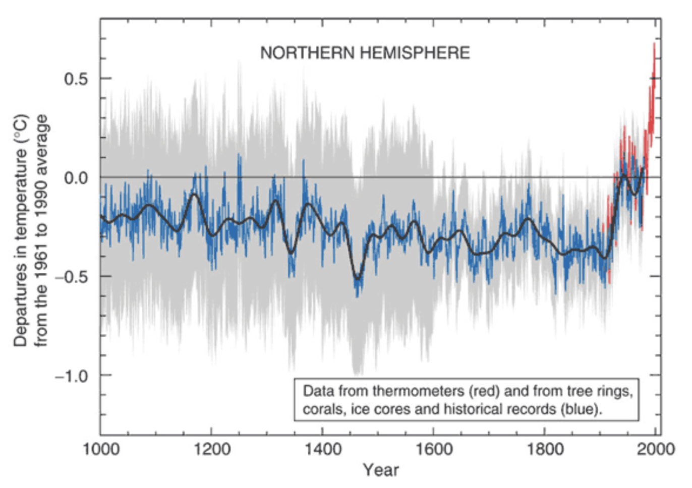

---
Pr-id: Networked Content Analysis: The Case of Climate Change
P-id: Theory on Demand
A-id: 31
Type: Chapter
Book-type: Dissertation
Dissertation item: Chapter
Item-id: unique no.
Article-title: 3. Climate Debate Actors in Science and on the Web
Article-status: accepted
Author: Sabine Niederer
Rights: CC BY-NC-SA 4.0
...

# 3. Climate Debate Actors in Science and on the Web

On 12 December 2015, a consequential agreement in the history of global
climate negotiations was reached when 195 countries adopted the
so-called *Paris Climate Agreement* during the 21st annual Conference of
the Parties, better known as COP21. Two weeks of ‘fierce negotiations’
ended with the words ‘I hear no objection in the room, I declare the
Paris Climate Agreement adopted’, spoken by the president Laurent
Fabius.[^1] Loud cheers followed, and festive pictures were published
along with a dedicated hashtag \#ParisAgreement (Figure 2).

Figure 2: \#ParisAgreement. Cheers after the declaration of the adoption of the
Paris Climate Agreement on December 12th of 2015. United Nations
Framework Convention on Climate Change, 'Adoption of the Paris
Agreement', United Nations, 12 December 2015,
https://unfccc.int/resource/docs/2015/cop21/eng/l09.pdf.

The global agreement that was adopted is a substantiation of the
widespread consensus on climate change as a most urgent issue of our
times, or as it is phrased in the agreement itself, of:

> \[R\]ecognizing that climate change represents an urgent and
> potentially irreversible threat to human societies and the planet and
> thus requires the widest possible cooperation by all countries, and
> their participation in an effective and appropriate international
> response, with a view to accelerating the reduction of global
> greenhouse gas emissions.[^2]

As such, the agreement marks an important milestone in the climate
debate, which has spread from a scientific debate to a public debate.
Arguably, the agreement may also signal a new chapter, indicating that,
in fact, skepticism is losing ground. In the case studies that follow, I
begin tracing ‘new' or unfolding elements of this debate from 2008, the
date of the first international skeptics' conference, as discussed in
the Introduction, moving all the way to 2015. However, engaging the
technicity of web content (i.e., that of Wikipedia) sometimes requires
the researcher to go back in time to allow for a historical
reconstruction of present issues or to assess earlier milestones in a
current controversy, such as important IPCC reports and COP events
before 2008. As this book is not a historiography of the debate but
rather a study of the controversy through networked content, I will
furthermore not always discuss the events in chronological order. In my
research, tracing the climate change controversy involves encountering
certain objects, images, publications, or events that resonate strongly
or even cause a heating up of the debate.

The most famous climate controversy object, in my view, is the so-called
‘hockey stick graph,' a chart in which a thick black line powerfully
depicts a sharp and unprecedented rise in global temperatures since the
late 20th century (). The hockey stick graph has been widely published,
for instance, in the IPCC report of 2001. But a wider audience may know
it from the performative account of climate change given in the
documentary *An Inconvenient Truth* (2006), in which Al Gore projects
the graph and uses a lift to follow the unprecedented rises in
temperature and CO2 levels all the way toward the top of the screen. In
2009, the hockey stick graph found itself at the center of the climate
debate again, with the so-called Climategate scandal. Following a hack
of East Anglia University’s climatic research unit, a selection of
emails was leaked in which climate scientists described the making of
the hockey stick graph for publication in the journal *Nature* as the
fraudulent-sounding ‘Mike’s Nature Trick’, in which research
visualizations ‘leave out the anomalies’.[^3][^4]

Figure 3: The HockeyStick Graph. Graph showing unprecedented rises in temperature since the
late 20th century. M.E. Mann, R.S. Bradley, and M.K. Hughes, 'Northern
Hemisphere Temperatures During the Past Millennium: Inferences,
Uncertainties, and Limitations', *Geophysical Research Letters* 26.6
(1999): 759–762.

Here rather than contributing to a critical discussion of climate
science, which is by no means my area of expertise, I ask how content
analysis may be amended to include networked content’s technicities,
and, in doing so, learn from controversy analysis and digital methods.
This book thus aims to contribute to those respective fields, as well as
to previous scholarly work on the climate debate, especially its
mediation through networks. Academic research on the climate debate has
taken as its point of departure the histories of events, objects, and
scandals, and studies their coverage, framing and impact across a broad
spectrum of mediation, from mass media to scientific literature.
Scholars have, for instance, focused on public awareness and the general
public's engagement with the issue. With central questions such as ‘Do
people believe in climate change? And is the percentage of people who
believe climate change is taking place increasing or decreasing?’
surveys and polls are undertaken by organizations such as Pew Research
Center.[^5] The outcomes of these reports are referenced in scholarly
works that look at public opinion and the public understanding of
climate change.[^6] Other scholars have created timelines and so-called
trend chronologies, which ‘summarize public opinion across key
dimensions including \[…\] public awareness of the issue of global
warming’ to analyze the development of public opinion over time.[^7]
Another strong tradition of climate debate research in the tradition of
media monitoring to measure the coverage of the issue in the news, for
instance, by comparing its coverage across a set of newspapers.[^8]

A different strand of climate debate coverage research longitudinally
monitors the coverage of the climate debate in mass media.[^9] Here, the
focus can be on television shows or printed news, or on specific
features of the coverage, such as the use of imagery in environmental
news.[^10] Longitudinal analysis of news coverage can reveal the
so-called ‘issue attention cycles' in a specific country or in a
comparison across countries.[^11] The related concept of *news spirals*
refers to the phenomenon that once the climate is in the news, this
creates a general upsurge of other environmental news.[^12] Studies
specifically centered on events and scandals zoom in on controversy
objects such as Climategate or debates around (alleged mistakes in) the
IPCC reports.[^13][^14][^15] Rather than looking at controversy objects
as a starting point, in the following case study, I will enter the
climate debate through the scope of its actors, who I will approach
using scientometric analysis and networked content analysis, for which I
will conduct both hyperlink analysis and search engine-based resonance
analysis.

As the climate debate is not limited to a single communication channel
but takes place across online platforms, I will first consider Google
Web Search — a dominant entry-point to the web for many — as a beginning
platform through which to operationalize some endeavors of capturing,
reading and analyzing this controversy's content. Whereas Google Web
Search has grown dramatically since 2008 (as have Twitter and Wikipedia,
the other platforms discussed in the next case studies of Chapters 4 and
5), its role in controversies has not been systematically examined. In
this first case study, I will discuss Google Web Search in a Networked
Content Analysis of the climate controversy in the period of 2008 -
2011. The case study asks how the technicities of networking (through
hyperlinked websites) and search (e.g., its output of ranked lists)
might be used to measure the prominence of specific actors in specific
issues, in this case, looking at the networks and resonance of climate
change actors. By ‘climate change actors', I mean to indicate both
non-skeptical climate scientists (for lack of a better term) and climate
change skeptics. ‘Climate change skeptics' here refers to those
skeptical of climate change and its sub-issues such as human-made global
warming, unprecedented global warming (temperature rises), and a variety
of the methods employed to study climate change. All scientists are
‘skeptical' to a certain extent, so when I use the term ‘non-skeptical
climate scientists', it refers to scientists who do not publish
skeptical articles on the anthropogenic causes or unprecedented effects
of climate change. I choose the term skeptic over ‘denialist' (a
stronger term often used by those who stand in opposition to these
skeptical actors) while bearing in mind that the term ‘alarmist' as used
by climate change skeptics to describe their opposition is also
rhetorically overloaded. Importantly, ‘deniers' and ‘alarmists' are
labels used by others to define and already delegitimize these specific
actors, not by the actors to describe themselves.

To assess what the techniques of networked content analysis may add to
the study of the climate controversy, I pair its approach with that of
scientometrics (or the quantitative study of science), a traditional
means to study the prominence of scientific actors within a specific
scientific field.[^16] In all, this chapter assembles a profile of these
actors' (aspired to) positions inside and outside academia and offers a
finer-grained picture of the status, group formations and issue
commitments of climate change skeptics. The chapter in this way assumes
that the *question* of whether these actors are scientists or lobbyists
holding open or reopening the climate debate into controversy is an
extremely current question, and that finding answers towards such
questions as I do here, is integral to a better understanding of the
climate change debate’s entanglement with stakeholders.

In the Introduction, I have outlined that the group formation of these
skeptics has been key to climate change becoming a major controversy. As
I detailed in that chapter, the first international conference for
climate change skeptics was organized in March 2008. The Heartland
Institute, a Chicago-based libertarian public policy think-tank,
organized this event with the inaugural title, *Can You Hear Us Now?
Global Warming Is Not a Crisis!* The format was that of a traditional
scientific conference with three days of parallel sessions and keynote
speakers as well as online proceedings.[^17] In his opening remarks,
Heartland’s president Joseph L. Bast stressed that the conference
featured talks by ‘over 200 scientists and other experts from leading
universities and organizations from all over the world’. Bast
furthermore stated that:

> These scientists and economists have been published thousands of times
> in the world’s leading scientific journals and have written hundreds
> of books. If you call this the fringe, where’s the center?[^18]

Bast gave credence here to climate skeptics as core actors in climate
science, while most descriptions of climate change skeptics, whether by
watchdogs (e.g., watchdogs of corporate PR campaigns such as
SourceWatch.org), journalists or scientific analysts, paint a less
flattering picture. Scholars have emphasized how skeptics effectively
keep the climate conversation alive *as a controversy* in the face of
increasing statements of consensus from the global scientific
climatology community.[^19][^20] Skeptics are often criticized for
having strong ties to specific industries invested in the status quo
reproduction of our climate-changing economy, as described in books such
as *Merchants of Doubt* and *Doubt is their Product*, as well as the
report *Smoke, Mirrors and Hot Air: How ExxonMobil Uses Big Tobacco’s
Tactics to Manufacture Uncertainty on Climate Change* and various
academic papers.[^21][^22][^23] These publications describe how
industry-funded skeptics insist on the lack of consensus on
anthropogenic (i.e., human-induced) global warming, using strategies
from prior decades' tobacco industry-funded research that downplayed
truth claims on the health risks of smoking. In October of 2015, this
topic flared up in the news, as the New York attorney general announced
an investigation of Exxon Mobile ‘to determine whether the company lied
to the public about the risks of climate change’.[^24]

The industrial and financial ties of climate change actors have been
visualized for public awareness and comprehension in projects such as
Exxonsecrets. This watchdog project by Greenpeace shows key scientists,
spokespersons, and organizations that have received Exxon-Mobil funding
since 1998. Figure 4 shows a map of the affiliations of the prominent
climate change skeptics Willie Soon and Sally Baliunas and depicts which
of those organizations have received funding from ExxonMobil. On the
left, Soon is depicted as having six institutional affiliations (for
instance, with the George C. Marshall Institute and the Fraser
Institute), four of which have received funding from ExxonMobil and one
of which is the American Petroleum Institute. On the right-hand side,
Baliunas is shown to hold eleven institutional relations, ten of which
have received ExxonMobil money and one of which is also the American
Petroleum Institute. Economic visualizations like this, of supposedly
‘disinterested' scientific debate and controversies, are designed to
activate public comprehension of bias and (sometimes artificial)
controversy in the networked, public mediation of so-called ‘scientific
research’ on climate change.

Figure 4: Exxonsecrets. Map showing the institutional relationships of Willie Soon (left) and Sallie Baliunas (right) and their funding by Exxon-Mobil
since 1998. ‘Greenpeace’, http://www.exxonsecrets.org/maps.php?mapid=1804.

Rather than zooming in on the industrial ties of specific climate change
researchers, in this chapter, I want to zoom out to laterally consider
the place and status of climate change *skepticism*, that is, the
resonance of skeptics, within the networked content of climate change
science and its online debate. I will start with a brief discussion of
scientometric analyses of these prominent climate skeptics.[^25] In
these analyses, I take to the opening statement of the first
international climate change skeptics’ conference abovementioned, to
turn its claims of authority into a question. Putting aside the
epistemological claims of the conference content, I trace its main
actors to assess whether these climate change skeptics are indeed at the
‘center’ of climate change debates. Here, I drew on a data set of over
15,000 scientific articles on climate change that had been cited at
least three times, to find whether these skeptics—speakers of the first
Heartland conference—were indeed located at an authoritative ‘center’ of
climate science.[^26]

Related to this understanding of citation networks, the utility of
hyperlinks for online content analysis has been asserted by many
scholars. Here, I would like to point specifically to the work by those
media scholars who describe links as being both an indicator of
reputation and the performance of politics of association.[^27][^28] For
example, not all organizations link to all other organizations that work
in the same field; they rather link only to the organizations that they
prefer to be associated with. New media scholar Axel Bruns describes the
IssueCrawler, the hyperlink analysis tool used in this chapter to
conduct hyperlink analysis and visualize the hyperlink networks, as
‘predominantly designed for identifying “issue networks”, that is,
networks of websites which form around the interlinking and exchange of
information pertaining to specific issues or topics’.[^29] This
technique of hyperlink analysis has been applied to the climate debate
before. In the paper *Landscaping Climate Change* (2000), Rogers and
Marres describe the study of hyperlinking as a means to map the debate
around an issue. They regard linking as a way to recognize other
participants in the debate and ‘\[s\]imilarly, non-linking is a sign of
non-recognition, or, more radically, is an act of silencing through
inaction. (Greenpeace does not link to Shell, but Shell links to
Greenpeace)’.[^30] When thinking of a hyperlink in terms of recognition
or as politics of association, the link can also be deemed and
repurposed as an instance of group formation, as described in the
Introduction in reference to the work of philosopher and anthropologist
Bruno Latour, who has argued cogently for the fact that there are no
groups ‘without a rather large retinue of group makers, group talkers,
and group holders’.[^31][^32]

Important to mention here is that this use of hyperlink analysis has
been recognized as an important technique by content analysis too. In
the third edition of *Content Analysis: An Introduction to its
Methodology* (2013), Klaus Krippendorff describes hyperlink analysis as
a means to study issue networks and answer issue-related research
questions regarding the composition of actors, influence and authority
within the network, and the life of an issue over time (when conducting
longitudinal analysis).[^33][^34][^35] The mentioning of hyperlink
analysis and its qualities for *issue research* in this handbook not
only demonstrates again the willingness of content analysis in its
original form to open up to such digital research methods and objects.
The inclusion of this research technique also stresses the importance of
the further development of networked content analysis and makes a case
for the inclusion of hyperlink analysis therein. As hyperlinks are the
basic ‘webby' way to network online content, they are an essential means
to trace and capture affiliations, aspirations, and alignment between
actors.

The third way in which I will measure the reputation of climate actors
and their viewpoints within larger contestations of climate change
knowledge online is through what I call ‘resonance analysis’. Here, a
demarcated set of sources, in this case, the top results for the query
of \[climate change\], is assessed for the presence (and absence) of
climate change skeptics, as well as other scientists in the top search
findings. This is of interest on two levels. Firstly, we may ask which
sources make it into the top of the results in Google Web Search. Often
critically referred to as a ‘black box’, due to its undisclosed
algorithm, it is known that Google grants status to sources that are
both established (as in receiving many in-links from other websites) and
relevant as in often clicked, a logic that has been discussed in
relating PageRank to citation analysis.[^36][^37][^38][^39] Secondly,
such analysis makes visible which sources grant a voice to the skeptics
prior-identified from the Heartland Conference program. Which of the top
100 results are proven to be the most ‘skeptic-friendly' websites? And
who of the prior identified skeptics appear most frequently? This
harkens back to traditional means of content analysis, where in media
monitoring the airplay of specific actors (for instance, a ‘Democratic
presidential candidate' versus a ‘Democratic presidential candidate in a
televised pre-election debate') would be counted and analyzed. Lastly,
it enables an assessment of who makes it into the top results (a
technique referred to as ‘source distance analysis’).[^40]

This actor-centric approach to the comprehension of the work and
networks of skeptics leads me to raise further important questions about
climate change skeptics’ *issue commitment,* once it becomes possible –
and useful – to map skeptics’ (non-) scientific publications on topics
other than climate change. In other words, their claims towards
scientific rationality can be further researched by asking whether such
claims are actually (*scientifically)* concerned with climate change at
all, or with the political questions that acceptance of the science
might raise. This is less of a radical move than it may seem at first
glance. Consider, for example that one of the most prominent Dutch
climate skeptics is the president of Stichting Skepsis, a foundation
that deals with not just one controversy but many (making climate change
a target of purposeful scrutiny to the point of delegitimization,
alongside topics like homeopathy and so on). To understand how such
controversies are networked online into *issue relations,* through issue
actors is to understand the network of a controversy’s content and
actors, and to study the complex ecologies of debates through the
distances and connections between them (as I will bring into practice
again in chapters 4 and 5 on Wikipedia and Twitter). Such analyses give
space to the *drama* in the network, to paraphrase Noortje Marres.[^41]

Before applying these three methods of analysis to the actions and
impacts of skeptics (through hyperlink analysis, actor-oriented actor
resonance analysis, and actor-issue commitment analysis), a brief
discussion of my mapping of the issue *within* science is necessary.
Here I make use of the ISI Web of Science to chart the position of these
skeptical scientists within climate science; from this, I can test how
*fringe* or *central* to climate science these actors are.

## Climate Change Skeptics: Mainstream or Fringe?

This scientometric analysis of the identified skeptics’ position tests
the claim that they are in the scientific center (of climate science). A
question that might be raised is whether climate change skepticism
should be considered to be its own field in the sense of a particular
distribution of disciplines, and following this, whether the composition
of climate skepticism mirrors that of climate science. In other words,
whether they are doing the same science and generating different results
that would technically add up to a ‘controversy’ or whether something
more complex than this is operative in the politics of online climate
change knowledge. Thus, to consider whether skeptics are at the ‘center’
of climate science, I will first compare the academic disciplines of
skeptical authors and assess whether they mirror the composition of
climate science authors. I then look at publications in climate science
and compare these to a subset of academic publications from climate
skeptics. The aim of this analysis is to first to get a better
understanding of the place and status of skeptics within climate
science, and then to complement this with networked content analysis
techniques capable of shedding light on the role of such actors within a
controversy that plays out inside and outside of advanced,
scientifically adjudicated academic research settings.

The basic data for my starting point is a list I have compiled of
prominent skeptics to which I will apply the scientometric analysis. The
prominence of the actors has been determined through reference to
prior-developed listings of climate change skeptics mentioned by
Wikipedia entries, previously mentioned watchdogs and other scholars'
academic analyses of climate skepticism.[^42] Cross-referencing these
existing listings with the line-up of keynote speakers at the Heartland
conference of 2008, resulted in a shortlist of fifteen prominent climate
change skeptics: Sallie Baliunas, Joseph Bast, Paul Driessen, William
Gray, Sherwood Idso, Václáv Klaus, Richard Lindzen, Patrick Michaels,
Steven Milloy, Frederick Seitz, S. Fred Singer, Willie Soon, Roy
Spencer, John Stossel, and James M. Taylor. Concurrent to this
assembling of prominent skeptics, I queried the ISI Web of Science for
all articles on ‘climate change'. On 9 July 2008, there were
approximately 27,000 articles, 15,877 of which received at least three
citations; these form the list of articles retained for the analysis.

Using this data set of nearly 16,000 articles with the list of skeptics,
I compare the disciplines of the journals in which significant climate
change articles appear to the disciplinary backgrounds of the climate
skeptics and their co-authors. This first analysis demonstrates that
seven out of the top 10 disciplines in the climate sciences are present
in the skeptics' top 10: ecology, meteorology, and atmospheric sciences,
multidisciplinary sciences, environmental sciences, interdisciplinary
geosciences, plant sciences, and agronomy. The climate change skeptics’
disciplinary composition partially matches that of climate science,
besides having some signature disciplines of its own (within the top 10
most occurring disciplines), namely astronomy and astrophysics,
biochemistry and molecular biology, and medicinal chemistry. Disciplines
unique to the rest of climate science are multidisciplinary sciences,
forestry, and environmental engineering. These large overlap in the
disciplinary background of the climate scientists publishing (cited
papers) on climate science and the subset of climate skeptics seems to
confirm Bast’s statement that skeptical climate science is, in fact,
part of climate science and not positioned outside the field. Or, at
least, it resembles climate science in terms of the composition of
scientific disciplines involved. Knowing the place of climate change
skeptics within the climate science disciplines, I now want to test
whether the skeptics publish in prominent climate science journals or
whether they have their own dedicated skeptics' journals.

Using the ISI result files and ReseauLu (the network analysis software),
I compare which journals *do not* publish skeptics at all, which publish
*only* skeptics, and which journals publish *both* skeptics as well as
non-skeptical views. Here it is found that the shortlisted climate
skeptics and their co-authors publish in the top four climate journals
(which are in the shared nodes in the center of the network). This may
be counterintuitive, especially when thinking about the aforementioned
readings of the climate change skeptics’ ‘lobby’ in which these actors
are described as a relatively small but powerful group of scientists of
which ‘the most vocal skeptics were *not* qualified, were *not* working
in the field’.[^43]

Figure 5 shows the visualization of the results. In the center are the
shared nodes. These are the 30 publications that publish articles (cited
at least three times) by skeptics as well as others. The shared journals
include prominent academic publications, including *Nature*, *Science*,
*Journal of Climate*, *Geophysical Research Letters*, *Journal of
Geophysical Research*, and *Climatic Change*. This is where climate
change skepticism overlaps or resides within the rest of climate
science. On the left are the journals that do not publish work by our
short-listed skeptics and their co-authors. On the right are the nodes
that represent the journals that publish only the works of climate
change skeptics.

Figure 5: Climate science publication graph. ReseauLu Map showing journal publications for climate science and skeptics.

This comparative (of articles cited at least three times) shows that the
climate change skeptics are indeed part of the scientific mainstream of
climate change research, in the sense that they publish in top climate
science journals. It also reveals that they also have their own specific
outlets that publish only skeptics’ research.[^44] However, climate
change skeptics cannot be characterized as merely a fringe based on this
research. It is relevant to mention here that two separate qualitative
analyses of global warming-related article abstracts through ISI have
found no ‘disagree\[ment\] with the consensus position’[^45] and that
‘an overwhelming percentage (97.2% based on self-ratings, 97.1% based on
abstract ratings) endorses the scientific consensus on A\[nthropogenic\]
G\[lobal\] W\[arming\]’.[^46] So while the climate skeptics are part of
the scientific center, this does not mean that their prominent
scientific publications are by definition those in which they voice
their skepticism.

As we have seen in the scientometric analysis of the place and status of
actors within climate science (through querying ISI), selecting only
cited academic papers (at least three citations) filters out the less
relevant sources (i.e., those of uncited papers). The web and its search
engines know a related logic that enables a means of analysis similar to
citation analysis. As described by Sergey Brin and Lawrence Page in
1998, when they presented their search engine prototype, the algorithm
treats hyperlinks almost like a web of science would treat a citation.
‘Intuitively, pages that are well cited from many places around the web
are worth looking at’.[^47][^48] But not all citations are equal; those
from well-cited pages have more weight. It is noteworthy that Page and
Brin explicitly use the term ‘citing’ when they refer to linking.[^49]
As citations network content, scientometrics could be considered a means
of networked content analysis. As scientometrics can help evaluate the
weight and relevance of scientific actors and outlets, for the study of
the climate controversy, it is relevant to also assess the place and
status of specific actors within the broader climate change debate as it
plays out on the web. This is possible with web-specific techniques of
networked content analysis, as I will discuss in the following sections.

## The Case of the Dutch Skeptics

On the web (broadly conceived) a national set of sources may be
demarcated by taking the local domain of Google Web Search (e.g.,
Google.nl for the Dutch web) and querying it in the specific local (in
this case Dutch) language(s). In this next section, I will zoom in on
the networks and resonance of climate actors in the Dutch climate
debates, to consider how networked content analysis may help to capture
instances of group formation and actor resonance. I will consider
moments of group formation through hyperlink networks, as I have
described in the introduction; thus, rather than labeling scientists
according to pre-formed categories, I understand them as part of a group
when they perform as such. This approach, informed by Latour, can
perhaps be best explained by example. In October 2011, the Royal Dutch
Academy of Sciences (KNAW) published a report titled *Climate Change:
Science and Debate*.[^50] With the brochure written by a small committee
of scientists from inside and outside the Academy, the KNAW set out to
map the state-of-the-art of climate science, more specifically
discussing what has reached scientific consensus and what still causes
controversy and why. The report ends with a summary in which the topics
of consensus are listed as seven statements. Statement A reads:

> Humankind changes the composition of the atmosphere quickly and
> drastically. The increased concentration of carbon dioxide and other
> greenhouse gases cannot be marginalized.[^51]

This first statement already is likely to turn the brochure into a
controversial object, for it directly and without qualification stresses
the role of humankind in global warming and the effects of CO~2~ (and
other emissions) on climate change. Unsurprisingly, soon after its
publication, Dutch skeptical blogs started posting about this report by
the KNAW, characterizing it as ‘alarmist’.[^52] One of the more
prominent skeptical blogs of the Netherlands, climategate.nl, featured a
blog posting in English stating that the brochure contained a ‘tsunami
of scientific errors’:

> The brochure claims that these seven statements are hard science on
> which all scientists agree. Nothing is further from the truth: they
> are a rendering of the claims of the IPCC, in denial of all serious
> criticism that has been brought against it by the scientific
> community.[^53]

Besides blogging about the report in various Dutch climate blogs, the
skeptics chose two other formats for their criticism: a letter signed by
22 scientists demanding the retraction of the report and a *climate
seminar* organized at Nieuwspoort, the international press center in The
Hague.

In the letter, the scientists refute the seven statements and demand a
retraction of the publication.[^54] They state they represent various
academic disciplines including (bio-) chemistry, physics, geology,
engineering, and climatology. The only non-academic who signed the
letter is Ralf Dekker, blogger and chairperson of the aforementioned
Groenerekenkamer.nl. One of the scientists on the list is Pieter
Ziegler, Swiss Geology Professor Emeritus at University of Basel and
Emeritus Member of the Royal Academy (KNAW). For the purposes of the
analysis, it is useful to consider the signatures of the letter as a
ready provision or short-listing of 22 climate change skeptics. Not
surprisingly, the program of the climate seminar organized by
Groenerekenkamer.nl and its list of speakers was filled mostly with
people on this shortlist.

The next step in the analysis of the skeptics’ group formations is to
study their networks, to better understand the scope and aspirations of
these actors through hyperlinking, and the composition of the issue
network. To generate such analyses, a list of the skeptics’ websites is
first entered into the IssueCrawler tool for hyperlink analysis. The
IssueCrawler then performs co-link analysis, crawling the inputted
(seed) ‘URLs for links and retain\[ing\] the pages that receive at least
two links from the seeds’, and outputting a network graph.[^55] Figure
6, the IssueCrawler map of Dutch skeptics, shows that the group's
hyperlink network is dominated by Anglo-American sources. This is
perhaps surprising given the appearance of a strong national network of
Dutch skeptics with an active collective blogging culture in the Dutch
language. The IssueCrawler map reveals, however, that these sites link
not so much to each other or to other Dutch sources, but mainly to
sources outside the Netherlands (see Figure 6, top).

The Dutch scientists that authored the KNAW publication (the
‘non-skeptical’ actors in this comparative study) show a more
heterogeneous network (see Figure 6, bottom), with many Dutch sources.
There is a science and government cluster in which the website of the
Dutch Ministry of Foreign Affairs links to an international cluster that
includes the homepages of the UN and the World Bank. There are also
mainstream media clusters, involving the large Dutch daily newspapers
and broadcasting companies who link to their international colleagues
such as *The New York Times*, the *Financial Times*, and *La Reppublica*
(Italy).

The networks immediately show two distinct actor groups. The skeptics
show international aspirations in linking to their Anglo-American
counterparts, and the non-skeptics reveal their rooting in science and
government and their contributions to the mainstream media. To further
understand their resonance within dominant sources on the topic of
climate change, I proceed to use Google Web Search to select top sources
and query them for the resonance of these sets of actors.

Figure 6: Dutch climate actor networks. IssueCrawler maps for the Dutch climate actors (top: ‘skeptical,’ bottom: ‘non-skeptical’).

## Dutch Climate Change Actor Resonance Analysis

As discussed in the previous chapter on traditions in content analysis,
the demarcation of networked content is a key part of networked content
analysis research, and much attention needs to be paid to the design and
fine-tuning of search strings when using search engines. In this case,
the demarcation of Dutch climate change sources can be operationalized
by querying the Dutch Google.nl for the search term *klimaatverandering*
(Dutch for ‘climate change'). The top 100 results contain only 25 unique
hosts consisting mainly of news sources, governmental sources, and some
environmental organizations and blogs. Here, I subsequently query each
of these 25 URLs for all of the 24 skeptics on the shortlist. This can
be done manually, with queries such as *‘Hans Labohm’ site:knmi.nl* and
*‘Hans Labohm’ site:www.wnf.nl*, and so on. At this point, I use the
so-called Lippmannian device, a tool inspired by Walter Lippmann to
discover partisanship, which takes as input a list of URLs and a list of
queries, and then the tool does the sequencing automatically.[^56]
Re-sizing the URLs according to their mentioning of prior identified or
short-listed skeptics then shows the sources that most involve these
actors, or are most ‘skeptic-friendly.' Showing a source cloud per actor
and leaving the search results in their original order (i.e., of the
result list in Google Web Search) renders visible that some skeptics
enter into the top results, and others resonate only in the bottom
results. The tool also offers a so-called ‘issue cloud' in which the
keywords (in this case actors' names) are clouded according to their
resonance within the top sources; this shows who the most prominent
actors on the shortlist are.

Figure 7: Dutch climate change skeptics resonance cloud. Issue cloud visualizing the resonance of Dutch climate skeptics in Google search results for the
query ‘klimaatverandering.’

Figure 7 presents such an issue cloud (in this case, an actor cloud) for
the Dutch skeptics, visualizing the resonance of the actors in the top
results for the query of ‘klimaatverandering’. The more the actors
resonate in the results, the larger their name is depicted. The three
most prominent Dutch skeptics are economist Hans Labohm, Henk Tennekes,
former Director of Research at the Royal Netherlands Meteorological
Institute (KNMI), and Bas van Geel, Associate Professor of Paleo-Ecology
at the University of Amsterdam. Hans Labohm is an economist formerly
employed by the Dutch Institute of International Relations Clingendael
and, notably, a former expert reviewer at IPCC. He has also been a
speaker at one of the Heartland Institute’s climate skeptics
conferences.[^57] In 2004, Labohm published the book *Man-Made Global
Warming: Unravelling a Dogma*, which he co-authored with Dick Thoenes
(who is less resonant in the online debate) and Simon Rozendaal (not on
the shortlist).[^58]

Zooming in on Hans Labohm we can create a ‘source cloud’ to see which
sources mention him most (see Figure 8). Labohm generally resonates well
in the media (also in *Volkskrant* and *Trouw*) and makes it into the
top results. He resonates most in klimaatverandering.wordpress.com, a
blog authored by atmospheric scientist Bart Verheggen, where Labohm has
his own tag and category and in the Dutch daily newspaper NRC. A closer
look at the NRC archives then reveals that most of this attention
stemmed from 2004 when Labohm’s book was published and 2007 when NRC
published a portrait of him as a ‘liberal’ climate skeptic.[^59]

Figure 8: Hans Labohm’s source cloud. This cloud shows the resonance of Hans Labohm, the most prominent Dutch climate change skeptic, in the top results for
climate change.

The sources in which skeptics resonate most are KNMI,
Klimaatverandering, and NRC. There are only five sources in the results
that do not mention any of the short-listed skeptics, the highest-ranked
one of which is milieucentraal.nl. Milieucentraal is a foundation
dedicated to providing consumers ‘unbiased information on energy and
environment’ (Milieucentraal.nl), and its website offers hands-on tips
and tricks for a sustainable or *green* lifestyle (such as reducing
waste, being more energy-efficient, etc.).

Of the analyzed KNAW scientists, the author and editor of the KNAW
brochure, Louise Fresco, a renowned scholar in the field of Tropical
Plant Breeding and Production, Food and Agriculture, President of
Wageningen University and KNAW member, is the most prominent actor (see
Figure 9). Fresco resonates in sixteen of the top climate change sources
(which is only one more than Hans Labohm). In half of these sources, she
is mentioned at least 100 times.[^60] The second most prominent
scientist is Rudy Rabbinge, Professor of Sustainable Development and
Food Security at Wageningen University. The third most resonating
scientist is Robbert Dijkgraaf, Director of the Institute for Advanced
Study in Princeton (United States), who at the time of the publication
of the report was president of the KNAW.

Figure 9: Louise Fresco’s source cloud. This cloud shows the resonance of Louise Fresco in the top results for climate change.

Collectively, the scientists resonate in all but seven of the sources.
They are not present in two sources that do list skeptics, namely
scientias.nl and greenpeace.nl.

In this resonance analysis, we find that there are no sources that
mention only our small sample of ‘non-skeptical’ scientists without the
short-listed skeptics. All scientists, be they climate change skeptics
or not, resonate broadly in the results, both at the top and bottom of
the list. So from these profiles, just as from the scientometric
analysis, it is not easy to detect stark differences between the place
and status of climate skeptics from that of non-skeptical scientists.
But as the climate change debate takes place internationally, using
networked content analysis to compare such a national *actor profile*
with sets of other national actor profiles within a debate can perhaps
reveal different (scientific) cultures and national frames on a global
issue.

In a comparative analysis of these Dutch climate actors with French
climate actors, I indeed noted major differences with the Dutch case and
was able to demonstrate how such comparative analyses can give insight
into the composition and position of these groups.[^61] This French
climate skepticism analysis, which I conducted together with climate
journalist Denis Delbecq was already briefly discussed in the
Introduction. Delbecq is an expert on the French climate debate and its
prominent actors, which he appraised extensively in a ‘dossier’ for the
French environmental journal TerraEco.[^62] For this case study, Delbecq
provided short lists of prominent French skeptical and non-skeptical
scientists and scientific organizations. With this list, I also started
by conducting hyperlink analysis, just as I did for the Dutch actors
aforementioned. By linking frequently to the objects of their own
criticism, the French skeptics granted high authority to these same
objects, thus positioning controversy objects right in the center of
their network. The IPCC was the main node in the skeptics’ network. The
non-skeptical scientists showed a different and much more traditional
approach. These scientists granted network authority to established
French scientific figures and organizations. The Dutch non-skeptical
scientists also granted authority to Dutch government and media. From
the resonance analysis, the most important finding was that the French
skeptics, in contrast with the Dutch ones, resonated throughout the
ranked results and appeared in the same outlets as their non-skeptical
counterparts.

On a methodological plane, we may ask how this national perspective
would be scalable to other platforms, and this is something I will
assess in the next chapter (4) on Wikipedia. In ending this chapter, I
want to propose the development of another actor-centric technique of
networked content analysis that looks at actors within a specific issue
in order to map their other issue involvements, which I show sheds
further light on the actors’ role and operationality in the climate
change debate *as such*. As said in the introduction to this chapter, a
prominent Dutch skeptic is the director of Skepsis, the skeptical
organization that also addresses many other issues regarding health and
religious practices. If climate change skeptics are skeptical of a range
of other issues, then this arguably sheds significant extra light on my
current study's consideration of these actors' operationality, opinions,
and degrees of skeptical activity *within* climate change as an issue.
They would be professional skeptics instead of professional climate
change experts.

## Do Skeptics Have Related Issues?

It is a commonplace that all issues have their skeptics, thus that the
presence (and problematics) of skeptics' involvement is not at all
specific to climate change. Nevertheless, as I argue that we must take
the involvement (and impact) of skeptics in such a consequential debate
seriously, then it is also worth asking what happens if we take the
matter of climate skeptics' involvement in other issues seriously.
Indeed, what would it mean to know if (climate) skeptics have *other*
issues to be skeptical about? And further, how might it matter to know
*which* other issues they are skeptical about?

In a previous small-scale study, I took the shortlisted climate skeptics
(of the scientometric analysis) and conducted a close reading of the
personal homepages. Here, I found that these prominent climate actors
also publish articles and blog postings in which they present skeptical
viewpoints on neighboring issues such as organic agriculture and
biofuels. More unexpected—in an illuminating sense—is their skepticism
on health-related issues such as the dangers of smoking and second-hand
smoke, the human variety of mad cow disease (Creutzfeld-Jacob disease),
and evolutionary theory.[^63] In my opinion, the analysis of
controversies would benefit strongly from the development of robust
methods for retrieving such ‘related issues,’ which could be developed
as part of networked content analysis. As ‘climate change skeptics’ are
skeptical of a range of other issues, then this arguably defines them as
professional skeptics. This sheds significant extra light on my current
study’s consideration of these actors’ role *within the* climate change
debate.

As we have seen in this chapter, the climate change debate, when studied
only as a scientific debate (accessed through ISI), presents a scholarly
space in which both non-skeptical and skeptical actors are active,
publish in the same top journals (as well as separate journals for each
of the groups) and have a similar distribution of scholarly disciplines.
However, when addressing the same debate from a broader base, looking at
the prominence and resonance of skeptical actors within climate change
content on the web (accessed through Google Web Search), we are
presented with distinct groups of actors and a stark profile of skeptics
as professional skeptics. When the Dutch climate change publication came
out in 2011, skeptics organized themselves in an event to counter the
claims of consensus presented in the booklet. A closer look at the
hyperlink networks of these Dutch skeptics showed their (aspired)
affiliations with their Anglo-American counterparts. One of the
prominent Dutch skeptics is the director of the Skepsis foundation,
addressing skeptical viewpoints on a myriad of issues. This raises the
question of whether these prominent skeptics are dedicated to skepticism
*as such*, or to climate change as a field of knowledge production and
research. Google Web Search and a close reading of the skeptics'
websites gave insights into their commitments along these (divided)
lines and put the scientometric analysis into a new light. It found that
prominent skeptics are indeed ideologically bound, dedicated to
skepticism rather than to the climate debate alone.

## Conclusions

Where the Paris Agreement of 2015 marked a new phase in the climate
debate, with a historic agreement but also a historically broadly
perceived consensus on climate change, in this chapter I have traced
back actors across science and the web, and in doing so went back in
time to the first Heartland Conference of 2008. Where controversy
analysis often centers on an issue (or a set of issues), the
actor-centric approaches proposed in this chapter can follow actors
*across* (and relevantly ‘beyond') single issues as objects. This kind
of analysis further complicates the characterization of climate skeptics
as presented in critical literature (that, for instance, focus on
industrial ties), given the revelation that these skeptics are not only
focusing on climate change in their skeptical endeavors. These findings
have a number of implications. First of all, on a methodological level,
it provides a shift from the idea that all issues have skeptics (or that
a skeptical stance is part of science) to consider the ramifications of
skeptics having multiple issues. Second, as the scientometric analysis
has revealed, the fact that these skeptical scientists are part of the
scientific mainstream raises questions about the employment of their
expertise. Why do they write about these other issues while being
climate scientists? Are their publications on related issues also part
of the scientific mainstream in their respective fields? Finally, we may
conclude that an actor-centric approach of networked content analysis
provides a means to trace a controversy and its actors outside of the
boundaries of a single issue, and thus is a valuable addition to the
study of actors within science (through scientometrics).

This chapter makes use of web content to research the place and status
of skepticism within climate science and the climate debate. The study
started with a scientometric analysis looking at the distribution of
disciplines and shared places of publication of skeptical and
non-skeptical actors. The scientometric data shows that climate change
skeptics are part of climate science, sharing both a distribution of
disciplines and a mainstream of prominent scientific outlets. Besides
being sometimes at the ‘center' of climate science, skeptics also work
in parallel to non-skeptical climate scientists and have their
respective unique journals and disciplines, their respective ‘fringes'
if you will.

To extend this comparison beyond academia, hyperlink analysis — in this
case, in a comparison between skeptics and non-skeptics in the
Netherlands — has shown the associations and aspirations of these
actors. For the Dutch skeptics, this aspirational linking plays out in
the prominence of skeptical Anglo-American sources appearing in their
hyperlink networks. The Dutch (non-skeptical) scientists have a
heterogeneous network, including science and government, as well as news
media. The Dutch skeptics form an international network by linking to
both (international) skeptic blogs and the subjects of their criticism.
These findings here cannot be generated through citation indices and
other scientometric data, but are rendered possible only through the
networked content analysis techniques I have outlined.

Web resonance analysis scoring the prominence of one or more actors in a
demarcated issue source sets allowed for further comparison between
skeptical scientists and others. Furthermore, the output of a source
cloud-enabled an analysis of actor-friendly sources. The comparative
analysis reveals different ‘profiles' per type of actor. The most
prominent Dutch skeptics resonate well in the news and on one dedicated
climate blog but as a whole resonate in fewer sources than the
non-skeptical short-listed climate scientists.

Shifting focus from the issue space to an actor-centric perspective,
skeptics appear to work on multiple issues, some of which are well
outside of the climate science, let alone outside of climate change
debates. Tools and methods like those worked through in this chapter can
help to assess the commitments of individual actors to and beyond
specific issues, and therefore reveal larger stakes in a much richer and
more complex ecology of related issues. Future analysis along these
lines and using these methods could also benefit from a longitudinal
approach, which would render visible not only the resonance of actors
over time but also the top sources for the issue of climate change and
their (analytical) treatment of these actors.

Where with scientometrics alone I was not able to identify the skeptics
as entirely distinct from climate science, with networked content
analysis I found distinct networking behavior as well as *related*
issues that were objects of their skepticism (ranging from the dangers
of second-hand smoke to Creutzfeld-Jacob), which qualified them as
*professional skeptics* rather than professional climate experts.

Asking then what the web *does to* the climate debate, I would like to
conclude that the technicity of the web, with its hyperlinked websites
and search engine result rankings, reveals actor-networks of affinity,
association, critique (as the skeptics linking to their main object of
criticism: IPCC) and aspiration, which may result in *drama* (in the
case of the Dutch skeptics linking to their Anglo-American colleagues
without them linking back). Search engines that rank results can be used
for resonance analysis, presenting on one level the sources that make it
into the top results of a query, while also offering up specific
keywords or (as presented in this case) actors. A close reading of these
actors' websites in the presented case study of this chapter establishes
a clear image of their professional skepticism, rather than a commitment
to climate change as a scientific issue.

This first study sets the ground for a networked content analysis of the
climate debate that is able to make use of, and also go beyond, the
following of online actors and their group formation. The case studies
that follow will apply similar novel techniques of networked content
analysis to the study of the climate debate on two online platforms. As
web content itself is increasingly formatted towards inclusion in such
platforms, my treatment of the technicity of Wikipedia, the
collaboratively authored encyclopedia project, and Twitter, the
micro-blogging platform, to study the climate change debate I argue is
key to comprehending the debate itself.[^64] In both chapters, I will
discuss the dependency of each of the respective platforms as well as
their various user groups and content on the (underlying) technicity. In
the case of Wikipedia, this means assessing the climate debate in this
socio-technical platform for encyclopedic knowledge production,
understanding the interplay between users and technical agents. In
Twitter, I will address how content is networked and will further the
utility of resonance analysis, which I deployed here in the study of
climate skeptics, to see how the various stages of the climate change
debate resonate. Furthermore, I will closely read clusters of hashtags
in assessing the state of the climate change debate. Overall, these
studies are geared towards the understanding and inclusion of technicity
in the analysis of networked content.

[^1]: United Nations Conference on Climate Change, ‘COP21’, 2015,
    http://www.cop21.gouv.fr/en/.

[^2]: United Nations Framework Convention on Climate Change, ‘Adoption
    of the Paris Agreement’, 1.

[^3]: F. Pearce, 'The Five Key Leaked Emails From UEA’s Climatic
    Research Unit', *The Guardian*, 7 July 2010,
    http://www.theguardian.com/environment/2010/jul/07/hacked-climate-emails-analysis.

[^4]: However, research based on Google Trends data has shown that the
    Climategate scandal, in retrospect, has had an only short-lived
    effect on the public debate around climate change. W.R. Anderegg and
    G.R. Goldsmith, 'Public Interest in Climate Change Over the Past
    Decade and the Effects of the “Climategate” Media Event',
    *Environmental Research Letters*, 9.5 (2014): 054005.

[^5]: A. Kohut, D.C. Doherty, M. Dimock, M., and S. Keeter, 'Fewer
    Americans See Solid Evidence of Global Warming', *Washington, DC:
    Pew Research Center,* 2009.

[^6]: S.C. Moser, 'Costly Knowledge – Unaffordable Denial: The Politics
    of Public Understanding and Engagement on Climate Change', in *The
    Politics of Climate Change: A Survey*, 2010, 155–181.

[^7]: Nisbet, M.C. and T. Myers, T. 'The Polls-Trends: Twenty Years of
    Public Opinion About Global Warming', *Public Opinion Quarterly*
    71.3 (2007): 444.

[^8]: Djerf-Pierre, ‘When Attention Drives Attention’.

[^9]: A. Nacu-Schmidt, K. Andrews, M. Boykoff, M. Daly, L. Gifford, G.
    Luedecke, and L. McAllister, 'World Newspaper Coverage of Climate
    Change or Global Warming, 2004-2016', 2016,
    http://sciencepolicy.colorado.edu/media\_coverage.

[^10]: S.J. O’Neill, M. Boykoff, S. Niemeyer, and S.A. Day, 'On the Use
    of Imagery for Climate Change Engagement', *Global Environmental
    Change* 23.2 (2013): 413–421.

[^11]: D. Brossard, J. Shanahan, and K. McComas. 'Are Issue-cycles
    Culturally Constructed? A Comparison of French and American Coverage
    of Global Climate Change', *Mass Communication & Society*, 7.3
    (2004): 359–377.

[^12]: Djerf-Pierre, ‘When Attention Drives Attention’.

[^13]: Anderegg and Goldsmith, 'Public Interest in Climate Change Over
    the Past Decade and the Effects of the “Climategate” Media Event.’

[^14]: A.J. Hoffman, 'Talking Past Each Other? Cultural Framing of
    Skeptical and Convinced Logics in the Climate Change debate',
    *Organization Environment* 24.1 (2011): 3–33.

[^15]: B. Nerlich, '“Climategate”: Paradoxical Metaphors and Political
    Paralysis', *Environmental Values* 19.4 (2010): 419–442.

[^16]: This study was published in the European Journal of Media
    Studies, *NECSUS*. S. Niederer, 'Global Warming Is Not a Crisis!
    Studying Climate Change Skepticism on the Web', *Necsus* 3 (Spring
    2013):
    http://www.necsus-ejms.org/global-warming-is-not-a-crisis-studying-climate-change-skepticism-on-the-web/.

[^17]: The Heartland Institute, ‘First International Conference on
    Climate Change’.

[^18]: The Heartland Institute, ‘First International Conference on
    Climate Change’.

[^19]: N. Oreskes, 'Beyond the Ivory Tower: The Scientific Consensus on
    Climate Change', *Science* 206.5702 (2007): 1686.

[^20]: N. Oreskes, 'The Scientific Consensus on Climate Change: How Do
    We Know We’re Not Wrong?' in J.F.C. DiMento and P. Doughman (eds)
    *Climate Change: What It Means for Us, Our Children, and Our
    Grandchildren*, Cambridge: MIT Press, 2007, pp. 65-99.

[^21]: Michaels, *Doubts Is Their Product.*

[^22]: Union of Concerned Scientists, 'Smoke, Mirrors and Hot Air.'

[^23]: C.W. Schmidt, 'A Closer Look at Climate Change Skepticism',
    *Environmental Health Perspectives* 118.12 (2010): A536–A540.

[^24]: J. Gillis and C. Krauss, 'Exxon Mobil Investigated for Possible
    Climate Change Lies by New York Attorney General', *The New York
    Times*, 5 November 2015,
    http://www.nytimes.com/2015/11/06/science/exxon-mobil-under-investigation-in-new-york-over-climate-statements.html.

[^25]: Some of the specific research methods that I am employing may be
    unfamiliar to existing content analysis or other media studies
    approaches. Scientometrics uses data sets of scientific publications
    and assesses these through citation analysis. More specifically,
    scientometric analyses can extend from tracking citational behavior
    and referencing, to understanding these processes as constructing
    norms and rules of scientific writing, to considering how specific
    or groups of texts play out in an inter-referential network of
    influence and authority. Citational behavior as indexed by ISI Web
    of Science, thus provides the researcher with a searchable data set
    of scientific publications that are networked by interlinking.
    Wouters, *The Citation Culture.*

[^26]: For this study that tested claims made in 2008, the sample is
    limited to those publications cited at least three times by July of
    2008.

[^27]: A. Dekker, *The Politics of Association on Display: Interview
    with Richard Rogers,* Amsterdam: Netherlands Media Art Institute,
    January
    2008, http://nimk.nl/eng/the-politics-of-association-on-display.

[^28]: Gerlitz and Helmond, ‘The Like Economy’.

[^29]: A. Bruns, 'Methodologies for Mapping the Political Blogosphere:
    Explorations Using the IssueCrawler Research Tool', *First Monday*,
    12.5 (2007):
    http://firstmonday.org/ojs/index.php/fm/article/view/1834/.

[^30]: Rogers and Marres, ‘Landscaping Climate Change’.

[^31]: Rogers, *Information Politics on the Web,* vii.

[^32]: Latour, *Reassembling the Social,* 32.

[^33]: Krippendorff, *Content Analysis,* 2013, 234-235.

[^34]: Here Krippendorff refers to the definition by Heclo, who
    ‘introduced the term in 1978 to describe connections between people
    who regard each other as knowledgeable and interested in particular
    public policy issues and who work these issues out essentially among
    themselves’ Krippendorff, *Content Analysis,* 2013, 233.

[^35]: Krippendorff also cites Rogers, who uses the term in reference to
    the output of the IssueCrawler. Krippendorff, *Content Analysis,*
    2013, 234.

[^36]: Lawrence Page, Sergey Brin, Rajeev Motwani, and Terry Winograd.
    ‘The PageRank Citation Ranking: Bringing Order to the Web,’
    Technical Report, Stanford InfoLab, 1999,
    http://ilpubs.stanford.edu:8090/422/.

[^37]: Rieder, ‘What Is in PageRank?’ In this paper, Rieder conducts a
    historical analysis of PageRank through two paper publications (S.
    Brin and L. Page, 'The Anatomy of a Large-Scale Hypertextual Web
    Search Engine', *Computer Networks*, 56.18 (2010): 3825–3833.; Page
    et al. 1999) and two US patents for PageRank, and explores their
    references to citation analysis (and similarly to sociometric
    literature), where the patents interestingly prove a richer resource
    for such references.

[^38]: See also: E. Weltevrede, *Repurposing Digital Methods: The
    Research Affordances of Platforms and Engines*, University of
    Amsterdam, Amsterdam, 2016, 105, for her historical discussion of
    the changes in its algorithm over time which she bases on ‘Page and
    Brin’s whitepaper (1998), key patents and empirical projects’ and in
    which she underlines that ‘Google Web Search’s current algorithm is
    not only PageRank but consists of over 200 signals and metrics’.
    Relevant to note here is that, as in my own work, Weltevrede strives
    not to *know the algorithm* but to *research with algorithms*.

[^39]: See also Clay Shirky’s speculation on ‘algorithmic authority’, or
    the discussion of the trust people place in the algorithms of
    Google, Twitter and Wikipedia alike in Rogers’s *Digital Methods*.
    C. Shirky, 'A Speculative Post on the Idea of Algorithmic
    Authority', 2009,
    http://www.shirky.com/weblog/2009/11/a-speculative-post-on-the-idea-of-algorithmic-authority/.
    Rogers, *Digital Methods,* 96.

[^40]: Rogers, *Digital Methods,* 112.

[^41]: Marres, ‘There is Drama in Networks’.

[^42]: For the compilation of the list, I have triangulated lists of
    skeptics from: A.M. McCright and R.E. Dunlap, 'Defeating Kyoto: The
    Conservative Movement’s Impact on US Climate Change Policy', *Social
    Problems* 50.3 (2003): 348–373; Mother Jones, 'Put a Tiger in Your
    Think Tank,' *Mother Jones,* 2005,
    http://www.motherjones.com/politics/2005/05/put-tiger-your-think-tank;
    Sourcewatch, n.d.; Wikimedia contributors, 'Bot Activity Matrix',
    http://stats.wikimedia.org/EN/BotActivityMatrix.htm. Frederick Seitz
    passed away prior to the conference yet has been kept on the list.

[^43]: J. Hoggan and R. Littlemore, *Climate Cover-up: The Crusade to
    Deny Global Warming*, Vancouver: Greystone Books, 2009, 4.

[^44]: For instance, in this sample, journals such as *Environmental
    Conservation*, the *Journal of GeoPhysical Research: Oceans,* and
    *Environmental and Experimental Botany* had only published skeptics'
    papers (cited at least three times and published before July of
    2008).

[^45]: N. Oreskes, 'The Scientific Consensus on Climate Change',
    *Science* 306.5702 (2004): 1686–1686.

[^46]: J. Cook, D. Nuccitelli, S.A. Green, M. Richardson, B. Winkler, R.
    Painting, and A. Skuce, 'Quantifying the Consensus on Anthropogenic
    Global Warming in the Scientific Literature', *Environmental
    Research Letters*, 8.2 (2013): 024024.

[^47]: Brin and Page, ‘The Anatomy of a Large-scale Hyptertextual Web
    Search Engine’.

[^48]: See also Krippendorff, *Content Analysis,* 2013, 33.

[^49]: See also Rieder, ‘What Is in a PageRank?’ for a discussion of how
    PageRank relates to citation analysis.

[^50]: KNAW, *Klimaatverandering, Wetenschap en Debat.*

[^51]: KNAW, *Klimaatverandering, Wetenschap en Debat,* 34.

[^52]: T. Wolters, 'Alarmistische KNAW in Grote Problemen', 2011,
    http://climategate.nl/2011/10/25/alarmistische-knaw-in-grote-problemen/.

[^53]: T. Wolters, 'Bad Science in Alarmist Report from Royal Dutch
    Academic Council', 2011,
    http://climategate.nl/2011/10/19/bad-science-in-alarmist-report-from-royal-dutch-academic-council/.

[^54]: H. Labohm, 'Klimaatsceptici Verzoeken KNAW Klimaatrapport in te
    Trekken', October 2011,
    http://www.dagelijksestandaard.nl/2011/10/klimaatsceptici-verzoeken-knaw-klimaatrapport-in-te-trekken.

[^55]: Govcom.org Foundation, 'IssueCrawler: Instructions of Use',
    http://www.govcom.org/Issuecrawler\_instructions.html.

[^56]: See also the Digital Methods Initiative’s Lippmannian Device tool
    page: Digital Methods Initiative, 'Lippmannian Device',
    https://wiki.digitalmethods.net/Dmi/ToolLippmannianDevice.

[^57]: ICCC4 in May of 2010.

[^58]: H. Labohm, S. Rozendaal, and D. Thoenes, *Man-Made Global
    Warming: Unravelling a Dogma*, Essex: Multi-Science Publishing Co.
    Ltd, 2004.

[^59]: M. aan de Brugh, 'Liberaal in de Strijd Tegen Klimaatgekte', *NRC
    Handelsblad*, 19 February 2007,
    http://vorige.nrc.nl/article1771418.ece.

[^60]: The ceiling for this scrape was set at 100, and she hits that
    ceiling in eight of the sources.

[^61]: Delbecq and Niederer, 'Climatosceptiques et Climatologues'.

[^62]: Delbecq, ‘Dossier Climato-sceptiques’.

[^63]: Niederer, 'Global Warming Is Not a Crisis!'.

[^64]: Helmond, *The Web as Platform.*
