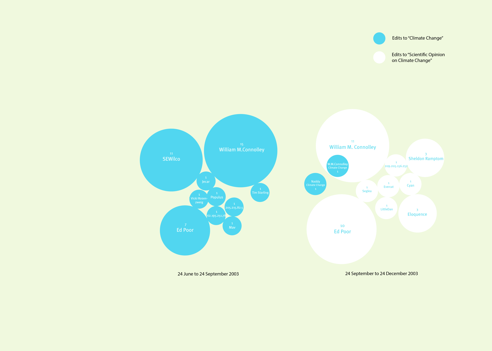

---
Pr-id: Networked Content Analysis: The Case of Climate Change
P-id: Theory on Demand
A-id: 32
Type: article
Book-type: anthology
Anthology item: article
Item-id: 03
Article-title: 4. wikipedia as a socio-technical utility for networked content analysis
Article-status: accepted
Author: Sabine Niederer
Rights: CC BY-NC 4.0
...

# 4. Wikipedia as a Socio-technical Utility for Networked Content Analysis

In the previous chapter, I have assessed the climate change debate
through scientometrics and networked content analysis. To understand the
technicity of online networked content, I argued, it is necessary to
address how content is networked and which kinds of digital methods and
tools are therefore suitable for the demarcation of content and the
operationalization of the research question. In this chapter, I will
address the mapping of the climate debate in Wikipedia. But before
coming to the discussion of this debate, as it plays out and is managed
among and other controversial topics and the management thereof in
Wikipedia, I will discuss how Wikipedia has revived the idea of the web
as a place of human collaboration and mass participation by
‘everybody’.[^06ch04_1] The Wikipedia platform is often considered as an
example par excellence of the collaborative promise of social media, and
of knowledge production and management that utilizes the wisdom of
crowds. Since 2001, its group of editors and volunteers has engaged in
developing an online encyclopedia whereby anyone with net access is
welcome to contribute, and articles are open to continuous editing and
refinement. Scholars who have evaluated or contested the value of
Wikipedia content have almost unanimously focused on its crowd-based
organization and have stressed the danger of producing low-quality
information with many (anonymous) minds.[^06ch04_2]

These concerns about Wikipedia are legitimate and relevant, of course,
but the one-sided focus they give to human agents while neglecting the
role of technology must be both resisted and complemented by attention
to the socio-technological dimension of Wikipedia as a dynamic knowledge
production and management project. In this chapter, therefore, I want to
explore the technicity of Wikipedia content and assess how networked
content analysis can be applied to this platform. What do researchers
need to know of the platform's means of content creation, networking,
and maintenance to be able to analyze its content in a way that is
digitally and, more specifically, platform-informed? What does Wikipedia
‘do’ to content that is controversial, and what does this mean for the
methods of networked content analysis put forward in this book? To
answer these questions, I will first analyze how dependent the human
social creation, use, and maintenance of Wikipedia knowledge is upon
software robots (in short referred to as bots), the non-human content
agents that assist in editing Wikipedia articles. Secondly, I will
discuss examples of networked content analysis of controversial content
that make use of the possibilities offered up by Wikipedia's technicity
for controversy research.

The technicity of Wikipedia content makes it possible to refine further
the techniques of networked content analysis, and to explore how
resonance, related content, actor engagement, and controversy management
may be studied within this encyclopedia project. It is crucial to
understand Wikipedia as a dynamic, networked encyclopedia when
approaching its content for analysis, which is why I will start (as I
did in the previous chapter on Twitter) with a brief introduction of the
platform’s technicities. Again, this is not meant to be an exhaustive
overview of all the features of the platform, but rather can be seen as
a kind of technical introduction to socio-technical fieldwork, exploring
and describing the ways in which content is produced and networked.

Looking just at the level of its software, Wikipedia has changed
drastically throughout the years. Overall, however, it remains a
wiki-based encyclopedia platform, offering various levels of access to
information of article history and editors, enabling researchers to
follow the actors and close-read their positions, interactions,
references, and commitment to a specific issue. The interface of
Wikipedia presents an article and talk page for each Wikipedia subject.
In the article tab, it is possible to read or edit the article, or to
view the article's revision history. In the revision history, each edit
is listed along with a timestamp, and a username (or IP-address for an
anonymous edit). A click on the timestamp opens the particular version
of the article from that edit date. It is possible to make a selection
of differently dated versions of an article and compare the different
revisions. For each Wikipedia article, the revision history lists
external tools, including revision history statistics, revision history
search, edits by user, number of watchers, and page view statistics. The
Talk page shows some policies and general rules for discussion as well
as a place to ask questions or discuss edits. It is also where the
article's revision history is located and publicly accessible. A
Wikipedia article may start with links to similarly named articles
(disambiguation), or related articles. In the body text, highlighted
words mark links to other Wikipedia articles. Each article ends with
separate sections holding references and external links. In the left
margin of the page, the language versions of the article are listed, as
well as a list of ‘what links here’, which provides a list of all other
Wikipedia articles that link to the article you have in front of you.
All of this creates materials, which can be analyzed through networked
content analysis.

In the next section, I will discuss how Wikipedia has been researched
since its launch in 2001, and how dominant research practices have
disregarded some of the crucial technical specificities of Wikipedia
entailed in the production, organization, and maintenance of its
content. Before discussing the climate debate in Wikipedia, I will first
zoom in on two controversy analyses that are informed by the technicity
of Wikipedia content, by looking at discussions on the talk pages (for
the article on Gdańsk/Danzig), and by conducting a comparative analysis
of articles across language versions (for the case of the Srebrenica
massacre). While these analyses are unrelated to climate change research
projects, they offer insights into the methodological workings of
networked content analysis. The final project discussed in this chapter
is a mapping of climate change articles, which ties back not only in
terms of techniques but also in its subject matter to the previous
chapters’ case studies of the climate debate on the web accessed through
Google Web Search and Twitter. In my networked content analysis here, I
build on existing research to trace climate change-related content and
close read actor behavior in and through Wikipedia.

## Many Minds Collaborating

Wherever Wikipedia is discussed, the facts of its material composition
very quickly drift into metaphor. It is variously described: by Sunstein
as a platform of ‘many minds’ produced by what Kittur and Kraut call
‘the wisdom of crowds’; by Shirky as a system of ‘distributed
collaboration’; by Tapscott and Williams as ‘mass collaboration’; and as
a space enabling hybrid new forms of ‘produsage’ by Bruns, inspiring
what Howe calls ‘crowdsourcing’ and Stalder and Hirsch describe as ‘Open
Source Intelligence’, and Poe as ‘collaborative
knowledge’.[^06ch04_3][^06ch04_4][^06ch04_5][^06ch04_6][^06ch04_7][^06ch04_8][^06ch04_9][^06ch04_10] As a collectively written
encyclopedia launched on a wiki platform, it is indeed one of the web’s
most significant and longer duree (in internet history terms) examples
of collaborative knowledge production. In early 2008, an article in the
*New York Review of Books* explained the media cultural charm of
Wikipedia:

> So there was this exhilarating sense of mission — of proving the
> greatness of the Internet through an unheard-of collaboration. Very
> smart people dropped other pursuits and spent days and weeks and
> sometimes years of their lives doing ‘stub dumps,’ writing ancillary
> software, categorizing and linking topics, making and remaking and
> smoothing out articles — without getting any recognition except for
> the occasional congratulatory ‘barn star’ on their user page and the
> satisfaction of secret fame. Wikipedia flourished partly because it
> was a shrine to altruism — a place for shy, learned people to deposit
> their trawls.[^06ch04_11]

Since the start of the Wikipedia project in 2001, the dedication of its
contributors as well as the platform’s success in socializing knowledge
production for the benefit of many, in contradistinction to academic and
media industry reliance on experts, has been through numerous waves of
praise and publicly mediated criticism. While Wikipedia has indeed
become famous for its collaborative approach to networks — of many minds
producing knowledge — it is interesting to recall that the project
originally intended to be an expert-generated encyclopedia. Beginning
under the name of Nupedia, a small team of selected academics was
invited to write the entries, with the aim of creating a ‘free online
encyclopedia of high quality’.[^06ch04_12] The articles would be made available
to World Wide Web users through an open content license. Founder Jimmy
‘Jimbo’ Wales and his employee Larry Sanger put into place a protocol
based on academic peer-review.[^06ch04_13] This expert approach failed, partly
because of the slowness of the editing process by invited scholars. To
speed up the process, Sanger suggested a wiki as a collective place
where scholars and interested laypeople from all over the world could
help with publishing and editing draft articles. The success of
Wikipedia and the commitment of emerging Wikipedians took them by
surprise. Sanger became the chief organizer, a wiki-friendly alternative
for the job of editor-in-chief that he held for Nupedia. He made a great
effort to keep Wikipedia organized while at the same time providing
space for certain kinds of dynamic ‘messiness’ the platform was
catalyzing (edit wars, inaccuracies, mistakes, fights, etc.) that ensues
from collaborative production. In early 2002, however, Sanger was
dissatisfied and turned away from the epistemic free-for-all of
Wikipedia, towards an expert-written encyclopedic model called
Citizendium; Wales stayed, choosing to pursue further the Wikipedia
model.[^06ch04_14]

Ever since the Sanger-Wales split, the question of whether online
encyclopedias and similar enterprises should be produced by a few
accountable individuals (experts) or from the fruits of many (amateur)
minds has been a source of heated debate. Internet critic Andrew Keen
applauded Sanger for coming to his senses about the (in his view)
debased value of amateur contributions in favor of professional
expertise.[^06ch04_15] On the other end of the spectrum, many Wikipedia adepts
have praised its democratizing potential as well as its ethos of
community and collaborative knowledge production available to everyone
to read and write.[^06ch04_16][^06ch04_17] At the same time, the publicly consolidated
narrative that Wikipedia is produced by *crowds* has been challenged,
most notably by Wikipedia’s founders themselves. In actuality, during
the first five years of its existence, Wikipedia was largely dependent
on the work of a small group of dedicated volunteers. Although they soon
formed a thriving community, the notion of a massive collective of
contributors was repeatedly downplayed by Wales. As he pointed out in a
talk at Stanford University in 2006:

> The idea that a lot of people have of Wikipedia, is that it's some
> emergent phenomenon—the wisdom of mobs, swarm intelligence, that sort
> of thing—thousands and thousands of individual users each adding a
> little bit of content and out of this emerges a coherent body of work.
> (...) \[But Wikipedia is in fact written by\] a community, a dedicated
> group of a few hundred volunteers. (...) I expected to find something
> like an 80-20 rule: 80% of the work being done by 20% of the users (…)
> But it's actually much, much tighter than that: it turns out over 50%
> of all the edits are done by just \[0\].7% of the users.[^06ch04_18]

As Wales asserts until 2006, Wikipedia was primarily written and
maintained by a small core of dedicated editors (2% doing 73.4% of all
the edits). Such a disproportionate contribution of (self-)designated
co-producers versus ‘common users' can be found in research into
production across the larger open source movement. Rishab Aiyer Ghosh
and Vipul Ved Prakash were among the first to disaggregate the notion of
‘many minds’ collaborating in the open software movement. From their
work, they conclude that ‘free software development is less a bazaar of
several developers involved in several projects and more a collation of
projects developed single-mindedly by a large number of authors’.[^06ch04_19]
In the open source movement then, very few total numbers of people were
directly collaborating in developing software. This raises the question
whether the same dynamics hold for Wikipedia.

It is important not to entirely dismiss the idea of Wikipedia's mass
collectivity as a mere myth. The matter is more complicated than this.
From 2004 onwards, the online encyclopedia shows a distinct decline of
‘elite' users while at the same time, the number of edits made by novice
users and ‘masses’ steadily increases. Various researchers have pointed
to a dramatic shift in workloads to the common user at this point.[^06ch04_20]
But instead of explaining the shift as a reversal of existing orders of
participation, Kittur et al. speak of marked growth in the population of
low edit users in terms of ‘the rise of the bourgeoisie’.[^06ch04_21]
Interestingly, these researchers explain this shift and coinage by
describing Wikipedia's dynamic social system evolving as a result of the
gradual development, implementation, and distribution of content
management systems. After an initial period of being managed by a small
group of high-powered, dedicated volunteers, the ‘pioneers were dwarfed
by the influx of settlers’.[^06ch04_22] The early adopters select and refine
the technology and managerial systems, followed by a majority of novice
users who begin to be the primary users of the system. Kittur and his
colleagues observe a similar decline of elite users in Web 2.0 platforms
and suggest that it may be a common phenomenon in the evolution of
online collaborative knowledge systems.

This tentative conclusion is reinforced by the research of Burke and
Kraut, which shows that to sustain the encyclopedia’s growing
popularity, organizers need to identify the platform’s more productive
workers and grant them ‘administrator’s status’.[^06ch04_23] Important to note
here is that since the publication by Kittur et al. in 2007, the
English-language Wikipedia has lost one-third of its editors.[^06ch04_24][^06ch04_25]
Problematically, the composition of this remaining editor-base mainly
consists of white male editors, a gender imbalance that plays out in the
substance of the encyclopedia project. ‘Its entries on
Pokemon and female porn stars are comprehensive, but its pages on female
novelists or places in sub-Saharan Africa are sketchy’.[^06ch04_26][^06ch04_27]

Although Wikipedia researchers who look at compositions of the so-called
crowd do observe significant historical changes in the ‘wisdom of
crowds’ narrative, their analyses tend to retain a binary divide between
(few) experts and (many) common users, without considering other factors
affecting collaborative production. Where they do notice the growing
presence of non-human actors, such as software tools and managerial
protocols, in the evolution of Wikipedia’s social dynamics, they tend to
underestimate their importance. In fact, the increasing openness of
Wikipedia to inexperienced human users is only made possible by a
sophisticated techno-managerial system facilitating collaboration on
various levels. Without the implementation of this strict hierarchical
content management system and its reliance on MediaWiki software,
Wikipedia would most likely have become a chaotic experiment.

According to Alexander Galloway, the Internet and many of its (open
source) applications are not simply open or closed, but modulated. More
specifically, Galloway’s work is key to comprehending the extent to
which networked technology and the management of its developments are
moderated by protocol — logics and authority generated ‘from technology
itself and how people program it’.[^06ch04_28] Wikipedia, built as an open
system and carried out by large numbers of contributors, appears to be a
*warm, friendly* technological space, but only becomes warm and friendly
through what Galloway refers to as ‘technical standardization,
agreement, organized implementation, broad adoption and directed
participation’.[^06ch04_29]

It is in these formative years of Wikipedia that the specific technicity
of its content materialized and developed into a techno-managerial
system, imposing a hierarchical order in deciding what entries to
include or exclude and what edits to allow or block.[^06ch04_30] Here, to look
more closely at Wikipedia’s organizational hierarchy (Figure 10) is to
distinguish various user groups, some of which are ‘global’ (in the
sense that they edit across various language Wikipedias) while others
are specific to a certain local Wikipedia.

Figure 10: User groups and their permission levels. Schematic overview
of global and local categories of Wikipedia users according to
permission levels. Wikimedia contributors, 'Wikipedia User Groups', 13
August 2019, http://meta.wikimedia.org/wiki/User\_groups.

Each user group maintains the same pecking order, regulating the
distribution of permission levels: blocked users have the least
permissions, for they can only edit their own talk page. Unregistered
(anonymous) users have fewer permissions than registered users, who, in
turn, are at a lower level of permission than bots; bots are close to
administrators (or ‘admins'), who occupy the highest level in the
elaborate Wikipedia-bureaucracy. System administrators (or ‘developers')
have the most permissions, including server access. This is a small user
group of only ten people who ‘manage and maintain the Wikimedia
Foundation Servers’.[^06ch04_31] Remarkable in this ranking system is the
position of bots (short for software robots), whose permission level is
just below that of administrators but above the authority of registered
users. I will return to the status of bots in the third section. For
now, it is important just to note the significant role of automated
mechanisms in the control of content.

Taking this notion of Wikipedia as a liberated vehicle of human
collaboration, it could be argued that the very success of the Wikipedia
project lies less as much in free collaboration as it does in the
regulation of collaborative production at every level, from a small edit
or a single upload to a more extensive contribution or even development
of the platform or its content.[^06ch04_32] Like any large public system,
Wikipedia works through a system of disciplinary control by issuing
rewards, such as granting a dedicated user the authority level of
administrator, and by blocking the contributing rights of those users
who deviate from the rules.[^06ch04_33] A disciplinary system of power
distribution in the digital age, however, can’t be regarded exclusively
as a system of social control.[^06ch04_34] As Gilles Deleuze has pointed out in
his acute revision of Foucault’s disciplinary institutions, a ‘society
of control’ deploys technology as an intricate part of its social
mechanisms.[^06ch04_35] Wikipedia’s content management system, with its
distinct levels of permissions, allows moreover for protocological
control: a mode of control that is at once social and technological—one
cannot exist without the other.[^06ch04_36] Along the same lines, Bruno Latour
proposes to analyze technological objects and infrastructures as
‘socio-technical ensembles’, in which the strict division between
‘material infrastructure’ and ‘social superstructure’ is dissolved:[^06ch04_37]

> Rather than asking, “is this social” or “is this technical or
> scientific” \[...\] we ask: has a human replaced a non-human? Has a
> non-human replaced a human? \[…\] Power is not a property of any of
> those elements \[of humans or non-humans\] but of a chain.[^06ch04_38]

Attending to the chain, rather than reinforcing the ‘technology/society
divide’ that these theorists have already deconstructed before me, I
argue that Wikipedia’s dynamic interweaving of human and non-human
content agents is an underrated yet crucial aspect of its performance.
The online encyclopedia’s success is based on socio-technical
protocological control, a complex combination of its technical
infrastructure and the variegated collective ‘wisdom’ of its
contributors. Rather than assessing Wikipedia’s epistemology exclusively
in terms of the ‘power of elites’ versus the ‘wisdom of crowds’, I
propose to define Wikipedia as a gradually evolving socio-technical
system that carefully orchestrates all kinds of human and non-human
contributions towards its development, by implementing managerial
hierarchies, protocols, and automated editing systems that constitute
the technicity of Wikipedia content. This technicity is also deployed to
produce accurate and neutral content.

## Accurate and Neutral Encyclopedic Information

Disregard of technological elements occurs in another heated debate
haunting the Wikipedia project since its inception: the question of the
credibility, accuracy, and objectivity of its content as an encyclopedic
knowledge source, given the phenomenal difference of its experiment in
socially editable, collaborated and anonymous dissemination. In other
words, Wikipedia organizes the authorship of content and manages its
standards, and thus ‘authority’, quite differently to offline projects
like the Encyclopedia Britannica, against which it has often been
compared and tested.[^06ch04_39] In response to this accuracy debate, reliant
on the assumed polarity between (known) experts and (unknown)
laypersons, few academics proposed to redirect their focus from
encyclopedic content to the qualities and agency of Wikipedia’s
technological tools.

One exception is a study by historian Roy Rosenzweig that conducted a
thorough analysis of Wikipedia content by comparing it biographical
entries to entries from the American National Biography Online (written
by known scholars).[^06ch04_40] Rosenzweig concludes that the value of
Wikipedia should not be sought in the accuracy of its published content
at one moment in time but in the dynamics of its continuous editing
process — an intricate process where amateurs and experts collaborate in
an extremely disciplined manner to improve entries each time they are
being edited. Rosenzweig notices the benefits of multiple edits to the
factuality of an entry. As he points out, it is not so many crowds of
anonymous users that make Wikipedia a reliable resource, but a regulated
system of consensus-based editing that shows up how history is written
from multiple accounts. In his words: ‘Although Wikipedia as a product
is problematic as a sole source of information, the process of creating
Wikipedia fosters an appreciation of the very skills that historians try
to teach.’[^06ch04_41] One of the most important features, in this respect, is
the website's built-in history page for each article, which lets you
check the edit history of an entry. According to Rosenzweig, the history
of an article, as well as personal watch lists and recent changes pages,
are important instruments that give users additional clues to determine
the quality of individual Wikipedia entries.

The politics and technicity of anonymity add a whole other layer to the
accuracy debates, which is of importance to my development of networked
content analysis. Disputes regarding the accuracy and neutrality of
Wikipedia’s content concentrate on the inherent unreliability of
anonymous sources. How can an entry be neutral and objective if the
encyclopedia accepts copy edits from anonymous contributors who might
have a vested interest in its outcome? Critics like Keen (2007) and
Denning et al. (2005) have objected to the principle of distributing
editing rights to all users. What remains unsaid in this debate is that
the impact of anonymous contributors is materially restricted due to
technological and protocological control mechanisms. At a base level,
every erroneous anonymous edit is systematically overruled by anyone who
has a (similar or) higher level of permission (which is anyone except
for blocked users). Since anonymous users are very low in the Wikipedia
pecking order, the longevity of their edits is likely to be short when
they break the rules of objectivity and neutrality. Furthermore, for
anonymous editors, Wikipedia lists the IP addresses. This has inspired
and enabled the creation of counter-tools such as WikiScanner for
checking the identity of anonymous contributors, which it does by
matching IP addresses with contact information. Bias in contributions
can in this way be identified by a layperson, tracked across multiple
entries, and if necessary, reversed.[^06ch04_42][^06ch04_43] My propositions for
networked content analysis attendant to these socio-technics is informed
by controversy mapping and follows the actors to understand the debate
and the state thereof.

The debates concerning Wikipedia's accuracy and neutrality have been
dominated by fallacious oppositions of human actors (experts versus
amateurs, registered versus anonymous users) and have also favored a
static approach to the evaluation of specific content (deemed correct or
incorrect at only one particular moment in time). Both of these starting
points have been ill-suited for the appreciation and analysis of dynamic
and networked content in platforms such as Wikipedia, mostly because a
debate grounded in such parameters fails to acknowledge the crucial
impact of non-human actors—Wikipedia's dynamic content management system
and the protocols by which it is run. Arguably, Wikipedia is not simply
the often-advertised platform of ‘many minds,' nor is it merely a
free-for-all space for anonymous knowledge production. But there is more
to the technicity of Wikipedia content than savvy users armed with
notification feeds and monitoring devices. The technicity of Wikipedia
content, key to the further development and application of networked
content analysis, lies in the totality of tools and software robots used
for creating, editing, and linking entries, combating vandalism, banning
users, scraping and feeding content and cleaning articles. It is this
complex collaboration not of crowds but of human and non-human agents
combined, which defines the quality standards of Wikipedia content and
is crucial to networked content analysis. These aspects must be taken
into account when studying Wikipedia content.

## Co-authored by Bots

The significant presence of bots in Wikipedia’s workings runs counter to
the commonly held assumption that Wikipedia content is authored by human
crowds. In fact, human editors would be greatly strained to keep up the
online encyclopedia if they weren’t assisted by a large number of
software robots. Bots are pieces of software or scripts that are
designed to ‘make automated edits without the necessity of human
decision-making.’ They can be recognized by a username that contains the
word ‘bot,' such as SieBot or TxiKiBoT (Wikimedia, n.d.-i).[^06ch04_44] Bots
are created by Wikipedians, and once approved, they obtain their own
user page and form their own user group with a certain level of access
and administrative rights, made visible by flags on a user account page.
One year after Wikipedia was founded, bots were introduced to help with
repetitive administrative tasks. Since the first bot was created on
Wikipedia, the number of bots has grown exponentially. In 2002, there
was only one active bot on Wikipedia; in 2006, the number had grown to
151, and in 2008 there were 457 active bots.[^06ch04_45][^06ch04_46]

In general, there are two types of bots: editing (or ‘co-authoring’)
bots and non-editing (or ‘administrative’) bots. Each bot has a very
specific approach to Wikipedia content, related to its often-narrow
task. Administrative bots are most well known and well-liked among
Wikipedia users, deployed to perform policing tasks, such as blocking
spam and detecting vandalism. Bots that combat vandalism come into
action when seemingly radical or destructive edits are made, for
example, when large sections of content are deleted or written over in
an article. Spellchecking bots check language usage and make corrections
in Wikipedia articles. Ban enforcement bots can block a user from
Wikipedia, and thus take away his or her editing rights, which is
something a registered user is not able to do. Non-editing bots also
include data miners, used to extract information from Wikipedia, and
copyright violation identifiers. The latter compare text in new
Wikipedia entries to what is already available on the web about that
specific topic and report this to a page for human editors to review.
Most bots are created to perform repetitive tasks and make many edits.
In 2004, the first bots had accrued a record number of 100,000 edits.

The second category of editing or co-authoring bots seems to be much
less known by Wikipedia users and researchers (for otherwise, they would
certainly have played a role in the debates about reliability and
accuracy). While not every bot is an author, all bots can be classified
as what I am calling *content agents*, as they all actively engage with
Wikipedia content. The most active Wikipedians are, in fact, bots; a
closer look at various user groups reveals that bots create a large
number of revisions with high quality. Adler et al. (2008) discovered
that the two top contributors in their test of the longevity of edits
were bots. As mentioned before, bots as a user group have more rights
than registered human users and also a particular set of permissions.
For instance, bot edits are by default invisible in recent changes logs
and watch lists. Research cited above has already pointed out that
Wikipedians rely on these notification systems and feeds for the upkeep
of articles.

Describing Wikipedians in bipolar categories of humans and non-humans,
however, does not do justice to what is the third category of many
active users being robustly assisted by administrative and monitoring
tools. The capacities of these kinds of users are captured in naming
them ‘software-assisted human editors.’ Bots are Wikipedians’ co-authors
of many entries. One of the first editing bots to be deployed by
Wikipedians was rambot, a piece of software created by Derek
Ramsey.[^06ch04_47] Rambot pulls content from public databases and feeds it
into Wikipedia, creating or editing articles on specific content, either
one by one or as a batch. Since its inception in 2002, rambot has
created approximately 30,000 articles on U.S. cities and counties on
Wikipedia using data from the CIA World Factbook and the U.S. Census.
Since the content produced by authoring bots relies heavily on their
source, errors in the data set caused rambot to publish around 2,000
corrupted articles. With time, bot-generated articles on American cities
and counties were corrected and complemented by human editors, following
a strict format protocol: history, geography, demographics, etc. The
articles appear strikingly tidy and informative and remarkably uniform.
If we compare, for instance, an article on La Grange, Illinois, as
created by rambot in 2002 with a more recent version of this article
from 2009, it clearly shows the outcomes of a collaborative editing
process; the entry has been enriched with facts, figures and images
(Figure 11). The basic format, however, has remained the same. To date,
it still is rambot’s main task to create and edit articles about US
counties and cities, while human editors check and compliment the facts
provided by this software robot.[^06ch04_48]

Figure 11: A bot-created article compared to a human-edited article. The
upper screenshot is the La Grange, Illinois article as created by rambot
on 11 December 2002. The lower screenshot shows the same article on 14
November 2015. Wikipedia contributors, 'La Grange, Illinois', 27
February 2016,
https://en.wikipedia.org/w/index.php?title=La\_Grange,\_Illinois&oldid=707244890.

But how dependent is Wikipedia on the use of bots as content agents for
the creation and editing of its articles? What is the relative balance
of human versus non-human contributions in the online encyclopedia?
Peculiarly, the answer to this simple question turns out to be layered
and nuanced. From the statistics offered by Wikipedia, it is observable
that the use of non-human contributions differs to a striking degree
between various language Wikipedias.[^06ch04_49] As a global project, Wikipedia
features over ten million articles in over 250 languages. What is the
relative balance of human versus non-human agents? The fact that
Wikipedia distinguishes between local and global user groups already
suggests that bot activity might differ across local Wikipedias. As it
turns out, specific language Wikipedias not only greatly vary in size
and number of articles, but also in bot activity. The percentage of bot
edits in all Wikipedias combined was 21,5% in 2009. In 2014, Wikipedia
had 22.4% bot activity. The percentage of bot edits in all Wikipedias
combined was 25,8% in February of 2015. Excluding the English language
Wikipedia, total bot activity counts up to over 35% (which was 39% in
2009). This shows that bot activity is unevenly distributed across
language versions.[^06ch04_50][^06ch04_51][^06ch04_52]

To account for the differences in bot activity versus human activity, in
previous research I have compared bot activity in the most-used language
Wikipedias (English, Japanese, German) to bot activity in endangered and
revived language Wikipedias (e.g., Cornish, Oriya, Ladino).[^06ch04_53] Most of
the editing of the English, Japanese, and German Wikipedias in 2008 was
shown to be done by human editors. The German Wikipedia, for instance,
had only 9% bot activity, the English version even less. Wikipedias of
small and endangered languages showed a high dependency on bots and a
relatively small percentage of human edits. One small Wikipedia, in the
language ‘Bishnupriya Manipuri' had seen 97% of its edits made by bots.
Further analysis of bot activity versus human activity revealed that the
degree of bot dependency could be an indicator of the general state of a
language Wikipedia—if not the state of that language itself—in the
global constellation.

It is noticeable when looking at the different types of bots that
Wikipedias are maintained mainly by bots that network the content. These
are called interwiki and interlanguage bots. These bots take care of
linking ‘articles to articles’ in Wikipedias, and prevent links and
pages from becoming orphans or dead ends. Wikipedia policy states that
all articles should be networked and part of the Wikipedia web. Not only
are ‘good' Wikipedia articles full of links to reliable sources, but
they should also link to related Wikipedia articles and sub-articles,
and be linked to. Articles that only refer to each other, but are not
linked to or linking to other articles, are also considered a threat to
the principle of building the web.[^06ch04_54] Most of the work in interlinking
these Wikipedia language versions is done by so-called interwiki bots.

It is possible to analyze a language version’s state of
interconnectedness using the Wikipedia statistics pages, featuring lists
of the most active bots per language Wikipedia. They reveal that
most-used language Wikipedias, which obviously contain much more content
than the smaller language Wikipedias, have bot activity distributed
across administrative tasks. In German, for instance, the top 45 of most
active bots featured 27 interwiki bots and 18 bots that are meant to
edit content, add categories and fix broken links. In the smaller
language Wikipedias, bots significantly outnumbered human editors and
were mostly dedicated to linking articles to related articles in other
Wikipedias; they made sure the content, however scarce, is networked.
The Cornish Wikipedia’s top 45 of most active bots, for instance, showed
at least 35 interwiki bots, and the remainder were bots with unspecified
functions. These interwiki bots, such as Silvonenbot, a bot that adds
interlanguage links, make connections between various language
Wikipedias. Smaller language Wikipedias thus make sure that every
article is properly linked sideways and prevent the language Wikipedia
from becoming isolated.

Tracing the collaboration between human and non-human agents in
Wikipedias thus allows for interesting and unexpected insights into the
culturally and linguistically diverse makeup of this global project.
Following the ‘wisdom of crowds’ paradigm, it is tempting to look for
cultural-linguistic diversity in patterns of transnational collaboration
in different languages, from so many proliferated cultural backgrounds.
But in line with this paradigm, British information scientists have
demonstrated that the Internet – and Wikipedia in particular – is
anything but a culturally neutral space; major aspects of online
collaborative work are influenced by pre-existing cultural differences
between human contributors, as discussed in a comparative content
analysis of the editing behavior found in four language versions of the
Wikipedia article on Games.[^06ch04_55] Adding a medium-specific networked
content analysis of the varied distributions of bot dependency across
the wide range of language Wikipedias, it is possible to elaborate
further that cultural differences in collaborative authoring of
Wikipedia content cannot just be accounted for in terms of human users;
they reveal themselves, perhaps more strikingly, in the relative shares
of human and non-humans contributions, which can be tracked through
automated patterns of contributions. High levels of bot activity, mainly
dedicated to networking content and to building the web, are an
indicator of small or endangered languages; a wider variety of bot
activity, largely subservient to human editing activity, could be
considered an indicator of a large and lively language space. This is
relevant to the understanding of Wikipedia content, for those
researchers invested in its analysis.

Before moving to the climate debate, in the following section, I will
present two studies that each offer a close reading of articles in order
to study a controversy (in this case the Srebrenica Massacre and the
city name of Gdansk) and how it is taking place behind the scenes of
Wikipedia articles. I discuss these studies to make a case for an
approach to networked content analysis that uses the (ever-evolving)
technicity of the Wikipedia platform in the analysis of a controversial
topic. Subsequently, I will proceed to discuss the issue central to the
book, namely that of the climate change debate. The study explicitly
deploys the *networked-ness* of Wikipedia content to demarcate an
arrangement of related, interlinked articles and looks into the
composition of its editors as well as editing activity over time.

## Wikipedia and Controversy Mapping

In its status as an encyclopedia project, it seems initially
counterintuitive to think of Wikipedia as a space of controversy. If it
were to operate fully in line with the offline genre of the
encyclopedia, as a utility whose information is pre-officiated and fixed
(but indeed, revisited authoritatively with each edition) the online
reader would assume that all controversy would aim to be resolved as
best as possible, prior to its publication. However, due to the way
Wikipedia content is networked, designed, and managed, the platform has
emerged to be recognized as a unique socio-technical site of, and for,
controversy mapping, an encyclopedic project that is ever exposed ‘in
the making’. To deal with controversy at the level of information, Jimbo
Wales advocates the description of sometimes-conflicting perspectives
within the same article, to achieve a neutral point of view (the NPoV
rule). In his words:

> Perhaps the easiest way to make your writing more encyclopedic is to
> write about what people believe, rather than what is so. In making
> this work, the NPoV rule in Wikipedia is crucial and has therefore
> been heralded as a success story of the potential of open editing.
> Consider the example of the controversial entry on abortion, where,
> after a dispute, editors chose to include an in-depth discussion of
> the different positions about the moral and legal viability of
> abortion at different times. \[…\] This made it easier to organize and
> understand the arguments surrounding the topic of abortion, which were
> each then presented sympathetically, each with its strengths and
> weaknesses.[^06ch04_56]

There are other examples in which a networked content analysis of
controversial Wikipedia articles provides a much richer view of the
debates taking place around a particular topic than the site itself can
achieve. For instance, using the different language versions of an
article is a useful means to compare Wikipedia articles on a single
specific issue. Researchers including Rogers and Sendijarevic, and
similarly Bilic and Bulian, have pointed out that it is more accurate to
say that there are ‘national’ rather than ‘neutral’ points of view,
where different language versions provide different views on a specific
historic event.[^06ch04_57] In this section, I will discuss two analyses of
controversy around the history of a specific place, and how these case
studies deploy the technicities of Wikipedia content for their analysis.
First, I will discuss a famously debated article on Gdańsk/Danzig.[^06ch04_58]
Secondly, I will discuss the study of the Srebrenica massacre by Rogers
and Sendijarevic.

The article on Gdańsk/Danzig is one of the better-known controversy
objects within Wikipedia.[^06ch04_59] An ethnographic study by Darius Jemelniak
explores this case extensively, by looking at how the ‘traditional
dispute resolution methods’ of Wikipedia proved ineffective in this
case, such that consensus was never reached.[^06ch04_60] The article on Gdańsk,
which was written already in 2001 with the start of the Wikipedia
project, in its first version consisted of just two sentences: ‘Gdansk
is a city in Poland, on the Baltic sea. Its old German name is
Danzig.’[^06ch04_61] In December of the same year, after several changes to the
body of the article, an editor decided to change its title and all other
mentions of Gdańsk in the article to Danzig. Jemelniak describes how
various editors have striven to reach a compromise in both the naming
and the description of the city and its history through traditional
means of conflict resolution, such as discussion on the talk page,
mediation by administrators in contributing to the article, closing down
the article from editing activity and eventually splitting the article
into one about Gdańsk and one about Danzig.

Jemelniak emphasizes that in accordance with the larger Wikipedia model,
a consensus is often reached over time; therefore, ‘winning an argument
is simply about staying in the discussion long enough’.[^06ch04_62] In the case
of Gdansk, however, longevity did not lead to consensus, and the edit
war persisted for years. Between 2003 and 2005, the editing was mainly
done by four editors heatedly working on the article, which lead
administrator Ed Poor (who we will see more of in the study of the
climate change articles) to intervene. His efforts however, only
exacerbated the edit war, which was by then even listed as one of the
‘lamest edit wars' ever on the Wikipedia page dedicated to tracking
these.[^06ch04_63][^06ch04_64]

Eventually, a sub-page was set up for voting about the naming
convention. This subpage first ‘prolonged the debate’ but later did
facilitate a vote, which attracted a strikingly small number of only 80
votes.[^06ch04_65] Today, the Gdańsk page in English uses the city name Gdańsk
throughout the article, and Danzig has its own dedicated article. Where
Jemielniak looks mostly at the various actors and their discussions in
the talk page for his content analysis, which allows for a close reading
of the controversy, he also makes use of the technicity of the platform
that includes the editing history per user, and checks the editing
history of some of the 80 editors who did vote, for instance. The fact
that some of these editors only had a very limited editing history
before the date of the vote raises further questions about whether user
accounts were created solely for this purpose.[^06ch04_66][^06ch04_67] Jemielniak’s
analysis concludes from this that Wikipedia as a ‘community relies as
much on cooperation as it does on conflict’, which he then fleshes out
by looking at the strict editing protocols at play (discussed earlier in
this chapter).[^06ch04_68]

In his analysis, Jemielniak makes use of various technicities of
Wikipedia. For instance, he looks at the history of the article
comparing versions of the article, follows the debate on the talk page,
studies the actor composition by looking at the different users in the
editing history, and looks at editing activity per user and the profiles
of each of the Wikipedians involved in the discussions and editing wars.
Furthermore, he gains insight into the internal Wikipedia culture by
describing the role of administrators in mediating and locking down
controversial articles, and by pointing at the (humorously intended)
‘lamest edit wars’ page.[^06ch04_69] However, where Jemelniak starts his study
by saying that ‘traditional dispute resolution methods’ did not work in
the Gdańsk/Danzig example, we will see that the eventual forking of the
article (into one about Gdańsk and one about Danzig) to displace
controversy is a means to end (or at least isolate) controversy. This
strategy is used frequently in Wikipedia, and may even be one of the
most relied upon, and appreciated dispute resolution mechanisms.

Another strong example of a study that makes use of the technicity of
Wikipedia content to appraise controversy in the workings of Wikipedia
was conducted by Rogers and Sendijarevic around the topic of the
Srebrenica massacre of July 1995. Where Jemielniak describes Wikipedia
as a dissent-driven platform, Rogers and Sendijarevic discuss the
platform as a ‘cultural reference’, and site for controversy
mapping.[^06ch04_70] Perhaps it is needless to emphasize again that this is a
counter-intuitive point of departure from the notion of Wikipedia
authorship as being principally invested in the cultivation of a neutral
point of view (NPoV), to ‘\[represent\] fairly, proportionately, and as
far as possible without bias, all significant views that have been
published by reliable sources’.[^06ch04_71] In this case study, conducted by
Rogers and Sendijarevic, the research question is whether Wikipedia
could show up ongoing differences in points of view on the events of
July 1995 in Srebrenica, through a method of comparing various language
versions of the article on the Srebrenica Massacre.[^06ch04_72]

The content demarcated for this comparative analysis consists of six
language versions of the article on the ‘Srebrenica Massacre’, namely
the English, Dutch, Bosnian, Serbian, Croatian, and Serbo-Croatian
versions. The content used for comparison contains the common parts of
an article, such as title, table of content, authors (or editors),
images, and references. Wikipedia-specific content elements that are
added to the data set include the discussion pages and the location of
anonymous editors (based on their IP-address).[^06ch04_73] This leaves out
other similarly specific elements that are also of interest in the study
of Wikipedia articles, such as the activity of bots, which as discussed,
are often the most active editors, whether across an entire language
version of Wikipedia or in a single article.

A first step in the analysis was to align side-by-side the different
elements of the various articles. Tables and charts were drawn up, which
enabled the researchers to quickly discover that, indeed, significant
discrepancies between the different language versions could be
discerned. First of all, in the article titles: ‘Srebrenica Massacre’
(English), ‘Masakr u Srebrenici’ (Serbian), ‘Masakr u Srebrenici’
(Serbo-Croatian), ‘Genocida u Srebrenici’ (Bosnian), ‘Genocide u
Srebrenici’(Croatian) and ‘De Val van Srebrenica’ (Dutch), they could
identify references to this single event as massacre, genocide, or the
military term ‘fall’ of Srebrenica, as the Dutch article title reads.
Another striking difference could be found in the victim count across
article versions (Table 1), where the Dutch and Serbian articles round
down, and the others tend to be higher, and the English one most
specific.[^06ch04_74]

Table 1: Wikipedia articles compared across language versions.
Comparison of victim counts from the Srebrenica massacre in the Bosnian,
Croatian, Dutch, English, Serbian and Serbo-Croatian articles. Rogers
and Sendijarevic. 'Neutral or National Point of View?’.

The first analysis confirmed a ‘national’ point of view rather than a
‘neutral’ point of view.[^06ch04_75] With methodological nuance, Rogers and
Sendijarevic explore Networked Content Analysis on different technical
levels. Firstly, on a Wikipedia language version level, their detailed
findings give an overview of the four Balkan language versions (Serbian,
Croatian, Serbo-Croatian and Bosnian), and compare them in terms of
article count, number of edits, number of users and number of active
users. Secondly, on this same level, they compare the creation dates of
the various Srebrenica massacre articles in the respective Wikipedia
language versions, including Dutch and English, and set these against
the creation dates of the Wikipedia language versions themselves.

Analyzing the editors of these articles for each language version,
Rogers and Sendijarevic's results show editor activity across language
versions, and for the anonymous users (for which an IP-address is listed
as mentioned before when discussing the WikiScanner) an overview of
their location. (Interestingly, as Networked Content Analysis
researchers you can localize anonymous users, but not registered ones.)
At the level of the article, their study includes a comparison of the
use of images ‘looking at the sheer numbers (62 in total), the shares of
them (English with 20, Bosnian 15, Croatian 14, Serbian and
Serbo-Croatian 5 and Dutch 3), the common ones, and those that are
unique’, and a similar analysis of shared and unique references, the
victim count per article, and the table of content.[^06ch04_76] Regarding the
talk page, their study offers a very detailed description of the actors’
positions and discussions. Rogers and Sendijarevic make the point that
these sub-analyses, especially of discussions, show the struggles to
achieve neutrality, especially in the English and Serbo-Croatian
version. ‘Editors of the various language versions participate in the
English version, which results in a continually contested article often
referred to (in the Serbian article) as western biased. The
Serbo-Croatian strives to be anti-nationalist and apolitical, employing
a variety of means to unify the Bosnian and Serbian points of
view.’[^06ch04_77] In all, the researchers found that ‘the analysis provides
footing for studying Wikipedia’s language versions as cultural
references’.

Both the Danzig and Srebrenica study offer examples of how the
technicity of Wikipedia content provides opportunities for controversy
mapping. A good example of what a Networked Content Analysis approach
could look like when applied to the issue of climate change on Wikipedia
can be found in a study by digital methods researchers Carolin Gerlitz
and Michael Stevenson, which was conducted already in 2009, and is
discussed in the following section. Their case study, titled *The Place
of Issues*, combines the study of networked articles with a close
reading of editing activity, and actor commitment, including active
bots.[^06ch04_78]

## Wikipedia and the Climate Change Debate

In their study, Gerlitz and Stevenson first collect all Wikipedia
articles that are interlinked with the article on Global Warming, and
only retain the reciprocal links.[^06ch04_79] Subsequently, each of the
resulting URLs is scraped for links to Wikipedia articles, which are
collected in a relational database. This database is visualized with
ReseauLu, software for network analysis and visualization, after which
the articles selected for further analysis are highlighted (Figure 12).

The technicity of this Wikipedia article ecology represents a historical
and geographical ‘mapping’ of a dispute that can be studied through a
Networked Content Analysis. The network graph displays the network of
articles surrounding ‘Global Warming’ on Wikipedia, based on links
between the articles. The nodes are sized according to their numbers of
links, and shaped according to their role in the network (hubs appear in
purple), and distributed according to the links they receive (in-degree
centrality) and give (out-degree centrality) to other articles. The
article ‘Global Warming’ acts as a central node, connecting a dense
cluster of articles related to climate change science (e.g. temperature
records, key reports and concepts), to a looser, more heterogeneous
network of articles, including some of the terms most popularly
associated with the issue (‘Climate Change’, ‘Carbon Dioxide’, ‘Ozone
Depletion’, ‘Kyoto Protocol' and ‘Renewable Energy'). Notably, this last
group includes articles explicitly about the climate change debate:
e.g., ‘Scientific Opinion on Climate Change’, ‘Global Warming
Controversy', and ‘Solar Variation' (considered by the Wikipedian who
created the article as ‘competition for “global warming” theory’).[^06ch04_80]
Within both clusters are articles explicitly about climate change
debates, such as ‘Scientific opinion on climate change’ and ‘Global
warming controversy’ in the looser cluster, and ‘Climate change denial’
in the dense cluster.

Figure 12: Article network graph. This graph depicts the network of
Wikipedia articles interlinked with the ‘Global Warming’ Wikipedia
article. Nodes are sized according to numbers of links, shaped according
to their role in the network (hubs appear in purple), and distributed
according to their in- and out-degree centrality. Digital Methods
Initiative, 'The Place of Issues'.

One interpretation of the network of articles comes from the hypothesis
that structurally, Wikipedia networks may represent the free
encyclopedia's desire to resolve controversy (an aim embodied
implicitly, for example, in the aforementioned NPoV core rule). From
this perspective, one sees a very clear separation — at the level of
discourse and article delineations and links — of factual articles from
articles dealing with the popular debate surrounding the existence and
causes of Global Warming.[^06ch04_81][^06ch04_82][^06ch04_83] In further analyses (below),
Stevenson and Gerlitz ask whether the creation of specific new articles
dedicated to the controversy may be better viewed as a form of
controversy management, one that is specific to Wikipedia.[^06ch04_84]

Stevenson and Gerlitz commenced their study of ‘controversy management’
on Wikipedia by zooming in on editing activity within a select sample of
articles address Global Warming. For each article in the sample, they
tallied the number of edits per month from November 2001 to July 2009
and visualized this as a (over two meters wide) ‘bubble line’ heat map,
where the intensity of the red color indicates editing activity (Figure
13).

Figure 13: Editing heat map. This is an over two meters-wide bubble line
heat map, visualizing the editing activity over time in a set of climate
change-related articles. The intensity of the red color indicates the
editing activity in the respective article Digital Methods Initiative,
'The Place of Issues'.

Networked Content Analysis allows for a historical reconstruction of a
debate. Here, it appears to indicate generic Wikipedia editing trends,
such as overall increases of editing interventions over time, and the
relative decrease in activity in the months of June and December, as
well as to mark out the existence of an 'incubation' period between an
article's creation and its maturation, with initial editing and a period
of inactivity followed by more regular editing. One may also recognize
issue attention cycles as discussed in the Introduction, where ‘new’
news around the controversy or debate has the effect of spiking
Wikipedia activity across specific pages. Accounting for tool-assisted
human editors, who will receive alerts when ‘their’ articles have been
edited, these upward spirals may have resulted in editing wars more than
once. For example, consider the editing activity after the release of
Climate Change 2007, the Fourth Assessment Report (AR4) of the United
Nations Intergovernmental Panel on Climate Change (IPCC) in February of
2007. The sudden decline of activity for the ‘Global Warming’ and
‘Global Warming Controversy’ articles are the result of article
protection of both articles after an editing war led administrators to
close down the article from further editing. The heat map may thus also
be used to signal significant moments in Wikipedia's management of the
issue of global warming.[^06ch04_85]

In addition to this editing activity heat map, Gerlitz and Stevenson
made a similar bubble heat map of bot activity. Here, they shift focus
to the technical actors active in this article ecology and recognize two
things. Firstly, and perhaps unsurprisingly, the most actively edited
articles in the network have most bot activity. The four most active
bots in this space (ClueBot, SmackBot, TawkerBot2, and AntiVandalBot)
are anti-vandalism bots that are indeed also most active in the
most-edited articles.[^06ch04_86][^06ch04_87] Secondly, the researchers found that
bots do not account for the high editing activity, as most bots that are
editing these articles make only up to ten edits each.

More telling in this particular case is a closer view on actor editing
activity in the context of controversy management on and by Wikipedia.
In February of 2003, the article ‘Scientific Opinion on Climate Change’
was created, which has led to a decline in editing activity both in the
article on ‘Global Warming’ and that on ‘Climate Change’. By creating a
separate article, the controversy was effectively displaced, taken out
of the main articles, and as a ‘controversy object’ moved into its own
dedicated space. Gerlitz and Stevenson looked close into this
displacement by asking whether this displacement had let to editor
migration from the main article on climate change to the controversy
article on the scientific opinion on climate change. The visualization
in Figure 14 shows the editing activity of those editors active in the
‘Climate Change’ article three months prior to the creation of
‘Scientific Opinion’ and three months after its creation. And indeed, we
can see that most editors have migrated along with the newly created
article, which again (just like the Gdańsk/Dantzig example) proves the
effectiveness of this measure in the management of controversy on
Wikipedia through forking. Only one of the editors active in the Climate
Change article before the creation of the Scientific Opinion article
remains active, however slightly, in the original article on Climate
Change. The mass migration of editors who were active in the main
article on climate change to the forked debate article on the issue yet
again demonstrates a commitment to debate as such, rather than to the
knowledge of climate change, as we have also seen in the web analysis of
skeptics and their ‘related issues’ in the previous study in Chapter 3.

Figure 14: Editor migration map. This Dorling map visualizes the
activity of editors active in the ‘Climate Change’ Wikipedia article in
June of 2003 (left), as compared to those active in the articles on
‘Climate Change’ and ‘Scientific Opinion on Climate Change’ (right).
Digital Methods Initiative, 'The Place of Issues'.

The above case studies are examples of how the methods of Networked
Content Analysis can close-read the dynamics of controversy and
controversy management in relationships between content and its
technicity. As discussed in the first part of this chapter, much of the
research has focused on the accuracy of Wikipedia content and its
editor's collective (however small) effort to reach high quality and
neutral content. However, these case studies reveal that for
controversial topics, the articles presented may be the result of
contestation, mediation, lock-down, or displacement.

Wikipedia, as an online encyclopedia project, presents hotly debated
climate change entries side by side to more straightforward and
uncontroversial entries. To further the study of Wikipedia content
production and controversy, researchers, programmers, and designers of
four universities working together in the context of the aforementioned
project Electronic Maps to Assist Public Science (EMAPS) have created
*Contropedia*, an analytical platform that offers novel visual analyses
of the instances and objects of contestation within Wikipedia
articles.[^06ch04_88][^06ch04_89] Their key orientation towards these inquiries and
their utility is that conflicts on Wikipedia ‘often reflect larger
societal debates’.[^06ch04_90] Contropedia, presently being developed for both
the public and specific users such as scientists and decision-makers,
aims to extract social controversies from Wikipedia and provide new
insights into these through visualization tools. Contropedia builds its
metrics on those of Wikipedia itself, and combines real-time data about
editing and discussion activity, to ‘\[allow\] for a deeper
understanding of the substance, composition, actor alignment, trajectory
and liveliness of controversies on Wikipedia’.[^06ch04_91] This commitment to
the co-development of, essentially, a publicly available tool for
networked content analysis, is perhaps a sign of this practice that I am
outlining in this thesis starting to take form further, and is confirmed
as necessary for public and civic sector needs. Contropedia is specific
to Wikipedia, and could even help to refine the impact and relevance of
the Wikipedia project, and will clearly provide a powerful tool for a
networked content analysis of controversial issues, repurposing markers
of technicity by reading them as markers of controversy (e.g. editing
activity or talk page activity).

As discussed in the Introduction, in present media conditions, a clean
separation of content from the platforms that serve and format it is no
longer feasible. It is now impossible, or, at least, unadvisable, to
regard a Wikipedia article as entirely separate from its publicly
available production process. Questions regarding actor composition, bot
activity, discussion, and forking are of great interest to those
invested in content analysis in a networked era as such, and to anyone
embarking on the mapping of a contemporary debate. Krippendorff has laid
the groundwork for such analysis, well prior to content analysis having
to deal with online content. Furthermore, Krippendorff has laid out the
non-intrusiveness of the approach, the inclusion of content in all its
shapes and forms, and the attention to the context of content, which are
all applicable to the study of a debate in Wikipedia. By extending the
approach to adapt to the specificities of networked content, I have
proposed to take up digital methods and research *principles*, if you
will, from controversy mapping. Herring, in her 2010 piece, has also
suggested extending the paradigm of content analysis to suit web
content. However, in contrast with her suggestion to pull in methods
from non-digital realms, I propose to build on existing digital methods
to suit the study of networked content. As controversy mapping urges
researchers to *follow the actors* and *describe what you see* (rather
than carrying pre-set categories and codebooks), this encourages the
Networked Content Analysis researcher to make use of the networkedness
of content and traverse content spaces.

## Conclusions

In line with David Beer’s call for a more thorough understanding of the
‘technological unconscious’ of participatory web cultures, I have in
this chapter discussed several methods to study networked content while
unraveling in detail the close interdependency of human and
technological agents, in order to further the instruments needed for
Networked Content Analysis.[^06ch04_92] It is important to comprehend the
powerful information technologies that shape our everyday life and the
coded mechanisms behind our informational practices and cultural
experiences. The analysis of the Wikipedia platform as a socio-technical
system is a first step in the direction of developing such adaptive
techniques for networked content analysis.

The first generation of scholarly Wikipedia research has focused mainly
on the platform’s capacities for crowdsourcing knowledge production, as
well as on the reliability of its co-produced content. I have argued for
more attention to the machinery that facilitates and formats this
knowledge production. While traditional content analysis may reach its
limits to struggle with the omnipresence of technical agents in the
wiki-platform of Wikipedia, networked content analysis provides means to
properly assess Wikipedia’s content, across articles and language
versions. Nicolas Carr has compared Web 2.0 to the mechanical Turk (of
the late 18th century), which ‘turns people’s actions and judgments into
functions in a software program’.[^06ch04_93] Wikipedia, on the other hand,
could be described as its opposite; people are so focused on watching
the humans creating knowledge that they do not see the machinery and
actual bots that are so entangled with what is created and
collaborated.[^06ch04_94] A thorough and critical understanding of the
automated processes that structure human judgments and decisions in and
beyond online space requires analytical skills and medium-specific
methods. These are crucial to a full understanding of how Wikipedia and
other online platforms work. The methods are also useful for users
learning to critically analyze their interactions with technology beyond
softwarized modes of control, and towards active engagement in
technologized knowledge development.[^06ch04_95] Furthermore, by assessing
Wikipedia's content across articles and language versions, and its
comparison to more static encyclopedia projects, frameworks, and tools
for networked content analysis also make it clear how Wikipedia is
socio-technically modulated towards reliability and consensus over time.

Wikipedia has never been an egalitarian space; its various user groups
have very distinct levels of permissions, and it is not only human
actors that form the hard core of editors. In this chapter, I have
argued how Wikipedia’s collaborative qualities and workings are
complexly technical and hierarchical, involving not only human users but
specific combinations of human and non-human actors.[^06ch04_96] Since 2002,
Wikipedia content has been maintained by both tool-assisted human
editors and bots, and collaboration has been modulated by protocols and
strict managerial hierarchies. Bots are systematically deployed to
detect and revert vandalism, monitor certain articles, and, if
necessary, ban users, but they also play a substantial role in the
creation and maintenance of content. As I have pointed out, bot activity
may also be analyzed, perhaps counter-intuitively, as an indicator of
the international or intercultural dimension of Wikipedia as a global
project.

Studies that include technicity, non-human actors, and coded protocols
can contribute greatly to our understanding of controversial topics such
as climate change on platforms like Wikipedia. In this chapter,
attention to climate change as a web-based controversy object, and to
recent software projects such as Contropedia, enables a socio-technical
view behind the scenes of collaborative knowledge production.[^06ch04_97] With
its history tabs and discussion pages, its intricate administrative
systems of editing policy, software robots, and tool-assisted humans,
Wikipedia proves to be a place and platform par excellence to conduct
networked content analysis to map controversy dynamics.[^06ch04_98][^06ch04_99]

Asking what kind of climate change debate Wikipedia puts forward, I want
to conclude that Wikipedia offers critical insights into the
socio-technics of online knowledge production and controversy
management. However different its technicity is from other parts of the
web, Wikipedia shares a capacity alongside the other platforms of this
thesis to be extremely useful for the study of actor commitment. The
mass migration of editors of the main article on climate change to the
forked debate article, for instance, yet again underlines the skeptics’
commitment to debate *as such*, rather than to climate change as a
specific topic and research field. This harkens back to the study of the
skeptics on the web, where we found their ‘related issues' to be largely
unrelated to climate change (see chapter 3). The different and recurring
research findings, methodological insights, and analytics emphasized in
this, and the previous chapter might prove to be scalable to other
platforms and web infrastructures, too, as will be similarly explored in
the following chapter on content networked by Twitter. In the next
chapter, I will assess the composition of actors for even more specific
climate-related discourses. Additionally, I will further ‘profile' these
sub-discourses by looking at most amplified content (retweets) and
most-shared content (by looking at the URLs included in tweets). So far,
I would argue that the vastly different technicities we have encountered
in the first two case studies confirm the necessity to refine the
definitions and demarcations of (the materiality of) content, and
recognize the technicity as an active agent and part of networked
content.

[^06ch04_1]: Shirky, *Here Comes Everybody.*

[^06ch04_2]: A. Keen, *The Cult of the Amateur: How blogs, MySpace, YouTube,
    and the Rest of Today’s User-generated Media Are De-stroying Our
    Economy, Our Culture, and Our Values*, New York: Doubleday Currency,
    2007.

[^06ch04_3]: C.R. Sunstein, *Infotopia: How Many Minds Produce Knowledge*,
    Oxford: Oxford University Press, 2006

[^06ch04_4]: A. Kittur and R.E. Kraut, 'Harnessing the Wisdom of Crowds in
    Wikipedia: Quality Through Coordination', in *Proceedings of the ACM
    2008 Conference on Computer Supported Cooperative Work*, New York:
    ACM, 2008, pp. 37-46.

[^06ch04_5]: Surowiecki, *The Wisdom of the Crowds.*

[^06ch04_6]: Shirky, *Here Comes Everybody.*

[^06ch04_7]: D. Tapscott and A.D. Williams, *Wikinomics. How Mass Collaboration
    Changes Everything* (New York: Penguin, 2006).

[^06ch04_8]: A. Bruns, *Blogs, Wikipedia, Second Life, and Beyond: From
    Production to Produsage*, New York: Peter Lang, 2008.

[^06ch04_9]: J. Howe, 'The Rise of Crowdsourcing', *Wired Magazine* 14.6
    (2006): 1–4. F.

[^06ch04_10]: Stalder and J. Hirsh, 'Open source intelligence', *First Monday*
    7.6 (2002):
    http://firstmonday.org/htbin/cgiwrap/bin/ojs/index.php/fm/article/viewArticle/961/88.
    M. Poe, 'The Hive', *The Atlantic Online*, September 2006,
    http://www.theatlantic.com/doc/200609/wikipedia.

[^06ch04_11]: N. Baker, 'The Charm of Wikipedia,' *New York Review of Books*,
    55.4 (2008),
    http://www.nybooks.com/articles/2008/03/20/the-charms-of-wikipedia/.

[^06ch04_12]: Shirky, *Here Comes Everybody,* 109.

[^06ch04_13]: Shirky, *Here Comes Everybody.* Poe, ‘The Hive’.

[^06ch04_14]: See also Citizendium. 'Citizendium Beta',
    http://en.citizendium.org/wiki/Welcome\_to\_Citizendium. See also
    historiographies of Wikipedia in: A. Dalby, *The World and
    Wikipedia: How We Are Editing Reality* (Somerset: Siduri Books,
    2009); J.M. Reagle, *Good Faith Collaboration: The Culture of
    Wikipedia,* Cambridge, MA: MIT Press, 2010; and A. Lih, *The
    Wikipedia Revolution: How a Bunch of Nobodies Created the World’s
    Greatest Encyclopedia*, London: Aurum Press, 2009.

[^06ch04_15]: Keen, *The Cult of the Amateur,* 186.

[^06ch04_16]: Y. Benkler, *The Wealth of Networks: How Social Production
    Transforms Markets and Freedom*, New Haven: Yale University Press,
    2006.

[^06ch04_17]: H. Jenkins, *Convergence Culture: Where Old and New Media
    Collide*, Cambridge, MA: MIT Press, 2006.

[^06ch04_18]: A. Swartz, 'Who Writes Wikipedia', 2006,
    http://www.aaronsw.com/weblog/whowriteswikipedia/.

[^06ch04_19]: R.A. Ghosh and V.V. Prakash. 'Orbiten Free Software Survey',
    *First Monday* 5.7 (2000): 1.

[^06ch04_20]: A. Kittur, E. Chi, B.A. Pendleton, B. Suh, and T. Mytkowicz,
    'Power of the Few vs. Wisdom of the Crowd: Wikipedia and the Rise of
    the Bourgeoisie', in *CHI*, 2007, San Jose.

[^06ch04_21]: Kittur et al. 'Power of the Few vs. Wisdom of the Crowd,’ 7.

[^06ch04_22]: Kittur et al. 'Power of the Few vs. Wisdom of the Crowd,’ 7.

[^06ch04_23]: M. Burke and R. Kraut, R. 'Taking Up the Mop: Identifying Future
    Wikipedia Administrators' in *Proceedings of the 2008 CHI
    Conference, Florence*, New York: ACM, 2008, pp. 3441-3446,
    http://portal.acm.org/citation.cfm?id=1358628.1358871.

[^06ch04_24]: Kittur et al. 'Power of the Few vs. Wisdom of the Crowd’.

[^06ch04_25]: Simonite, ‘The Decline of Wikipedia’.

[^06ch04_26]: Simonite, ‘The Decline of Wikipedia’.

[^06ch04_27]: See also A. Halfaker, R.S. Geiger, J. Morgan, and J. Riedl, 'The
    Rise and Decline of an Open Collaboration System: How Wikipedia’s
    Reaction to Sudden Popularity Is Causing Its Decline', *American
    Behavioral Scientist* 57.5 (2013): 664–688,
    http://doi.org/10.1177/0002764212469365, for a detailed study of
    this problem.

[^06ch04_28]: A. Galloway, *Protocol: How Control Exists after
    Decentralization*, Cambridge, MA: MIT Press, 2004, 121.

[^06ch04_29]: Galloway, *Protocol,* 142.

[^06ch04_30]: Joseph Reagle has described these dilemmas and protocols around
    openness versus control in his book *Good Faith Collaboration: The
    Culture of Wikipedia*, in the chapter titled ‘The Puzzle of
    Openness’ (pp. 73–96).

[^06ch04_31]: Wikimedia contributors, 'System Administators', 3 August 2019,
    http://meta.wikimedia.org/wiki/System\_administrators.

[^06ch04_32]: A lot of this is literally implemented in MediaWiki.

[^06ch04_33]: Burke and Kraut, ‘Taking Up the Mop’.

[^06ch04_34]: Social scientist Mathieu O’Neil has studied the hierarchies and
    power structures within Wikipedia, and underlines the ‘social
    authority’ of Wikipedia administrators as ‘interpreters of policy —
    judge, jury and executioner’. M. O’Neil, *Cyberchiefs: Autonomy and
    Authority in Online Tribes*, New York: Pluto Press, 2009, 159.

[^06ch04_35]: G. Deleuze, 'Society of Control', *L’autre Journal,* 1 (1990):
    http://www.nadir.org/nadir/archiv/netzkritik/societyofcontrol.html.

[^06ch04_36]: Galloway, *Protocol,* 17.

[^06ch04_37]: Latour, 'Technology Is Society Made Durable', 129.

[^06ch04_38]: Latour, 'Technology Is Society Made Durable', 110.

[^06ch04_39]: See Niederer and van Dijck, ‘Wisdom of the Crowd or Technicity of
    the Content?’ for the extended discussion of these tests and their
    outcomes.

[^06ch04_40]: Rosenzweig, ‘Can History Be Open Source?’.

[^06ch04_41]: Rosenzweig, ‘Can History Be Open Source?’, 138.

[^06ch04_42]: On the History page of each Wikipedia entry, it is possible to
    access the timestamp and IP-address for every anonymous edit made.
    The WikiScanner, a tool created by California Institute of
    Technology student Virgil Griffith in 2007, made it possible for
    anyone (not just logged in Wikipedia editors) to geo-locate
    anonymous edits by looking up the IP addresses in a IP-to-Geo
    database and listing the IP addresses and the companies and
    institutions they belong to, thus offering a tool for journalists
    trying to locate and expose biased content. In the WikiScanner FAQ
    on his website, Griffith states he created the WikiScanner to (among
    other reasons) ‘create a fireworks display of public relations
    disasters in which everyone brings their own fireworks, and enjoys’.
    The WikiScanner was designed to reveal bias, and Griffith has
    collected the most spectacular results on his website. The
    Wikiscanner is now offline.

[^06ch04_43]: On December 21, 2012, an open-source clone of WikiScanner called
    *WikiWatchdog* was launched. F. Scrinzi and P. Massa,
    'WikiWatchDog', 2010, http://www.wikiwatchdog.com.

[^06ch04_44]: The name ‘bot,' and my description here of their movements may
    make bots appear as elaborate kinds of Artificial Intelligence
    robots but in fact they are mostly very simple scripts that are
    triggered by rules.

[^06ch04_45]: Wikimedia contributors, 'Bot Activity Matrix',
    http://stats.wikimedia.org/EN/BotActivityMatrix.htm.

[^06ch04_46]: Wikimedia contributors. 'Editing Frequency of All Bots', 3 March
    2018,
    http://en.wikipedia.org/wiki/Wikipedia:Editing\_frequency/All\_bots.

[^06ch04_47]: Wikimedia contributors, 'User:Ram-Man', 1 March 2016,
    https://en.wikipedia.org/w/index.php?title=User:Ram-Man&oldid=707772255.

[^06ch04_48]: See SmackBot’s request for approval here:
    http://en.wikipedia.org/wiki/Wikipedia:Bots/Requests\_for\_approval/SmackBot\_0.

[^06ch04_49]: 'Wikimedia Statistics', http://stats.wikimedia.org/.

[^06ch04_50]: See also ‘Wikimedia Statistics’, http://stats.wikimedia.org/.

[^06ch04_51]: Researchers have also studied controversial ‘forkings’ (or
    splitting) of language versions, most famously the Spanish fork of
    2002, a full copy of the Spanish Wikipedia content to a new wiki
    with the name ‘Enciclopedia Libre,’ which left the ‘Spanish
    Wikipedia rather inactive for all of 2002’. Lih, *The Wikipedia
    Revolution,* 138.

[^06ch04_52]: See also: N. Tkacz, *Wikipedia and the Politics of Openness*,
    Chicago: University of Chicago Press, 2015.

[^06ch04_53]: Digital Methods Initiative, 'Networked Content', 2008,
    https://digitalmethods.net/Digitalmethods/TheNetworkedContent.

[^06ch04_54]: See also Wikimedia contributors, 'Wikipedia:Manual of
    Style/Linking', 5 March 2016,
    https://en.wikipedia.org/w/index.php?title=Wikipedia:Manual\_of\_Style/Linking&oldid=708334675.

[^06ch04_55]: U. Pfeil, P. Zaphiris, C.S. Ang, 'Cultural Differences in
    Collaborative Authoring of Wikipedia', *Journal of Computer-Mediated
    Communication* 12.1 (2006): 88–113.

[^06ch04_56]: Wales in Bruns, *Gatewatching,* 112.

[^06ch04_57]: R. Rogers and E. Sendijarevic, 'Neutral or National Point of
    View? A Comparison of Screbrenica Articles across Wikipedia’s
    Language Versions', presented at the Wikipedia Academy 2012, Berlin,
    2012.

[^06ch04_58]: D. Jemielniak, *Common Knowledge? An Ethnography of Wikipedia*,
    Stanford, CA: Stanford University Press, 2014.

[^06ch04_59]: Wikipedia contributors, 'Gdańsk', 10 March 2016,
    https://en.wikipedia.org/w/index.php?title=Gda%C5%84sk&oldid=709411660.

[^06ch04_60]: Jemielniak, *Common Knowledge?,* 59.

[^06ch04_61]: Jemielniak, *Common Knowledge?,* 65.

[^06ch04_62]: In his book chapter on the controversy, Jemielniak describes the
    various editor types that remained active throughout the years and
    distinguishes between ‘at least four groups’, including German and
    Prussian nationalists (pro-Danzig), Polish nationalists
    (pro-Gdańsk), editors trying to end the dispute by looking at
    sources (no preference), and editors trying to end the dispute
    through mitigation and inclusion of all viewpoints. Jemielniak,
    *Common Knowledge?,* 67.

[^06ch04_63]: Poor suggested the following solution: ‘Gdańsk (or Danzig) is a
    famous European city with a long and colourful history. It is known
    in English by two slightly different names: in alphabetical order,
    *Danzig* (German) and *Gdansk* (Polish)’. Jemielniak, *Common
    Knowledge?,* 69.

[^06ch04_64]: See also: Wikimedia contributors, 'Lamest Edit Wars', 17 July
    2019, http://en.wikipedia.org/wiki/Wikipedia:Lamest\_edit\_wars.

[^06ch04_65]: Jemielniak, *Common Knowledge?,* 73.

[^06ch04_66]: The first sentence of the Gdańsk article reads:
    ‘Gdańsk (pronounced \[gdaɲsk\], English
    pronunciation [/](http://en.wikipedia.org/wiki/help:ipa_for_english)[ɡəˈdænsk](http://en.wikipedia.org/wiki/help:ipa_for_english#Key)/, German: Danzig, pronounced \[ˈdantsɪç\],
    also known by other alternative names) is a Polish city on
    the Baltic coast, the capital of the Pomeranian Voivodeship,
    Poland's principal seaport and the centre of the country's
    fourth-largest metropolitan area.’ Wikipedia contributors, 'Gdańsk',
    10 March 2016,
    https://en.wikipedia.org/w/index.php?title=Gda%C5%84sk&oldid=709411660.

[^06ch04_67]: The first sentence of the ‘Free City of Danzig’ article reads
    ‘The Free City of
    Danzig ([German](http://en.wikipedia.org/wiki/german_language): Freie
    Stadt Danzig; Polish: Wolne Miasto Gdańsk) was a
    semi-[autonomous](http://en.wikipedia.org/wiki/autonomous) [city-state](http://en.wikipedia.org/wiki/city-state) that
    existed between 1920 and 1939, consisting of the [Baltic
    Sea](http://en.wikipedia.org/wiki/baltic_sea) port of Danzig
    (now Gdańsk, Poland) and nearly 200 towns in the surrounding areas.’
    Wikipedia contributors, 'Free City of Danzig', 14 August 2019,
    http://en.wikipedia.org/wiki/Free\_City\_of\_Danzig.

[^06ch04_68]: Jemielniak, *Common Knowledge?,* 84.

[^06ch04_69]: The questions of which lock-down mechanisms are deployed by
    Wikipedia and what is the role of bots (and their automated user
    blocking) in these edit wars are worth asking here too.

[^06ch04_70]: Rogers and Sendijarevic. 'Neutral or National Point of View?’

[^06ch04_71]: ‘Wikipedia: Neutral Point of View’, 2012,
    <https://en.wikipedia.org/wiki/Wikipedia:Neutral_point_of_view>.

[^06ch04_72]: Rogers and Sendijarevic. 'Neutral or National Point of View?’

[^06ch04_73]: Rogers and Sendijarevic. 'Neutral or National Point of View?’

[^06ch04_74]: Rogers and Sendijarevic. 'Neutral or National Point of View?’

[^06ch04_75]: Rogers and Sendijarevic. 'Neutral or National Point of View?’

[^06ch04_76]: Rogers and Sendijarevic. 'Neutral or National Point of View?’,
    46.

[^06ch04_77]: Rogers and Sendijarevic. 'Neutral or National Point of View?’, 1.

[^06ch04_78]: Digital Methods Initiative, 'The Place of Issues', 2009,
    https://wiki.digitalmethods.net/Dmi/ThePlaceOfIssues.

[^06ch04_79]: Digital Methods Initiative, ‘The Place of Issues’.

[^06ch04_80]: Digital Methods Initiative, 'The Place of Issues'.

[^06ch04_81]: Digital Methods Initiative, 'The Place of Issues'.

[^06ch04_82]: In a brief study of the skeptics’ resonance in this set of
    Wikipedia articles, I took the list of interlinked global
    warming-related articles and queried them for a list of known
    skeptics — the keynote speakers of the first Heartland climate
    change conference in 2008 — and found most mentions of these
    skeptics in the articles on the ‘Climate Change Controversy’ and the
    ‘Inter-governmental Panel of Climate Change.’ S. Fred Singer was the
    most mentioned skeptic, listed in four different global warming
    related articles.

[^06ch04_83]: See also Digital Methods Initiative, ‘Climate Change Sceptiks in
    the Wikipedia Climate Change Space’.

[^06ch04_84]: This relates to what Jemielnak phrased as dispute resolution
    mechanisms, and also to the sociological studies of science and
    technology as discussed in the first chapter.

[^06ch04_85]: Digital Methods Initiative, 'The Place of Issues'. Another part
    of their study zooms in on bot activity, which is similarly
    visualized as a heat map ‘bubble line.’

[^06ch04_86]: ClueBot (now called ClueBot NG) is an anti-vandalism bot;
    SmackBot (presently called Helpful Pixie Bot) is an editing bot,
    mostly formatting articles. TawkerBot2 and its follow-up
    AntiVandalBot were anti-vandalism bots (currently inactive).

[^06ch04_87]: See also: Wikipedia contributors, ‘User: AntiVandalBot’,
    https://en.wikipedia.org/wiki/User:AntiVandalBot.

[^06ch04_88]: Emaps, ‘Contropedia’.

[^06ch04_89]: My discussion of this project and other research and art projects
    related to big data was published in *Big Data & Society*: S.
    Niederer and R. Taudin Chabot, 'Deconstructing the Cloud: Responses
    to Big Data Phenomena From Social Sciences, Humanities and the
    Arts', *Big Data & Society* 2.2 (2015):
    http://doi.org/10.1177/2053951715594635.

[^06ch04_90]: Borra et al. ‘Societal Controversies in Wikipedia Articles’.

[^06ch04_91]: Emaps, ‘Contropedia’.

[^06ch04_92]: D. Beer, 'Power Through the Algorithm? Participatory Web Cultures
    and the Technological Unconscious', *New Media & Society*, 11.6
    (2009): 985–1002.

[^06ch04_93]: Carr, *The Big Switch,* 218.

[^06ch04_94]: See also Niederer, 'Interview'.

[^06ch04_95]: Zittrain, *The Future of the Internet*, 245.

[^06ch04_96]: Critiquing the presentation of non-human actors as existing more
    or less autonomously from human users, Jaron Lanier has argued that:
    ‘Some people \[…\] believe they are hearing algorithms and crowds
    and other internet-supported nonhuman entities speak for themselves.
    I don’t hear their voices, though – and I believe those who do are
    fooling themselves.’ Lanier, *You Are Not a Gadget,* 39.

[^06ch04_97]: Climaps, 'Contropedia'.

[^06ch04_98]: R.S. Geiger and D. Ribes, 'The Work of Sustaining Order in
    Wikipedia: The Banning of a Vandal', in *Proceedings of the ACM 2010
    conference on Computer supported cooperative work (CSCW)*, Atlanta,
    GA: Association for Computing Machinery, 2010,
    http://www.stuartgeiger.com/wordpress/wp-content/uploads/2009/10/cscw-sustaining-order-wikipedia.pdf.

[^06ch04_99]: Niederer and van Dijck, ‘Wisdom of the Crowd or Technicity of the
    Content?’
