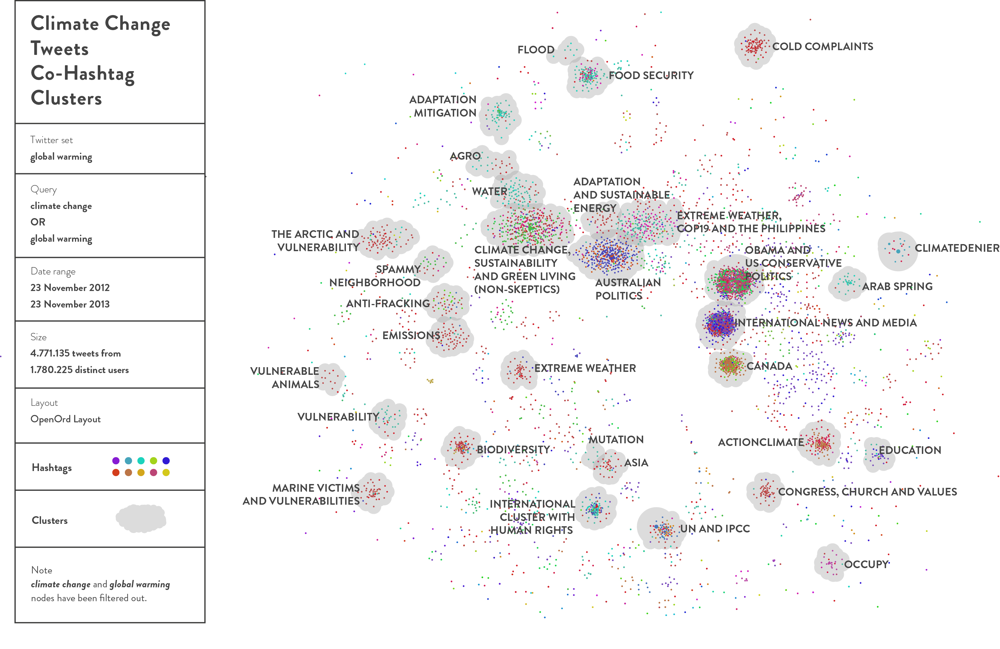

---
Pr-id: Networked Content Analysis: The Case of Climate Change
P-id: Theory on Demand
A-id: 32
Type: article
Book-type: anthology
Anthology item: article
Item-id: 03
Article-title: mapping the resonance of climate change discourses in twitter
Article-status: accepted
Author: Sabine Niederer
Rights: CC BY-NC 4.0
...

# 5. Mapping the Resonance of Climate Change Discourses in Twitter

In the previous chapters, I have proposed networked content analysis as
an approach to the study of online networked content shaped by the
technicity of its platforms and engines. The first case study traced
climate change skeptics in science (through scientific publications) and
on the web (looking at hyperlinking networks and their resonance in
search engine results for the query of climate change). What I found was
that networked content analysis presented the skeptics as *professional
skeptics* engaged in skepticism of a variety of topics, rather than
presenting them as scientists dedicated to the topic of climate change
alone. The second case study discussed in detail the technicity of
Wikipedia, as a socio-technical site especially suited for controversy
mapping. The study of the climate debate in Wikipedia further
established the profile of skeptics as dedicated to debate, as in the
controversy management by Wikipedia editors, creating an article
dedicated to the scientific debate, the actors most active in
questioning and editing the article on climate change migrated along to
the new article. They even never returned to the main article on the
issue of climate change.

In this chapter, I will apply networked content analysis to the climate
change debate in Twitter in the period of 2012-2014. More than in the
previous case studies of the web and Wikipedia, I will discuss in detail
the issue of climate change, its sub-issues, and the recent literature
connecting it to conflict. This study entails working with the built-in
logic of the platform and begins with recognizing the very particular
(socio-technical) ways in which content is networked there. Therefore, I
will first briefly discuss how content circulates on the micro-blogging
platform.[^07ch05_1] This discussion is not designed to be a full glossary of
Twitter features (which can be found on Twitter) but rather a brief
introduction to the many ways in which content and its users are
networked on Twitter.[^07ch05_2]

Twitter is a global messaging social network that allows its users to
publish short messages (and links) up to 140 characters in length. These
so-called ‘tweets’ can be posted by registered users that have a
username that starts with an @. Twitter prioritizes ‘fresh’ data and
presents tweets in reverse chronological order (with the latest post on
top) and does so in real-time.[^07ch05_3] For each tweet, Twitter displays some
numeric data, such as the number of retweets and favorites, and a
timestamp indicating how much time has passed since the tweet was
posted. For each user, Twitter lists the number of followers, and the
number of users this user is following, as well as the date of
registration. Furthermore, users can add a short description, a URL, and
a location (even geo-location) to each of their tweets. All tweets are
publicly accessible, except for direct messages between users and tweets
from protected accounts.

Hashtags (keywords marked with a hash or \#) are included in tweets to
tag content and to participate in a public conversation, by connecting
to public channels of content that carries the same hashtag (a
convention to group content known from Internet Relay Chat \[IRC\]).
Hashtags thus ‘facilitate\[s\] a global discussion on a topic beyond a
user’s follower network’, as they can be clicked to present a stream of
all messages containing that hashtag (again, with the most recent tweet
presented on top).[^07ch05_4] [^07ch05_5] [^07ch05_6] The use of hashtags can therefore also be
interpreted as a willful means to connect to a broader conversation,
trending beyond one’s personal network. The use of hashtags for analysis
has some limitations, as hashtags occur in less than 20% of all tweets
and are used by specific users for specific practices.[^07ch05_7] However, as I
will discuss later in this chapter, tweets containing multiple hashtags
offer possibilities for co-hashtag analysis, where the co-occurring
hashtags are regarded as topical clusters.[^07ch05_8] Users following other
users (to ‘listen’ to their stream of messages), is one of the prominent
activities on Twitter.[^07ch05_9] This activity adds followed users’ posts to
one’s own ‘Timeline.’ Other user interactions include @mentions (tweets
that address a user by mentioning their @username), @replies (tweets
sent in response to other tweets), and retweets.[^07ch05_10] [^07ch05_11]

Retweeting, or the resending or quoting of another user’s tweet, is done
to amplify a message, sharing information with a user’s followers, or
commenting on a quoted message. Other motivations for retweeting are
discussed extensively in boyd et al., based on interviews.[^07ch05_12]
Retweeting has been built into the Twitter interface (alongside
favorites and replies). Different third-party apps have different
formats of retweeting, just as different users may style their retweets
differently (for instance, by adding ‘via @username’ rather than RT,
short for ReTweet), which should be taken into account when studying
Twitter data.[^07ch05_13] Tweets may include URLs, where reported percentages
of tweets with URLs vary from 22% to 11.7%.[^07ch05_14] Here, networked content
analysts have to keep in mind that URLs may be shortened (for example,
with bit.ly) in order to save space, i.e., a URL mentioned in a tweet
can't always be recognized by a common web address including www.[^07ch05_15]

As tweets can cover all sorts of mundane topics, but also carry more
substantive missives of public political and informational value, the
use of Twitter data for scholarly research is becoming widespread.[^07ch05_16]
According to Tumasjan et al., tweets can function as indicators of
political opinion, while Twitter offers a platform for political
deliberation, which also makes it a highly suitable site for controversy
analysis around a social issue.[^07ch05_17] [^07ch05_18] The choice of including
Twitter as a platform for the study of the form and substance of the
issue of climate change and vulnerability concepts therein is not
arbitrary. Twitter relates knowledge perception, reception, and
conversation. Furthermore, Twitter has an interesting relationship with
mass media content, as it is not just a media platform, but a platform
that transpires within multiple media networks. Twitter could be
approached through more conventional news cycle analyses but also
through ‘meme-tracking’.[^07ch05_19] In the latter mode, Twitter as a
micro-blog could then be seen as highly responsive to or even
parasitical or imploding of conventional news ‘sites’, echoing and
amplifying news snippets by tweeting and retweeting. Further, as Twitter
is often moving information faster than the news, Twitter content, in
some cases, *is* news. Of course, for these reasons, Twitter is a
popular medium for professional journalists. They bind tweets to their
stories, and when their work has been published, they may tweet a link
to that article, using it as a channel for the distribution of their own
work. As news and mass media sources strive to make their content
‘platform-ready’, a term by Helmond, the entanglement of news, other
mass media content, and new platforms has entered the next level.[^07ch05_20]
Networked content analysis proposes to take this entanglement as a given
and to demarcate content through the logic of the platform (as developed
in digital methods) and thus follow the actors across sources (as is key
to controversy analysis). The rise of digital media does not mean the
end of traditional mass media, but its reconfiguration as part of online
networked content. This is important to bear in mind analytically, and a
key to its utility for research practices such as networked content
analysis.

Just as in Wikipedia and the web (accessed through Google Web Search),
it is no longer possible to separate content from its carrier. Looking
at the entanglement of content with Twitter's technicities of
distributing, networking, and amplification its content, it also highly
unadvisable to even attempt to ignore these mechanisms.[^07ch05_21] [^07ch05_22] Taking
that as a starting point of networked content analysis, where any
evaluation of online content should acknowledge the significance of its
socio-technological structure, I operationalize the previously
introduced socio-technics of Twitter (in shared links, retweets, etc.)
in the following analyses of the climate change debate. Firstly, I will
compare the resonance of terms associated with climate change, including
skepticism, mitigation, adaptation, and conflict through a climate
change content collection in Twitter. This is to propose that the
changing prominence of each concept in time indicates a ‘phase' in the
issue evolution of climate change as a controversy object.[^07ch05_23]

For the first part of the case study, I worked with a data set
containing 8.3 million climate change tweets (from the period of 23
November 2012 until 30 May 2013), which I queried for the keywords
\[skeptic\], \[mitigation\], \[adaptation\] and \[conflict OR
violence\], using the online Digital Method Initiative’s Twitter Capture
and Analysis Tool (DMI-TCAT).[^07ch05_24] Each of these queries refer to one of
four related climate change discourses: skepticism (towards the man-made
origins and unprecedentedness of climate change), mitigation (the
prevention of further climate change by minimizing its causes),
adaptation (to climate change), and conflict (here taken to mean
political unrest relatable to climate change vulnerability).[^07ch05_25] Given
‘vulnerability’ has become a prominent and focalizing, contested
discourse within climate change debates, both in the scientific
literature (as mapped out by the IPCC in 2014) and in news coverage
around climate change, I will discuss this more elaborately.[^07ch05_26] [^07ch05_27]
Here, I will build on the influential work of sociologist Ulrich Beck,
who has described climate change as one of the main problems of our
*World at Risk*.[^07ch05_28] In his framing, multiple anticipated crises
(climate change, terrorism, financial disaster, and so on) lead to a
situation in which:

> The decoupling of the social location and the social decision-making
> responsibility from the places and times in which other “foreign”
> populations become (or are made) the object of possible physical and
> social injuries.[^07ch05_29]

This decoupling between the decision-making and the sites of such
possible ‘injuries’, or *casualties*, can be clearly demonstrated when
looking at the assessment of climate change adaptation and climate
change vulnerability, and the way discussions about the distribution of
resources to those places most vulnerable to the adverse effects of
climate change play out at the UN Framework Convention on Climate
Change’s Conference of the Parties (UNFCC COP).[^07ch05_30] Climate change
vulnerability, according to the IPCC, is the ‘degree to which a system
is susceptible to and is unable to cope with adverse effects (of climate
change)’.[^07ch05_31] Vulnerability research is, therefore, interested in ‘the
shocks and stresses experienced by the social-ecological system, the
response of the system, and the capacity for adaptive action’.[^07ch05_32]

The Kyoto protocol’s Adaptation Fund and the UNFCC have described their
commitment to and funding of adaptation as designed ‘to assist
developing countries that are particularly vulnerable to the adverse
effects of climate change’.[^07ch05_33] Importantly, the assessment of such
*particularly vulnerable* countries has been critically described as a
‘political challenge’, rather than a scientific effort, as the
socio-economic variables addressed when determining vulnerability blur
the line between adaptation actions and development aid.[^07ch05_34] The
prominence that is now given to ‘adaptation' and ‘vulnerability'
discourses and models within the discussion of climate change, both in
the UNFCC and scientific literature and on an operational level, as in
the field of urban planning, has led to the declaration of an
‘adaptation turn’.[^07ch05_35] [^07ch05_36]

The following case study addresses the further development of Networked
Content Analysis by attending to technicities of the widely used and
globally accessed Twitter platform. The case study foregrounds not just
the utility of Twitter for such analyses but also, in the other
direction, considers which of the aforementioned networked content
analysis methods and techniques developed in the previous case studies
(in chapters 3 and 4) might also be applied to the platform of Twitter,
and which others are so productively platform-specific to be
non-transferable.

## Using Twitter Data for Research

Twitter has often been described as an important channel during
political events and social unrest.[^07ch05_37] [^07ch05_38] At the same time, popular
and scholarly assessments of the role played by Twitter in social
uprisings come with some caveats. For example, news coverage of the
uprisings in Iran has been (productively) criticized as ‘heavily skewed’
towards being presented as a technology-driven social movement.[^07ch05_39]
Gladwell has pointed out that such skewing is due partly to Western
scholars’ and media pundits’ own ‘outsized enthusiasm(s) for social
media’.[^07ch05_40] Other scholars have looked closer at the composition of the
actors in the various uprisings, painting a more fine-grained picture of
the role and relevance of the platform in these uprisings.[^07ch05_41]

According to Hermida, Twitter is a site for ‘the immediate dissemination
of digital fragments of news and information from official and
unofficial sources over a variety of systems and devices’, and might,
therefore, be better understood as an ‘awareness system’, rather than
merely a micro-blogging platform.[^07ch05_42] This awareness system functions
as an always-on communication channel, ready to move ‘from the
background to the foreground’ when necessary.[^07ch05_43] Twitter, Hermida
argues, creates the means for ‘ambient journalism’, where value does not
lie in any single tweet but rather in the ‘awareness system that offers
diverse means to collect, communicate, share and display news and
information, serving diverse purposes’.[^07ch05_44] And it is this function of
Twitter as an awareness system that I will assess in the case study of
Twitter hashtag clusters.

Twitter has been analyzed as a source of *happening* *content* and
*fresh data*, as a site for *real-time research*, as a platform with a
‘dual nature of information source and conversation enabler’[^07ch05_45], and
as an (archived) data set as well as an anticipatory medium.[^07ch05_46] [^07ch05_47] [^07ch05_48]
Methods and tools for capturing and analyzing this real-time data have
been developed for instance by Bruns and Liang, who study Twitter as an
important channel for crisis communication during and after natural
disasters, and by scholars who have looked at the predictive quality of
tweets in relation to the stock market, such as Sprenger et al., or
political sentiment around elections, such as Tumasjan et
al.[^07ch05_49] [^07ch05_50] [^07ch05_51] [^07ch05_52] [^07ch05_53]

In what follows, I will look at the content that Twitter serves around
the issue of climate change, and conduct a Networked Content Analysis of
a year’s worth of English-language climate-related tweets, exploring the
‘Twitter ecology’ of climate change content.[^07ch05_54] Twitter evidently does
not produce ‘climate science’ but instead, puts scientific research into
circulation while enabling up close, located and platform-literate
engagements able to assess the resonance of climate change adaptation
and indicators of vulnerability within the broader online discussion of
climate change. Before exploring the resonance of the adaptation turn on
Twitter, I will discuss the critical need to attend to vulnerability and
adaptation concepts through a review of recent literature (news media,
NGO reports, and scientific literature) that is connecting the risk of
climate change to injuries and to conflict.[^07ch05_55] Combining a description
of vulnerability assessments from published reports and media content
with a methodological application of digital methods to Twitter, this
chapter shows networked content analysis working to unpack and give
analytic complexity to important discourses *within* the issue of
climate change. This chapter focuses on the period of 2012-2014, a
timeframe during which conflict was increasingly attributed to climate
change, as I will discuss in the next section.

## Climate Change Vulnerability and Its Relation to Conflict

Climate scholar Richard Klein has recently paid due critical attention
to this rise of vulnerability research in scientific work. Klein
describes how ‘vulnerability has become a popular concept in a very
diverse set of research fields’ in projects ranging from ‘studies of
vulnerability to terrorism, to poverty, to computer viruses, to oil
spills, to globalisation, to radiation, to SARS, to earthquakes, to
financial collapse, to political change, and so on’.[^07ch05_56] Importantly, the particular connection I want to make between
climate vulnerability and conflict has been steadily gaining attention
in both scholarly research and popular media outlets. Following the
publication of a research article on climate and conflict by Hsiang,
Burke and Miguel, media outlets themselves began to pose speculative
research questions,[^07ch05_57] for example: ‘Could hotter temperatures from
climate change boost violence?’ and, ‘How could a drought spark a civil
war?’[^07ch05_58] The link between the Arab Spring and climate change was
quickly made during this time, as headlines reported ‘Drought helped
cause Syria’s war. Will climate change bring more like it?’ and ‘Climate
change and rising food prices heightened Arab Spring’.[^07ch05_59] The
climate-conflict nexus, however, comprises many complicated facets of
indexing and data triangulation, spurring further debates among
scientists within and across disciplines.[^07ch05_60] [^07ch05_61] [^07ch05_62] [^07ch05_63] [^07ch05_64] [^07ch05_65]

The emerging literature on climate change and conflict further appears
to focus on two broader questions: ‘how’ climate change leads to
conflict and ‘where’ climate change-induced conflicts will most likely
take place.[^07ch05_66] As bleak headlines already indicate, a variety of
climatic variables are considered to be of influence on human conflict.
According to Barnett and Adger, there are two ways in which conflict
might be stimulated by climate change.[^07ch05_67] First, in line with research
by Rifkin, changes in the political economy of energy resources (due to
mitigative action to reduce emissions from fossil fuels) could result in
conflict.[^07ch05_68] Second, conflict could be stimulated by the effects of
actual or perceived long-term or short-term climate impacts in causing
changes to social systems.[^07ch05_69] Short-term impacts include a change in
the intensity and frequency of floods, droughts, storms and cyclones,
fires, heatwaves, and epidemics. In the long term, changes in average
conditions such as temperature, sea level, and annual precipitation will
impact social-ecological systems. Also mediating the relationship
between these climatic changes and human conflict are the interrelated
issues of resource scarcity (cropland, freshwater, fisheries or forests)
and migration.[^07ch05_70] Environmentally induced migration could lead to
increased pressures on resources in areas or countries of destination
and inter-communal tensions in source areas.[^07ch05_71] [^07ch05_72] These trends may
also complicate future food security as the competition around
increasingly scarce resources proliferates.

The question then of where climate change-induced conflicts (and other
casualties and damages) will most likely take place, makes the question
of how the concept of climate vulnerability can be studied even more
urgent. A number of studies on the connection between climate change and
conflict note that the vulnerability of people to climate change depends
on the extent to which they are dependent on natural resources and
ecosystem services, the extent to which the resources and services they
rely on are sensitive to climate change, and their capacity to adapt to
changes in these resources and services.[^07ch05_73] [^07ch05_74] Furthermore, those
countries that do not have the ability to adapt to environmental change
— often poor and underdeveloped states — are, in turn, more vulnerable
to environmentally-related violence.[^07ch05_75] This vulnerability to climate
change impacts and related effects such as violence is described in
terms of a lack of ‘adaptive capacity’, or ‘the ability or potential of
a system to respond successfully to climate variability and change.
\[...\] Common traits include human and social capital, wealth,
technology, and the quantity and quality of infrastructure.’[^07ch05_76] These
traits are among the variables used in so-called climate vulnerability
indices, published as annual research reports that rank countries
according to their adaptive capacity to climate change.

## Vulnerability Indices and the Assessment of Adaptive Capacity

Since the 1990s, there have been many projects that attempted to develop
indices that claim to measure vulnerability to social and environmental
change.[^07ch05_77] These vulnerability indices typically combine multiple
indicators of a variable into a single measure, thus ordering a set of
entities into quantitative attributes or traits. As such, they are
integral to many contexts that require systematic approaches to
decision-making, especially those that concern the management or
governance of risk.[^07ch05_78] [^07ch05_79] At the same time, however, according to
Barnett, Lambert and Fry, there have been so many attempts to create
such indices that it has ‘\[lead\] the National Research Council (2000)
to conclude that there is no consensus on their appropriateness,
theoretical and scientific basis, and appropriate level of specificity
or aggregation’.[^07ch05_80] Furthermore, measuring vulnerability has been
described as ‘impossible’, as well as problematic in ‘rais\[ing\] false
expectations’, around socio-ecological systems, given that ‘there is
ambiguity on what exactly the problem to be solved is and no canonical
solution exists’.[^07ch05_81] [^07ch05_82] [^07ch05_83] Nevertheless, vulnerability research
aims to inform decision-making around funding opportunities to mitigate
the worst possible impacts of climate change for particularly vulnerable
target nations.[^07ch05_84]

In a comparative analysis of three vulnerability indices, their ranked
lists of most and least vulnerable countries and their usage, we have
found that countries calculated to be most vulnerable and at-risk
according to one Index may be among those with the greatest adaptive
capacity according to the other Indices that take into account other
variables.[^07ch05_85] Figure 15 shows a world map that compares the output of
this triangulation, which illustrates some comparative appreciation of
vulnerability, but also the lack of consensus on methodologies and,
therefore, rankings of vulnerability. It is not surprising that the
assessment of climate change vulnerability using indicators continues to
divide both policy and academic communities alike. EMAPS, 'Who is
Vulnerable According to Whom?'.[^07ch05_86]

Figure 15: Who is vulnerable according to whom? This world map
visualizes an exploratory comparative analysis of Germanwatch’s Climate
Risk Index (CRI), DARA’s Climate Vulnerability Monitor (CVM), and the
Global Adaptation Initiative’s Global Adaptation Index (GAIN) in their
assessment of vulnerability.[^07ch05_87] [^07ch05_88]

## Twitter, Climate Vulnerability and the Adaptation Turn

However significant the differences between the three discussed indices
may be, the lack of consensus does not seem to have hindered the
coverage and talk of adaptation in official negotiations and gatherings
as well as scientific literature, where a turn of attention to climate
adaptation has been recognized. In the remainder of this chapter
dedicated to Twitter, I will ask what kind of view on the climate change
debate Twitter enables. Does a climate change *awareness system* indeed
play out through the platform? And secondly, does an adaptation turn
resonate here too? Taking as a starting point of Networked Content
Analysis, the notion that any evaluation of online content should
acknowledge the significance of its socio-technological structure, I
operationalize the previously introduced socio-technics of Twitter—in
shared links, retweets, etc.—in the following analyses of this case
study. Firstly, I will compare the resonance of terms associated with
climate change, including skepticism, mitigation, adaptation, and
conflict through a climate change content collection in Twitter. This is
to propose that the changing prominence of each concept in time
indicates a ‘phase' in the issue evolution of climate change as a
controversy object.[^07ch05_89]

As mentioned earlier in this chapter, for this analysis a data set
containing 8.3 million climate change tweets (from the period of 23
November 2012 until 30 May 2013) is queried for the keywords ‘skeptic,’
‘mitigation,’ ‘adaptation’ and ‘conflict OR violence,’ using the online
Twitter Capture and Analysis Tool (TCAT).[^07ch05_90] [^07ch05_91] Following the logic
of the Twitter platform, I have created profiles for each keyword
indicating their various socio-technical formats of resonance, listing
their URLs, top 10 hashtags, top 10 mentioned users, top 10 active
users, and top 10 hosts (of the URLs mentioned in the tweets). The
profiles include the most linked URL and the most retweeted tweet for
each of the keywords. Focusing on the top does not merely attune to the
logic of the platform and its ranking; from a user perspective, it means
the selection of content with the most exposure, those tweets most
viewed by users.[^07ch05_92]

Figure 16: Profiling adaptation and its place in climate change debates
with Twitter. This map shows profiles of four discursive areas within
the climate debate: skepticism (with the query ‘skeptic’), mitigation,
adaptation, and conflict (with the query ‘conflict’ OR ‘violence’).
EMAPS, 'Profiling Adaptation and Its Place in Climate Change Debates
With Twitter', 2014,
http://climaps.eu/\#!/map/profiling-adaptation-and-its-place-in-climate-change-debates-with-twitter-I.

Figure 16 offers a visual rendition of these discourse profiles. The
term of ‘adaptation’ resonates most in the climate change tweets, with
30,560 results, indicating that indeed also in Twitter the ‘adaptation
turn’ has occurred.[^07ch05_93] Overall, ‘adaptation' and ‘mitigation' have
similarities in terms of most-used hashtags (where five hashtags from
the top 10 are shared). The occurrence of ‘adaptation' in the
‘mitigation' set and vice versa further confirms the overlap between the
two terms. The UN and its events dominate both ‘mitigation' and
‘adaptation' (e.g., the users UN climate talks, UNDP), where
‘adaptation' receives the most attention. For example, \#COP18 is the
hashtag for the 18th Conference of the Parties, which took place in Doha
and is present in both ‘adaptation' and ‘mitigation' tweets. \#UNFCCC is
present in relation to ‘mitigation.' A noteworthy top hashtag is
\#agriculture, a food-related issue, also present in both ‘mitigation'
and ‘adaptation' tweets, but (again) with a larger occurrence in the
‘adaptation' collection.[^07ch05_94]

The ‘skepticism’ and ‘conflict’ profiles both offer up distinct
discursive spaces. The resonance of skepticism is dominated by actors
that are, in fact, critical of climate change skepticism, rather than
being skeptical themselves of human-induced change. Furthermore, it is
striking how the top users are recognized throughout this space, as will
become clear from the following example of the Twitter user named
Skepticscience. @Skepticscience is the most-mentioned user for
‘skepticism,’ and with 2684 mentions is even the most-mentioned user
across the board, outnumbering those for ‘mitigation’, ‘adaptation’ and
‘conflict’.[^07ch05_95] The user is connected to skepticalscience.com, a
website with the slogan ‘getting skeptical about global warming
skepticism’, which is the top host in the ‘skepticism’ collection.[^07ch05_96]
This underlines the importance of combining computational analysis with
a qualitative close reading of the data, with attention to the actors
and their content. A solely quantitative analysis, in this case, would
have lead to misinterpretation of the results, concluding a strong
presence of skepticism, where, in fact, criticism of skepticism
resonates strongly here.

*SkepticalScience*’s survey report *The Consensus Project*, which
assessed over 12,000 peer-reviewed climate science papers for consensus
on human-induced climate change, is the object that resonates most in
this space, receiving 660 links and listings in the most retweeted
message by the third most mentioned user, the entrepreneur @elonmusk:
‘In reality 97% of scientists agree that we face serious human generated
climate change http://t.co/soQCnJB61B’, which was retweeted 503
times.[^07ch05_97] [^07ch05_98]

In conclusion, the profiles offer a view beyond the substance of the
issue, to capture the actors present in this space as most active or
most mentioned users, be they individuals or organizations. This way,
the Twitter networked content analysis offers insights into the types of
actors present in the debate and the intensity (and perhaps even
interrelatedness) of their arguments and references. Again, we may
productively ask: What kind of climate change debate does Twitter
present? In the climate change adaptation and mitigation profiles, the
most resonating users (mentioned) are international organizations
working on the issue of food security. For example, the CGIAR (Research
Program on Climate Change Agriculture and Food Security) ranks highly in
both. Similarly, top users and hostnames are organizations, such as the
Mask-Africa Food Security Program, in the case of adaptation. In the
case of ‘mitigation’, when looking at the type of content that
circulates best through the most shared URLs, the organization Green
Register, a blog dedicated to environmental sustainability news and
eco-friendly living tips, ranks highly. The top users actively engaging
with the mitigation discourse are more diverse, and include companies,
academics, and international organizations.

For the climate change skepticism profile, the top users are those
skeptical of climate change skepticism, and the most-shared content
acknowledges the human-made origins of climate change. News media rank
highly, and famous protagonists of human-made global warming appear
here, including Al Gore. The cluster also gives voice to journalists and
entrepreneurs infamous for their skepticism. The interrelation between
the scientific and the public debate is perhaps best captured by the
Consensus Project.[^07ch05_99] The Consensus Project takes an academically
published scientometric analysis of climate consensus in climate science
publications and publishes it in media campaigns stressing consensus on
climate change, in collaboration with *SkepticalScience*. As the website
theconsensusproject.org reads: ‘Using peer-reviewed science, it plays an
active role in debunking climate misinformation published across the
spectrum of media, including TV, online, and print.’ Its resonance is
easily retrievable in Twitter, where it has performed as the most shared
URL in the skepticism set. Relatedly, the study in the previous chapter
showed the strong connections between skepticism and mass media,
indicating the shift from a scientific to a public (and heavily
mediated) debate. Similarly, conflict is associated with news media and
public figures, for instance, radio show hosts (@hermancain), but also
organizations with a humanitarian focus, such as Oxfam and Greenpeace,
that address the humanitarian aspects of the environmental crisis.[^07ch05_100]

Having zoomed in on the most prominent issues and actors in climate
change-related tweets, where adaptation and food security are leading
issues, my analysis now takes a more exploratory approach (in the vein
of Tukey’s approach).[^07ch05_101] Hashtags included in the same tweets, for
example, can form thematic clusters with a myriad of sub-issues
illustrating the current state of climate action and adaptation.
Co-hashtag analysis allows for the characterization of hashtags in terms
of how they are networked associatively with other hashtags.[^07ch05_102] As
discussed in the introduction, there are limitations to samples
demarcated by hashtags. However, given the large dataset that I am
attending to here — 4,771,135 tweets from 1,780,225 distinct users —
this filtering by hashtag usage provides a sizeable yet manageable
subset of sample data.[^07ch05_103]

## Exploratory View: Co-hashtag Analysis of Climate Change Tweets

For the exploration of co-hashtags within the data set, we first
visualized the thematic clusters that could be identified within the
Twitter space, based on the ‘modularity class’ algorithm in Gephi, an
algorithm that detects communities of densely connected nodes where the
nodes belong to different communities more sparsely connected.[^07ch05_104]
Considering the (still) large amount of data in the data set, we made
use of the OpenOrd layout, a force-directed layout algorithm
specifically designed to encourage clustering in densely connected,
large-scale, undirected graphs.[^07ch05_105] As the nodes ‘climate change’ and
‘global warming’ generated the strongest results (as expected), we
excluded them from the graph to render legible their sub-clusters. The
resulting clusters were manually categorized into themes that captured
the essence of the connected hashtags. We followed this with a close
reading of the actual tweets involved to verify the themes.[^07ch05_106]

An exploratory reading of the network graph in Figure 17 shows some
aspects that have long been a subject of discussion where climate change
emerges as a controversy object, both among scientists and the public.
The network displays clusters focused on the two main approaches to
dealing with the impacts of climate change: adaptation and mitigation.
This is reflected in hashtags such as \#adaptation, \#preparedness,
\#mitigation, \#resilience, \#impacts and \#naturaldisasters. More
specific discussions of adaptation revolve around energy, solar power,
and fossil fuels, explicated in hashtags revealing the need to take
action to counteract the impact of environmental change, such as
\#gofossilfree, \#fossilfools, \#carbonfootprint, \#cleantech, and
\#renewables.

Figure 17: Climate change tweets co-hashtag cluster map. This network
visualization shows thematic clusters in hashtag clusters within a set
of climate change tweets.[^07ch05_107]

Skeptical views on climate change are also addressed in the Twitter
space. In this case, however, as seen in the profiles, the
skepticism-related tweets mainly oppose climate skepticism. These users
organize their content through hashtags such as \#sciencesaysso (the
prominent user in the skepticism profile in figure 3-2), \#actionaugust,
\#climatedenier, and \#climatedenieraward. The hashtag \#actionaugust
refers to the August of 2013 when the Organizing for Action movement
delivered unicorn-shaped ‘climate denier awards’ to congressional
members skeptical of climate change, ‘ignoring the overwhelming judgment
of science’.[^07ch05_108] The prominence of actions against known climate
change skeptics and their institutional networks shows that views
acknowledging climate change still take a more central position in the
Twitter co-hashtag network than those skeptical of its man-made
production and mitigation.

Of specific interest, is the number and variation of thematic clusters
of climate vulnerabilities and casualties that can be identified
specifically through the networked content analysis of climate change in
Twitter. Here, tweets clustered by hashtags range to include everything
from vulnerable animals and habitats to victims of extreme weather
events. The majority of vulnerability-related clusters is concerned with
marine habitats and the vulnerability of the Arctic, as hashtags like
‘northpole’, ‘antarctic’, ‘melting’, ‘overfishing’, ‘oceans’ prevail. In
particular, ‘reefs’ and ‘antarctic’ are named in this context as
vulnerable spots, where ‘polar bears’, ‘penguins’, ‘whales’, ‘trout’ and
‘sharks’ seem to be the most prominent *issue animals* threatened with
injury, death, and, ultimately, extinction.[^07ch05_109] The biodiversity
cluster reflects the need for resilience towards climate change for
‘birds’, ‘turtles’, ‘koalas’, ‘tigers’, and ‘butterflies’, again
pointing towards the vulnerability of habitats and species.[^07ch05_110]

Other clusters tend to focus on geographical regions such as Australia,
Canada, and the US, albeit mainly in terms of climate change or global
warming as an important topic in the national political agenda.
Particularly dense clusters reflect specific, localized takes on the
issue of climate change, centered on political events. One of these
clusters focuses on Obama and conservative U.S. politics, with hashtags
such as \#obamacare, \#obamaisnotsatan \#inauguration2013 mentioned
alongside \#climategate \#badscience and \#globalwarminghoax. In his
inaugural speech in 2013, Obama emphasized the need to respond to
climate change as a threat to future generations. He further stressed
the urgency of action when he argued: ‘some may still deny the
overwhelming judgment of science, but none can avoid the devastating
impact of raging fires and crippling drought, and more powerful
storms’.[^07ch05_111] A Canada-themed cluster reflects both the political
events in Vancouver and the climate hearings in Saskatoon. The events in
Vancouver revolved around the British Columbian Green Party in the weeks
leading up to the elections, addressing the need to reduce greenhouse
gas emissions and opposing oil pipeline expansions.[^07ch05_112] Canada
conservatives, on the other hand, supported the expansion of oil
pipelines, spurring a debate on Twitter regarding the facts of climate
change.[^07ch05_113]

In November 2013, the Saskatchewan citizens’ hearings on climate change
also gained prominence on Twitter through the hashtag ‘climatesk’. The
hearings included a two-day event with presentations on the realities of
climate change from scientists, teachers, newcomers to Canada, and
affected groups, allowing the voiceless victims of climate change to be
heard.[^07ch05_114] A third political cluster includes hashtags on Australian
politics, reflected in hashtags such as \#melbourne, \#auspol,
\#ausvotes, and \#carbontax. The debate there revolved around Tony
Abbott, prime minister of Australia since 2013, and his statements of
September 2013 announcing that he would not increase funding for further
carbon tax reductions if Australia missed its emission reductions
target.[^07ch05_115] These clusters thus seem to detail the discussions on
statements made about climate change following specific political
events, as well as the political views of those involved in elections
around the world. Each identifies clear opportunities for scholarly
research that uses Twitter as a ‘source of current and topical news’ as
proposed by Phelan, McCarthy, and Smyth.[^07ch05_116]

Clusters that are formed by hashtags related to official sources (UN and
IPCC), climate activism and everyday weather remarks additionally
express that many, if not most, conversations on Twitter emerge around
particular (current) events and other real-time experiences.[^07ch05_117] This
endorses the aforementioned scientific literature on Twitter as a medium
for real-time and happening content. Lastly, the network further
displays resonance of the previously profiled climate change discourse
of conflict. These very small clusters of hashtags focus on the Arab
Spring in particular, and hashtags such as \#arabspring, \#libya,
\#syria, \#egypt, \#morsi, \#iran, and \#drones appear here. A close
reading of these tweets reveals that in part, the relation between
climate change and conflict is popularly recognized on Twitter, with
re-tweets from news articles on the issue, but these being also
skeptically assessed, in tweets similar to the following: ‘Syria
conflict is not caused by drought. Its more to do with a bad mix of
Religion and politics just like everywhere else.’[^07ch05_118]

Taken as a group then, these Twitter clusters provide a rich snapshot of
the state of the climate debate, indeed work as a kind of ‘awareness
system,’ to speak with Hermida, that gives voice to the different voices
and actors active in this realm, and reveals the intertwinement of the
news and other mass media content with the platform’s content.[^07ch05_119]
Twitter does not produce ‘climate science’ but instead puts scientific
research into circulation, while also enabling up close, located and
platform-literate engagements that assess the resonance of climate
change adaptation and indicators of vulnerability within the broader
online discussion of climate change. It should be noted, however, that
this awareness system is only accessible by combining computational
analysis with a qualitative close reading of the data, with attention to
the actors and their content. As mentioned, Twitter’s entanglement with
news journalism and mass media should be kept in mind here, as Twitter
*is* news, amplifies news, and is a channel for news distribution.

## Conclusions

On a methodological level, we may conclude that networked content
analysis applied to Twitter content entails working with the logic of
the platform and recognizing the socio-technical structures of its
content. By attending to the natively digital elements of this platform,
it becomes possible to assess how content is networked and circulated.
In the case study presented here, I compare the resonance of three
different climate change discourses. After demarcating a specific set of
issue-related tweets, I query the set for the resonance of recognized
keywords to create ‘keyword profiles’. Important to note is that,
against the rise of ‘big data’ pattern recognition, a close reading of
the data proved necessary to correctly interpret the found data and
further filter the data to improve its relevance.

The keyword profiles offer zoom-in views on particular discourses within
the broader issue of climate change. Here, looking at skepticism,
mitigation, adaptation, and violence, the profiles enable a comparative
view, and it becomes clear that mitigation and adaptation are very
proximate issues, in terms of argumentation and actors, with most actors
involved in the Twitter space being organizations in the field of food
security. The UN and its initiatives dominate both discourses.
Adaptation has now surpassed mitigation in terms of resonance; thus,
here also in Twitter, the so-called adaptation turn discussed in the
introduction of this chapter has taken place. Skepticism and conflict
have distinct profiles, where a focus on ‘skepticism' as a keyword
brings up (perhaps counter to expectations) much criticism of climate
change skepticism. This is mainly organized around the actor
Skepticalscience (both as a user named @Skepticalscience and as a
website host) and major news sources, and makes an important point for
the close reading of data rather than favoring coarser pattern
recognition. In the profile of conflict, news media, and media
personalities resonate strongly, as do humanitarian NGOs.[^07ch05_120]

The exploratory analysis of the climate change Twitter hashtag network
shows us that climate change as a controversy object appears through, or
is a sum of, a multiplicity of sub-issues including skepticism,
mitigation, adaptation, vulnerability, and conflict. Just as the
comparison of different Indices’ rankings revealed conflicting
vulnerabilities, the Twitter hashtag network also points to different
metrics of vulnerability.[^07ch05_121] [^07ch05_122] In contrast to how vulnerability
indices organize and rank vulnerability by country listings, it appears
that the ‘nation’ is not the key entity we are tracking in relation to
vulnerabilities registering on Twitter. Rather, the objects of
vulnerability and injury that are put forward on Twitter are mostly
animal species and habitats (which, needless to say, are categories of
‘actors’ entirely oblivious to legally drawn borders). As discussed in
the Introduction, animals are mediagenic issue actors, and some are more
mediagenic than others. Nevertheless, it is important not to overstate
mediagenic power and take the prominence of animal species and habitats
seriously as they appear. I would like to argue that such a framing of
risk in terms of present and future risked species, ecologies, and
systems provides a possible Beckian extension to the study of Bruns and
Liang, who described Twitter as a powerful channel for crisis management
after the fact of a natural disaster.

The networked content analysis of hashtag clusters that are dedicated to
sub-issues, casualties and events can be read as a time slice presenting
the status quo of climate change, one that is not merely stating ‘what’s
happening’ but rather serves as a progress report on an issue, in this
case both addressing where we are with climate change adaptation and
what is at stake.

[^07ch05_1]: For historical accounts of the development of the micro-blogging
    platform Twitter, see, for instance: Rogers, *Digital Methods*; Van
    Dijck, ‘Tracing Twitter’; Van Dijck, ‘The Culture of Connectivity’.

[^07ch05_2]: See, for instance, Twitter, 'Getting started with Twitter',
    https://support.twitter.com/articles/215585.

[^07ch05_3]: For a critical analysis of the freshness of data and the
    ‘real-time-ness’ of Twitter and other social media, see: Helmond,
    ‘The Perceived Freshness Fetish’ and Weltevrede, Helmond, and
    Gerlitz, 'The Politics of Real-time’.

[^07ch05_4]: Lotan et al. ‘The Revolutions Were Tweeted’.

[^07ch05_5]: See later in this chapter for a brief discussion of the role of
    the hashtag on Twitter.

[^07ch05_6]: See also C. Gerlitz and B. Rieder, 'Mining One Percent of Twitter:
    Collections, Baselines, Sampling', *M/C Journal*, 16.2 (2013) for a
    discussion of the affordances of hashtags for research. They find,
    on the basis of their 1% sample analyzing 1 day of tweets, that
    13,1% of the tweets include hashtags.

[^07ch05_7]: Gerlitz and Rieder, 'Mining One Percent of Twitter’.

[^07ch05_8]: See also: Gerlitz and Rieder, 'Mining One Percent of Twitter’.

[^07ch05_9]: Van Dijck, ‘Tracing Twitter’.

[^07ch05_10]: danah boyd, S. Golder, and G. Lotan, 'Tweet, Tweet, Retweet:
    Conversational Aspects of Retweeting on Twitter', in *43rd Hawaii
    International Conference on System Sciences (HICSS),* 2010, 2.

[^07ch05_11]: See also Honeycutt and Herring, *Beyond Microblogging:
    Conversation and Collaboration via Twitter*, 2009,
    https://www.researchgate.net/publication/224373137\_Beyond\_Microblogging\_Conversation\_and\_Collaboration\_via\_Twitter,
    for discussions of the various motivations users may have to include
    an @mention, such as attention-seeking, addressing users, etc.

[^07ch05_12]: boyd et al. ‘Tweet, Tweet, Retweet’, 6.

[^07ch05_13]: Gerlitzand and Rieder, 'Mining One Percent of Twitter’, discuss
    demarcation of data in Twitter, as many case studies use specific
    hashtags or user practices (such as retweeting or favoriting) as a
    means to demarcate a sample, which is a question of recall (how many
    data points did I get?) and precision (how many of these data points
    are relevant?).

[^07ch05_14]: Smyrnaion and Rieder, 'Social
    Infomediation of News on Twitter’.

[^07ch05_15]: boyd et al. ‘Tweet, Tweet, Retweet’, 2.

[^07ch05_16]: The use of Twitter data for cultural and social analysis has been
    described as the third phase in Twitter's popular cultural uptake,
    which had as its first phase the function of being an ‘ambient
    friend-following tool’, where user content answers the question
    ‘What are you doing?’ The second phase of Twitter usage encouraged
    by Twitter’s new tagline ‘What’s happening?’ both recognized and
    further fostered its use as a ‘news medium for event-following’.
    Rogers, R. 'Debanalising Twitter’, xii-xiv.

[^07ch05_17]: A. Tumasjan, T.O. Sprenger, P.G. Sandner, and I.M. Welpe,
    'Predicting Elections with Twitter: What 140 Characters Reveal About
    Political Sentiment', in *Fourth International AAAI Conference on
    Weblogs and Social Media*, 2010,
    https://www.aaai.org/ocs/index.php/ICWSM/ICWSM10/paper/view/1441. In
    their 2010 study, Tumasjan et al. studied deliberation by looking at
    the exchange of substantive issues and equality of participation (as
    put forward by Koop and Jansen in their study of blogs as sites of
    deliberation). Through a content analysis of 100,000 tweets about
    German political parties around the federal elections of 2009, they
    found that Twitter was used extensively for political deliberation,
    with a massive number of tweets mentioning one or more of the
    political parties, and one-third of these messages partaking in
    platform-based conversations.

[^07ch05_18]: The predictive affordances of Twitter have been criticized by
    scholars such as Daniel Gayo-Avello, whose paper from 2012 offers an
    interesting ‘annotated biography’ with a discussion of Twitter
    prediction literature. D. Gayo-Avello, 'I Wanted to Predict
    Elections with Twitter and All I Got Was This Lousy Paper: A
    Balanced Survey on Election Prediction Using Twitter Data', *Arxiv
    Preprint arXiv12046441*, 2012, http://arxiv.org/pdf/1204.6441.pdf.

[^07ch05_19]: J. Leskovec, L. Backstrom, and J. Kleinberg, 'Meme-tracking and
    the Dynamics of the News Cycle', In *Proceedings of the 15th ACM
    SIGKDD international conference on Knowledge discovery and data
    mining*, ACM, 2009, pp. 497-506,
    http://dl.acm.org/citation.cfm?id=1557077.

[^07ch05_20]: Helmond, *The Web as Platform.*

[^07ch05_21]: DMI-TCAT, as a tool, does separate Twitter content from the
    platform Twitter. However, it retains information about how Twitter
    structures its information.

[^07ch05_22]: See also E. Borra and B. Rieder, 'Programmed Method: Developing a
    Toolset for Capturing and Analyzing Tweets', *Aslib Journal of
    Information Management*, 66.3 (2014): 262–278.

[^07ch05_23]: EMAPS, 'Vulnerability, Resilience and Conflict’. Needless to say,
    these phases are not cleanly separated chronologically but rather
    overlap.

[^07ch05_24]: Borra and Rieder, 'Programmed Method’.

[^07ch05_25]: In the EMAPS Digital Methods Fall Data Sprint, we also asked
    whether conflict could be seen as a fourth phase in the evolution of
    the issue of climate change, after skepticism, mitigation, and
    adaptation. EMAPS, 'Vulnerability, Resilience and Conflict’.

[^07ch05_26]: IPCC, 'Climate Change 2014: Synthesis Report: Contribution of
    Working Groups I, II and III to the Fifth Assessment Report of the
    Intergovernmental Panel on Climate Change', Geneva: IPCC, 2014,
    http://ar5-syr.ipcc.ch/, 3.

[^07ch05_27]: The IPCC's Working Group II has mapped adaptation within
    scientific literature on climate change and concludes that there is
    an overall doubling of the volume of publication in this field in
    less than five years, and secondly, that adaptation has become a
    central area of research within the scientific literature on climate
    change. EMAPS, 'Reading the State of Climate Change From Digital
    Media', 2014,
    http://climaps.eu/\#!/narrative/reading-the-state-of-climate-change-from-digital-media.

[^07ch05_28]: Beck, *World at Risk.*

[^07ch05_29]: Beck, *World at Risk,* 161.

[^07ch05_30]: Beck, *World at Risk,* 161.

[^07ch05_31]: IPCC, 'Working Group II: Impacts, Adaptation and Vulnerability:
    Summary for Policymakers', 2001,
    http://www.ipcc.ch/ipccreports/tar/wg2/index.php?idp=8.

[^07ch05_32]: Adger, 'Vulnerability', 269.

[^07ch05_33]: R.J.T. Klein, 'Identifying Countries That Are Particularly
    Vulnerable to the Adverse Effects of Climate Change: An Academic or
    a Political Challenge?' *Carbon and Climate Law Review* 3 (2009):
    284–289.

[^07ch05_34]: Klein, ‘Identifying Countries That Are Particularly Vulnerable to
    the Adverse Effects of Climate Change’, 289. This is discussed in
    detail in EMAPS, 'Who Deserved to Be Funded? A Closer Look at the
    Practices of Vulnerability Assessment and the Priorities of
    Adaptation Funding', 2014,
    http://climaps.eu/\#!/narrative/who-deserves-to-be-funded.

[^07ch05_35]: J. Howard, 'Climate Change Mitigation and Adaptation in Developed
    Nations: A Critical Perspective on the Adaptation Turn in Urban
    Climate Planning', in S. Davoudi, J. Crawford and A. Mehmood (eds)
    *Planning for Climate Change: Strategies for Mitigation and
    Adaptation for Spatial Planning*, London: Earthscan, 2009, pp.
    19-32.

[^07ch05_36]: Venturini et al. ‘Climaps by EMAPS in 2 Pages'.

[^07ch05_37]: Shirky, *Here Comes Everybody.*

[^07ch05_38]: Z. Tufekci and C. Wilson, 'Social Media and the Decision to
    Participate in Political Protest: Observations from Tahrir Square',
    *Journal of Communication* 62.2 (2012): 363–379.

[^07ch05_39]: E. Morozov, 'Iran: Downside to the “Twitter Revolution”’,
    *Dissent* 56.4 (2009): 10–14.

[^07ch05_40]: Gladwell, 'Small Change’.

[^07ch05_41]: T. Poell and K. Darmoni, 'Twitter as a Multilingual Space: The
    Articulation of the Tunisian Revolution Through \#sidibouzid',
    *NECSUS European Journal of Media Studies* 1.1 (2012): 14–34.

[^07ch05_42]: The term ‘awareness systems’ here refers to systems that support
    remote co-working. A. Hermida, 'Twittering the News', *Journalism
    Practice* 4.3 (2010): 298-301.

[^07ch05_43]: Hermida, ‘Twittering the News’, 298.

[^07ch05_44]: Hermida, ‘Twittering the News’, 301.

[^07ch05_45]: G. Veltri, 'Microblogging and Nanotweets: Nanotechnology on
    Twitter', *Public Understanding of Science* 22.7 (2013): 832–849.

[^07ch05_46]: Rogers, 'Debanalising Twitter', xiv.

[^07ch05_47]: Back et al. ‘Doing Real Time Research’.

[^07ch05_48]: Marres and Weltevrede, ‘Scraping the Social?’

[^07ch05_49]: T.O. Sprenger, A. Tumasjan, P.G. Sandner, and I.M. Welpe, 'Tweets
    and Trades: The Information Content of Stock Microblogs', *European
    Financial Management* 20 (2014): 926-957,
    10.1111/j.1468-036X.2013.12007.x.

[^07ch05_50]: Tumasjan, Sprenger, Sandner, and Welpe, 'Predicting Elections
    with Twitter’.

[^07ch05_51]: A. Bruns and Y.E. Liang, 'Tools and Methods for Capturing Twitter
    Data During Natural Disasters', *First Monday* 17.4 (2012):
    http://firstmonday.org/ojs/index.php/fm/article/view/3937/3193.

[^07ch05_52]: In the vein of big data research, researchers such as M. de Rijke
    repurpose the *real-timeness* of Twitter data to reveal current
    cultural preferences in real-time; for example, in their work, to
    overview what music the world is listening to right now. Their
    project *Streamwatchr* collects about 500,000 music tweets per day.
    For each of the tweets that mention what someone is listening to,
    Streamwatchr outputs a tile on its front-page interface ‘with a
    photo of the artist and a play button (via mouse scroll over) that
    does, indeed, play the song (from Youtube)’. De Rijke, ‘Going out
    with Streamwatchr’, 2014, http://staff.science.uva.nl/\~mdr/.

[^07ch05_53]: MIT MediaLab project *Whose Voices?* tracks which Twitter users
    are cited in the media, and through case studies zooms in on the
    diversity of sources quoted on the international citizen media
    platform Global Voices. J.N. Matias, 'Whose voices? Twitter citation
    in Global Voices', 2012, http://natematias.com/medialab/gv-viewer/.

[^07ch05_54]: boyd et al. ‘Tweet, Tweet, Retweet’.

[^07ch05_55]: In this chapter, more than in the previous case studies on the
    web and Wikipedia, I will discuss in detail the issue of climate
    change, its sub-issues, and the recent literature connecting it to
    conflict.

[^07ch05_56]: Klein, 'Identifying Countries That Are Particularly Vulnerable to
    the Adverse Effects of Climate Change’, 285.

[^07ch05_57]: S.M. Hsiang, M. Burke, E. Miguel, 'Quantifying the Influence of
    Climate on Human Conflict', *Science*, 341.6151 (2013):
    http://doi.org/10.1126/science.1235367.

[^07ch05_58]: Doucleff, 'Could Hotter Temperatures from Climate Change Boost
    Violence?’. NPR, 'How Could a Drought Spark a Civil War?'

[^07ch05_59]: Perez, 'Climate Change and Rising Food Prices Heightened Arab
    Spring'. Plumer, ‘Drought Helped Cause Syria’s War’.

[^07ch05_60]: It is important to clarify how ‘solid' this relationship between
    climate change and conflict is conceived to be at the time of
    writing. In a meta-analysis conducted by Hsiang, Burke, and Miguel
    'Quantifying the Influence of Climate on Human Conflict', who
    evaluated 60 primary studies on the topic, particular trends are
    observed. For one, deviations from average rainfall and
    temperatures, whether up or down, are likely to result in human
    conflict on three levels, from the more local level of interpersonal
    violence and crime, moving to intergroup violence and political
    instability, and then measuring conflict at the global level, in
    terms of institutional breakdown and the collapse of civilizations.
    'Quantifying the Influence of Climate on Human Conflict', 1.

[^07ch05_61]: On a local level, several studies in psychology and economics
    have found that individuals are more likely to act aggressively or
    show violent behavior if ambient temperatures at the time of
    observation are higher. C.A. Anderson, 'Heat and violence', *Current
    Directions in Psychological Science*, 10.1 (2001): 33–38. A.
    Auliciems and L. DiBartolo, 'Domestic Violence in a Subtropical
    Environment: Police Calls and Weather in Brisbane', *International
    Journal of Biometeorology*, 39.1 (1995): 34–39. D.T. Kenrick and
    S.W. MacFarlane, 'Ambient Temperature and Horn Honking: A Field
    Study of the Heat/Aggression Relationship', *Environment and
    Behavior* 18 (1986): 179–197.

[^07ch05_62]: Other recent literature indicates that in low-income settings,
    extreme rainfall events that adversely affect agricultural income
    are similarly associated with higher rates of personal violence and
    property crime. D. Blakeslee and R. Fishman, 'Rainfall shocks and
    property crimes in agrarian societies: Evidence from India', 2013,
    http://papers.ssrn.com/sol3/papers.cfm?abstract\_id=2208292. H.
    Mehlum, E. Miguel, and R. Torvik, 'Poverty and Crime in 19th Century
    Germany', *Journal of Urban Economics* 59.3 (2006): 370–388.

[^07ch05_63]: Some longitudinal studies of intergroup violence point out that
    such social conflicts tend to be more likely after extreme rainfall
    conditions. Such research tends to confirm rather than challenge the
    aforementioned findings on the a priori relationship between social
    unrest and rainfall in low-income settings. In other words, reduced
    agricultural production may be an important mediating mechanism of
    conflict, although alternative explanations such as political
    instability cannot be excluded.

[^07ch05_64]: C.S. Hendrix and I. Salehyan, 'Climate Change, Rainfall, and
    Social Conflict in Africa', *Journal of Peace Research* 49.1 (2012):
    35–50.

[^07ch05_65]: A.T. Bohlken and E.J. Sergenti, 'Economic Growth and Ethnic
    Violence: An Empirical Investigation of Hindu-Muslim Riots in
    India', *Journal of Peace Research*, 47 (2010): 589–600.

[^07ch05_66]: T.F. Homer-Dixon, 'On the Threshold: Environmental Changes as
    Causes of Acute Conflict', *International Security* 16 (1991):
    76–116.

[^07ch05_67]: J. Barnett and W.N. Adger, 'Climate Change, Human Security and
    Violent Conflict', *Political Geography*, 26.6 (2008): 639–655.

[^07ch05_68]: Jeremy Rifkin, *The Hydrogen Economy: The Creation of the
    Worldwide Energy Web and the Redistribution of Power on Earth
    Tarcher* (New York: Putnam, 2002).

[^07ch05_69]: Barnett and Adger, 'Climate Change, Human Security and Violent
    Conflict'.

[^07ch05_70]: C. Raleigh and H. Urdal, 'Climate Change, Environmental
    Degradation and Armed Conflict', *Political Geography* 26.6 (2007):
    674–694.

[^07ch05_71]: J. Barnett, 'Security and Climate Change', *Global Environmental
    Change*, 13.1 (2003): 7–17.

[^07ch05_72]: R. Reuveny, 'Climate Change-induced Migration and Violent
    Conflict', *Political Geography* 26.6 (2007): 656–673.

[^07ch05_73]: Adger, 'Climate Change, Human Security and Violent Conflict'.

[^07ch05_74]: Homer-Dixon, 'On the Threshold’. Reuveny, 'Climate Change-induced
    Migration and Violent Conflict'.

[^07ch05_75]: Homer-Dixon, 'On the Threshold’.

[^07ch05_76]: E.A. Stanton, J. Cegan, R. Bueno, and F. Ackerman, *Estimating
    Regions’ Relative Vulnerability to Climate Damages in the CRED
    Model*, Somerville, MA: Stockholm Environment Institute, 2011, 4.

[^07ch05_77]: J. Barnett, S. Lambert, and I. Fry, 'The Hazards of Indicators:
    Insights from the Environmental Vulnerability Index', *Annals of the
    Association of American Geographers*, 98.1 (2008): 102–119.

[^07ch05_78]: Beck, *World at Risk.*

[^07ch05_79]: O. Renn and P. Graham, *White Paper on Risk Governance: Towards
    an Integrative Approach*, International risk governance council,
    2015.

[^07ch05_80]: Barnett, Lambert, and Fry, 'The Hazards of Indicators: Insights
    from the Environmental Vulnerability Index', 106.

[^07ch05_81]: J. Hinkel presents an analysis of six diverse types of problems
    that vulnerability indicators are meant to address according to his
    review of the literature: ‘(i) identification of mitigation targets;
    (ii) identification of vulnerable people, communities, regions,
    etc.; (iii) raising awareness; (iv) allocation of adaptation funds;
    (v) monitoring of adaptation policy; and (vi) conducting scientific
    research’. Based on this, he finds that only the second type of
    problem can be addressed by vulnerability indicators, but only at
    small and local scales, causing him to question the concept of
    vulnerability itself and the applied methodologies. J. Hinkel,
    'Indicators of Vulnerability and Adaptive Capacity: Towards a
    Clarification of the Science–policy Interface', *Global
    Environmental Change* 21.1 (2011): 198-206.

[^07ch05_82]: In his review of vulnerability research traditions, climate
    change scholar W. Neil Adger distinguishes between two scholarly
    ‘antecedents’ that have ‘acted as seedbeds for ideas that eventually
    translated into current research on the vulnerability of social and
    physical systems in an integrated manner’. These are ‘the analysis
    of vulnerability as lack of entitlements and the analysis of
    vulnerability to natural hazard’. This double-ness in the history of
    the research concept has lead to distinct parallelism in research
    practices where some researchers focus solely on ecological systems
    and ‘largely ignore physical and biological systems (entitlements
    and livelihoods, while others ‘try to integrate social and
    ecological systems’. A serious challenge following from the rise of
    adaptation and its inherent complexity is the question of how to
    develop robust and credible indicators and criteria for measuring
    vulnerability. Adger, 'Vulnerability', 270.

[^07ch05_83]: S.H. Eriksen and P.M. Kelly, 'Developing Credible Vulnerability
    Indicators for Climate Adaptation Policy Assessment', *Mitigation
    and Adaptation Strategies for Global Change* 12.4 (2007): 495–524.

[^07ch05_84]: Naomi Klein, in her book *This Changes Everything* (2014),
    discusses this as a justice issue. Many developing countries, due to
    both their specific local environments and limited infrastructures,
    will be worse hit by the impacts of climate change while having
    contributed least (e.g., in the sense of carbon emission levels) to
    creating the problem in the first place.

[^07ch05_85]: EMAPS, 'Who is Vulnerable According to Whom?', 2014,
    http://climaps.eu/\#!/map/who-is-vulnerable-according-to-whom.

[^07ch05_86]: Hinkel, 'Indicators of Vulnerability and Adaptive Capacity’, 198.

[^07ch05_87]: EMAPS, 'Who is Vulnerable According to Whom?'.

[^07ch05_88]: See also:
    http://climaps.org/?utm\_content=buffer51f08&utm\_medium=social&utm\_source=twitter.com&utm\_campaign=buffer\#!/map/who-is-vulnerable-according-to-whom.

[^07ch05_89]: EMAPS, 'Vulnerability, Resilience and Conflict: Mapping Climate
    Change, Reading Cli-fi', *Electronic Maps to Assist Public Science
    Blog*, 2013, http://www.emapsproject.com/blog/archives/2293.

[^07ch05_90]: Borra and Rieder, 'Programmed Method’.

[^07ch05_91]: The climate change collection was made with TCAT by collecting
    tweets that mention climate change (also spelled as climatechange),
    global warming (and globalwarming), climate, drought, or flood. This
    is a very wide data set, opting for high recall and low precision,
    which we then filtered, retaining only tweets mentioning ‘climate
    change’ or ‘global warming.’ The data set is available from the tool
    at:
    http://tcat.digitalmethods.net/analysis/index.php?dataset=globalwarming&query=&url\_query=&exclude=&from\_user\_name=&from\_source=&startdate=2012-11-23&enddate=2013-05-30&whattodo=&graph\_resolution=day.

[^07ch05_92]: This is similar to working with top results in the Google Web
    Search engine; it follows the logic of the medium and the logic of
    working with the results most viewed (and clicked) by its users.

[^07ch05_93]: The tweets were checked for false positives by close reading the
    top tweets to see whether these indeed refer to climate change. The
    reason to focus on top tweets is that these are not only the most
    prominent according to the logic of the platform itself but (similar
    to search engine results that are high in the ranking) they are also
    the tweets with the most exposure and therefore are most viewed by
    users.

[^07ch05_94]: EMAPS, 'Profiling Adaptation and Its Place in Climate Change
    Debates With Twitter'.

[^07ch05_95]: As the data set contains retweets too, it could occur that a
    single message that is often retweeted skews the data heavily.
    Therefore, it is important to read the data closely to interpret the
    results.

[^07ch05_96]: SkepticalScience, ‘http://www.skepticalscience.com/’, also
    prominent in the search engine case study in chapter 5.

[^07ch05_97]: Cook et al., 'Quantifying the Consensus on Anthropogenic Global
    Warming in the Scientific Literature'.

[^07ch05_98]: Skeptical Science. 'The Consensus Project'.

[^07ch05_99]: Skeptical Science, 'The Consensus Project'.

[^07ch05_100]: EMAPS, 'Profiling Adaptation and Its Place in Climate Change
    Debates with Twitter'.

[^07ch05_101]: J.W. Tukey, 'Exploratory Data Analysis', 1977,
    http://xa.yimg.com/kq/groups/16412409/1159714453/name/exploratorydataanalysis.pdf

[^07ch05_102]: Gerlitz and Rieder, 'Mining One Percent of Twitter’.

[^07ch05_103]: For this case study, we took a dataset of tweets posted between
    23 November 2012 and 23 November 2013 containing the query \[climate
    change OR global warming\], consisting of 4,771,136 tweets from
    1,785,296 distinct users, using the tool TCAT. Borra and Rieder,
    'Programmed Method’.

[^07ch05_104]: V.D. Blondel, J.-L. Guillaume, R. Lambiotte, and E. Lefebvre,
    'Fast Unfolding of Communities in Large Networks', *Journal of
    Statistical Mechanics: Theory and Experiment* (2008): 2.

[^07ch05_105]: Shawn W. Martin, Michael Brown, Richard Klavans, and Kevin
    Boyak, 'OpenOrd: An Open-source Toolbox for Large Graph Layout',
    *Proceedings of the SPIE Visualisation and Data Analysis*, 2011,
    https://doi.org/10.1117/12.871402. The algorithm uses a so-called
    ‘simulated annealing' schedule, with five different iterations in
    which several parameters are changed. In the first two stages, a
    strong edge-cutting strategy is employed: long connections between
    nodes are ignored, promoting clusters segregation and increasing at
    the same time the amount of white space in the layout.

[^07ch05_106]: This proved necessary to eliminate the noise of tweets unrelated
    to climate change, for instance, one discussing a positively
    changing *investment climate* in the Chinese real estate market.

[^07ch05_107]: EMAPS, 'Climate Change Tweets Co-Hashtag Cluster Map', 2014,
    http://climaps.eu/\#!/map/profiling-adaptation-and-its-place-in-climate-change-debates-with-twitter-ii.

[^07ch05_108]: K. Burkhart, 'Organizing for Action Delivers Unicorn Trophies to
    135 Climate Deniers in Congress', *The Huffington Post*, 13 August
    2013,
    http://www.huffingtonpost.com/2013/08/13/organizing-for-action-climate-deniers\_n\_3750126.html.

[^07ch05_109]: These clusters reflect indicators of habitat change as included
    in the DARA index, and ecosystem services as defined in the ND-Gain
    index, albeit mostly focused on animals rather than indicators of
    effects on human habitats. A number of countries are however,
    mentioned in the context of \#drought and \#rainfall, such as Haiti,
    Namibia, Malawi, Jemen, and Liberia.

[^07ch05_110]: See also the *Issue Animals* study by Niederer and Weltevrede.
    Digital Methods Initiative, 'Networked Content', 2008,
    https://digitalmethods.net/Digitalmethods/TheNetworkedContent.
    Rogers, *Digital Methods.*

[^07ch05_111]: Stevenson and Broder, ‘Climate Change Prominent in Obama’s
    Inaugural Address’.

[^07ch05_112]: J. MacNab, 'Will Climate Be a Winner in British Columbia’s
    Election?' *Pembina Institute*, 2013,
    http://www.pembina.org/blog/724.

[^07ch05_113]: C. Cattaneo, 'As B.C. Election Looms, Both NDP and Liberals Take
    Hard Line on Oil Pipelines', *Financial Post*, 2013,
    http://business.financialpost.com/2013/05/06/bc-election-oil-sands/?\_\_lsa=d52e-3289.

[^07ch05_114]: 'Saskatchewan Citizens’ Hearings on Climate Change', 2014,
    http://skclimatehearings.org/.

[^07ch05_115]: L. Taylor, 'Rudd Accuses Abbott of Abandoning Australia’s
    Alimate Commitments, *The Guardian*, 13 September 2013,
    http://www.theguardian.com/world/2013/sep/03/rudd-abbott-abandoning-climate-commitments.

[^07ch05_116]: O. Phelan, K. McCarthy, and B. Smyth, 'Using Twitter to
    Recommend Real-time Topical News', in *Proceedings of the Third ACM
    Conference on Recommender Systems*, 2009, pp. 385-388,
    http://dl.acm.org/citation.cfm?doid=1639714.1639794.

[^07ch05_117]: As expected, mundane climate change ‘updates’ also find their
    way into the climate change Twitter network, with complaining tweets
    about the cold weather that include such hashtags as \#cold and
    \#freezing.

[^07ch05_118]: The small clusters include tweets recognizing the connection,
    such as ‘\#arabspring caused by \#history’s most underrated force:
    \#climate change’. The discussion also includes skepticism towards
    this connection between climate change and conflict, as with the
    example given in the text and with this tweet: ‘seriously global
    warming err climate change caused Syria? Unreal’.

[^07ch05_119]: Hermida, ‘Twittering News’.

[^07ch05_120]: The profile, however, also shows that this specific discourse
    also seems to have been hijacked by a single user trying to widen
    the issue by connecting it to medical conditions such as obesity.

[^07ch05_121]: While I focus on Twitter analysis here, the EMAPS study also
    analyzed the prominence of adaptation and the other discourses on
    the web as accessed through Google. Querying the keywords
    ‘skepticism,' ‘mitigation,' ‘adaptation’ and ‘conflict’ in the top
    Google results for the query ‘climate change OR global warming,’ we
    also found ‘adaptation’ to be the most widely present keyword in
    Google top results about climate change.

[^07ch05_122]: See also: EMAPS, 'Reading the State of Climate Change From the
    Web: Top Google Results', 2014,
    http://climaps.eu/\#!/map/profiling-adaptation-and-its-place-in-climate-change-debates-with-twitter-ii.
