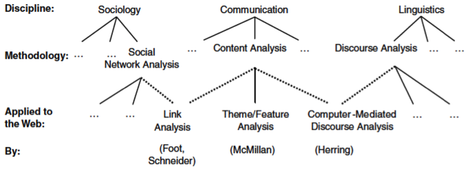
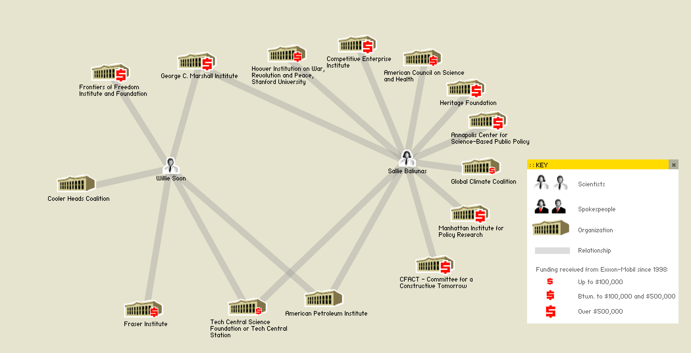
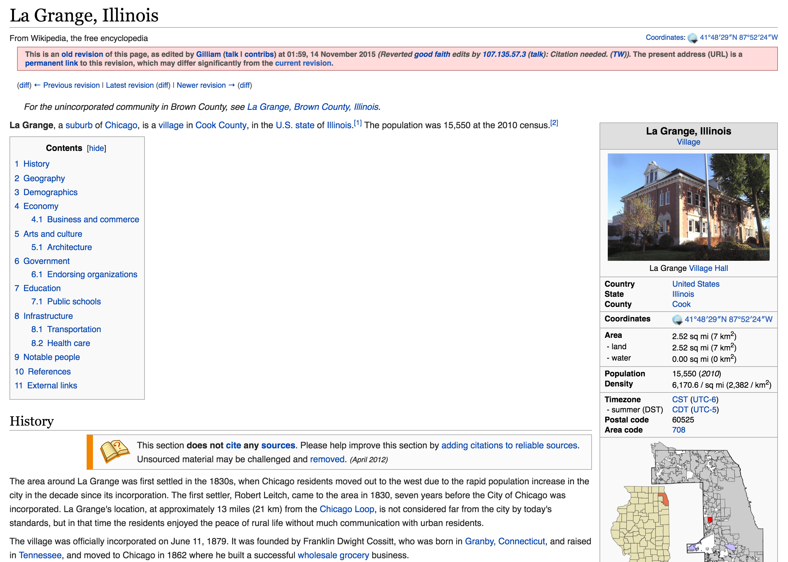
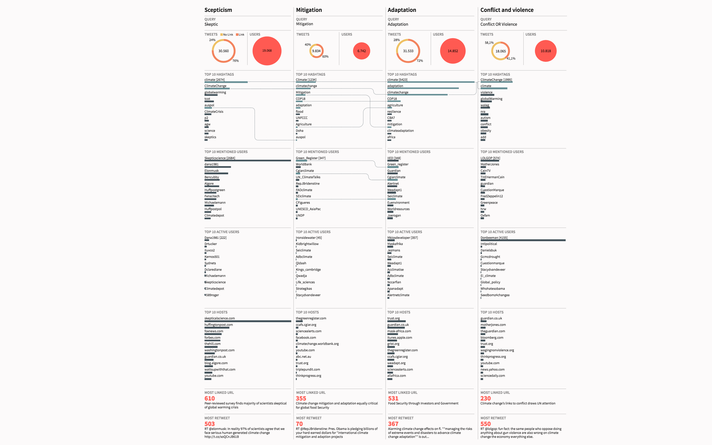

# Networked Content Analysis: The Case of Climate Change

## Sabine Niederer

# Colophon
Theory on Demand #31 
 **Networked Content Analysis: The Case of Climate Change**

Author: Sabine Niederer
  Editing:
 Image editing: Carlo de Gaetano 
 Production: Sepp Eckenhaussen
 Cover design: Katja van Stiphout 
 Published by the Institute of Network Cultures, Amsterdam, 2019
 ISBN 

**Contact** 
 Institute of Network Cultures
 Phone: +3120 5951865
 Email: info@networkcultures.org
 Web: http://www.networkcultures.org

This publication is published under the Creative Commons Attribution-NonCommercial-NoDerrivatives 4.0 International (CC BY-NC-SA 4.0) licence.

This publication may be ordered through various print-on-demand-services or freely downloaded from http://www.networkcultures.org/publications.

# 1. Introduction

This book has its origins in a project developed during the Digital
Methods Summer School of 2007, the first annual summer program on
methods and tools for social research with the web at the University of
Amsterdam, titled ‘New Objects of Study’. One week of the summer school
was dedicated to ‘Controversy Mapping - Citizen Equipment for
Second-degree Objectivity’ and the keynote speaker was the famous
sociologist and philosopher Bruno Latour.[^1] Via Skype, Latour provided
an introduction to the mapping of controversies, based on the
educational program he had developed at Sciences Po in Paris.[^2] He
started by outlining how to define and detect a ‘good’ controversy. A
controversy is a ‘shared uncertainty about facts’, that manifests
publicly through a range of attitudes. Latour includes consensus and
agreement among the attitudes surrounding a controversy, and considers
consensus an extreme moment in a controversy when actors abandon the
controversy or agree.

Controversies can form and develop through hot arguments or cool
disputes, depending on their intensity and the relative numbers of
positions in disagreement over certain time periods. There is no such
thing as a solid or fixed state of any controversy, or, for that matter,
of consensus. Consequential to this temporal definition and its
appropriateness to scholars’ ongoing relation to controversy as a
*research object,* and as a specific kind of *research* *practice,*
Latour suggested that researchers should best be prepared to jump right
into the middle of a controversy and describe what they encounter there.
A ‘good' controversy (i.e., a controversy most suitable for analysis)
takes place across heterogeneous sources (e.g., academic journals,
newspapers), and includes people from different disciplines. This range
of actors can be studied through their specific vocabulary (the
so-called *actor language*). It matters significantly in approaching the
research of a controversy as to whether it is ‘live,' past or present,
and how many people are involved (and how many of them are scientists).
One should beware that some controversies may be too big to research,
involve too many actors, or too many points of contestation (the example
Latour gave here was that of genetic manipulation). In such cases, it is
best to choose a sub-controversy from a larger one. Furthermore, Latour
stressed that researchers should describe all these dynamics of a
controversy *without translating* what they observe into a more common
or analytically familiar language. Steering clear of predefined keywords
and categories enables researchers to better ‘follow the actors’ and log
actors’ language, connections, and formats (Latour, 2007).[^3]

In Latour’s approach, the actors of a controversy may be found at a
specific event or gathering, in a collection of writings, an e-mail
exchange, and so on. For my first experiment with a controversy mapping
research practice, which I conducted with Esther Weltevrede, we looked
at animals most frequently depicted and mentioned in the climate change
debate on the web.[^4] Looking at three different online spaces: the
news (accessed through Google News), the web (accessed through Google
Web Search) and the blogosphere (accessed through Technorati, the
dominant blogosphere search engine at the time), we created word and
image clouds of those animals resonating most in the climate change
debate. These ‘issue animal’ hierarchies proved distinct per space, and
this was the case in the textual as well as in the image analysis. The
web gave attention to a wide variety of endangered species, giving way
to those affected by global warming as well as global cooling. The News
favorited the polar bear, and also presented a new animal: the cow,
which is not so much affected by global warming but one of the causes,
as cows emit methane. The blogosphere showed a strong preference for the
polar bear too. But a closer look at the actual imagery revealed that
many polar bear images were of people dressed up as polar animals during
activist protests. This also explained the appearance of the dogs in the
data set: the activists’ pets taken along to protests. The study pointed
out that each online content space had its own hierarchies and needed
research approaches adapted to its specificities, a finding that was
worth exploring further.

## Climate Change as a Globally Encountered Controversy

During the summer school of 2008, I chose to pursue the study of the
climate change controversy further . In March of the same year, the
Heartland Institute, a Chicago-based conservative public policy
think-tank, had organized the first international conference of climate
change skepticism. The conference was titled *Global Warming Is Not a
Crisis!*, and featured event elements common to any scientific event:
seemingly esteemed keynote speakers, parallel sessions, and online
proceedings.[^5] The conference website stated that over 200 scientists
from leading universities had participated in the event. For this
controversy mapping exercise, I partnered with Andrei Mogoutov, the
developer of a software tool for ‘scientometric analysis’ called
ReseauLu, to examine the scientific publishing and citation networks of
prominent speakers at this event.[^6][^7]

Our first query related to the apparent eventfulness of the inaugural
Heartland conference. We wanted to know whether the scientific research
and publication ‘profiles’ of climate skeptics were different from the
profiles of non-skeptical climate scientists. More specifically, were
the skeptics, beyond this specific conference, co-participants in a
broader scientific community dedicated to climate science? Or was it
more accurate to understand them as a separate or differently networked
or trained community (or on their way to becoming this), as the
Heartland conference appeared to propose? In addition to this
scientometric analysis, together with another summer school participant
Bram Nijhof, I also *followed* the conference actors through to their
personal websites to see whether these scientists wrote skeptical
articles on topics *other* than climate change. This second research
question is somewhat related to the first, and also straightforward:
Should these actors best be considered as professional *climate science*
experts that happened to be skeptical about specific findings or
projections of climate change science data*?* Or were they skeptics in
relationship to various controversies *as such*—writing critically or
presenting as skeptics on a variety of subjects? Lastly, with Nijhof, I
analyzed the hyperlinking behavior of these actors and their resonance
within the top search engine results for the query of ‘climate
change’.[^8] Upon discovering in these studies that the most prominent
climate actors were skeptics first and foremost (as discussed in detail
in chapter 3), this geared me towards further studies of the controversy
and its actors and ultimately led to the formulation of this book
project.

## Conducting National Analyses

In 2010, I was contacted by Denis Delbecq, a French climate journalist
writing a dossier of several long-form articles about climate skepticism
for the French environmental journal *Terra Eco*. Delbecq had come
across my analysis of the Heartland actors on the
mappingcontroversies.net platform and expressed interest in a similar
collaboration with him that would apply these methods to an analysis of
French climate science actors. He provided a list of prominent climate
scientists (both climate skeptics and non-skeptics), including names of
individuals and representative organizations. We used this data to
conduct both hyperlink analysis (looking at the hyperlinks from the
actors’ websites) and resonance analysis (querying the prominence of
these actors in the Google.fr search results for the query ‘changement
climatique’). Our results were published in *EcoTerra* and on Delbecq’s
blog, and resulted in the outing of a famous French skeptic, who had
until then operated under a pseudonym.[^9][^10]

Soon after, in October 2011, the Royal Dutch Academy of Sciences (KNAW)
published a report titled ‘Climate Change: Science and Debate’, aiming
to articulate the current state of global climate science by delineating
topics of consensus from those of controversy.[^11] In response to these
developments in the Netherlands, I collected a list of non-skeptical
actors from the contributors to the KNAW report, and a second list from
the line-up of a skeptical gathering that was organized at Nieuwspoort
in the Hague in critical response to the KNAW report, to conduct an
analysis of Dutch climate skepticism similar to that of the French.[^12]
This made it possible to start to compare the two national situations.
The Dutch study is discussed in detail in Chapter 3.

It was at this point that I found myself in the very midst of the
controversy I was invested in researching, arguably in full accordance
with Latour's directive that researchers jump straight into the middle
of their controversy object as it unfolds. Following the publication of
my work on these national climate change debates, Dutch skeptics,
perhaps prompted by media monitoring tools of their own, started
e-mailing me and including other scholars in their communications to me
in cc (the ‘carbon copy' setting in email). In one email, I was kindly
asked for a headshot, so this person could identify me on his blog along
with his review of my article. Another email described as ‘hurtful' my
linking of Dutch skeptics' work to research by Oreskes and others that
discussed the financial ties of skeptics to fossil fuel and other
sponsoring industries. Still, others wrote to ask why I had not just
contacted them directly to learn the ‘truth' about climate change, or
posed my queries directly to them regarding their specific
methodological approaches and tactics, assumedly to bypass the public
nature and impact of my research findings. Somewhat overwhelmed by these
direct responses but also by their tone, I decided not to write back at
this time.[^13][^14] I wanted to continue my research without getting to
know the actors personally and interfering with my ‘objects of study,’
given that observational distance is (also) necessary for both of the
approaches which I will introduce later in this chapter, namely ‘content
analysis’ and ‘digital methods,’ to keep their status as *non-intrusive*
methods.

## Formulating the Case Studies

As I further developed my research on the climate controversy on the
web, I also sought the most suitable means to study a controversy of
this nature that has no single communication channel but takes place
across online platforms, resonating not only in mass media but also in
search engine results, Wikipedia, Twitter and beyond. Important to note
here is that these platforms have grown exponentially in the period of
2008 and 2015, the time during which I studied the debate, but that
their status or role in controversies has never been systematically
examined. Furthermore, during the same period, traditional mass media
have had many struggles but have not disappeared. Rather, they have
become part of, folded into, and entangled with the platforms and
sources encountered when analyzing controversies through networked
content. I considered that in order to understand specific
controversies, as well as methods for the analysis of networked content
through which they travel, media studies research would benefit from a
deeper knowledge of the function or position that online platforms have
in a controversy, and their entanglement with traditional mass media
content. Hence, I decided to formulate case studies that could capture
the climate change debates flowing through and across these online
platforms.

To map and analyze the state and resonance of climate change actors and
discourses through medium-specific digital methods, I included the use
of websites through hyperlink analysis and search engine results,
Wikipedia through interlinked articles and Twitter through its hashtags.
Thus, my platform-specific case studies make use of different
methodological approaches, taking the research outlook from controversy
analysis and tools and methods developed in digital methods in order to
further attune content analysis to networked digital media content. In
the next section, I will address this research outlook provided by
controversy analysis and very briefly discuss its roots in ‘science and
technology studies’, before I formulate my main thesis and outline the
case studies.

## Traditions in Controversy Analysis

Controversy analysis, as previously mentioned, originated in science and
technology studies (STS), and focuses especially on *scientific*
controversies. Scientific controversies are said to ‘destabilize’ a
system or convention of scientific truth claims, and in doing so reveal
underlying dynamics of science and technology and their relations with a
wider society that under normal circumstances tend to remain
hidden.[^15] STS scholars Trevor Pinch and Christine Leuenberger
describe four influential approaches, which partly overlap
chronologically, within STS-informed controversy analysis.[^16] Firstly,
the ‘Priority Dispute studies’ problematize claims towards who was the
first scientist to make a particular scientific discovery. A second
approach looks at the negative impacts — real or potential — of
scientific and technological innovations (consider for example the
political, social and ecological aspects of nuclear energy and genetic
modification). A third key area of STS, as Pinch and Leuenberger note,
is the Sociology of Scientific Knowledge (SSK), which emerged in the
1970s and operationalized the ideal of ‘symmetry’ to urge social
researchers to ‘use the same explanatory resources to explain both
successful and unsuccessful knowledge claims’.[^17] This principle can
be applied especially well to scientific controversies, where different
scientists each claim to present the truth and to refute the research
methodology, argumentation, or outcomes of other(s). Symmetrical
analysis enables the researchers of a controversy to study both (or all)
sides of the story, including the scientific claims made by actors
internal to the controversy object, by using ‘the same sorts of
sociological resources’.[^18] Fourthly, Pinch and Leuenberger identify
‘modern science and technology studies’ that build heavily on SSK to
regard controversies as ‘integral to many features of scientific and
technological practice and dissemination’.[^19]

While STS has a strong tradition and methodological framework to study
scientific controversies, it does not explicitly outline or champion
specific digital methods for studying the digitally networked aspects of
scientific knowledge communities. As the climate debate is not limited
to offline media but also manifests itself across web platforms, there
is a direct need for further methodological specificity. To analyze
online networked content as part of a scientific (or other) controversy,
we need to recognize the elaborate socio-technical formations—and
transformations—of controversies in online networked content that impact
the work and communities of scientific (and extra-scientific)
truth-claims. Two of the schools of thought and practice I build my
research techniques upon at this point, controversy analysis (as
developed in education at Sciences Po, Paris) and ‘issue mapping’ (as
developed by the Digital Methods Initiative at the University of
Amsterdam) offer digital means of controversy analysis from similar
scholarly traditions but with a distinct angle.[^20] While the Parisian
school stems from STS and operationalizes Actor-Network Theory to zoom
in on a *controversy*, the Amsterdam approach builds on science and
technology studies to track *issues* more broadly, be they controversial
or not.[^21][^22][^23][^24][^25]

This book makes integrative use of controversy analysis as well as
digital methods (and tools) for issue mapping to conduct an analysis of
the climate controversy across online platforms. As I outline in detail
in the next chapter, a highly relevant research technique for both
qualitative and quantitative analyses of mediated content precedes my
work here, developed to study media content in the field of
communication science under the name of ‘content analysis’. Content
analysis was incepted to study given or demarcated bodies of content
(often referred to as ‘texts’ but not limited to that format), to
analyze both formal features (e.g. the shot lengths of a television
show, or the column widths and word counts of a printed text, etc.) and
‘textual’ meanings (broadly defined) including themes, tropes, recurring
topics and terms, all in order to make inferences about societal
perceptions, cultural change, and trends in public opinion. A famous
pre-web longitudinal content analysis study referenced in the scholarly
literature is the *Cultural Indicators* program (of the 60s through 90s)
by George Gerbner et al. that used weeklong aggregations of the
prime-time television footage to record all representations of violence
and construct ‘violence profiles,' for this material. These
representations were then interpreted and turned into ‘cultural
indicators,' which referred both to trends in network television's
dramatic content and to viewer conceptions of social reality.[^26][^27]
Content analysis has since been described as ‘indigenous to
communication research and \[as\] potentially one of the most important
research techniques in the social sciences’.[^28]

It is essential to emphasize that I understand content analysis to have
always been inclusive of *potentially* all content types. By taking mass
media as its most prominent raw data source, however, this kind of
scholarship tended to be ‘dominated by content analyses of newspapers,
magazines, books, \[radio\] broadcasts, films, comics, and television
programming’ as one of its key scholars, Klaus Krippendorf pointed
out.[^29] Krippendorf, who I take to be centrally informative for my own
work, has made explicit since content analysis’ earliest methodological
formation that (more or less publicly communicated) data of any kind
could potentially be studied through content analysis. He mentions
varieties of media ‘content’ as diverse as ‘personal letters, children's
talk, disarmament negotiations, witness accounts in courts, audiovisual
records of therapeutic sessions, answers to open-ended interview
questions, and computer conferences’, and even ‘postage stamps, motifs
on ancient pottery, speech disturbances, the wear and tear of books, and
dreams’. More theoretically, as a major proponent and methodological
innovator of this field of media research, Krippendorff’s assertion that
‘anything that occurs in sufficient numbers and has reasonably stable
meanings for a specific group of people may be subjected to content
analysis’, is a key driver of my own development of ‘networked content
analysis’.[^30]

If, in practice, content analysis has mostly focused on neatly
demarcated sets of texts or other media materials such as television
shows, the specificity, dynamism, and networked nature of digital media
content poses a myriad of new methodological challenges and
opportunities to contemporary content analysts. Digital media content
can be published or created on the World Wide Web, and enriched with
opportunities for navigation and interaction. It can be networked by
in-text hyperlinks (creating a so-called ‘hypertext’), or by suggestions
of related articles or other recommendation systems, or pulled into
social media by prevalent ‘Like’ and ‘Share’ buttons on websites, urging
users to link content to their own user profiles.[^31] Online content is
*networked*. It is dynamic rather than stable; it often changes over
time or moves from the front page to the archive. Social media further
scatters content, offering a ‘live feed’ that is referred to as the
qualitative and quantitative *real-timeness* of social media data, the
content of which can be linked to, copied onto other networks, and
archived across the (social) web.[^32] These social media platforms each
format, rank, and serve content in unique ways, which makes it important
to start developing adaptive, digital methods that are attuned to the
diverse specificities of these platforms.

Content analysis of such networked content may ask where the ‘content’
that is under analysis ends if all content is (more and less)
meaningfully hyperlinked to other related content on other web pages.
Indeed, how is it possible to demarcate a website? Is it
methodologically appropriate to apply the techniques of content analysis
that worked for printed newspapers like the *New York Times* or *The
Guardian*, and for television formats such as *CNN* or *Al Jazeera*, to
online news sites like www.nytimes.com and www.guardian.co.uk, let alone
to a content search engine and aggregator like Google News? The answers
to these questions as they have been offered by content analysis
scholars throughout different phases in the history of the web are
described extensively in Chapter 2, and can be summed up as broadly
presenting two distinct approaches. The first, as described by McMillan,
argues for standardization of methods towards the analysis of web
content, which McMillan characterizes as a ‘moving target’.[^33] A
second approach is formulated by Herring in response to McMillan, who
proposes to combine traditional content analysis techniques with
methodologies from disciplines such as linguistics and sociology to
offer a more workable response to the challenges offered by ‘new online
media’.[^34]

While these two approaches each offer ways forward for the analysis of
web content, they are not concerned with the vast differences between
different web platforms—the specific technicalities of which contribute
significantly to the meaning of networked content. It is important to
note that web content currently exists in and through the platforms and
engines that produce it, which means a clean separation of content from
its carrier is no longer feasible.[^35] Different web platforms and
search engines each carry their own (often visually undisclosed) formats
and formatting; they have their own scenarios of use and their own terms
of service; further, they also output their own results and rankings.
Consider the example of Wikipedia, the collaboratively written
encyclopedia project on a wiki, where each article has a page, sometimes
other language versions, a discussion page, user statistics, a ‘history'
or archive of all previous versions of the article, all of which can be
used in comparison with the current version of the article, as bots at
work continue to edit text and undo vandalism. Differently for Twitter,
the social network slash micro-blogging tool, user-broadcasted messages
are bound by a limit of 140 characters per Tweet. They can include
images, links to URLs, tags of other users (whether directly connected
as ‘followers' or not), and hashtags to network and aggregate individual
content around specific events, issues, opinions, and themes. Content
can include retweets of someone else's message (in several distinct
ways, as described by Bruns and Burgess), which generates yet another
layer to the networking of content.[^36][^37] These specificities of how
platforms and engines serve, format, redistribute, and essentially
co-produce content is what I refer to as the *technicity* of content.

## Central Thesis: Accounting for Technicity

Controversy mapping, digital methods, and content analysis, in
combination, offer means to study a controversy on the web that include
this factor of technicity in the analysis of networked content. In this
research, I will put forward such methods and techniques that take as
their point of departure that the medium of the web now not only serves
but also co-produces online content. The novel challenges posed by the
dynamics of web content does not mean we have to dispose of content
analysis altogether. On the contrary, as content analysis from the
outset has been potentially inclusive of all varieties of content in and
across contexts, its methods need to be amended only slightly — building
on digital methods and controversy analysis — to suit the technicity of
web content. I will argue that content analysis in its earliest form
still offers model methods and approaches that, with appropriate
amendments for the digital age, can be updated to stand as a strong
methodological ground for what I name and develop here as ‘networked
content analysis’.

The central thesis of this study is that different web platforms and
engines serve content with different technicities, which I argue are a
crucial aspect of the object of study (i.e., web content) and should,
therefore, be included in the analysis.[^38][^39][^40][^41] How can
these insights from digital methods inform the application of content
analysis to web content? As I am persistently emphasizing, developing
means of collecting and analyzing digital media content across platforms
starts with the problematic realization that each platform or engine has
its own *technicity* and thus requires specific methods and analytical
tools. To retain the strengths of content analysis for contemporary
humanities and social research, and further develop techniques that
better adapt to the specificities of networked content, the question
central to this book is: how can technicity be meaningfully included in
the analysis of online content?

In operationalizing this inclusive approach, I analyze the content of
specific platforms alongside their technicity, for example, the user's
access to read/write/link/archive capabilities, and identify the queries
or tools that are necessary to demarcate and analyze content relevant to
controversy objects that traverse these specific websites and platforms.
Neither controversy analysis nor content analysis offers
platform-specific techniques, which is why the addition of digital
methods and tools is necessary for the analysis of such an
interdisciplinary and popular, volatile public debate that is so widely
distributed across platforms. In this way, I conduct what I consider to
be useful, propositional forms, and methods of networked content
analysis towards the study of the climate change debate online.

## Networked Content Analysis of the Climate Debate

Climate change is defined by the United Nations Framework Convention on
Climate Change (UNFCC) as the ‘change of climate which is attributed
directly or indirectly to human activity that alters the composition of
the global atmosphere and which is in addition to natural climate
variability observed over comparable time periods’.[^42] The UNFCC
distinguishes between human-attributed climate change and natural
climate variability, a complex distinction that lies at the core of what
is one of the most contentious and world-changing controversy objects of
our time. There are clearly many reasons that I could propose for
choosing to work with this complex issue in my development of networked
content analysis methods. Quite apart from the political and scientific
urgency accorded to this debate, as a new media researcher, I am
particularly interested in the fact that to study climate change as a
controversy object is to engage with a wide variety of (offline and
online) media and knowledge spaces. Climate change remains on the agenda
of NGOs and governments alike. Scholars have named it amongst the
greatest threats (or ‘risks,’ to speak with Ulrich Beck) of our times
and as a crisis of formidable scale.[^43][^44] This book does not
contribute to climate *science* but instead focuses entirely on
developing a networked content analysis of the climate controversy as it
is specifically mediated and transformed by online platforms and actors,
in order to gain insight in how such controversial debates evolve and
how certain actors and viewpoints may resonate more forcefully than
others. Accordingly, the next section will introduce prior studies in
climate-related content analysis by Anthony Downs, building beyond the
work that opened this introduction.

Before reappraising Downs, it is necessary to specify further my
research outlook. Where my central concern here is to develop means to
include technicity in the analysis of networked content, I am dealing
with the specificity of the question by applying it to the topic of web
content on climate change. Looking at how technicity can be included in
the analysis of networked climate change content, I take to three online
platforms that each represent a different web culture, if you will. The
web as accessed through the search engine Google is for many Internet
users the main point of access to web content.[^45] Twitter is one of
the most prominent social platforms online, with its content available
through an API. Wikipedia is the most-used online equivalent of an
encyclopedia. As climate change is present across distinct sites of
knowledge sharing, discussion and dissemination (science, news, popular
media) it can be studied across platforms and analyzed in terms of: the
variety and prominence of actors and sources (Google); the online
dynamics of knowledge production (Wikipedia); and the sub-issues of
climate change as shared online (Twitter).

Building upon the strengths of existing content analysis projects, my
formulation of networked content analysis asks what may be learned from
previous applications of content analysis. How has content analysis been
amended since its very first application to web-based content? In
applying networked content analysis to online climate change content, I
will address how the issue of climate change can be studied there (via
Google/Wikipedia/Twitter) and identify the specific technicities of such
content. Given that the study of climate change across media has already
been strongly attended to in earlier content analysis studies, I briefly
discuss this research pre-history and its relevance to my own work in
the next section.

## The Climate Change Debate as an Object of Study

Climate change as an issue has, in fact, been attended to with
fine-grained content analysis methods since the early seventies. In his
article *Up and Down with Ecology: the “Issue Attention Cycle”,* Anthony
Downs described how the environment, like any societal issue, is subject
to a rise and fall in public interest. He uses the notion of the ‘issue
attention cycle’ to describe common dynamics in public attention that
occur for ‘most key domestic issues’.[^46] Downs’ articulation of the
issue attention cycle knows five stages: (1) the pre-problem stage, (2)
alarmed discovery and euphoric enthusiasm, (3) realization of the cost
of significant progress, (4) gradual decline of intense public interest
and, lastly, (5) the post-problem stage.[^47] Downs sees the ‘remarkably
widespread upsurge of interest in the quality of our environment’ as
involving such an issue attention cycle, in which the ‘change in public
attitudes has been much faster than any changes in the environment
itself’.[^48] Downs’ work has been subjected to strong criticism, mainly
on the linearity assumed by his proposed cycle model, and on the
research’s focus more on mediation as such, over the mediation of this
specific and urgent issue, as described thoroughly by McComas and
Shanahan.[^49] With these qualifications, analysts of media content have
taken up Downs’ approach and further extended its application to
environment-related issues.

In what they refer to as a ‘(de)construction’ of the issue attention
cycle for environmental issues, McComas and Shanahan compare the climate
change news coverage of the major US newspapers, *The New York Times*
and *The Washington Post*, between 1980-1995.[^50] Their research
confirms the cyclical nature of attention to the issue of climate
change, and even recognizes different stages that dialogue with Downs’
own, in which:

> \[T\]he implied danger and consequences of global warming gain more
> prominence on the upswing of newspaper attention, whereas controversy
> among scientists receives greater attention in the maintenance phase.
> The economics of dealing with global warming also receive more
> considerable attention during the maintenance phase and downside of
> the attention cycle.[^51]

Where these researchers stress the importance of the ‘role played by
narratives in driving media attention to environmental issues’, others
have stressed how real-life events (such as extreme weather) are a
crucial catalyst in the garnering of public attention for an issue of
‘celebrity status’.[^52] [^53] A concept that builds on this analytical
approach to issue attention is the ‘news spiral’, which refers to the
phenomenon that once the climate is in the news, this creates a general
upsurge of interest in (and reporting on) other environmental
issues.[^54] The retrieval and analyses of attention and news cycles fit
into the ongoing methods and applications of content analysis at large.

Chapter 2 discusses the early disciplinary formation of content analysis
and develops an approach towards networked content analysis. Content
analysis has a strong history of use in communication science, where
large bodies of text are analyzed for features or (recurring) themes, in
order to identify cultural indicators or make other inferences about the
text. To apply these methods to web content remains a challenging
exercise to researchers of various scholarly disciplines, for, unlike
traditional print media such as newspapers or books, web content is
often dynamic. It is also networked, which poses problems for the
demarcation of the content under study. To grapple with these technical
specificities of web content, researchers either stay close to
traditional content analysis techniques or choose to pull in methods
from other disciplines and seek more extended paradigms of web content
analysis.[^55][^56][^57] In this chapter, I will give an overview of
these strategies preceding my research, and introduce novel means of
networked content analysis that include the technicity of web content as
part of the analysis and repositions content analysis (in the tradition
of Krippendorff) as a medium-specific approach.

In the three case studies that follow this methodological discussion, I
assess the climate change debate on different platforms. As the climate
debate does not only take place across platforms, but also over time,
the studies presented will assess diverse moments in the climate change
debate, ranging from the first skeptical conference of 2008 to the
‘Paris Agreement’ of 2015. The aim of the study is not to present a neat
chronology or timeline of the debate from beginning to end, nor, at the
other extreme, to do away with historical analyses. The point of entry
is less the debate’s transformation over time (or its timing), than its
entangled relation to the platform and its specificities. How can we
amend content analysis to attune to the technicity of networked content,
knowing for instance that on the web, search engines rank content,
websites are hyperlinked, and actors in one issue may also be working on
another issues and publishing about this on their personal websites? And
what does the platform, or the engine, do to the debate?

In Chapter 3, I analyze the networks of climate debate actors using
search engines and scientometric analysis. This chapter uses search
engines (ISI and Google) and hyperlink analysis to research the place
and status of climate skepticism within both climate science itself and
the climate change controversy as it takes place beyond the scientific
literature. Here, the central question is how networked content analysis
can be conducted *through* the web, taking into account the technicity
of search engines. The case study zooms in on climate change actors and
their prominence, as identified by search engines. It asks how the
technical logic of search might be used to measure and compare the
prominence of actors in a specific issue, in this case, by looking at
the resonance of climate change scientists (both skeptical and
non-skeptical) within a demarcated set of websites. Hyperlink analysis
and search engines enable comprehension of the group formation of actors
in the debate and measure their resonance within web sources on the
issue of climate change. Traditional scientometrics paired with digital
methods offer a detailed picture of the status, group formations and
issue commitments of climate change skeptics, and questions whether
their interest lies in skepticism itself or in climate change.

In Chapter 4, I discuss Wikipedia as a socio-technical utility for
climate controversy mapping. The technicity of Wikipedia content makes
it possible to refine further the techniques of networked content
analysis, so as to enable matters of resonance, relational dimensions of
content, actor engagement and controversy management to be studied
within this encyclopedia project. Wikipedia, as a wiki-based
encyclopedia platform, offers various levels of access to information on
article histories and editors, enabling researchers to ‘follow the
actors’ and close-read their positions, references and commitment to a
specific issue. In this case study, I discuss how Wikipedia has been
researched since its launch in 2001, and how dominant research practices
have disregarded some of the crucial technical specificities of
Wikipedia and the production, organization and maintenance of its
content. I then zoom in on more recent controversy analyses, attending
to the technicity of Wikipedia content by looking at discussions on the
talk pages (for the article on Gdańsk/Danzig), and by conducting a
comparative analysis of articles across language versions (for the case
of the Srebrenica massacre). Lastly, I discuss a networked content
analysis of climate change related articles, tracing its networked
content and close reading its actor behavior. I discuss a climate change
article ecology study from 2009 and the development of a Wikipedia
controversy analysis tool developed in 2014 titled ‘Contropedia’. I
propose here to treat Wikipedia as a data-rich site of social research,
through a networked content analysis of climate change articles and
their linkages.

In the final case study of Chapter 5, I conduct a networked content
analysis of climate change-related Twitter messages (or ‘tweets’) to map
the state of the climate change debate online. Here, I analyze Twitter
data to consider four related climate change discourses: adaptation (to
climate change), skepticism (towards the man-made origins and
unprecedentedness of climate change), mitigation (the prevention of
further climate change by minimizing its causes), and conflict (here
taken to mean political unrest relatable to so-called ‘climate change
vulnerability’).[^58] Given climate vulnerability has recently become a
prominent and focalizing discourse within climate change, both in the
scientific literature (as mapped out by the IPCC in 2014) and in news
coverage around climate change, I will zoom in on this issue in more
detail. Recently, new debates concerning climate change research and
modeling have arisen as experts are increasingly drawing connections
between climate vulnerability and human conflict. Major news media
outlets increasingly contribute to circulating an understanding of
climate change vulnerability as a potential factor in social unrest,
including in Syria and Egypt, explaining how drought and water scarcity
may have intensified the Arab Spring. Twitter already has a strong
tradition of being repurposed to study events, uprisings and social
responsiveness to the news.

In this chapter, to study Twitter’s climate content and include its
technicity, I create keyword profiles and additionally zoom in on the
hashtags used within a set of climate change tweets. A co-hashtag
analysis of this set of tweets reveals an ecology of climate
change-related sub-issues illustrating the current state of climate
action and adaptation—a multifarious presence of vulnerability variables
related to data sets on animals, habitats and more, affected by extreme
weather conditions. In attending to a descriptive analysis of sub-issues
within the climate change controversy, which has such complex social
dimensions, this chapter exemplifies how controversy does not end once
consensus on some aspects of the science is publicly secured.

Chapter 6 holds the conclusions, in which I discuss the findings of the
various case studies on two levels: that of the methodological toolbox
of networked content analysis as well as on the level of the controversy
mapping itself, reiterating what the various case studies teach us about
the climate change debate, and gather up implications for the practice
of networked content analysis. Taking the lessons learned from the case
studies on the study of the climate debate with Twitter, Wikipedia, and
Google, I return to Krippendorff to revisit his foundational work and
propose appropriately amended techniques and tools for networked content
analysis. Subsequently, I discuss the challenges for future research. As
the climate controversy plays out on many platforms that, in turn, *pull
in* traditional mass media content, I show how combined and interlinked
findings across platforms provide a more comprehensive mapping of a
multi-platformed issue.

[^1]: See also the summer school’s wiki page:
    https://wiki.digitalmethods.net/Dmi/MappingControversies.

[^2]: B. Latour, 'Mapping Controversies', presented at the Digital
    Methods Summer School, University of Amsterdam, Amsterdam, 2007.

[^3]: Tommaso Venturini, working with Bruno Latour in the Controversy
    Mapping educational and research program of Sciences Po describes
    ‘three commandments of observation’: ‘1. You shall not restrain your
    observation to any single theory or methodology; 2. You shall
    observe from as many viewpoints as possible; 3. You shall listen to
    actors’ voices more than to your own presumptions.’ T. Venturini,
    'Diving in Magma: How to Explore Controversies with Actor-network
    Theory', *Public Understanding of Science* 19.3 (2009): 260.

[^4]: Digital Methods Initiative, 'Issue Image Analysis', 2007,
    https://wiki.digitalmethods.net/Dmi/IssueImageAnalysis.

[^5]: The Heartland Institute, 'First International Conference on
    Climate Change (ICCC-1)', 2008,
    http://climateconferences.heartland.org/iccc1/.

[^6]: Scientometrics uses data sets of scientific publications and
    assesses these through citation analysis. More specifically, a
    scientometric analysis can extend from tracking citational behavior
    and referencing, to understanding these processes as constructing
    norms and rules of scientific writing, to considering how specific
    or groups of texts play out in an inter-referential network of
    influence and authority. P. Wouters, *The Citation Culture*,
    Amsterdam: University of Amsterdam, 1999.

[^7]: See also A. Cambrosio, P. Cottereau, S. Popowycz, A. Mogoutov, and
    T. Vichnevskaia, 'Analysis of Heterogenous Networks: The ReseauLu
    Project', in B. Reber and C. Brossaud (eds.) *Digital Cognitive
    Technologies: Epistemology and the Knowledge Economy*, Hoboken, NJ:
    John Wiley & Sons, Inc, 2013.

[^8]: These studies were published on the online research platform
    mappingcontroversies.net (as part of the EU 7th Framework project
    *Macospol*). S. Niederer, 'Climate Change Skeptics in Science',
    2009,
    http://www.mappingcontroversies.net/Home/PlatformClimateChangeSkepticsScience.

[^9]: D. Delbecq, 'A \[F\]rench Climate Skeptic Comes Out: He Is a
    Physicist', *Effets de Terre*, 2010,
    http://effetsdeterre.fr/2010/04/21/a-french-climate-skeptic-comes-out-he-is-a-physicist/.
    D. Delbecq, 'Dossier Climato-sceptiques', *TerraEco* (April 2010):
    50–62.

[^10]: D. Delbecq, and S. Niederer, 'Climatosceptiques et Climatologues,
    Quelle Place sur l’Internet?', 2010,
    http://effetsdeterre.fr/2010/04/12/climatosceptiques-quelle-place-sur-linternet/.

[^11]: KNAW, *Klimaatverandering, Wetenschap en Debat*, Amsterdam:
    Koninklijke Nederlandse Academie van Wetenschappen, 2011,
    https://www.knaw.nl/nl/actueel/publicaties/klimaatverandering-wetenschap-en-debat/@@download/pdf\_file/20101047.pdf.

[^12]: Nieuwspoort is a forum for political debate, situated next to the
    House of Representatives’ building in the city center of The Hague.
    ‘Nieuwspoort’, http://www.nieuwspoort.nl/over-nieuwspoort/.

[^13]: The question of how precisely I was able to label and split these
    actors as either skeptical or non-skeptical climate scientists I
    consider valid. Here, I followed the Latourian logic of there being
    no groups without ‘group holders’ and ‘group talkers’. Bruno Latour,
    *Reassembling the Social*, Oxford: Oxford University Press, 2005.

[^14]: Somebody may not be a climate expert in daily life, but when this
    person is one of the editors of a publication on the climate
    controversy and consensus (in the KNAW example), they at that moment
    perform to identify with a ‘group’ of climate experts. Similarly,
    when opposing Dutch climate experts organize an event at Nieuwspoort
    to refute a scientific report as ‘alarmist’, they perform as
    skeptical ‘group makers, group talkers, and group holders’. Latour,
    *Reassembling the Social,* 32.

[^15]: T. Pinch and C. Leuenberger, 'Studying Scientific Controversy
    from the STS Perspective: Concluding Remarks on Panel "Citizen
    Participation and Science and Technology"', in *East Asian Science,
    Technology and Society*, 2006,
    http://fr.curriculumforge.org/TravaillongVincentr?action=AttachFile&do=get&target=Pinch+studying.pdf.

[^16]: Pinch and Leuenberger, 'Studying Scientific Controversy from the
    STS Perspective’, 4.

[^17]: Pinch and Leuenberger, 'Studying Scientific Controversy from the
    STS Perspective’, 12.

[^18]: Pinch and Leuenberger, 'Studying Scientific Controversy from the
    STS Perspective’, 12.

[^19]: Pinch and Leuenberger, 'Studying Scientific Controversy from the
    STS Perspective’, 5.

[^20]: The third of which is content analysis, central to the next
    chapter.

[^21]: N. Marres, 'Why Map Issues? On Controversy Analysis as a Digital
    Method', *Science, Technology & Human Values*, 0162243915574602,
    2015, http://doi.org/10.1177/0162243915574602.

[^22]: T. Venturini, 'Diving in Magma: How to Explore Controversies with
    Actor-network Theory', *Public Understanding of Science* 19.3
    (2009): 258–273.

[^23]: R. Rogers and N. Marres, 'Landscaping Climate Change: A Mapping
    Technique for Understanding Science and Technology Debates on the
    World Wide Web', *Public Understanding of Science* 9.2 (2000):
    141–163.

[^24]: Latour’s *Mapping Controversies* educational program has
    culminated in the Médialab Sciences Po in Paris in 2009, which
    develops digital tools and methods for Controversy Mapping. Sciences
    Po’s approach is ‘interdisciplinary’ and describes its work as
    ‘seeking to apply computational techniques in order to detect,
    analyze and visualize public contestation over topical affairs’.
    Marres, ‘Why Map Issues?’.

[^25]: When analyzing controversy, researchers team up with programmers,
    data analysts, and information designers to create maps that make
    web content *differently* legible for further analysis. In my own
    research practice, I have worked in similar teams associated with
    the University of Amsterdam's Digital Methods Initiative, and
    participated in ‘sprints' as part of the EU-projects MACOSPOL and
    EMAPS, in which we analyzed controversies through web data.

[^26]: G. Gerbner, 'Toward "Cultural Indicators": The Analysis of Mass
    Mediated Public Message Systems', *Educational Technology Research
    and Development* 17.2 (1969): 137–148.

[^27]: G. Gerbner, 'Cultural Indicators: The Case of Violence in
    Television Drama', *The Annals of the American Academy of Political
    and Social Science* 388.1 (1970): 69–81.

[^28]: K. Krippendorff, *Content Analysis: An Introduction to its
    Methodology*, first edition, Beverly Hills, CA: Sage Publications,
    1980.

[^29]: Krippendorff, *Content Analysis,* 404.

[^30]: Krippendorff, *Content Analysis.*

[^31]: C. Gerlitz and A. Helmond, 'The Like Economy: Social Buttons and
    the Data-intensive Web', *New Media & Society*, 2013,
    http://nms.sagepub.com/content/early/2013/02/03/1461444812472322.

[^32]: L. Back, C. Lury, and R. Zimmer, 'Doing Real Time Research:
    Opportunities and Challenges', *National Centre for Research Methods
    (NRCM)*, *Methodological review paper*, 2012,
    http://eprints.ncrm.ac.uk/3157/1/real\_time\_research.pdf.

[^33]: S. McMillan, 'The Microscope and the Moving Target: The Challenge
    of Applying Content Analysis to the World Wide Web', *Journalism and
    Mass Communication Quarterly* 77 (2000): 80–88.

[^34]: S. Herring, 'Web Content Analysis: Expanding the Paradigm', in J.
    Hunsinger et al. (eds) *International Handbook of Internet
    Research*, Dordrecht: Springer, 2010, pp. 233-249.

[^35]: Krippendorf stands out, as I emphasize in Chapter 2, in including
    this fact from the beginning, well before this research method had
    to deal with online networked content.

[^36]: A. Bruns and J.E. Burgess, 'The use of Twitter Hashtags in the
    Formation of Ad Hoc Publics', in *Proceedings of the 6th European
    Consortium for Political Research (ECPR) General Conference 2011*,
    2011, http://eprints.qut.edu.au/46515.

[^37]: A. Helmond, *The Web as Platform: Data Flows in Social Media,*
    Ph.D. Thesis, 19 June 2015, University of Amsterdam, Amsterdam.

[^38]: Here it is important to point out that the attention to the
    technicity of content at the core of my research necessitates the
    recognition of the spatial organization and geo-location of content,
    as well as dislocation and censorship, which all problematize the
    very idea of a ‘world wide web' of content assumed to be globally
    available. Internet censorship research has demonstrated how a
    user's geo-location is crucial to the availability of content, as
    served, for instance by the search engine Google. Research that
    critically comes to terms with these local differences in search
    engine results — which can be shown up by using a different language
    version of Google, or with VPN connections that access the web from
    other geo-locations — has been called ‘search as research' by
    Rogers, and presented at international search engine research
    conferences such as the *Society of the Query*. R. Rogers, *Digital
    Methods*, Cambridge, MA.: MIT Press, 2013. R. Deibert, J. Palfrey,
    R. Rohozinski, J. Zittrain, and J.G. Stein, *Access Denied: The
    Practice and Policy of Global Internet Filtering*, Cambridge, MA:
    MIT Press, 2008.

[^39]: See also: R. König and M. Rasch, eds. *Society of the Query
    Reader: Reflections on Web Search*, Amsterdam: Institute of Network
    Cultures, 2014. What this research underlines is that the web may be
    ‘worldwide’ in its infrastructure, but it is not in its access to
    content.

[^40]: R. Deibert, J. Palfrey, R. Rohozinski, J. Zittrain, and M.
    Haraszti, *Access Controlled: The Shaping of Power, Rights, and Rule
    in Cyberspace*, Cambridge, MA: MIT Press, 2010.

[^41]: R. Rogers, E. Weltevrede, S. Niederer, and E. Borra, 'National
    Web Studies: The case of Iran', in J. Hartley, J. Burgess and A.
    Bruns (eds) *Blackwell Companion to New Media Dynamics*, Oxford:
    Blackwell, 2013, pp. 142-166.

[^42]: United Nations, 'United Nations Framework Convention on Climate
    Change', 1992,
    https://unfccc.int/files/essential\_background/background\_publications\_htmlpdf/application/pdf/conveng.pdf.

[^43]: U. Beck, *World at Risk*, Cambridge: Polity Press, 2009.

[^44]: B. Latour, 'Waiting for Gaia: Composing the Common World Through
    Arts and Politics', *Equilibri* 16.3 (2012): 515–538.

[^45]: The dominance of Google Web Search has been critically assessed
    by scholars including Carr, Lovink, and Vaidhyanathan. See: N. Carr,
    *The Big Switch: Rewiring the World, from Edison to Google*, New
    York, NY: W.W. Norton & Company, 2008. G. Lovink, 'The Society of
    the Query and the Googlisation of Our Lives: A Tribute to Joseph
    Weizenbaum', *Eurozine*, 2008,
    http://www.eurozine.com/articles/2008-09-05-lovink-en.html. S.
    Vaidhyanathan, *The Googlization of Everything: (And Why We Should
    Worry)*, Berkeley, CA: University of California Press, 2011.

[^46]: A. Downs, 'Up and Down with Ecology: The Issue-attention Cycle',
    *The Public Interest* 28 (1972): 38.

[^47]: Downs, ‘Up and Down with Ecology’, 39-40.

[^48]: Downs, ‘Up and Down with Ecology’, 38.

[^49]: K. McComas and J. Shanahan, 'Telling Stories About Global Climate
    Change Measuring the Impact of Narratives on Issue Cycles',
    *Communication Research* 26.1 (1999): 30–57.

[^50]: McComas and Shanahan, ‘Telling Stories About Global Climate
    Change Measuring the Impact of Narratives on Issue Cycles’.

[^51]: McComas and Shanahan, ‘Telling Stories About Global Climate
    Change Measuring the Impact of Narratives on Issue Cycles’, 30.

[^52]: McComas and Shanahan, ‘Telling Stories About Global Climate
    Change Measuring the Impact of Narratives on Issue Cycles’, 33. S.

[^53]: Ungar, 'The Rise and (Relative) Decline of Global Warming as a
    Social Problem', *The Sociological Quarterly* 33.4 (1992): 483–501.

[^54]: M. Djerf-Pierre, 'When Attention Drives Attention: Issue Dynamics
    in Environmental News Reporting Over Five Decades', *European
    Journal of Communication*, 27.3 (2012): 291–304.

[^55]: McMillan, 'The Microscope and the Moving Target'.

[^56]: Herring, 'Web Content Analysis’.

[^57]: C. Weare and W. Lin, 'Content Analysis of the World Wide Web:
    Opportunities and Challenges', *Social Science Computer Review* 18
    (2010): 272–292.

[^58]: In the EMAPS Digital Methods Fall Data Sprint of October 2013, we
    asked whether conflict could be seen as a fourth phase in the
    evolution of the issue of climate change, after skepticism,
    mitigation and adaptation. EMAPS, 'Vulnerability, Resilience and
    Conflict: Mapping Climate Change, Reading Cli-fi', *Electronic Maps
    to Assist Public Science Blog*, 2013,
    http://www.emapsproject.com/blog/archives/2293.

# 2. Foundations of Content Analysis

The drastically changing nature of content in the move from print and
elsewhere (e.g.,television) to the web has challenged the techniques and
tools of content analysis, which, upon its inception, concerned itself
mostly with large but static groupings of texts. Unlike modern print
media such as newspapers or books, web content is often unstable and
dynamic. It is also networked, which poses more problems for the
researcher regarding the demarcation of the ‘text’ under study. Before
further exploring this difference that technicity makes when aiming to
do content analysis across the web, it is necessary to review the
foundational status, methodologies, and tools of content analysis that
existed as developed for (pre-web) mass media content. This chapter
offers a historical perspective on the foundations of content analysis,
discussing its scholarly roots and exploring how it has been modified as
a field of research along with the changing technicities of content that
it engages with. My historical reappraisal of the concepts and methods
of content analysis considers first the work of Klaus Krippendorff, a
groundbreaking content analysis scholar and, not coincidentally, a
co-organizer of the first content analysis conference at Annenberg in
1969. After a brief examination of the foundational work by Berelson and
Gerbner, I will come to describe Krippendorff’s seminal work *Content
Analysis: An Introduction to its Methodology,* in which he lays out the
requirements of a sound content analysis research framework.[^1]

Secondly, I will address the challenges this approach faces since the
computer has become more of a content producer and site of production
and publication, rather than merely a research aid for large-scale
analyses of ‘texts’, broadly defined. Here, I will build on responses to
the work of Krippendorff by communications and advertising scholar Sally
McMillan and linguist and information scientist Susan Herring, who
further developed Krippendorff’s techniques to grapple with the
technical specificities of web content, which I refer to as its
technicity. The term technicity, as described in the introduction,
refers to the technologically composed nature of web content—the fact
that content can hardly be separated from its carrier (a specific web
platform for instance), and that technical agents such as hyperlinks and
shares are not mere features, but *part of* the content under
study.[^2][^3] Accordingly, when looking at previous applications of
content analysis to web content, I ask how the *technicity* may be made
part of the definition, collection, and analysis of content being
studied, which is the central question of this book.

Thirdly, I will ask whether content analysis should be enhanced to suit
the analysis of networked and dynamic information online. Looking at the
traditions in content analysis, a return to its roots may prove more
productive. I would argue that conventional content analysis still holds
valuable insights for current (online) approaches of web content.
However, what needs to be explored are the necessary steps towards
networked content analysis that takes the technicity of web content and
the variety thereof as its point of departure. Lastly, I will describe
how I will apply networked content analysis to study the issue of
climate change, in the case studies in this book. I underline the
importance of the issue for our day and age, but also describe strong
preceding research in the content analysis of climate change content.

## Emergence of a Research Field

The field of content analysis considers its first seminal work to be
that of Berend Berelson of 1952, titled *Content Analysis in
Communication Research*, which describes content analysis as an
important research technique for social scientists and media scholars
for reading social and cultural change from (the analysis of) mediated
messages.[^4] For example, in a study from 1948, Berelson and Salter
study prejudice against minority groups through the analysis of popular
magazine fiction.[^5] In the same tradition, as mentioned in the
Introduction, George Gerbner has studied violence on television and the
representation of for instance women and children during primetime
programming, to derive *cultural indicators,* the indicators of their
position in society at a given time.[^6]

Scholars often refer to the inclusion of the definition of ‘content
analysis’ in Webster’s Dictionary of the English Language in 1961 as a
milestone in the establishment and public recognition of the field.
Here, content analysis was defined as the ‘analysis of the manifest and
latent content of a body of communicated material (as a book or film)
through classification, tabulation, and evaluation of its key symbols
and themes in order to ascertain its meaning and probable effect’.[^7]
In November of 1969, another milestone took place with the content
analysis conference of the Annenberg School of Communications, where
over 400 scholars gathered from approximately 85 educational and
scientific institutions in the United States and Canada to discuss the
application of content analysis to and from a wide range of academic
disciplines.[^8][^9] The conference also featured a panel dedicated to
‘Computer Techniques in Content Analysis and Computational Linguistics’,
focusing solely on different ways in which content could be analyzed by
the computer and by computer-aided content analysts. The scholars who
presented computational analyses, in particular, at this inaugural event
also came from a diverse set of fields, including ‘political science,
psychiatry, sociology, English, and social psychology’.[^10][^11] It is
worth keeping these early, partially interdisciplinary beginnings in
mind when negotiating contemporary applications of content analysis by
different academic fields. With the more recent infusion of culture with
information technology, content analysis’ early trajectory, as well as
its focus on text and image analysis, merges with the interests of
information science and allied fields in data-driven contemporary
cultural analysis; this situation and convergence of practices and
methods continues to create confusion about the possibilities of
techniques for studying culture through content.

The most significant disciplinary figure of early content analysis,
Klaus Krippendorff, defines content analysis as a ‘scientific tool’ and
‘a research technique for making replicable and valid inferences from
text to the contexts of their use’.[^12] He deployed terms and concepts
from outside the qualitative humanities normally concerned with content,
like for example ‘scientific’, ‘replicable’ and ‘valid’, to emphasize
the need for formalization of techniques and tools of analysis. At the
same time, however, his use of the word *text* does not refer only to
written materials but expansively may include ‘works of art, images,
maps, sounds, signs, symbols, and even numerical records’ and other
data.[^13] Krippendorff makes the significant conceptual point that it
is precisely one’s definition of what content is, and how that is
delimited, that leads to specific kinds of analytical results. As we
will see with the analysis of networked content, it is indeed this
refinement of definitions and approaches to the time and materiality of
‘content’ that needs to be amended. This is important for the
recognition of the technicity as an active material agent and *part of*
the content, rather than as a challenge that disturbs or supposedly
renders difficult the demarcation and study of content online.

In other words, how one chooses to define content paves the way for
specific research questions, methodological choices, and analytical
consequences to play out over others. Content analysis, in this sense is
not an entirely standardized or standardizable practice but is applied
*across* scholarly disciplines that have used many different strategies
of coping with the challenges posed by content on the web. Krippendorff
dates this broadening as coinciding with some of the earliest
applications of content analysis to the (further) growth of mass media
after WWII. This rise of the field of content analysis to deal with
expanded media formats, he argues, meant a loss of focus already then,
as ‘everything seemed to be content analyzable and every analysis of
symbolic phenomena became Content Analysis’.[^14] Krippendorff describes
how various disciplines began to apply the research techniques of
content analysis differently: ethnographers were interacting with their
informants (something content analysts usually do not do, as they
prioritize ‘unobtrusive' analyses) and also analyzing their own personal
field notes as ‘content’, while social scientists studied educational
materials to identify societal trends. At this point, Krippendorff
develops a conceptual framework for content analysis that serves not
only as a tool with which to (re-)establish a focus for this research
methodology but also as a practical, analytical and methodological guide
for researchers to *apply* the methods to diverse types of content. In
the next section, I will describe this framework as introduced by
Krippendorff and briefly reflect on how its components may hold in
networked.

Krippendorff's framework lays out six components necessary for a content
analysis research project, all of which are to be included though not
necessarily in this sequential order:

- A body of text, the data that a content analyst has available to begin
an analytical effort;

- A research question that the analyst seeks to answer by examining the
body of text;

- A context of the analyst's choice within which to make sense of the
body of text;

- An analytical construct that operationalizes what the analyst knows
about the context;

- Inferences that are intended to answer the research question, which
constitute the basic accomplishment of the content analysis;

- Validating evidence, which the ultimate justification of the content
analysis.[^15]

Importantly, from the beginning point of his procedural outline,
Krippendorff does not describe how content should be collected for
well-formed content analysis to take place. The content to be analyzed
seems not in question, in the sense that the text is already assumed to
be accessible to the scholar (as, for example, a set of recent newspaper
articles might be), demarcated, and readily available for study. The
formulation of the research question and context narrows the broad scope
of content analysis’ disciplinarity slightly more. (Again, the term
‘text' also refers to images, websites, music, etc.) In the next
outlined step, Krippendorff emphasizes the importance of tailoring
appropriate research questions, when stating that — in contrast to a
deliberately open-ended interpretive approach to texts — strong research
questions enable the researcher to read a text with more analytical
distance. This allows the analyst not to just follow the author (in the
Latourian sense described in the introduction) in what the actor says is
in the text but instead, read off content with a specific question in
mind. In this sense, the research question could also be described as a
methodological tool in itself, with which to create a selection or
sample of the data appropriate for answering the question.

As Krippendorff asserts, ‘\[data\] become\[s\] text to the analyst
within the context that the analyst has chosen to read \[it\], that is,
from within the analysis’.[^16] The analyst's background and scope and
the research questions in combination provide the texts with a novel
interpretive mechanism, within which they can be analyzed. A political
scientist and an anthropologist might analyze the same piece of text
differently, for instance. With regards to the analytical construct,
Krippendorff stresses the importance of the *research* context in which
a given text ‘would arguably make sense’.[^17] The analysis of text
should be conducted in line with what is known about its uses.
Krippendorf's fifth point constitutes the core of content analysis, in
so far as the analysis enables the researcher to make inferences that
scale appropriately. Krippendorff emphasizes the strength of abductive
inferences — meaning those findings that are made across ‘logically
distinct domains’ where multiple variables are taken into account — and
compares this approach to the logic of reasoning employed by Sherlock
Holmes, who uses clues to solve or sort through a larger reality and
situation.[^18] For example, one can date a text by analyzing the
vocabulary it uses, or infer the poignant issues of a city by studying
letters sent to the municipality or local newspaper.[^19]

Lastly, and clearly in the interest of *not* letting abductive
inferences over-reach, or otherwise become scientifically suspect,
Krippendorff argues that all content analyses should be ‘validatable in
principle’.[^20] Importantly for Krippendorff, this means there is a
necessity to enable correlation of the research results with other data
or information that stands *outside* the scope of the original analysis.
The question of when the data requires a baseline outside of the content
under study is one that resonates in the study of web content.[^21] In
the realm of content analysis, this discussion has also taken place,
including the suggestion of validating mass media content analysis (of
culture) with audience interviews.[^22] For example, Gerbner on multiple
occasions tried to correlate his Cultural Indicators research on
violence in prime-time television with a survey on whether people also
concurrently perceived the world as a violent place.[^23]

While the definition and demarcation of content were never that
straightforward in the case of offline mass media materials, the rise of
digital media has further complicated these matters. Digitization of
content changed the nature of the materials already, raising new
questions (e.g., Should column-width still be considered?). With
hyperlinks, content became networked and thus harder to demarcate (Where
does this content end?). Search engines brought about new ways of
presenting and ranking data (What is the most important source?), and
platformization gives shape to the far-stretching entanglement of social
media with other web content.[^24]

As I will discuss in this chapter, the defining characteristics of web
content pose new challenges to the above outlines, conditions, and
expected consequences of what once fell under the purview of content
analysis. To make a move into what I name networked content analysis,
namely the application of content analysis on the web and the challenges
thereof, it is important to engage with the challenges of this
transition as these have been pre-conceived and processed by scholars
identifying with the foundations of the field. This includes the work of
Sally McMillan, who describes the study of web content as like looking
at ‘a moving target through a microscope’.[^25] Web content in the late
1990s was in many respects different from web content in 2009 or 2014;
this is a fact that should never be lost hold of. In the late 1990s,
which is the period in which the studies McMillan reviews in her paper
were conducted, the web did not yet have ‘platforms’ and was still in
its early days of search engines and web browsers. Content was, however,
already networked by hyperlinks and website *features*, which thus were
the focus of many analyses of this period.

## Web Content Analysis: A Moving Target Seen Through a Microscope (McMillan)

In her article *Web Content Analysis: A Moving Target Seen Through a
Microscope*, notably included in Krippendorff’s 2004 edited volume
*Content Analysis: An Introduction to its Methodology*, McMillan takes
stock of the challenges researchers face when applying traditional
content analysis techniques to the study of web content. Interestingly,
McMillan takes up certain directives from Krippendorff’s original
content analysis framework to systematically track the present
theoretical varieties of contemporary content analysis methods and
theories in this paper. Firstly, McMillan compiles a collection of
papers by searching the Social Sciences Citation Index (SSCI) for the
keyword combinations ‘web’ and ‘content analysis’ as well as ‘internet’
and ‘content analysis’. Secondly, McMillan seeks papers from selected
communication journals as well as communication conferences not indexed
in the SSCI. Finally, she expands the list by checking the
bibliographies of all the found sources, and adding relevant cited
studies to the list. In all, she finds a total of nineteen studies
dedicated to content analysis on the web and another eleven studies that
are dedicated to the analysis of other digital content, such as email
and ListServs, both of which were important online media at the time but
which are not included in her final study.[^26]

Having collected her sources, McMillan relies on a research protocol
close to Krippendorff's, checking each study for the resemblance of its
components and methods to the original content analysis
framework.[^27][^28] She then compares the 19 articles to identify how
the challenges of applying content analysis to web content research were
being dealt with by each of the authors. From this, McMillan induced
five steps that in her view, should be part of all web content analysis
studies, and which should be compared to Krippendorff’s original list
above:

1\. Formulate the research questions and/or hypotheses;

2\. Create a sample;

3\. Further define categories:

\(a) Establish the time period of the study, as web research calls for rapid collection of data;

\(b) Identify context units;

\(c) Develop coding units;

4\. Train the coders and check the reliability of their coding skills;

5\. Analyze and interpret data.

I want to discuss this paper in more detail because McMillan does try to
address the issue of content collection that goes unstated in
Krippendorff. Firstly, aiming to summarize how scholars collected their
content, McMillan carefully lists the sampling strategies she has found
in her list of 19 studies. She notes a wide variety of ways in which the
researchers compiled their collections of websites to be analyzed. Most
of the studies identify existing lists of reputable sources. In a
footnote, McMillan issues a warning for web researchers using search
engines, a novel tool at the time, stressing the importance of knowing
as much as possible about how a search engine chooses and prioritizes
its results before deciding how to use it for sampling. (I will more
fully elaborate on this issue through the case study and argumentation
of chapter 4 that deals with search engine results for the analysis of
the position and resonance of climate skepticism on the web.)

Comparing McMillan's assembled lists of steps to the original provided
by Krippendorff, one important component is now missing, which is
validatability. This omission, I argue, very directly points to one of
the key problems in using traditional content analysis methods without
alteration in the analysis of web content: the fact that validation,
which presumes an offline reference as a baseline, is not always
possible in the analysis of digital and networked content. I would
propose that an offline validation of online research in many cases is
impossible. Thought-provokingly, scholars have asked in which cases the
online *is* the only relevant baseline.[^29][^30] Linguist and
information scientist Susan Herring recognizes that web content is
indeed a different kind of object compared to the pre-web content of
Krippendorff’s time. In her 2010 paper, *Web Content Analysis: Expanding
the Paradigm*, she calls for a widening of the research paradigms and
methods attendant to web-oriented content analysis.

## Web Content Analysis: Expanding the Paradigm (Herring)

Rather than proposing wholly novel means of analysis, Herring proposes a
combination of methods from various disciplines that can help the
analyst to research the new kinds of content that occur on the web.
Herring begins her contribution by noting the semantic differentiation
between ‘web \[content analysis\]’, a narrower kind of research where
traditional content analysis methods are applied to the web, and ‘\[web
content\] analysis’, or what she calls WebCA, which is the analysis of
web content in a broader sense, where various ‘traditional and
non-traditional techniques’ can be applied.[^31] Herring promotes the
latter by showing how traditional content analysis can be combined with
methodologies from disciplines such as linguistics and sociology to
offer a more workable response to the challenges offered by ‘new online
media’.[^32] She illustrates this with examples from blog analyses and
conversations online.

Herring's ‘more general’ definition of web content covers ‘various types
of information “contained” in new media documents \[…\], all of which
can communicate meaning’.[^33] This definition is very similar to the
earlier definitions of content analysis that were critiqued by
Krippendorff, for the presumption that content is ‘contained in
messages, waiting to be separated from its form and described’, as the
true nature of content ‘resides *inside* a text’.[^34] The broadening
that Herring proposes is, in fact, a return to another specific idea of
content, where various content types (all of which Krippendorff would
refer to as *text*) can each communicate meaning. The broadening of the
paradigm in her paper's title refers on the one hand to the inclusion of
the analysis of these various types of online content. In other words,
besides the more traditional content *elements* that might be considered
by content analysts, such as images, themes, and features, she includes
a range of newer online-only (or: natively digital) elements, such as
the hyperlink.

Furthermore, Herring argues that the research practice she denotes as
‘\[web content\] analysis’ would benefit from a broadening of its
methodology, by including methods from other disciplines (see Figure 1).
From sociology (and social network analysis), it is possible to attend
to link analyses, from communication science (and content analysis) one
can do feature analyses, and from linguistics (and discourse analysis)
the contributing methodologies make it possible to produce
computer-mediated discourse analysis. Rather than proposing
medium-specific approaches to ‘web content analysis’, she proposes to
broaden the methodological apparatus, by including other
non-web-specific methods from different disciplines.

Figure 1: Widening of the content analysis paradigm. Herring's brief overview of approaches to web content analysis. Herring, ‘Web Content Analysis’, 240.

In her critique of McMillan's five-step research protocol, Herring
argues that web content analysis follows ‘somewhat different norms from
those traditionally prescribed for the analysis of communication content
by researchers such as Krippendorff and McMillan’ and may even be
developing new norms.[^35] She stresses that Krippendorff's framework
also has been used rather liberally in content analysis practices.
Furthermore, she notes, ‘a growing number of web studies analyze types
of content that differ from those usually studied in CA — such as
textual conversations and hyperlinks — using methodological paradigms
other than traditional CA’.[^36] Herring offers a new list of five steps
for web content analysis, or more specifically that of
‘computer-mediated discourse analysis’ (CMDA), which she initially
developed in 2004.[^37] CMDA is described as ‘language-focused content
analysis supplemented by a toolkit of spoken conversation and written
text analysis’.[^38]

Herring's checklist for web content analysis is similar to that of
McMillan but offers in her view a more ‘pragmatic’ point of
departure:[^39]

a\) Articulate research question(s);

b\) Select computer-mediated data sample;

c\) Operationalize key concept(s) in terms of discourse features;

d\) Apply method(s) of analysis to data sample;

e\) Interpret results.

Like Krippendorff and McMillan, Herring does not begin her procedures
for content analysis with any specific mentioning of the exact means of
collecting data but instead takes the data set to be something already
given. Although the checklist may suggest that the research question
would lead the analysis, at the same time she urges researchers to
‘choose a research question that is “empirically answerable from the
available data”’.[^40] Herring also promotes flexibility in determining
the sample types and coding categories based on the available data set.
She builds a plea for a widening of the paradigms of content analysis,
including the objects of such analyses, based on the assertion that most
preceding approaches to content analysis focus on features and themes
alone. She finds that in her own research practice of computer-mediated
discourse analysis as applied to blogs, the research techniques of
content analysis are indeed ‘well suited for analyzing structural
features of blog interfaces’ and ‘analyzing themes represented in blog
entries and comments’.[^41] Furthermore, although Herring rightly points
out that the field of web content analysis nowadays extends beyond the
use of conventional pre-web content analysis methods being merely
applied to the web, it is clear that even this multi-disciplinary
approach still attempts to separate content from its carrier. In this
book, working beyond these concerted but insufficient attempts to update
content analysis for the (changing) present media age, I want to show
how and why this (persistent) separation of content and carrier can no
longer hold with online networked content.

## Technicity of Content

As outlined in the introduction to this chapter, my emphasis on the
technicity of content stems from the observation that web content is
networked. The networked character of online content means that content
now includes technical agents that network it, such as in-text
hyperlinks, tags, and social buttons.[^42] Re-considering the early
disciplined approaches of content analysis, we can see how networked
content raises numerous methodological questions, many of which have
been pointed out already, for instance in the above work of McMillan and
Herring. When demarcating and collecting the relevant content at stake
in analysis, one may wonder, for instance, where exactly the content of
an article in an online newspaper ends. Should the hyperlinked pages be
included in the study? How should social buttons be treated? Are all
these links and buttons mere features to be counted and quantified, or
should they be analyzed otherwise?[^43] My propositions for networked
content analysis urge the analyst to move beyond the analysis of web
page features to treat the particular technicities of content—exactly
this complexity—as part of the *text* under study, as Krippendorff would
phrase this. Only when we include these technical specificities in the
analysis of content rather than attempting to separate content from its
carrier, can we meaningfully apply still-key foundational content
analysis techniques to natively digital content.

In line with Krippendorff, who states that the meaning of content
emerges *through its analysis*, we could say here that the technicity of
the content, and further, the algorithmic logic behind platforms (such
as Twitter and Facebook) and search engines (like Google) that rank and
organize content, both serve and give shape to this technicity while
forming the unique *context* of web content. The fact that online
content is networked and dynamic shapes the context, and in turn, the
means of the analysis. In the last part of this chapter, I will give an
example of technicities of content from the platforms I study through
Digital Methods, methods in which the quantitative measures that are
built into the medium are deployed for networked content analysis.
Krippendorff’s sensitivity to the context of the text and the
materiality thereof, which I observe to have receded in later content
analysis methods formulations by scholars like McMillan and Herring, can
from this point regain prominence for a networked content analysis.

There is no single common *type* of online content, as we have seen from
McMillan and Herring’s attempt at an overview, alongside many other
attempts, and as is evident from the examples of different types of web
content I provide in the case studies that follow.[^44] Rather than
emphasizing the pluriformity of the web’s content ‘types’, I would like
to *productively* distinguish between various platforms with which
content analysis must come to terms.[^45] Platforms are ‘portals or
applications that offer specific Internet services, frameworks for
social interaction, or interfaces to access other networked
communications and information distribution systems’.[^46] Many
researchers have described how the Internet can easily be observed to be
changing into a constellation of platforms, which are fast becoming our
main means of accessing online information.[^47] This tendency adds to
the urgency for content analysis approaches to be able to deal with
platform-specific aspects of content.

The approach of networked content analysis that I put forward, given
these above considerations, is based on two overarching principles. The
first is that web content is increasingly accessed and organized through
search engines and platforms. The second principle is that the
technicity of content should be part of the analysis of such networked
content proposed. In this way, I consider techniques of content analysis
that are inclusive of the specificity of the *platform* in networked
content analysis, and that enable the researcher to study content, with
an enhanced literacy for its dimensionality and movement, within and
through the technical specificities and cultures of online content in
context. This entails analytical sensitivity that recognizes that each
platform networks, handles and serves content differently, for instance,
search engines serving search results in a ranked list, Wikipedia
cleaning and organizing its content with robots, and Twitter linking
content through hashtags.

## Networked Content Analysis With (or as) Digital Methods

Perhaps the most significant difference of emphasis, also from
Krippendorf, that I am making in the proposition for networked content
analysis is for the research question to lead to the collection of data
or to a specific query within an existing data set, rather than the
other way around. To emphasize this research need on the level of
methodology and protocol is clearly quite contrary to the pre- and
early-digital methods of content analysis (as shown in the research
protocols earlier in this chapter). Networked content analysis can start
with a question involving a set of actors in a specific issue, as I
engage climate change skeptics (detailed in Chapter 3), and in a
Latourian way follow these actors across platforms and sources, looking
at their resonance, their language, and their networks. Such an approach
to online content is partly drawing on the techniques and strengths of
issue mapping, the multidisciplinary research practice described in the
Introduction, where the objects of study are ‘issues’ themselves, and
where analysis may include how these issues manifest online, within
specific platforms. Issue mapping can follow a topic as it traverses
sources, for example, or capture multiple online spaces in a comparative
analysis. An example of this is offered by Climaps, where a mapping of
the issue of climate change across sources and platforms resulted in an
online atlas of climate change adaptation.[^48]

Given that this demarcation of content is such an essential part of
networked content analysis research, much attention needs to be paid to
the design and fine-tuning of search strings when using engines and
related tools. Clarifying refined queries for specific source sets
enables the researcher to answer the research questions with their
gathered data. Rather than using predefined categories or translating
jargon into more familiar terms, such inquiries also aspire to ‘follow
the actors’ in their own (issue).[^49] Thus, research queries respect
the terms employed by the actors. Source sets may be conventional, such
as from leading environmental or human rights organizations' public
data, or they may be derived more directly from web engines or
platforms, e.g., the leading organizations according to a search engine
query, or the sub-issues resonating in a set of tweets.

Critical views on issue mapping with digital methods highlight the
problem of the methods’ and tools’ dependency on already problematic
proprietary walled gardens, and otherwise volatile ever-innovating
commercial web platforms, such as Facebook and Twitter.[^50] Scholars
particularly warn of the sheer impossibility of distinguishing between
the working logic of web platforms and the exemplarity of ‘platform
artifacts’.[^51][^52] For example, the most ‘retweeted’ content on
Twitter might be the most Twitter-friendly content; therefore, we may
only be finding out more about the logic of the platform itself, rather
than the issue under study or the eventfulness of a particular
tweet.[^53] Consequently, when dealing with online content, we need to
take into account the socio-technical logic of the platform itself as
part of any analysis.[^54] In fact, with the explosive rise of (big)
data, attention to socio-technical logics of platforms must be further
prioritized as social research increasingly makes use of what is called
*Live Research*, where masses of content (with specific forms and
technicities) are aggregated in real-time, copied onto other networks,
and archived across the (social) web.[^55] [^56] Furthermore, data
analysis and the tools that enable this are built on highly dynamic web
services. In a critique of the famous Google Flu Trends project, David
Lazer et al. write how Twitter, Facebook, Google, and the Internet more
generally are continually changing because of the actions of millions of
engineers and consumers.[^57] Understanding and studying these platforms
as socio-technical systems for what they are, is of utmost importance,
as they are ‘increasingly embedded in our societies’.[^58] In this book,
I develop such a socio-technological perspective on the controversy
surrounding climate change as presented and debated on the web.

Consequent to the process of data collection, and then the querying of
that data through refined search queries, the decision to visualize the
data arises. Visualization here is not a mandatory step in the analysis.
However, it can be considered an applied tool for the purpose of visual
and descriptive analysis. While the ‘descriptive turn’ has been
‘embraced’ in contemporary sociology, it does come with its own ethical
questions, if you will.[^59] Each time a map is made, the researcher has
to consider the appropriate output of the analysis ‘in ranked lists, in
cluster graphs, in line graphs, in clouds, on maps’ and on a more
abstract level, the visual, critical and even political aspects of
map-making in their work.[^60][^61] Sociologist Tommaso Venturini, when
discussing controversy maps, has described social maps as a visual
interface to complex issues: ‘To be of any use, social maps have to be
less confused and convoluted than collective disputes. They cannot just
mirror the complexity of controversies: they have to make such
complexity legible.’[^62] Similarly, visualization of data layered onto
a geographic map of an area should render legible the complexity of the
area, as well as the ways in which the social media platforms from which
the data is taken from actually deal with that geo-location. It must be
constantly borne in mind that map-based visualizations have been
criticized for their oversimplification and reductionist approach to
vast and multifarious data, highlighting some information and
obfuscating other data for the sake of creating a ‘display \[of\] what
we already know’.[^63]

I would, therefore, like to stress that in this book and in related
research, the practice and objects of mapping are not efforts to ignore
the distributed nature of today’s technologies or data, or the richness
of public debate, but in fact to gain a better understanding of the
complex patterns and intersections of competing technologies as they
intertwine form and content.[^64] These maps then function as a
navigational tool through a complex debate, rather than aiming at a
reductionist narrative.[^65] The map is neither the end product nor an
aesthetic inquiry into the data. Here, the visualizations function as an
analytical tool.[^66] The maps then enable researchers to essentially
zoom out, navigate the issue, and decide the directions for further
analysis. I endeavor to accomplish this here by studying a single issue
across multiple platforms from different viewpoints and by creating not
one all-encompassing ‘mother map’, but a series of different maps and
descriptions, of variegated utility, which underline both the complexity
of studying issues through online content and the entanglement of
content with its technicity. Of course, offline mass media content will
also be present in these maps and analyses, as news and other media
(which have traditionally been subject to content analysis) are referred
to in and thus form part of online networked content.

When applied to the study of controversy, as in this case the climate
change debate, the key contribution of networked content analysis lies
in the development of adaptive research techniques that are rooted in
content analysis while suited to networked digital media content. These
methods allow researchers to follow debates and actors across diverse
sources and online platforms. In the next chapters, I will
operationalize such an approach, in which I discuss first how content is
networked (on the web and accessed through Google, Wikipedia and,
lastly, Twitter) and then address a question considering a specific
aspect of the climate change debate. In the case of the web, I assess
the place and status of climate change skeptics, within climate science
and on the web. Are they professional climate experts, or professional
skeptics? I operationalize this question by taking a set of key actors
and profiling them, if you will, by assessing their prominence within
climate science, their networking behavior, their resonance in search
engine results for the issue of climate change and, lastly, by
appraising and discussing their ‘related content’. In the case of
Wikipedia, a network of interlinked articles on climate change and
global warming allows for a reconstruction of the debate over time.
Lastly, through the platform of Twitter, I provide a comparative view of
the different stages of climate change (skepticism, mitigation,
adaptation, and vulnerability/conflict), and explore the sub-issue of
climate vulnerability in detail.

##Conclusions
Content analysis has made longstanding contributions to the broadest
definitions of mediated ‘textual’ analysis, but when applied to
networked content evokes a myriad of analytical issues: demarcating the
object of study (where does a website end?), dealing with the dynamic
character of the web (how can you redo the research, when the object of
study constantly changes?), dealing with the unknown algorithms of
search engines (how does one rely on Google without knowing its exact
algorithm?) and so on. Where some content analysts, such as McMillan,
prefer to stay close to the foundations of content analysis, others,
such as Herring, make a plea for the widening of this research paradigm
and its object of study, through the inclusion of methods from adjoining
scientific fields. However, while Herring regards content as contained
in media documents, I argue that the separation between content and its
carrier no longer holds with networked content.

As Krippendorff pointed out, it is the specificity of the definition of
‘content’ one chooses that leads to specific kinds or varieties of
content analysis.[^67] The inclusion of web content’s technicity into
the idea of content itself leads to analyses that make use of and deal
analytically with these technical agents. As I have demonstrated in this
chapter, the collection and analysis of web content that follow the
specificities of each platform and operationalizes the specific
technicities at play will lead to more precise analysis, one that is
sensitive to the networked nature and dynamical movement of online
content. I have here realigned my work with Krippendorff’s inceptive
call to keep the content together with its carrier (or context), and
accordingly propose that in networked content analysis researchers
include not only the carrier (e.g., the Wikipedia article, the search
engine result, the Tweet) but also the technicity (e.g., the editing
history and content robots of the Wikipedia article, the ranking of the
search results, the hashtags and retweets networking the collection of
tweets) as part of their analytical approaches.

For the collection of content in early instituted content analysis
methods, the data available was always shaping or assumed to be setting
up the point of departure for research. In other words, research
questions enabled the researchers to sample more specific queries from
that available data only. In the methods proposed here, I assert the
value of working the other way around. The collection of data occurs
*after* the research questions are formulated, and starts with the
careful composition of source lists that are to be queried. After the
sources are collected, and the spreadsheets are in place, the queries
for the content sphere’s dominant engine are designed, tested and, if
necessary, tweaked. Subsequent analysis of the content under study often
comes with a map or visualization of the data.

The way forward presented here is a first step in the description of the
contribution of medium-specific digital methods to the field of content
analysis. Of course, it will need and welcome further elaboration, and,
to stay in line with traditions of content analysis, should offer both a
description of the approach on a theoretical, conceptual and historical
level and eventually also hands-on guidelines that lay out the recipe
for a solid project of content analysis. Clearly, I am valuing and
making progress towards tools and methods for networked content analysis
that stay tied to the inceptive work of Krippendorff. In line with his
thinking, a contemporary web-literate approach titled networked content
analysis remains open to all kinds of content and includes contents’
technical specificities in the value of such. The case studies in the
next chapters offer such medium-specific approaches to climate change
content on the web (and Google), Wikipedia, and Twitter to ask which
methods might be further tailored towards platform-specific ends, and
which can be scaled from or between platforms.

[^1]: In this chapter, I will refer mostly to the second edition
    published in 2004, as this was thoroughly revised to describe the
    analysis of ‘computer readable’ content and presents a more mature
    method and technique of content analysis since the first edition of
    1980. K. Krippendorff, *Content Analysis: An Introduction to its
    Methodology*, second edition, Thousand Oaks: Sage Publications,
    2004, xiv. I will occasionally refer to the third edition of 2013,
    e.g., when addressing recent discussions or techniques not included
    in the previous editions. K. Krippendorff, *Content Analysis: An
    Introduction to its Methodology*, third edition, Thousand Oaks, CA:
    Sage Publications, 2013.

[^2]: S. Niederer and J. van Dijck, 'Wisdom of the Crowd or Technicity
    of Content? Wikipedia as a Sociotechnical System', *New Media &
    Society* 12.8 (2010): 1368–1387.

[^3]: S. Niederer and J. van Dijck, 'Wisdom of the Crowd or Technicity
    of Content? Wikipedia as a Sociotechnical System', in M. David and
    P. Milward (eds) *Researching Society Online*, London: Sage, 2014.

[^4]: B. Berelson, 'Content Analysis in Communication Research', 1952,
    http://psycnet.apa.org/psycinfo/1953-07730-000.

[^5]: B. Berelson and P.J. Salter, 'Majority and Minority Americans: An
    Analysis of Magazine Fiction', *The Public Opinion Quarterly*, 10
    (1948): 168–190.

[^6]: Annenberg School for Communication, *George Gerbner Archive*,
    University of Pennsylvania, 2006.

[^7]: A. Merriam-Webster, *Webster’s New Collegiate Dictionary*, G.&C.
    Merriam Company, Publishers, 1961.

[^8]: Presently called Annenberg School for Communication. ‘Annenberg
    School for Communication’, https://www.asc.upenn.edu/.

[^9]: G. Gerbner, O. Holsti, K. Krippendorff, W.J. Paisley, and P.J.
    Stone, eds. *The Analysis of Communication Contents: Development in
    Scientific Theories and Computer Techniques*, Wiley, 1969, xiii.

[^10]: Stone in Gerbner et al. *The Analysis of Communication Contents,*
    335.

[^11]: It is worth mentioning here that at this historical moment, the
    computer being brought to work on content analysis was,
    specifically, a machine reading text from punch cards or microfilm,
    or otherwise dealing with content ‘typed in from a computer
    console’. Accordingly, the approaches to content analysis presented
    were often captured in pieces of software and developed in different
    ways that directly reflected the specific state of the technology.
    Some approaches were programmed by the scholars themselves or
    programmed by others, including technicians, under close supervision
    from scholars, while yet other scholars completely outsourced
    programming responsibilities in full. Stone in Gerbner et al. *The
    Analysis of Communication Contents,* 336.

[^12]: Krippendorff, *Content Analysis,* 2004, 24.

[^13]: Krippendorff, *Content Analysis*, 2013, 25.

[^14]: Krippendorff, *Content Analysis,* 2004, 12.

[^15]: Krippendorff, *Content Analysis,* 2004, 29-30.

[^16]: Krippendorff, *Content Analysis,* 2004, 33.

[^17]: Krippendorff, *Content Analysis,* 2004, 35.

[^18]: Krippendorff, *Content Analysis,* 2004, 38.

[^19]: Krippendorff, *Content Analysis,* 2004, 42.

[^20]: Krippendorff, *Content Analysis,* 2004, 39.

[^21]: See for instance R. Rogers, F. Janssen, M. Stevenson, and E.
    Weltevrede, 'Mapping Democracy', in *Global Informaton Society
    Watch*, The Hague: Hivos, 2009, pp. 47-57.

[^22]: Krippendorff, *Content Analysis,* 2013, 44.

[^23]: G. Gerbner, L. Gross, N. Signorielli, M. Morgan, and M.
    Jackson-Beeck, 'The Demonstration of Power: Violence Profile No.
    10', *Journal of Communication* 29.3 (1979): 177–196.

[^24]: See also Helmond, *The Web as Platform.*

[^25]: McMillan, ‘The Microscope and the Moving Target’, 80.

[^26]: McMillan, ‘The Microscope and the Moving Target’, 88.

[^27]: McMillan, ‘The Microscope and the Moving Target’.

[^28]: Krippendorff, *Content Analysis,* 2004.

[^29]: D. Moats, 'From Digital Methods to Digital Ontologies: Bruno
    Latour and Richard Rogers at CSISP', 2012,
    http://www.csisponline.net/2012/03/12/from-digital-methods-to-digital-ontologies-bruno-latour-and-richard-rogers-at-csisp/.

[^30]: R. Rogers, *The End of the Virtual: Digital Methods*, Amsterdam:
    Vossiuspers UvA, 2009.

[^31]: Herring, ‘Web Content Analysis’, 235.

[^32]: Herring, ‘Web Content Analysis’, 246.

[^33]: Herring, ‘Web Content Analysis’, 245

[^34]: Krippendorff, *Content Analysis,* 2004, 20.

[^35]: Herring, ‘Web Content Analysis’, 237.

[^36]: Herring, ‘Web Content Analysis’, 238.

[^37]: Herring, ‘Web Content Analysis’, 238.

[^38]: Herring, ‘Web Content Analysis’, 238.

[^39]: Herring, ‘Web Content Analysis’, 238.

[^40]: Herring, ‘Web Content Analysis’, 238.

[^41]: Herring, ‘Web Content Analysis’, 241.

[^42]: This term ‘agents’ implies that these pieces of content have
    agency, which I argue is indeed the case. These technical
    specificities not only present or structure text differently, they
    are also co-authoring the text. The chapter on Wikipedia will
    provide examples of this, when I zoom in on the activity of software
    robots authoring and editing articles.

[^43]: Similar questions arise in the research (and practice) of web
    archiving, where national libraries and other organizations aim to
    demarcate and archive a ‘national web’. Similarly, internet
    censorship tries to demarcate ‘forbidden content’, and grapples with
    similar questions (see our study on the Iranian web: R. Rogers, E.
    Weltevrede, S. Niederer, and E. Borra, 'National Web Studies: The
    case of Iran', in J. Hartley, J. Burgess and A. Bruns (eds)
    *Blackwell Companion to New Media Dynamics*, Oxford: Blackwell,
    2013, pp. 142-166.).

[^44]: For an example of another attempt, see e.g., Weare and Lin,
    ‘Content Analysis of the World Wide Web’.

[^45]: The idea of content segmentation has been popular in Internet
    marketing since the early 2000s, where it refers to the segmentation
    of content within one website, to attract various audiences. See for
    instance 'Content Segmentation: Differentiate Your Brand Online', 5
    April 2012,
    http://contentmarketinginstitute.com/2012/04/use-content-segmentation-to-differentiate-your-brand/.

[^46]: Platform Politics, '*Platform Politics: Call for Papers: A
    Multidisciplinary Conference*', Cambridge, UK, 2011,
    http://www.networkpolitics.org/content/platform-politics-call-papers.

[^47]: Helmond, *The Web as Platform.*

[^48]: EMAPS, 'Climaps: A Global Issue Atlas of Climate Change
    Adaptation', 2014, http://climaps.eu/.

[^49]: Latour, *Reassembling the Social.*

[^50]: J. van Dijck, *The Culture of Connectivity: A Critical History of
    Social Media*, New York, NY: Oxford University Press, 2013.

[^51]: Marres, ‘Why Map Issues?’.

[^52]: N. Marres and E. Weltevrede, 'Scraping the Social? Issues in Live
    Social research', *Journal of Cultural Economy* 6.3 (2013): 313–335,
    Rogers, *Digital Methods.*

[^53]: Marres, ‘Why Map Issues?’

[^54]: Niederer and van Dijck, 'Wisdom of the Crowd or Technicity of
    Content?’

[^55]: Back et al. ‘Doing Real Time Research’.

[^56]: Marres and Weltevrede, ‘Scraping the Social?’

[^57]: D. Lazer, R. Kennedy, G. King, and A. Vespignani, 'The Parable of
    Google Flu: Traps in Big Data Analysis', *Science* 343 (2014): 1205.

[^58]: Lazer et al. ‘The Parable of Google Flu’, 1205.

[^59]: M. Savage, 'Contemporary Sociology and the Challenge of
    Descriptive Assemblage', *European Journal of Social Theory* 12.1
    (2009): 158. In this article, Savage makes a strong case for
    visualization research, stating that ‘there needs to be more
    sociological interest in visualization as process, social artifact,
    and research tool’.

[^60]: Digital Methods Initiative, *DMIR Unit \#5: Cross-Platform
    Analysis*, Amsterdam: University of Amsterdam, 2015.

[^61]: D. Wood and J. Fels, *The Power of Maps*, New York: The Guilford
    Press, 1992.

[^62]: T. Venturini, 'Building on Faults: How to Represent Controversies
    with Digital Methods', *Public Understanding of Science* 21.7
    (2010): 797.

[^63]: G. Lovink, *Social Media Abyss: Critical Internet Cultures and
    the Force of Negation*, Cambridge, UK: Polity Press, 2016, 152.

[^64]: See also S. Niederer, G. Colombo, M. Mauri, and M. Azzi,
    'Street-Level City Analytics: Mapping the Amsterdam Knowledge Mile'
    in *Hybrid City 2015: Data to the People*, Athens: University of
    Athens, 2015, www.media.uoa.gr/hybridcity.

[^65]: As some of my research was part of the EMAPS EU-project (2014),
    I’d like to refer here the way in which the analysts of the program
    articulated their practice of mapping while showing full awareness
    of the value of these emerging critiques, which can be read in
    *Climaps*, the collaborative issue atlas of climate change
    adaptation produced as the result of EU FP7 project EMAPS (with
    principal investigator Bruno Latour, Sciences Po) and Digital
    Methods at the University of Amsterdam collaborated with
    international parties (Barcelona Media, Politecnico di Milano, the
    Young Foundation, and the Dortmund Technische Universität) in
    mapping the issue of climate adaptation. EMAPS, ‘Climaps.’

[^66]: S.K. Card, J.D. Mackinlay, and B. Shneiderman, *Readings in
    Information Visualization: Using Vision to Think*, San Francisco,
    CA: Morgan Kaufmann, 1999.

[^67]: Krippendorff, *Content Analysis,* 2004.

# 3. Climate Debate Actors in Science and on the Web

On 12 December 2015, a consequential agreement in the history of global
climate negotiations was reached when 195 countries adopted the
so-called *Paris Climate Agreement* during the 21st annual Conference of
the Parties, better known as COP21. Two weeks of ‘fierce negotiations’
ended with the words ‘I hear no objection in the room, I declare the
Paris Climate Agreement adopted’, spoken by the president Laurent
Fabius.[^1] Loud cheers followed, and festive pictures were published
along with a dedicated hashtag \#ParisAgreement (Figure 2).

Figure 2: \#ParisAgreement. Cheers after the declaration of the adoption of the
Paris Climate Agreement on December 12th of 2015. United Nations
Framework Convention on Climate Change, 'Adoption of the Paris
Agreement', United Nations, 12 December 2015,
https://unfccc.int/resource/docs/2015/cop21/eng/l09.pdf.

The global agreement that was adopted is a substantiation of the
widespread consensus on climate change as a most urgent issue of our
times, or as it is phrased in the agreement itself, of:

> \[R\]ecognizing that climate change represents an urgent and
> potentially irreversible threat to human societies and the planet and
> thus requires the widest possible cooperation by all countries, and
> their participation in an effective and appropriate international
> response, with a view to accelerating the reduction of global
> greenhouse gas emissions.[^2]

As such, the agreement marks an important milestone in the climate
debate, which has spread from a scientific debate to a public debate.
Arguably, the agreement may also signal a new chapter, indicating that,
in fact, skepticism is losing ground. In the case studies that follow, I
begin tracing ‘new' or unfolding elements of this debate from 2008, the
date of the first international skeptics' conference, as discussed in
the Introduction, moving all the way to 2015. However, engaging the
technicity of web content (i.e., that of Wikipedia) sometimes requires
the researcher to go back in time to allow for a historical
reconstruction of present issues or to assess earlier milestones in a
current controversy, such as important IPCC reports and COP events
before 2008. As this book is not a historiography of the debate but
rather a study of the controversy through networked content, I will
furthermore not always discuss the events in chronological order. In my
research, tracing the climate change controversy involves encountering
certain objects, images, publications, or events that resonate strongly
or even cause a heating up of the debate.

The most famous climate controversy object, in my view, is the so-called
‘hockey stick graph,' a chart in which a thick black line powerfully
depicts a sharp and unprecedented rise in global temperatures since the
late 20th century (). The hockey stick graph has been widely published,
for instance, in the IPCC report of 2001. But a wider audience may know
it from the performative account of climate change given in the
documentary *An Inconvenient Truth* (2006), in which Al Gore projects
the graph and uses a lift to follow the unprecedented rises in
temperature and CO2 levels all the way toward the top of the screen. In
2009, the hockey stick graph found itself at the center of the climate
debate again, with the so-called Climategate scandal. Following a hack
of East Anglia University’s climatic research unit, a selection of
emails was leaked in which climate scientists described the making of
the hockey stick graph for publication in the journal *Nature* as the
fraudulent-sounding ‘Mike’s Nature Trick’, in which research
visualizations ‘leave out the anomalies’.[^3][^4]

Figure 3: The HockeyStick Graph. Graph showing unprecedented rises in temperature since the
late 20th century. M.E. Mann, R.S. Bradley, and M.K. Hughes, 'Northern
Hemisphere Temperatures During the Past Millennium: Inferences,
Uncertainties, and Limitations', *Geophysical Research Letters* 26.6
(1999): 759–762.

Here rather than contributing to a critical discussion of climate
science, which is by no means my area of expertise, I ask how content
analysis may be amended to include networked content’s technicities,
and, in doing so, learn from controversy analysis and digital methods.
This book thus aims to contribute to those respective fields, as well as
to previous scholarly work on the climate debate, especially its
mediation through networks. Academic research on the climate debate has
taken as its point of departure the histories of events, objects, and
scandals, and studies their coverage, framing and impact across a broad
spectrum of mediation, from mass media to scientific literature.
Scholars have, for instance, focused on public awareness and the general
public's engagement with the issue. With central questions such as ‘Do
people believe in climate change? And is the percentage of people who
believe climate change is taking place increasing or decreasing?’
surveys and polls are undertaken by organizations such as Pew Research
Center.[^5] The outcomes of these reports are referenced in scholarly
works that look at public opinion and the public understanding of
climate change.[^6] Other scholars have created timelines and so-called
trend chronologies, which ‘summarize public opinion across key
dimensions including \[…\] public awareness of the issue of global
warming’ to analyze the development of public opinion over time.[^7]
Another strong tradition of climate debate research in the tradition of
media monitoring to measure the coverage of the issue in the news, for
instance, by comparing its coverage across a set of newspapers.[^8]

A different strand of climate debate coverage research longitudinally
monitors the coverage of the climate debate in mass media.[^9] Here, the
focus can be on television shows or printed news, or on specific
features of the coverage, such as the use of imagery in environmental
news.[^10] Longitudinal analysis of news coverage can reveal the
so-called ‘issue attention cycles' in a specific country or in a
comparison across countries.[^11] The related concept of *news spirals*
refers to the phenomenon that once the climate is in the news, this
creates a general upsurge of other environmental news.[^12] Studies
specifically centered on events and scandals zoom in on controversy
objects such as Climategate or debates around (alleged mistakes in) the
IPCC reports.[^13][^14][^15] Rather than looking at controversy objects
as a starting point, in the following case study, I will enter the
climate debate through the scope of its actors, who I will approach
using scientometric analysis and networked content analysis, for which I
will conduct both hyperlink analysis and search engine-based resonance
analysis.

As the climate debate is not limited to a single communication channel
but takes place across online platforms, I will first consider Google
Web Search — a dominant entry-point to the web for many — as a beginning
platform through which to operationalize some endeavors of capturing,
reading and analyzing this controversy's content. Whereas Google Web
Search has grown dramatically since 2008 (as have Twitter and Wikipedia,
the other platforms discussed in the next case studies of Chapters 4 and
5), its role in controversies has not been systematically examined. In
this first case study, I will discuss Google Web Search in a Networked
Content Analysis of the climate controversy in the period of 2008 -
2011. The case study asks how the technicities of networking (through
hyperlinked websites) and search (e.g., its output of ranked lists)
might be used to measure the prominence of specific actors in specific
issues, in this case, looking at the networks and resonance of climate
change actors. By ‘climate change actors', I mean to indicate both
non-skeptical climate scientists (for lack of a better term) and climate
change skeptics. ‘Climate change skeptics' here refers to those
skeptical of climate change and its sub-issues such as human-made global
warming, unprecedented global warming (temperature rises), and a variety
of the methods employed to study climate change. All scientists are
‘skeptical' to a certain extent, so when I use the term ‘non-skeptical
climate scientists', it refers to scientists who do not publish
skeptical articles on the anthropogenic causes or unprecedented effects
of climate change. I choose the term skeptic over ‘denialist' (a
stronger term often used by those who stand in opposition to these
skeptical actors) while bearing in mind that the term ‘alarmist' as used
by climate change skeptics to describe their opposition is also
rhetorically overloaded. Importantly, ‘deniers' and ‘alarmists' are
labels used by others to define and already delegitimize these specific
actors, not by the actors to describe themselves.

To assess what the techniques of networked content analysis may add to
the study of the climate controversy, I pair its approach with that of
scientometrics (or the quantitative study of science), a traditional
means to study the prominence of scientific actors within a specific
scientific field.[^16] In all, this chapter assembles a profile of these
actors' (aspired to) positions inside and outside academia and offers a
finer-grained picture of the status, group formations and issue
commitments of climate change skeptics. The chapter in this way assumes
that the *question* of whether these actors are scientists or lobbyists
holding open or reopening the climate debate into controversy is an
extremely current question, and that finding answers towards such
questions as I do here, is integral to a better understanding of the
climate change debate’s entanglement with stakeholders.

In the Introduction, I have outlined that the group formation of these
skeptics has been key to climate change becoming a major controversy. As
I detailed in that chapter, the first international conference for
climate change skeptics was organized in March 2008. The Heartland
Institute, a Chicago-based libertarian public policy think-tank,
organized this event with the inaugural title, *Can You Hear Us Now?
Global Warming Is Not a Crisis!* The format was that of a traditional
scientific conference with three days of parallel sessions and keynote
speakers as well as online proceedings.[^17] In his opening remarks,
Heartland’s president Joseph L. Bast stressed that the conference
featured talks by ‘over 200 scientists and other experts from leading
universities and organizations from all over the world’. Bast
furthermore stated that:

> These scientists and economists have been published thousands of times
> in the world’s leading scientific journals and have written hundreds
> of books. If you call this the fringe, where’s the center?[^18]

Bast gave credence here to climate skeptics as core actors in climate
science, while most descriptions of climate change skeptics, whether by
watchdogs (e.g., watchdogs of corporate PR campaigns such as
SourceWatch.org), journalists or scientific analysts, paint a less
flattering picture. Scholars have emphasized how skeptics effectively
keep the climate conversation alive *as a controversy* in the face of
increasing statements of consensus from the global scientific
climatology community.[^19][^20] Skeptics are often criticized for
having strong ties to specific industries invested in the status quo
reproduction of our climate-changing economy, as described in books such
as *Merchants of Doubt* and *Doubt is their Product*, as well as the
report *Smoke, Mirrors and Hot Air: How ExxonMobil Uses Big Tobacco’s
Tactics to Manufacture Uncertainty on Climate Change* and various
academic papers.[^21][^22][^23] These publications describe how
industry-funded skeptics insist on the lack of consensus on
anthropogenic (i.e., human-induced) global warming, using strategies
from prior decades' tobacco industry-funded research that downplayed
truth claims on the health risks of smoking. In October of 2015, this
topic flared up in the news, as the New York attorney general announced
an investigation of Exxon Mobile ‘to determine whether the company lied
to the public about the risks of climate change’.[^24]

The industrial and financial ties of climate change actors have been
visualized for public awareness and comprehension in projects such as
Exxonsecrets. This watchdog project by Greenpeace shows key scientists,
spokespersons, and organizations that have received Exxon-Mobil funding
since 1998. Figure 4 shows a map of the affiliations of the prominent
climate change skeptics Willie Soon and Sally Baliunas and depicts which
of those organizations have received funding from ExxonMobil. On the
left, Soon is depicted as having six institutional affiliations (for
instance, with the George C. Marshall Institute and the Fraser
Institute), four of which have received funding from ExxonMobil and one
of which is the American Petroleum Institute. On the right-hand side,
Baliunas is shown to hold eleven institutional relations, ten of which
have received ExxonMobil money and one of which is also the American
Petroleum Institute. Economic visualizations like this, of supposedly
‘disinterested' scientific debate and controversies, are designed to
activate public comprehension of bias and (sometimes artificial)
controversy in the networked, public mediation of so-called ‘scientific
research’ on climate change.

Figure 4: Exxonsecrets. Map showing the institutional relationships of Willie Soon (left) and Sallie Baliunas (right) and their funding by Exxon-Mobil
since 1998. ‘Greenpeace’, http://www.exxonsecrets.org/maps.php?mapid=1804.

Rather than zooming in on the industrial ties of specific climate change
researchers, in this chapter, I want to zoom out to laterally consider
the place and status of climate change *skepticism*, that is, the
resonance of skeptics, within the networked content of climate change
science and its online debate. I will start with a brief discussion of
scientometric analyses of these prominent climate skeptics.[^25] In
these analyses, I take to the opening statement of the first
international climate change skeptics’ conference abovementioned, to
turn its claims of authority into a question. Putting aside the
epistemological claims of the conference content, I trace its main
actors to assess whether these climate change skeptics are indeed at the
‘center’ of climate change debates. Here, I drew on a data set of over
15,000 scientific articles on climate change that had been cited at
least three times, to find whether these skeptics—speakers of the first
Heartland conference—were indeed located at an authoritative ‘center’ of
climate science.[^26]

Related to this understanding of citation networks, the utility of
hyperlinks for online content analysis has been asserted by many
scholars. Here, I would like to point specifically to the work by those
media scholars who describe links as being both an indicator of
reputation and the performance of politics of association.[^27][^28] For
example, not all organizations link to all other organizations that work
in the same field; they rather link only to the organizations that they
prefer to be associated with. New media scholar Axel Bruns describes the
IssueCrawler, the hyperlink analysis tool used in this chapter to
conduct hyperlink analysis and visualize the hyperlink networks, as
‘predominantly designed for identifying “issue networks”, that is,
networks of websites which form around the interlinking and exchange of
information pertaining to specific issues or topics’.[^29] This
technique of hyperlink analysis has been applied to the climate debate
before. In the paper *Landscaping Climate Change* (2000), Rogers and
Marres describe the study of hyperlinking as a means to map the debate
around an issue. They regard linking as a way to recognize other
participants in the debate and ‘\[s\]imilarly, non-linking is a sign of
non-recognition, or, more radically, is an act of silencing through
inaction. (Greenpeace does not link to Shell, but Shell links to
Greenpeace)’.[^30] When thinking of a hyperlink in terms of recognition
or as politics of association, the link can also be deemed and
repurposed as an instance of group formation, as described in the
Introduction in reference to the work of philosopher and anthropologist
Bruno Latour, who has argued cogently for the fact that there are no
groups ‘without a rather large retinue of group makers, group talkers,
and group holders’.[^31][^32]

Important to mention here is that this use of hyperlink analysis has
been recognized as an important technique by content analysis too. In
the third edition of *Content Analysis: An Introduction to its
Methodology* (2013), Klaus Krippendorff describes hyperlink analysis as
a means to study issue networks and answer issue-related research
questions regarding the composition of actors, influence and authority
within the network, and the life of an issue over time (when conducting
longitudinal analysis).[^33][^34][^35] The mentioning of hyperlink
analysis and its qualities for *issue research* in this handbook not
only demonstrates again the willingness of content analysis in its
original form to open up to such digital research methods and objects.
The inclusion of this research technique also stresses the importance of
the further development of networked content analysis and makes a case
for the inclusion of hyperlink analysis therein. As hyperlinks are the
basic ‘webby' way to network online content, they are an essential means
to trace and capture affiliations, aspirations, and alignment between
actors.

The third way in which I will measure the reputation of climate actors
and their viewpoints within larger contestations of climate change
knowledge online is through what I call ‘resonance analysis’. Here, a
demarcated set of sources, in this case, the top results for the query
of \[climate change\], is assessed for the presence (and absence) of
climate change skeptics, as well as other scientists in the top search
findings. This is of interest on two levels. Firstly, we may ask which
sources make it into the top of the results in Google Web Search. Often
critically referred to as a ‘black box’, due to its undisclosed
algorithm, it is known that Google grants status to sources that are
both established (as in receiving many in-links from other websites) and
relevant as in often clicked, a logic that has been discussed in
relating PageRank to citation analysis.[^36][^37][^38][^39] Secondly,
such analysis makes visible which sources grant a voice to the skeptics
prior-identified from the Heartland Conference program. Which of the top
100 results are proven to be the most ‘skeptic-friendly' websites? And
who of the prior identified skeptics appear most frequently? This
harkens back to traditional means of content analysis, where in media
monitoring the airplay of specific actors (for instance, a ‘Democratic
presidential candidate' versus a ‘Democratic presidential candidate in a
televised pre-election debate') would be counted and analyzed. Lastly,
it enables an assessment of who makes it into the top results (a
technique referred to as ‘source distance analysis’).[^40]

This actor-centric approach to the comprehension of the work and
networks of skeptics leads me to raise further important questions about
climate change skeptics’ *issue commitment,* once it becomes possible –
and useful – to map skeptics’ (non-) scientific publications on topics
other than climate change. In other words, their claims towards
scientific rationality can be further researched by asking whether such
claims are actually (*scientifically)* concerned with climate change at
all, or with the political questions that acceptance of the science
might raise. This is less of a radical move than it may seem at first
glance. Consider, for example that one of the most prominent Dutch
climate skeptics is the president of Stichting Skepsis, a foundation
that deals with not just one controversy but many (making climate change
a target of purposeful scrutiny to the point of delegitimization,
alongside topics like homeopathy and so on). To understand how such
controversies are networked online into *issue relations,* through issue
actors is to understand the network of a controversy’s content and
actors, and to study the complex ecologies of debates through the
distances and connections between them (as I will bring into practice
again in chapters 4 and 5 on Wikipedia and Twitter). Such analyses give
space to the *drama* in the network, to paraphrase Noortje Marres.[^41]

Before applying these three methods of analysis to the actions and
impacts of skeptics (through hyperlink analysis, actor-oriented actor
resonance analysis, and actor-issue commitment analysis), a brief
discussion of my mapping of the issue *within* science is necessary.
Here I make use of the ISI Web of Science to chart the position of these
skeptical scientists within climate science; from this, I can test how
*fringe* or *central* to climate science these actors are.

## Climate Change Skeptics: Mainstream or Fringe?

This scientometric analysis of the identified skeptics’ position tests
the claim that they are in the scientific center (of climate science). A
question that might be raised is whether climate change skepticism
should be considered to be its own field in the sense of a particular
distribution of disciplines, and following this, whether the composition
of climate skepticism mirrors that of climate science. In other words,
whether they are doing the same science and generating different results
that would technically add up to a ‘controversy’ or whether something
more complex than this is operative in the politics of online climate
change knowledge. Thus, to consider whether skeptics are at the ‘center’
of climate science, I will first compare the academic disciplines of
skeptical authors and assess whether they mirror the composition of
climate science authors. I then look at publications in climate science
and compare these to a subset of academic publications from climate
skeptics. The aim of this analysis is to first to get a better
understanding of the place and status of skeptics within climate
science, and then to complement this with networked content analysis
techniques capable of shedding light on the role of such actors within a
controversy that plays out inside and outside of advanced,
scientifically adjudicated academic research settings.

The basic data for my starting point is a list I have compiled of
prominent skeptics to which I will apply the scientometric analysis. The
prominence of the actors has been determined through reference to
prior-developed listings of climate change skeptics mentioned by
Wikipedia entries, previously mentioned watchdogs and other scholars'
academic analyses of climate skepticism.[^42] Cross-referencing these
existing listings with the line-up of keynote speakers at the Heartland
conference of 2008, resulted in a shortlist of fifteen prominent climate
change skeptics: Sallie Baliunas, Joseph Bast, Paul Driessen, William
Gray, Sherwood Idso, Václáv Klaus, Richard Lindzen, Patrick Michaels,
Steven Milloy, Frederick Seitz, S. Fred Singer, Willie Soon, Roy
Spencer, John Stossel, and James M. Taylor. Concurrent to this
assembling of prominent skeptics, I queried the ISI Web of Science for
all articles on ‘climate change'. On 9 July 2008, there were
approximately 27,000 articles, 15,877 of which received at least three
citations; these form the list of articles retained for the analysis.

Using this data set of nearly 16,000 articles with the list of skeptics,
I compare the disciplines of the journals in which significant climate
change articles appear to the disciplinary backgrounds of the climate
skeptics and their co-authors. This first analysis demonstrates that
seven out of the top 10 disciplines in the climate sciences are present
in the skeptics' top 10: ecology, meteorology, and atmospheric sciences,
multidisciplinary sciences, environmental sciences, interdisciplinary
geosciences, plant sciences, and agronomy. The climate change skeptics’
disciplinary composition partially matches that of climate science,
besides having some signature disciplines of its own (within the top 10
most occurring disciplines), namely astronomy and astrophysics,
biochemistry and molecular biology, and medicinal chemistry. Disciplines
unique to the rest of climate science are multidisciplinary sciences,
forestry, and environmental engineering. These large overlap in the
disciplinary background of the climate scientists publishing (cited
papers) on climate science and the subset of climate skeptics seems to
confirm Bast’s statement that skeptical climate science is, in fact,
part of climate science and not positioned outside the field. Or, at
least, it resembles climate science in terms of the composition of
scientific disciplines involved. Knowing the place of climate change
skeptics within the climate science disciplines, I now want to test
whether the skeptics publish in prominent climate science journals or
whether they have their own dedicated skeptics' journals.

Using the ISI result files and ReseauLu (the network analysis software),
I compare which journals *do not* publish skeptics at all, which publish
*only* skeptics, and which journals publish *both* skeptics as well as
non-skeptical views. Here it is found that the shortlisted climate
skeptics and their co-authors publish in the top four climate journals
(which are in the shared nodes in the center of the network). This may
be counterintuitive, especially when thinking about the aforementioned
readings of the climate change skeptics’ ‘lobby’ in which these actors
are described as a relatively small but powerful group of scientists of
which ‘the most vocal skeptics were *not* qualified, were *not* working
in the field’.[^43]

Figure 5 shows the visualization of the results. In the center are the
shared nodes. These are the 30 publications that publish articles (cited
at least three times) by skeptics as well as others. The shared journals
include prominent academic publications, including *Nature*, *Science*,
*Journal of Climate*, *Geophysical Research Letters*, *Journal of
Geophysical Research*, and *Climatic Change*. This is where climate
change skepticism overlaps or resides within the rest of climate
science. On the left are the journals that do not publish work by our
short-listed skeptics and their co-authors. On the right are the nodes
that represent the journals that publish only the works of climate
change skeptics.

Figure 5: Climate science publication graph. ReseauLu Map showing journal publications for climate science and skeptics.

This comparative (of articles cited at least three times) shows that the
climate change skeptics are indeed part of the scientific mainstream of
climate change research, in the sense that they publish in top climate
science journals. It also reveals that they also have their own specific
outlets that publish only skeptics’ research.[^44] However, climate
change skeptics cannot be characterized as merely a fringe based on this
research. It is relevant to mention here that two separate qualitative
analyses of global warming-related article abstracts through ISI have
found no ‘disagree\[ment\] with the consensus position’[^45] and that
‘an overwhelming percentage (97.2% based on self-ratings, 97.1% based on
abstract ratings) endorses the scientific consensus on A\[nthropogenic\]
G\[lobal\] W\[arming\]’.[^46] So while the climate skeptics are part of
the scientific center, this does not mean that their prominent
scientific publications are by definition those in which they voice
their skepticism.

As we have seen in the scientometric analysis of the place and status of
actors within climate science (through querying ISI), selecting only
cited academic papers (at least three citations) filters out the less
relevant sources (i.e., those of uncited papers). The web and its search
engines know a related logic that enables a means of analysis similar to
citation analysis. As described by Sergey Brin and Lawrence Page in
1998, when they presented their search engine prototype, the algorithm
treats hyperlinks almost like a web of science would treat a citation.
‘Intuitively, pages that are well cited from many places around the web
are worth looking at’.[^47][^48] But not all citations are equal; those
from well-cited pages have more weight. It is noteworthy that Page and
Brin explicitly use the term ‘citing’ when they refer to linking.[^49]
As citations network content, scientometrics could be considered a means
of networked content analysis. As scientometrics can help evaluate the
weight and relevance of scientific actors and outlets, for the study of
the climate controversy, it is relevant to also assess the place and
status of specific actors within the broader climate change debate as it
plays out on the web. This is possible with web-specific techniques of
networked content analysis, as I will discuss in the following sections.

## The Case of the Dutch Skeptics

On the web (broadly conceived) a national set of sources may be
demarcated by taking the local domain of Google Web Search (e.g.,
Google.nl for the Dutch web) and querying it in the specific local (in
this case Dutch) language(s). In this next section, I will zoom in on
the networks and resonance of climate actors in the Dutch climate
debates, to consider how networked content analysis may help to capture
instances of group formation and actor resonance. I will consider
moments of group formation through hyperlink networks, as I have
described in the introduction; thus, rather than labeling scientists
according to pre-formed categories, I understand them as part of a group
when they perform as such. This approach, informed by Latour, can
perhaps be best explained by example. In October 2011, the Royal Dutch
Academy of Sciences (KNAW) published a report titled *Climate Change:
Science and Debate*.[^50] With the brochure written by a small committee
of scientists from inside and outside the Academy, the KNAW set out to
map the state-of-the-art of climate science, more specifically
discussing what has reached scientific consensus and what still causes
controversy and why. The report ends with a summary in which the topics
of consensus are listed as seven statements. Statement A reads:

> Humankind changes the composition of the atmosphere quickly and
> drastically. The increased concentration of carbon dioxide and other
> greenhouse gases cannot be marginalized.[^51]

This first statement already is likely to turn the brochure into a
controversial object, for it directly and without qualification stresses
the role of humankind in global warming and the effects of CO~2~ (and
other emissions) on climate change. Unsurprisingly, soon after its
publication, Dutch skeptical blogs started posting about this report by
the KNAW, characterizing it as ‘alarmist’.[^52] One of the more
prominent skeptical blogs of the Netherlands, climategate.nl, featured a
blog posting in English stating that the brochure contained a ‘tsunami
of scientific errors’:

> The brochure claims that these seven statements are hard science on
> which all scientists agree. Nothing is further from the truth: they
> are a rendering of the claims of the IPCC, in denial of all serious
> criticism that has been brought against it by the scientific
> community.[^53]

Besides blogging about the report in various Dutch climate blogs, the
skeptics chose two other formats for their criticism: a letter signed by
22 scientists demanding the retraction of the report and a *climate
seminar* organized at Nieuwspoort, the international press center in The
Hague.

In the letter, the scientists refute the seven statements and demand a
retraction of the publication.[^54] They state they represent various
academic disciplines including (bio-) chemistry, physics, geology,
engineering, and climatology. The only non-academic who signed the
letter is Ralf Dekker, blogger and chairperson of the aforementioned
Groenerekenkamer.nl. One of the scientists on the list is Pieter
Ziegler, Swiss Geology Professor Emeritus at University of Basel and
Emeritus Member of the Royal Academy (KNAW). For the purposes of the
analysis, it is useful to consider the signatures of the letter as a
ready provision or short-listing of 22 climate change skeptics. Not
surprisingly, the program of the climate seminar organized by
Groenerekenkamer.nl and its list of speakers was filled mostly with
people on this shortlist.

The next step in the analysis of the skeptics’ group formations is to
study their networks, to better understand the scope and aspirations of
these actors through hyperlinking, and the composition of the issue
network. To generate such analyses, a list of the skeptics’ websites is
first entered into the IssueCrawler tool for hyperlink analysis. The
IssueCrawler then performs co-link analysis, crawling the inputted
(seed) ‘URLs for links and retain\[ing\] the pages that receive at least
two links from the seeds’, and outputting a network graph.[^55] Figure
6, the IssueCrawler map of Dutch skeptics, shows that the group's
hyperlink network is dominated by Anglo-American sources. This is
perhaps surprising given the appearance of a strong national network of
Dutch skeptics with an active collective blogging culture in the Dutch
language. The IssueCrawler map reveals, however, that these sites link
not so much to each other or to other Dutch sources, but mainly to
sources outside the Netherlands (see Figure 6, top).

The Dutch scientists that authored the KNAW publication (the
‘non-skeptical’ actors in this comparative study) show a more
heterogeneous network (see Figure 6, bottom), with many Dutch sources.
There is a science and government cluster in which the website of the
Dutch Ministry of Foreign Affairs links to an international cluster that
includes the homepages of the UN and the World Bank. There are also
mainstream media clusters, involving the large Dutch daily newspapers
and broadcasting companies who link to their international colleagues
such as *The New York Times*, the *Financial Times*, and *La Reppublica*
(Italy).

The networks immediately show two distinct actor groups. The skeptics
show international aspirations in linking to their Anglo-American
counterparts, and the non-skeptics reveal their rooting in science and
government and their contributions to the mainstream media. To further
understand their resonance within dominant sources on the topic of
climate change, I proceed to use Google Web Search to select top sources
and query them for the resonance of these sets of actors.

Figure 6: Dutch climate actor networks. IssueCrawler maps for the Dutch climate actors (top: ‘skeptical,’ bottom: ‘non-skeptical’).

## Dutch Climate Change Actor Resonance Analysis

As discussed in the previous chapter on traditions in content analysis,
the demarcation of networked content is a key part of networked content
analysis research, and much attention needs to be paid to the design and
fine-tuning of search strings when using search engines. In this case,
the demarcation of Dutch climate change sources can be operationalized
by querying the Dutch Google.nl for the search term *klimaatverandering*
(Dutch for ‘climate change'). The top 100 results contain only 25 unique
hosts consisting mainly of news sources, governmental sources, and some
environmental organizations and blogs. Here, I subsequently query each
of these 25 URLs for all of the 24 skeptics on the shortlist. This can
be done manually, with queries such as *‘Hans Labohm’ site:knmi.nl* and
*‘Hans Labohm’ site:www.wnf.nl*, and so on. At this point, I use the
so-called Lippmannian device, a tool inspired by Walter Lippmann to
discover partisanship, which takes as input a list of URLs and a list of
queries, and then the tool does the sequencing automatically.[^56]
Re-sizing the URLs according to their mentioning of prior identified or
short-listed skeptics then shows the sources that most involve these
actors, or are most ‘skeptic-friendly.' Showing a source cloud per actor
and leaving the search results in their original order (i.e., of the
result list in Google Web Search) renders visible that some skeptics
enter into the top results, and others resonate only in the bottom
results. The tool also offers a so-called ‘issue cloud' in which the
keywords (in this case actors' names) are clouded according to their
resonance within the top sources; this shows who the most prominent
actors on the shortlist are.

Figure 7: Dutch climate change skeptics resonance cloud. Issue cloud visualizing the resonance of Dutch climate skeptics in Google search results for the
query ‘klimaatverandering.’

Figure 7 presents such an issue cloud (in this case, an actor cloud) for
the Dutch skeptics, visualizing the resonance of the actors in the top
results for the query of ‘klimaatverandering’. The more the actors
resonate in the results, the larger their name is depicted. The three
most prominent Dutch skeptics are economist Hans Labohm, Henk Tennekes,
former Director of Research at the Royal Netherlands Meteorological
Institute (KNMI), and Bas van Geel, Associate Professor of Paleo-Ecology
at the University of Amsterdam. Hans Labohm is an economist formerly
employed by the Dutch Institute of International Relations Clingendael
and, notably, a former expert reviewer at IPCC. He has also been a
speaker at one of the Heartland Institute’s climate skeptics
conferences.[^57] In 2004, Labohm published the book *Man-Made Global
Warming: Unravelling a Dogma*, which he co-authored with Dick Thoenes
(who is less resonant in the online debate) and Simon Rozendaal (not on
the shortlist).[^58]

Zooming in on Hans Labohm we can create a ‘source cloud’ to see which
sources mention him most (see Figure 8). Labohm generally resonates well
in the media (also in *Volkskrant* and *Trouw*) and makes it into the
top results. He resonates most in klimaatverandering.wordpress.com, a
blog authored by atmospheric scientist Bart Verheggen, where Labohm has
his own tag and category and in the Dutch daily newspaper NRC. A closer
look at the NRC archives then reveals that most of this attention
stemmed from 2004 when Labohm’s book was published and 2007 when NRC
published a portrait of him as a ‘liberal’ climate skeptic.[^59]

Figure 8: Hans Labohm’s source cloud. This cloud shows the resonance of Hans Labohm, the most prominent Dutch climate change skeptic, in the top results for
climate change.

The sources in which skeptics resonate most are KNMI,
Klimaatverandering, and NRC. There are only five sources in the results
that do not mention any of the short-listed skeptics, the highest-ranked
one of which is milieucentraal.nl. Milieucentraal is a foundation
dedicated to providing consumers ‘unbiased information on energy and
environment’ (Milieucentraal.nl), and its website offers hands-on tips
and tricks for a sustainable or *green* lifestyle (such as reducing
waste, being more energy-efficient, etc.).

Of the analyzed KNAW scientists, the author and editor of the KNAW
brochure, Louise Fresco, a renowned scholar in the field of Tropical
Plant Breeding and Production, Food and Agriculture, President of
Wageningen University and KNAW member, is the most prominent actor (see
Figure 9). Fresco resonates in sixteen of the top climate change sources
(which is only one more than Hans Labohm). In half of these sources, she
is mentioned at least 100 times.[^60] The second most prominent
scientist is Rudy Rabbinge, Professor of Sustainable Development and
Food Security at Wageningen University. The third most resonating
scientist is Robbert Dijkgraaf, Director of the Institute for Advanced
Study in Princeton (United States), who at the time of the publication
of the report was president of the KNAW.

Figure 9: Louise Fresco’s source cloud. This cloud shows the resonance of Louise Fresco in the top results for climate change.

Collectively, the scientists resonate in all but seven of the sources.
They are not present in two sources that do list skeptics, namely
scientias.nl and greenpeace.nl.

In this resonance analysis, we find that there are no sources that
mention only our small sample of ‘non-skeptical’ scientists without the
short-listed skeptics. All scientists, be they climate change skeptics
or not, resonate broadly in the results, both at the top and bottom of
the list. So from these profiles, just as from the scientometric
analysis, it is not easy to detect stark differences between the place
and status of climate skeptics from that of non-skeptical scientists.
But as the climate change debate takes place internationally, using
networked content analysis to compare such a national *actor profile*
with sets of other national actor profiles within a debate can perhaps
reveal different (scientific) cultures and national frames on a global
issue.

In a comparative analysis of these Dutch climate actors with French
climate actors, I indeed noted major differences with the Dutch case and
was able to demonstrate how such comparative analyses can give insight
into the composition and position of these groups.[^61] This French
climate skepticism analysis, which I conducted together with climate
journalist Denis Delbecq was already briefly discussed in the
Introduction. Delbecq is an expert on the French climate debate and its
prominent actors, which he appraised extensively in a ‘dossier’ for the
French environmental journal TerraEco.[^62] For this case study, Delbecq
provided short lists of prominent French skeptical and non-skeptical
scientists and scientific organizations. With this list, I also started
by conducting hyperlink analysis, just as I did for the Dutch actors
aforementioned. By linking frequently to the objects of their own
criticism, the French skeptics granted high authority to these same
objects, thus positioning controversy objects right in the center of
their network. The IPCC was the main node in the skeptics’ network. The
non-skeptical scientists showed a different and much more traditional
approach. These scientists granted network authority to established
French scientific figures and organizations. The Dutch non-skeptical
scientists also granted authority to Dutch government and media. From
the resonance analysis, the most important finding was that the French
skeptics, in contrast with the Dutch ones, resonated throughout the
ranked results and appeared in the same outlets as their non-skeptical
counterparts.

On a methodological plane, we may ask how this national perspective
would be scalable to other platforms, and this is something I will
assess in the next chapter (4) on Wikipedia. In ending this chapter, I
want to propose the development of another actor-centric technique of
networked content analysis that looks at actors within a specific issue
in order to map their other issue involvements, which I show sheds
further light on the actors’ role and operationality in the climate
change debate *as such*. As said in the introduction to this chapter, a
prominent Dutch skeptic is the director of Skepsis, the skeptical
organization that also addresses many other issues regarding health and
religious practices. If climate change skeptics are skeptical of a range
of other issues, then this arguably sheds significant extra light on my
current study's consideration of these actors' operationality, opinions,
and degrees of skeptical activity *within* climate change as an issue.
They would be professional skeptics instead of professional climate
change experts.

## Do Skeptics Have Related Issues?

It is a commonplace that all issues have their skeptics, thus that the
presence (and problematics) of skeptics' involvement is not at all
specific to climate change. Nevertheless, as I argue that we must take
the involvement (and impact) of skeptics in such a consequential debate
seriously, then it is also worth asking what happens if we take the
matter of climate skeptics' involvement in other issues seriously.
Indeed, what would it mean to know if (climate) skeptics have *other*
issues to be skeptical about? And further, how might it matter to know
*which* other issues they are skeptical about?

In a previous small-scale study, I took the shortlisted climate skeptics
(of the scientometric analysis) and conducted a close reading of the
personal homepages. Here, I found that these prominent climate actors
also publish articles and blog postings in which they present skeptical
viewpoints on neighboring issues such as organic agriculture and
biofuels. More unexpected—in an illuminating sense—is their skepticism
on health-related issues such as the dangers of smoking and second-hand
smoke, the human variety of mad cow disease (Creutzfeld-Jacob disease),
and evolutionary theory.[^63] In my opinion, the analysis of
controversies would benefit strongly from the development of robust
methods for retrieving such ‘related issues,’ which could be developed
as part of networked content analysis. As ‘climate change skeptics’ are
skeptical of a range of other issues, then this arguably defines them as
professional skeptics. This sheds significant extra light on my current
study’s consideration of these actors’ role *within the* climate change
debate.

As we have seen in this chapter, the climate change debate, when studied
only as a scientific debate (accessed through ISI), presents a scholarly
space in which both non-skeptical and skeptical actors are active,
publish in the same top journals (as well as separate journals for each
of the groups) and have a similar distribution of scholarly disciplines.
However, when addressing the same debate from a broader base, looking at
the prominence and resonance of skeptical actors within climate change
content on the web (accessed through Google Web Search), we are
presented with distinct groups of actors and a stark profile of skeptics
as professional skeptics. When the Dutch climate change publication came
out in 2011, skeptics organized themselves in an event to counter the
claims of consensus presented in the booklet. A closer look at the
hyperlink networks of these Dutch skeptics showed their (aspired)
affiliations with their Anglo-American counterparts. One of the
prominent Dutch skeptics is the director of the Skepsis foundation,
addressing skeptical viewpoints on a myriad of issues. This raises the
question of whether these prominent skeptics are dedicated to skepticism
*as such*, or to climate change as a field of knowledge production and
research. Google Web Search and a close reading of the skeptics'
websites gave insights into their commitments along these (divided)
lines and put the scientometric analysis into a new light. It found that
prominent skeptics are indeed ideologically bound, dedicated to
skepticism rather than to the climate debate alone.

## Conclusions

Where the Paris Agreement of 2015 marked a new phase in the climate
debate, with a historic agreement but also a historically broadly
perceived consensus on climate change, in this chapter I have traced
back actors across science and the web, and in doing so went back in
time to the first Heartland Conference of 2008. Where controversy
analysis often centers on an issue (or a set of issues), the
actor-centric approaches proposed in this chapter can follow actors
*across* (and relevantly ‘beyond') single issues as objects. This kind
of analysis further complicates the characterization of climate skeptics
as presented in critical literature (that, for instance, focus on
industrial ties), given the revelation that these skeptics are not only
focusing on climate change in their skeptical endeavors. These findings
have a number of implications. First of all, on a methodological level,
it provides a shift from the idea that all issues have skeptics (or that
a skeptical stance is part of science) to consider the ramifications of
skeptics having multiple issues. Second, as the scientometric analysis
has revealed, the fact that these skeptical scientists are part of the
scientific mainstream raises questions about the employment of their
expertise. Why do they write about these other issues while being
climate scientists? Are their publications on related issues also part
of the scientific mainstream in their respective fields? Finally, we may
conclude that an actor-centric approach of networked content analysis
provides a means to trace a controversy and its actors outside of the
boundaries of a single issue, and thus is a valuable addition to the
study of actors within science (through scientometrics).

This chapter makes use of web content to research the place and status
of skepticism within climate science and the climate debate. The study
started with a scientometric analysis looking at the distribution of
disciplines and shared places of publication of skeptical and
non-skeptical actors. The scientometric data shows that climate change
skeptics are part of climate science, sharing both a distribution of
disciplines and a mainstream of prominent scientific outlets. Besides
being sometimes at the ‘center' of climate science, skeptics also work
in parallel to non-skeptical climate scientists and have their
respective unique journals and disciplines, their respective ‘fringes'
if you will.

To extend this comparison beyond academia, hyperlink analysis — in this
case, in a comparison between skeptics and non-skeptics in the
Netherlands — has shown the associations and aspirations of these
actors. For the Dutch skeptics, this aspirational linking plays out in
the prominence of skeptical Anglo-American sources appearing in their
hyperlink networks. The Dutch (non-skeptical) scientists have a
heterogeneous network, including science and government, as well as news
media. The Dutch skeptics form an international network by linking to
both (international) skeptic blogs and the subjects of their criticism.
These findings here cannot be generated through citation indices and
other scientometric data, but are rendered possible only through the
networked content analysis techniques I have outlined.

Web resonance analysis scoring the prominence of one or more actors in a
demarcated issue source sets allowed for further comparison between
skeptical scientists and others. Furthermore, the output of a source
cloud-enabled an analysis of actor-friendly sources. The comparative
analysis reveals different ‘profiles' per type of actor. The most
prominent Dutch skeptics resonate well in the news and on one dedicated
climate blog but as a whole resonate in fewer sources than the
non-skeptical short-listed climate scientists.

Shifting focus from the issue space to an actor-centric perspective,
skeptics appear to work on multiple issues, some of which are well
outside of the climate science, let alone outside of climate change
debates. Tools and methods like those worked through in this chapter can
help to assess the commitments of individual actors to and beyond
specific issues, and therefore reveal larger stakes in a much richer and
more complex ecology of related issues. Future analysis along these
lines and using these methods could also benefit from a longitudinal
approach, which would render visible not only the resonance of actors
over time but also the top sources for the issue of climate change and
their (analytical) treatment of these actors.

Where with scientometrics alone I was not able to identify the skeptics
as entirely distinct from climate science, with networked content
analysis I found distinct networking behavior as well as *related*
issues that were objects of their skepticism (ranging from the dangers
of second-hand smoke to Creutzfeld-Jacob), which qualified them as
*professional skeptics* rather than professional climate experts.

Asking then what the web *does to* the climate debate, I would like to
conclude that the technicity of the web, with its hyperlinked websites
and search engine result rankings, reveals actor-networks of affinity,
association, critique (as the skeptics linking to their main object of
criticism: IPCC) and aspiration, which may result in *drama* (in the
case of the Dutch skeptics linking to their Anglo-American colleagues
without them linking back). Search engines that rank results can be used
for resonance analysis, presenting on one level the sources that make it
into the top results of a query, while also offering up specific
keywords or (as presented in this case) actors. A close reading of these
actors' websites in the presented case study of this chapter establishes
a clear image of their professional skepticism, rather than a commitment
to climate change as a scientific issue.

This first study sets the ground for a networked content analysis of the
climate debate that is able to make use of, and also go beyond, the
following of online actors and their group formation. The case studies
that follow will apply similar novel techniques of networked content
analysis to the study of the climate debate on two online platforms. As
web content itself is increasingly formatted towards inclusion in such
platforms, my treatment of the technicity of Wikipedia, the
collaboratively authored encyclopedia project, and Twitter, the
micro-blogging platform, to study the climate change debate I argue is
key to comprehending the debate itself.[^64] In both chapters, I will
discuss the dependency of each of the respective platforms as well as
their various user groups and content on the (underlying) technicity. In
the case of Wikipedia, this means assessing the climate debate in this
socio-technical platform for encyclopedic knowledge production,
understanding the interplay between users and technical agents. In
Twitter, I will address how content is networked and will further the
utility of resonance analysis, which I deployed here in the study of
climate skeptics, to see how the various stages of the climate change
debate resonate. Furthermore, I will closely read clusters of hashtags
in assessing the state of the climate change debate. Overall, these
studies are geared towards the understanding and inclusion of technicity
in the analysis of networked content.

[^1]: United Nations Conference on Climate Change, ‘COP21’, 2015,
    http://www.cop21.gouv.fr/en/.

[^2]: United Nations Framework Convention on Climate Change, ‘Adoption
    of the Paris Agreement’, 1.

[^3]: F. Pearce, 'The Five Key Leaked Emails From UEA’s Climatic
    Research Unit', *The Guardian*, 7 July 2010,
    http://www.theguardian.com/environment/2010/jul/07/hacked-climate-emails-analysis.

[^4]: However, research based on Google Trends data has shown that the
    Climategate scandal, in retrospect, has had an only short-lived
    effect on the public debate around climate change. W.R. Anderegg and
    G.R. Goldsmith, 'Public Interest in Climate Change Over the Past
    Decade and the Effects of the “Climategate” Media Event',
    *Environmental Research Letters*, 9.5 (2014): 054005.

[^5]: A. Kohut, D.C. Doherty, M. Dimock, M., and S. Keeter, 'Fewer
    Americans See Solid Evidence of Global Warming', *Washington, DC:
    Pew Research Center,* 2009.

[^6]: S.C. Moser, 'Costly Knowledge – Unaffordable Denial: The Politics
    of Public Understanding and Engagement on Climate Change', in *The
    Politics of Climate Change: A Survey*, 2010, 155–181.

[^7]: Nisbet, M.C. and T. Myers, T. 'The Polls-Trends: Twenty Years of
    Public Opinion About Global Warming', *Public Opinion Quarterly*
    71.3 (2007): 444.

[^8]: Djerf-Pierre, ‘When Attention Drives Attention’.

[^9]: A. Nacu-Schmidt, K. Andrews, M. Boykoff, M. Daly, L. Gifford, G.
    Luedecke, and L. McAllister, 'World Newspaper Coverage of Climate
    Change or Global Warming, 2004-2016', 2016,
    http://sciencepolicy.colorado.edu/media\_coverage.

[^10]: S.J. O’Neill, M. Boykoff, S. Niemeyer, and S.A. Day, 'On the Use
    of Imagery for Climate Change Engagement', *Global Environmental
    Change* 23.2 (2013): 413–421.

[^11]: D. Brossard, J. Shanahan, and K. McComas. 'Are Issue-cycles
    Culturally Constructed? A Comparison of French and American Coverage
    of Global Climate Change', *Mass Communication & Society*, 7.3
    (2004): 359–377.

[^12]: Djerf-Pierre, ‘When Attention Drives Attention’.

[^13]: Anderegg and Goldsmith, 'Public Interest in Climate Change Over
    the Past Decade and the Effects of the “Climategate” Media Event.’

[^14]: A.J. Hoffman, 'Talking Past Each Other? Cultural Framing of
    Skeptical and Convinced Logics in the Climate Change debate',
    *Organization Environment* 24.1 (2011): 3–33.

[^15]: B. Nerlich, '“Climategate”: Paradoxical Metaphors and Political
    Paralysis', *Environmental Values* 19.4 (2010): 419–442.

[^16]: This study was published in the European Journal of Media
    Studies, *NECSUS*. S. Niederer, 'Global Warming Is Not a Crisis!
    Studying Climate Change Skepticism on the Web', *Necsus* 3 (Spring
    2013):
    http://www.necsus-ejms.org/global-warming-is-not-a-crisis-studying-climate-change-skepticism-on-the-web/.

[^17]: The Heartland Institute, ‘First International Conference on
    Climate Change’.

[^18]: The Heartland Institute, ‘First International Conference on
    Climate Change’.

[^19]: N. Oreskes, 'Beyond the Ivory Tower: The Scientific Consensus on
    Climate Change', *Science* 206.5702 (2007): 1686.

[^20]: N. Oreskes, 'The Scientific Consensus on Climate Change: How Do
    We Know We’re Not Wrong?' in J.F.C. DiMento and P. Doughman (eds)
    *Climate Change: What It Means for Us, Our Children, and Our
    Grandchildren*, Cambridge: MIT Press, 2007, pp. 65-99.

[^21]: Michaels, *Doubts Is Their Product.*

[^22]: Union of Concerned Scientists, 'Smoke, Mirrors and Hot Air.'

[^23]: C.W. Schmidt, 'A Closer Look at Climate Change Skepticism',
    *Environmental Health Perspectives* 118.12 (2010): A536–A540.

[^24]: J. Gillis and C. Krauss, 'Exxon Mobil Investigated for Possible
    Climate Change Lies by New York Attorney General', *The New York
    Times*, 5 November 2015,
    http://www.nytimes.com/2015/11/06/science/exxon-mobil-under-investigation-in-new-york-over-climate-statements.html.

[^25]: Some of the specific research methods that I am employing may be
    unfamiliar to existing content analysis or other media studies
    approaches. Scientometrics uses data sets of scientific publications
    and assesses these through citation analysis. More specifically,
    scientometric analyses can extend from tracking citational behavior
    and referencing, to understanding these processes as constructing
    norms and rules of scientific writing, to considering how specific
    or groups of texts play out in an inter-referential network of
    influence and authority. Citational behavior as indexed by ISI Web
    of Science, thus provides the researcher with a searchable data set
    of scientific publications that are networked by interlinking.
    Wouters, *The Citation Culture.*

[^26]: For this study that tested claims made in 2008, the sample is
    limited to those publications cited at least three times by July of
    2008.

[^27]: A. Dekker, *The Politics of Association on Display: Interview
    with Richard Rogers,* Amsterdam: Netherlands Media Art Institute,
    January
    2008, http://nimk.nl/eng/the-politics-of-association-on-display.

[^28]: Gerlitz and Helmond, ‘The Like Economy’.

[^29]: A. Bruns, 'Methodologies for Mapping the Political Blogosphere:
    Explorations Using the IssueCrawler Research Tool', *First Monday*,
    12.5 (2007):
    http://firstmonday.org/ojs/index.php/fm/article/view/1834/.

[^30]: Rogers and Marres, ‘Landscaping Climate Change’.

[^31]: Rogers, *Information Politics on the Web,* vii.

[^32]: Latour, *Reassembling the Social,* 32.

[^33]: Krippendorff, *Content Analysis,* 2013, 234-235.

[^34]: Here Krippendorff refers to the definition by Heclo, who
    ‘introduced the term in 1978 to describe connections between people
    who regard each other as knowledgeable and interested in particular
    public policy issues and who work these issues out essentially among
    themselves’ Krippendorff, *Content Analysis,* 2013, 233.

[^35]: Krippendorff also cites Rogers, who uses the term in reference to
    the output of the IssueCrawler. Krippendorff, *Content Analysis,*
    2013, 234.

[^36]: Lawrence Page, Sergey Brin, Rajeev Motwani, and Terry Winograd.
    ‘The PageRank Citation Ranking: Bringing Order to the Web,’
    Technical Report, Stanford InfoLab, 1999,
    http://ilpubs.stanford.edu:8090/422/.

[^37]: Rieder, ‘What Is in PageRank?’ In this paper, Rieder conducts a
    historical analysis of PageRank through two paper publications (S.
    Brin and L. Page, 'The Anatomy of a Large-Scale Hypertextual Web
    Search Engine', *Computer Networks*, 56.18 (2010): 3825–3833.; Page
    et al. 1999) and two US patents for PageRank, and explores their
    references to citation analysis (and similarly to sociometric
    literature), where the patents interestingly prove a richer resource
    for such references.

[^38]: See also: E. Weltevrede, *Repurposing Digital Methods: The
    Research Affordances of Platforms and Engines*, University of
    Amsterdam, Amsterdam, 2016, 105, for her historical discussion of
    the changes in its algorithm over time which she bases on ‘Page and
    Brin’s whitepaper (1998), key patents and empirical projects’ and in
    which she underlines that ‘Google Web Search’s current algorithm is
    not only PageRank but consists of over 200 signals and metrics’.
    Relevant to note here is that, as in my own work, Weltevrede strives
    not to *know the algorithm* but to *research with algorithms*.

[^39]: See also Clay Shirky’s speculation on ‘algorithmic authority’, or
    the discussion of the trust people place in the algorithms of
    Google, Twitter and Wikipedia alike in Rogers’s *Digital Methods*.
    C. Shirky, 'A Speculative Post on the Idea of Algorithmic
    Authority', 2009,
    http://www.shirky.com/weblog/2009/11/a-speculative-post-on-the-idea-of-algorithmic-authority/.
    Rogers, *Digital Methods,* 96.

[^40]: Rogers, *Digital Methods,* 112.

[^41]: Marres, ‘There is Drama in Networks’.

[^42]: For the compilation of the list, I have triangulated lists of
    skeptics from: A.M. McCright and R.E. Dunlap, 'Defeating Kyoto: The
    Conservative Movement’s Impact on US Climate Change Policy', *Social
    Problems* 50.3 (2003): 348–373; Mother Jones, 'Put a Tiger in Your
    Think Tank,' *Mother Jones,* 2005,
    http://www.motherjones.com/politics/2005/05/put-tiger-your-think-tank;
    Sourcewatch, n.d.; Wikimedia contributors, 'Bot Activity Matrix',
    http://stats.wikimedia.org/EN/BotActivityMatrix.htm. Frederick Seitz
    passed away prior to the conference yet has been kept on the list.

[^43]: J. Hoggan and R. Littlemore, *Climate Cover-up: The Crusade to
    Deny Global Warming*, Vancouver: Greystone Books, 2009, 4.

[^44]: For instance, in this sample, journals such as *Environmental
    Conservation*, the *Journal of GeoPhysical Research: Oceans,* and
    *Environmental and Experimental Botany* had only published skeptics'
    papers (cited at least three times and published before July of
    2008).

[^45]: N. Oreskes, 'The Scientific Consensus on Climate Change',
    *Science* 306.5702 (2004): 1686–1686.

[^46]: J. Cook, D. Nuccitelli, S.A. Green, M. Richardson, B. Winkler, R.
    Painting, and A. Skuce, 'Quantifying the Consensus on Anthropogenic
    Global Warming in the Scientific Literature', *Environmental
    Research Letters*, 8.2 (2013): 024024.

[^47]: Brin and Page, ‘The Anatomy of a Large-scale Hyptertextual Web
    Search Engine’.

[^48]: See also Krippendorff, *Content Analysis,* 2013, 33.

[^49]: See also Rieder, ‘What Is in a PageRank?’ for a discussion of how
    PageRank relates to citation analysis.

[^50]: KNAW, *Klimaatverandering, Wetenschap en Debat.*

[^51]: KNAW, *Klimaatverandering, Wetenschap en Debat,* 34.

[^52]: T. Wolters, 'Alarmistische KNAW in Grote Problemen', 2011,
    http://climategate.nl/2011/10/25/alarmistische-knaw-in-grote-problemen/.

[^53]: T. Wolters, 'Bad Science in Alarmist Report from Royal Dutch
    Academic Council', 2011,
    http://climategate.nl/2011/10/19/bad-science-in-alarmist-report-from-royal-dutch-academic-council/.

[^54]: H. Labohm, 'Klimaatsceptici Verzoeken KNAW Klimaatrapport in te
    Trekken', October 2011,
    http://www.dagelijksestandaard.nl/2011/10/klimaatsceptici-verzoeken-knaw-klimaatrapport-in-te-trekken.

[^55]: Govcom.org Foundation, 'IssueCrawler: Instructions of Use',
    http://www.govcom.org/Issuecrawler\_instructions.html.

[^56]: See also the Digital Methods Initiative’s Lippmannian Device tool
    page: Digital Methods Initiative, 'Lippmannian Device',
    https://wiki.digitalmethods.net/Dmi/ToolLippmannianDevice.

[^57]: ICCC4 in May of 2010.

[^58]: H. Labohm, S. Rozendaal, and D. Thoenes, *Man-Made Global
    Warming: Unravelling a Dogma*, Essex: Multi-Science Publishing Co.
    Ltd, 2004.

[^59]: M. aan de Brugh, 'Liberaal in de Strijd Tegen Klimaatgekte', *NRC
    Handelsblad*, 19 February 2007,
    http://vorige.nrc.nl/article1771418.ece.

[^60]: The ceiling for this scrape was set at 100, and she hits that
    ceiling in eight of the sources.

[^61]: Delbecq and Niederer, 'Climatosceptiques et Climatologues'.

[^62]: Delbecq, ‘Dossier Climato-sceptiques’.

[^63]: Niederer, 'Global Warming Is Not a Crisis!'.

[^64]: Helmond, *The Web as Platform.*

# 4. Wikipedia as a Socio-technical Utility for Networked Content Analysis

In the previous chapter, I have assessed the climate change debate
through scientometrics and networked content analysis. To understand the
technicity of online networked content, I argued, it is necessary to
address how content is networked and which kinds of digital methods and
tools are therefore suitable for the demarcation of content and the
operationalization of the research question. In this chapter, I will
address the mapping of the climate debate in Wikipedia. But before
coming to the discussion of this debate, as it plays out and is managed
among and other controversial topics and the management thereof in
Wikipedia, I will discuss how Wikipedia has revived the idea of the web
as a place of human collaboration and mass participation by
‘everybody’.[^1] The Wikipedia platform is often considered as an
example par excellence of the collaborative promise of social media, and
of knowledge production and management that utilizes the wisdom of
crowds. Since 2001, its group of editors and volunteers has engaged in
developing an online encyclopedia whereby anyone with net access is
welcome to contribute, and articles are open to continuous editing and
refinement. Scholars who have evaluated or contested the value of
Wikipedia content have almost unanimously focused on its crowd-based
organization and have stressed the danger of producing low-quality
information with many (anonymous) minds.[^2]

These concerns about Wikipedia are legitimate and relevant, of course,
but the one-sided focus they give to human agents while neglecting the
role of technology must be both resisted and complemented by attention
to the socio-technological dimension of Wikipedia as a dynamic knowledge
production and management project. In this chapter, therefore, I want to
explore the technicity of Wikipedia content and assess how networked
content analysis can be applied to this platform. What do researchers
need to know of the platform's means of content creation, networking,
and maintenance to be able to analyze its content in a way that is
digitally and, more specifically, platform-informed? What does Wikipedia
‘do’ to content that is controversial, and what does this mean for the
methods of networked content analysis put forward in this book? To
answer these questions, I will first analyze how dependent the human
social creation, use, and maintenance of Wikipedia knowledge is upon
software robots (in short referred to as bots), the non-human content
agents that assist in editing Wikipedia articles. Secondly, I will
discuss examples of networked content analysis of controversial content
that make use of the possibilities offered up by Wikipedia's technicity
for controversy research.

The technicity of Wikipedia content makes it possible to refine further
the techniques of networked content analysis, and to explore how
resonance, related content, actor engagement, and controversy management
may be studied within this encyclopedia project. It is crucial to
understand Wikipedia as a dynamic, networked encyclopedia when
approaching its content for analysis, which is why I will start (as I
did in the previous chapter on Twitter) with a brief introduction of the
platform’s technicities. Again, this is not meant to be an exhaustive
overview of all the features of the platform, but rather can be seen as
a kind of technical introduction to socio-technical fieldwork, exploring
and describing the ways in which content is produced and networked.

Looking just at the level of its software, Wikipedia has changed
drastically throughout the years. Overall, however, it remains a
wiki-based encyclopedia platform, offering various levels of access to
information of article history and editors, enabling researchers to
follow the actors and close-read their positions, interactions,
references, and commitment to a specific issue. The interface of
Wikipedia presents an article and talk page for each Wikipedia subject.
In the article tab, it is possible to read or edit the article, or to
view the article's revision history. In the revision history, each edit
is listed along with a timestamp, and a username (or IP-address for an
anonymous edit). A click on the timestamp opens the particular version
of the article from that edit date. It is possible to make a selection
of differently dated versions of an article and compare the different
revisions. For each Wikipedia article, the revision history lists
external tools, including revision history statistics, revision history
search, edits by user, number of watchers, and page view statistics. The
Talk page shows some policies and general rules for discussion as well
as a place to ask questions or discuss edits. It is also where the
article's revision history is located and publicly accessible. A
Wikipedia article may start with links to similarly named articles
(disambiguation), or related articles. In the body text, highlighted
words mark links to other Wikipedia articles. Each article ends with
separate sections holding references and external links. In the left
margin of the page, the language versions of the article are listed, as
well as a list of ‘what links here’, which provides a list of all other
Wikipedia articles that link to the article you have in front of you.
All of this creates materials, which can be analyzed through networked
content analysis.

In the next section, I will discuss how Wikipedia has been researched
since its launch in 2001, and how dominant research practices have
disregarded some of the crucial technical specificities of Wikipedia
entailed in the production, organization, and maintenance of its
content. Before discussing the climate debate in Wikipedia, I will first
zoom in on two controversy analyses that are informed by the technicity
of Wikipedia content, by looking at discussions on the talk pages (for
the article on Gdańsk/Danzig), and by conducting a comparative analysis
of articles across language versions (for the case of the Srebrenica
massacre). While these analyses are unrelated to climate change research
projects, they offer insights into the methodological workings of
networked content analysis. The final project discussed in this chapter
is a mapping of climate change articles, which ties back not only in
terms of techniques but also in its subject matter to the previous
chapters’ case studies of the climate debate on the web accessed through
Google Web Search and Twitter. In my networked content analysis here, I
build on existing research to trace climate change-related content and
close read actor behavior in and through Wikipedia.

## Many Minds Collaborating

Wherever Wikipedia is discussed, the facts of its material composition
very quickly drift into metaphor. It is variously described: by Sunstein
as a platform of ‘many minds’ produced by what Kittur and Kraut call
‘the wisdom of crowds’; by Shirky as a system of ‘distributed
collaboration’; by Tapscott and Williams as ‘mass collaboration’; and as
a space enabling hybrid new forms of ‘produsage’ by Bruns, inspiring
what Howe calls ‘crowdsourcing’ and Stalder and Hirsch describe as ‘Open
Source Intelligence’, and Poe as ‘collaborative
knowledge’.[^3][^4][^5][^6][^7][^8][^9][^10] As a collectively written
encyclopedia launched on a wiki platform, it is indeed one of the web’s
most significant and longer duree (in internet history terms) examples
of collaborative knowledge production. In early 2008, an article in the
*New York Review of Books* explained the media cultural charm of
Wikipedia:

> So there was this exhilarating sense of mission — of proving the
> greatness of the Internet through an unheard-of collaboration. Very
> smart people dropped other pursuits and spent days and weeks and
> sometimes years of their lives doing ‘stub dumps,’ writing ancillary
> software, categorizing and linking topics, making and remaking and
> smoothing out articles — without getting any recognition except for
> the occasional congratulatory ‘barn star’ on their user page and the
> satisfaction of secret fame. Wikipedia flourished partly because it
> was a shrine to altruism — a place for shy, learned people to deposit
> their trawls.[^11]

Since the start of the Wikipedia project in 2001, the dedication of its
contributors as well as the platform’s success in socializing knowledge
production for the benefit of many, in contradistinction to academic and
media industry reliance on experts, has been through numerous waves of
praise and publicly mediated criticism. While Wikipedia has indeed
become famous for its collaborative approach to networks — of many minds
producing knowledge — it is interesting to recall that the project
originally intended to be an expert-generated encyclopedia. Beginning
under the name of Nupedia, a small team of selected academics was
invited to write the entries, with the aim of creating a ‘free online
encyclopedia of high quality’.[^12] The articles would be made available
to World Wide Web users through an open content license. Founder Jimmy
‘Jimbo’ Wales and his employee Larry Sanger put into place a protocol
based on academic peer-review.[^13] This expert approach failed, partly
because of the slowness of the editing process by invited scholars. To
speed up the process, Sanger suggested a wiki as a collective place
where scholars and interested laypeople from all over the world could
help with publishing and editing draft articles. The success of
Wikipedia and the commitment of emerging Wikipedians took them by
surprise. Sanger became the chief organizer, a wiki-friendly alternative
for the job of editor-in-chief that he held for Nupedia. He made a great
effort to keep Wikipedia organized while at the same time providing
space for certain kinds of dynamic ‘messiness’ the platform was
catalyzing (edit wars, inaccuracies, mistakes, fights, etc.) that ensues
from collaborative production. In early 2002, however, Sanger was
dissatisfied and turned away from the epistemic free-for-all of
Wikipedia, towards an expert-written encyclopedic model called
Citizendium; Wales stayed, choosing to pursue further the Wikipedia
model.[^14]

Ever since the Sanger-Wales split, the question of whether online
encyclopedias and similar enterprises should be produced by a few
accountable individuals (experts) or from the fruits of many (amateur)
minds has been a source of heated debate. Internet critic Andrew Keen
applauded Sanger for coming to his senses about the (in his view)
debased value of amateur contributions in favor of professional
expertise.[^15] On the other end of the spectrum, many Wikipedia adepts
have praised its democratizing potential as well as its ethos of
community and collaborative knowledge production available to everyone
to read and write.[^16][^17] At the same time, the publicly consolidated
narrative that Wikipedia is produced by *crowds* has been challenged,
most notably by Wikipedia’s founders themselves. In actuality, during
the first five years of its existence, Wikipedia was largely dependent
on the work of a small group of dedicated volunteers. Although they soon
formed a thriving community, the notion of a massive collective of
contributors was repeatedly downplayed by Wales. As he pointed out in a
talk at Stanford University in 2006:

> The idea that a lot of people have of Wikipedia, is that it's some
> emergent phenomenon—the wisdom of mobs, swarm intelligence, that sort
> of thing—thousands and thousands of individual users each adding a
> little bit of content and out of this emerges a coherent body of work.
> (...) \[But Wikipedia is in fact written by\] a community, a dedicated
> group of a few hundred volunteers. (...) I expected to find something
> like an 80-20 rule: 80% of the work being done by 20% of the users (…)
> But it's actually much, much tighter than that: it turns out over 50%
> of all the edits are done by just \[0\].7% of the users.[^18]

As Wales asserts until 2006, Wikipedia was primarily written and
maintained by a small core of dedicated editors (2% doing 73.4% of all
the edits). Such a disproportionate contribution of (self-)designated
co-producers versus ‘common users' can be found in research into
production across the larger open source movement. Rishab Aiyer Ghosh
and Vipul Ved Prakash were among the first to disaggregate the notion of
‘many minds’ collaborating in the open software movement. From their
work, they conclude that ‘free software development is less a bazaar of
several developers involved in several projects and more a collation of
projects developed single-mindedly by a large number of authors’.[^19]
In the open source movement then, very few total numbers of people were
directly collaborating in developing software. This raises the question
whether the same dynamics hold for Wikipedia.

It is important not to entirely dismiss the idea of Wikipedia's mass
collectivity as a mere myth. The matter is more complicated than this.
From 2004 onwards, the online encyclopedia shows a distinct decline of
‘elite' users while at the same time, the number of edits made by novice
users and ‘masses’ steadily increases. Various researchers have pointed
to a dramatic shift in workloads to the common user at this point.[^20]
But instead of explaining the shift as a reversal of existing orders of
participation, Kittur et al. speak of marked growth in the population of
low edit users in terms of ‘the rise of the bourgeoisie’.[^21]
Interestingly, these researchers explain this shift and coinage by
describing Wikipedia's dynamic social system evolving as a result of the
gradual development, implementation, and distribution of content
management systems. After an initial period of being managed by a small
group of high-powered, dedicated volunteers, the ‘pioneers were dwarfed
by the influx of settlers’.[^22] The early adopters select and refine
the technology and managerial systems, followed by a majority of novice
users who begin to be the primary users of the system. Kittur and his
colleagues observe a similar decline of elite users in Web 2.0 platforms
and suggest that it may be a common phenomenon in the evolution of
online collaborative knowledge systems.

This tentative conclusion is reinforced by the research of Burke and
Kraut, which shows that to sustain the encyclopedia’s growing
popularity, organizers need to identify the platform’s more productive
workers and grant them ‘administrator’s status’.[^23] Important to note
here is that since the publication by Kittur et al. in 2007, the
English-language Wikipedia has lost one-third of its editors.[^24][^25]
Problematically, the composition of this remaining editor-base mainly
consists of white male editors, a gender imbalance that plays out in the
substance of the encyclopedia project. ‘Its entries on
Pokemon and female porn stars are comprehensive, but its pages on female
novelists or places in sub-Saharan Africa are sketchy’.[^26][^27]

Although Wikipedia researchers who look at compositions of the so-called
crowd do observe significant historical changes in the ‘wisdom of
crowds’ narrative, their analyses tend to retain a binary divide between
(few) experts and (many) common users, without considering other factors
affecting collaborative production. Where they do notice the growing
presence of non-human actors, such as software tools and managerial
protocols, in the evolution of Wikipedia’s social dynamics, they tend to
underestimate their importance. In fact, the increasing openness of
Wikipedia to inexperienced human users is only made possible by a
sophisticated techno-managerial system facilitating collaboration on
various levels. Without the implementation of this strict hierarchical
content management system and its reliance on MediaWiki software,
Wikipedia would most likely have become a chaotic experiment.

According to Alexander Galloway, the Internet and many of its (open
source) applications are not simply open or closed, but modulated. More
specifically, Galloway’s work is key to comprehending the extent to
which networked technology and the management of its developments are
moderated by protocol — logics and authority generated ‘from technology
itself and how people program it’.[^28] Wikipedia, built as an open
system and carried out by large numbers of contributors, appears to be a
*warm, friendly* technological space, but only becomes warm and friendly
through what Galloway refers to as ‘technical standardization,
agreement, organized implementation, broad adoption and directed
participation’.[^29]

It is in these formative years of Wikipedia that the specific technicity
of its content materialized and developed into a techno-managerial
system, imposing a hierarchical order in deciding what entries to
include or exclude and what edits to allow or block.[^30] Here, to look
more closely at Wikipedia’s organizational hierarchy (Figure 10) is to
distinguish various user groups, some of which are ‘global’ (in the
sense that they edit across various language Wikipedias) while others
are specific to a certain local Wikipedia.

Figure 10: User groups and their permission levels. Schematic overview of global and local categories of Wikipedia users according to permission levels. Wikimedia contributors, 'Wikipedia User Groups', 13 August 2019,
http://meta.wikimedia.org/wiki/User\_groups.

Each user group maintains the same pecking order, regulating the
distribution of permission levels: blocked users have the least
permissions, for they can only edit their own talk page. Unregistered
(anonymous) users have fewer permissions than registered users, who, in
turn, are at a lower level of permission than bots; bots are close to
administrators (or ‘admins'), who occupy the highest level in the
elaborate Wikipedia-bureaucracy. System administrators (or ‘developers')
have the most permissions, including server access. This is a small user
group of only ten people who ‘manage and maintain the Wikimedia
Foundation Servers’.[^31] Remarkable in this ranking system is the
position of bots (short for software robots), whose permission level is
just below that of administrators but above the authority of registered
users. I will return to the status of bots in the third section. For
now, it is important just to note the significant role of automated
mechanisms in the control of content.

Taking this notion of Wikipedia as a liberated vehicle of human
collaboration, it could be argued that the very success of the Wikipedia
project lies less as much in free collaboration as it does in the
regulation of collaborative production at every level, from a small edit
or a single upload to a more extensive contribution or even development
of the platform or its content.[^32] Like any large public system,
Wikipedia works through a system of disciplinary control by issuing
rewards, such as granting a dedicated user the authority level of
administrator, and by blocking the contributing rights of those users
who deviate from the rules.[^33] A disciplinary system of power
distribution in the digital age, however, can’t be regarded exclusively
as a system of social control.[^34] As Gilles Deleuze has pointed out in
his acute revision of Foucault’s disciplinary institutions, a ‘society
of control’ deploys technology as an intricate part of its social
mechanisms.[^35] Wikipedia’s content management system, with its
distinct levels of permissions, allows moreover for protocological
control: a mode of control that is at once social and technological—one
cannot exist without the other.[^36] Along the same lines, Bruno Latour
proposes to analyze technological objects and infrastructures as
‘socio-technical ensembles’, in which the strict division between
‘material infrastructure’ and ‘social superstructure’ is dissolved:[^37]

> Rather than asking, “is this social” or “is this technical or
> scientific” \[...\] we ask: has a human replaced a non-human? Has a
> non-human replaced a human? \[…\] Power is not a property of any of
> those elements \[of humans or non-humans\] but of a chain.[^38]

Attending to the chain, rather than reinforcing the ‘technology/society
divide’ that these theorists have already deconstructed before me, I
argue that Wikipedia’s dynamic interweaving of human and non-human
content agents is an underrated yet crucial aspect of its performance.
The online encyclopedia’s success is based on socio-technical
protocological control, a complex combination of its technical
infrastructure and the variegated collective ‘wisdom’ of its
contributors. Rather than assessing Wikipedia’s epistemology exclusively
in terms of the ‘power of elites’ versus the ‘wisdom of crowds’, I
propose to define Wikipedia as a gradually evolving socio-technical
system that carefully orchestrates all kinds of human and non-human
contributions towards its development, by implementing managerial
hierarchies, protocols, and automated editing systems that constitute
the technicity of Wikipedia content. This technicity is also deployed to
produce accurate and neutral content.

## Accurate and Neutral Encyclopedic Information

Disregard of technological elements occurs in another heated debate
haunting the Wikipedia project since its inception: the question of the
credibility, accuracy, and objectivity of its content as an encyclopedic
knowledge source, given the phenomenal difference of its experiment in
socially editable, collaborated and anonymous dissemination. In other
words, Wikipedia organizes the authorship of content and manages its
standards, and thus ‘authority’, quite differently to offline projects
like the Encyclopedia Britannica, against which it has often been
compared and tested.[^39] In response to this accuracy debate, reliant
on the assumed polarity between (known) experts and (unknown)
laypersons, few academics proposed to redirect their focus from
encyclopedic content to the qualities and agency of Wikipedia’s
technological tools.

One exception is a study by historian Roy Rosenzweig that conducted a
thorough analysis of Wikipedia content by comparing it biographical
entries to entries from the American National Biography Online (written
by known scholars).[^40] Rosenzweig concludes that the value of
Wikipedia should not be sought in the accuracy of its published content
at one moment in time but in the dynamics of its continuous editing
process — an intricate process where amateurs and experts collaborate in
an extremely disciplined manner to improve entries each time they are
being edited. Rosenzweig notices the benefits of multiple edits to the
factuality of an entry. As he points out, it is not so many crowds of
anonymous users that make Wikipedia a reliable resource, but a regulated
system of consensus-based editing that shows up how history is written
from multiple accounts. In his words: ‘Although Wikipedia as a product
is problematic as a sole source of information, the process of creating
Wikipedia fosters an appreciation of the very skills that historians try
to teach.’[^41] One of the most important features, in this respect, is
the website's built-in history page for each article, which lets you
check the edit history of an entry. According to Rosenzweig, the history
of an article, as well as personal watch lists and recent changes pages,
are important instruments that give users additional clues to determine
the quality of individual Wikipedia entries.

The politics and technicity of anonymity add a whole other layer to the
accuracy debates, which is of importance to my development of networked
content analysis. Disputes regarding the accuracy and neutrality of
Wikipedia’s content concentrate on the inherent unreliability of
anonymous sources. How can an entry be neutral and objective if the
encyclopedia accepts copy edits from anonymous contributors who might
have a vested interest in its outcome? Critics like Keen (2007) and
Denning et al. (2005) have objected to the principle of distributing
editing rights to all users. What remains unsaid in this debate is that
the impact of anonymous contributors is materially restricted due to
technological and protocological control mechanisms. At a base level,
every erroneous anonymous edit is systematically overruled by anyone who
has a (similar or) higher level of permission (which is anyone except
for blocked users). Since anonymous users are very low in the Wikipedia
pecking order, the longevity of their edits is likely to be short when
they break the rules of objectivity and neutrality. Furthermore, for
anonymous editors, Wikipedia lists the IP addresses. This has inspired
and enabled the creation of counter-tools such as WikiScanner for
checking the identity of anonymous contributors, which it does by
matching IP addresses with contact information. Bias in contributions
can in this way be identified by a layperson, tracked across multiple
entries, and if necessary, reversed.[^42][^43] My propositions for
networked content analysis attendant to these socio-technics is informed
by controversy mapping and follows the actors to understand the debate
and the state thereof.

The debates concerning Wikipedia's accuracy and neutrality have been
dominated by fallacious oppositions of human actors (experts versus
amateurs, registered versus anonymous users) and have also favored a
static approach to the evaluation of specific content (deemed correct or
incorrect at only one particular moment in time). Both of these starting
points have been ill-suited for the appreciation and analysis of dynamic
and networked content in platforms such as Wikipedia, mostly because a
debate grounded in such parameters fails to acknowledge the crucial
impact of non-human actors—Wikipedia's dynamic content management system
and the protocols by which it is run. Arguably, Wikipedia is not simply
the often-advertised platform of ‘many minds,' nor is it merely a
free-for-all space for anonymous knowledge production. But there is more
to the technicity of Wikipedia content than savvy users armed with
notification feeds and monitoring devices. The technicity of Wikipedia
content, key to the further development and application of networked
content analysis, lies in the totality of tools and software robots used
for creating, editing, and linking entries, combating vandalism, banning
users, scraping and feeding content and cleaning articles. It is this
complex collaboration not of crowds but of human and non-human agents
combined, which defines the quality standards of Wikipedia content and
is crucial to networked content analysis. These aspects must be taken
into account when studying Wikipedia content.

## Co-authored by Bots

The significant presence of bots in Wikipedia’s workings runs counter to
the commonly held assumption that Wikipedia content is authored by human
crowds. In fact, human editors would be greatly strained to keep up the
online encyclopedia if they weren’t assisted by a large number of
software robots. Bots are pieces of software or scripts that are
designed to ‘make automated edits without the necessity of human
decision-making.’ They can be recognized by a username that contains the
word ‘bot,' such as SieBot or TxiKiBoT (Wikimedia, n.d.-i).[^44] Bots
are created by Wikipedians, and once approved, they obtain their own
user page and form their own user group with a certain level of access
and administrative rights, made visible by flags on a user account page.
One year after Wikipedia was founded, bots were introduced to help with
repetitive administrative tasks. Since the first bot was created on
Wikipedia, the number of bots has grown exponentially. In 2002, there
was only one active bot on Wikipedia; in 2006, the number had grown to
151, and in 2008 there were 457 active bots.[^45][^46]

In general, there are two types of bots: editing (or ‘co-authoring’)
bots and non-editing (or ‘administrative’) bots. Each bot has a very
specific approach to Wikipedia content, related to its often-narrow
task. Administrative bots are most well known and well-liked among
Wikipedia users, deployed to perform policing tasks, such as blocking
spam and detecting vandalism. Bots that combat vandalism come into
action when seemingly radical or destructive edits are made, for
example, when large sections of content are deleted or written over in
an article. Spellchecking bots check language usage and make corrections
in Wikipedia articles. Ban enforcement bots can block a user from
Wikipedia, and thus take away his or her editing rights, which is
something a registered user is not able to do. Non-editing bots also
include data miners, used to extract information from Wikipedia, and
copyright violation identifiers. The latter compare text in new
Wikipedia entries to what is already available on the web about that
specific topic and report this to a page for human editors to review.
Most bots are created to perform repetitive tasks and make many edits.
In 2004, the first bots had accrued a record number of 100,000 edits.

The second category of editing or co-authoring bots seems to be much
less known by Wikipedia users and researchers (for otherwise, they would
certainly have played a role in the debates about reliability and
accuracy). While not every bot is an author, all bots can be classified
as what I am calling *content agents*, as they all actively engage with
Wikipedia content. The most active Wikipedians are, in fact, bots; a
closer look at various user groups reveals that bots create a large
number of revisions with high quality. Adler et al. (2008) discovered
that the two top contributors in their test of the longevity of edits
were bots. As mentioned before, bots as a user group have more rights
than registered human users and also a particular set of permissions.
For instance, bot edits are by default invisible in recent changes logs
and watch lists. Research cited above has already pointed out that
Wikipedians rely on these notification systems and feeds for the upkeep
of articles.

Describing Wikipedians in bipolar categories of humans and non-humans,
however, does not do justice to what is the third category of many
active users being robustly assisted by administrative and monitoring
tools. The capacities of these kinds of users are captured in naming
them ‘software-assisted human editors.’ Bots are Wikipedians’ co-authors
of many entries. One of the first editing bots to be deployed by
Wikipedians was rambot, a piece of software created by Derek
Ramsey.[^47] Rambot pulls content from public databases and feeds it
into Wikipedia, creating or editing articles on specific content, either
one by one or as a batch. Since its inception in 2002, rambot has
created approximately 30,000 articles on U.S. cities and counties on
Wikipedia using data from the CIA World Factbook and the U.S. Census.
Since the content produced by authoring bots relies heavily on their
source, errors in the data set caused rambot to publish around 2,000
corrupted articles. With time, bot-generated articles on American cities
and counties were corrected and complemented by human editors, following
a strict format protocol: history, geography, demographics, etc. The
articles appear strikingly tidy and informative and remarkably uniform.
If we compare, for instance, an article on La Grange, Illinois, as
created by rambot in 2002 with a more recent version of this article
from 2009, it clearly shows the outcomes of a collaborative editing
process; the entry has been enriched with facts, figures and images
(Figure 11). The basic format, however, has remained the same. To date,
it still is rambot’s main task to create and edit articles about US
counties and cities, while human editors check and compliment the facts
provided by this software robot.[^48]

Figure 11: A bot-created article compared to a human-edited article. The upper
screenshot is the La Grange, Illinois article as created by rambot on 11
December 2002. The lower screenshot shows the same article on 14
November 2015. Wikipedia contributors, 'La Grange, Illinois', 27
February 2016, https://en.wikipedia.org/w/index.php?title=La\_Grange,\_Illinois&oldid=707244890.

But how dependent is Wikipedia on the use of bots as content agents for
the creation and editing of its articles? What is the relative balance
of human versus non-human contributions in the online encyclopedia?
Peculiarly, the answer to this simple question turns out to be layered
and nuanced. From the statistics offered by Wikipedia, it is observable
that the use of non-human contributions differs to a striking degree
between various language Wikipedias.[^49] As a global project, Wikipedia
features over ten million articles in over 250 languages. What is the
relative balance of human versus non-human agents? The fact that
Wikipedia distinguishes between local and global user groups already
suggests that bot activity might differ across local Wikipedias. As it
turns out, specific language Wikipedias not only greatly vary in size
and number of articles, but also in bot activity. The percentage of bot
edits in all Wikipedias combined was 21,5% in 2009. In 2014, Wikipedia
had 22.4% bot activity. The percentage of bot edits in all Wikipedias
combined was 25,8% in February of 2015. Excluding the English language
Wikipedia, total bot activity counts up to over 35% (which was 39% in
2009). This shows that bot activity is unevenly distributed across
language versions.[^50][^51][^52]

To account for the differences in bot activity versus human activity, in
previous research I have compared bot activity in the most-used language
Wikipedias (English, Japanese, German) to bot activity in endangered and
revived language Wikipedias (e.g., Cornish, Oriya, Ladino).[^53] Most of
the editing of the English, Japanese, and German Wikipedias in 2008 was
shown to be done by human editors. The German Wikipedia, for instance,
had only 9% bot activity, the English version even less. Wikipedias of
small and endangered languages showed a high dependency on bots and a
relatively small percentage of human edits. One small Wikipedia, in the
language ‘Bishnupriya Manipuri' had seen 97% of its edits made by bots.
Further analysis of bot activity versus human activity revealed that the
degree of bot dependency could be an indicator of the general state of a
language Wikipedia—if not the state of that language itself—in the
global constellation.

It is noticeable when looking at the different types of bots that
Wikipedias are maintained mainly by bots that network the content. These
are called interwiki and interlanguage bots. These bots take care of
linking ‘articles to articles’ in Wikipedias, and prevent links and
pages from becoming orphans or dead ends. Wikipedia policy states that
all articles should be networked and part of the Wikipedia web. Not only
are ‘good' Wikipedia articles full of links to reliable sources, but
they should also link to related Wikipedia articles and sub-articles,
and be linked to. Articles that only refer to each other, but are not
linked to or linking to other articles, are also considered a threat to
the principle of building the web.[^54] Most of the work in interlinking
these Wikipedia language versions is done by so-called interwiki bots.

It is possible to analyze a language version’s state of
interconnectedness using the Wikipedia statistics pages, featuring lists
of the most active bots per language Wikipedia. They reveal that
most-used language Wikipedias, which obviously contain much more content
than the smaller language Wikipedias, have bot activity distributed
across administrative tasks. In German, for instance, the top 45 of most
active bots featured 27 interwiki bots and 18 bots that are meant to
edit content, add categories and fix broken links. In the smaller
language Wikipedias, bots significantly outnumbered human editors and
were mostly dedicated to linking articles to related articles in other
Wikipedias; they made sure the content, however scarce, is networked.
The Cornish Wikipedia’s top 45 of most active bots, for instance, showed
at least 35 interwiki bots, and the remainder were bots with unspecified
functions. These interwiki bots, such as Silvonenbot, a bot that adds
interlanguage links, make connections between various language
Wikipedias. Smaller language Wikipedias thus make sure that every
article is properly linked sideways and prevent the language Wikipedia
from becoming isolated.

Tracing the collaboration between human and non-human agents in
Wikipedias thus allows for interesting and unexpected insights into the
culturally and linguistically diverse makeup of this global project.
Following the ‘wisdom of crowds’ paradigm, it is tempting to look for
cultural-linguistic diversity in patterns of transnational collaboration
in different languages, from so many proliferated cultural backgrounds.
But in line with this paradigm, British information scientists have
demonstrated that the Internet – and Wikipedia in particular – is
anything but a culturally neutral space; major aspects of online
collaborative work are influenced by pre-existing cultural differences
between human contributors, as discussed in a comparative content
analysis of the editing behavior found in four language versions of the
Wikipedia article on Games.[^55] Adding a medium-specific networked
content analysis of the varied distributions of bot dependency across
the wide range of language Wikipedias, it is possible to elaborate
further that cultural differences in collaborative authoring of
Wikipedia content cannot just be accounted for in terms of human users;
they reveal themselves, perhaps more strikingly, in the relative shares
of human and non-humans contributions, which can be tracked through
automated patterns of contributions. High levels of bot activity, mainly
dedicated to networking content and to building the web, are an
indicator of small or endangered languages; a wider variety of bot
activity, largely subservient to human editing activity, could be
considered an indicator of a large and lively language space. This is
relevant to the understanding of Wikipedia content, for those
researchers invested in its analysis.

Before moving to the climate debate, in the following section, I will
present two studies that each offer a close reading of articles in order
to study a controversy (in this case the Srebrenica Massacre and the
city name of Gdansk) and how it is taking place behind the scenes of
Wikipedia articles. I discuss these studies to make a case for an
approach to networked content analysis that uses the (ever-evolving)
technicity of the Wikipedia platform in the analysis of a controversial
topic. Subsequently, I will proceed to discuss the issue central to the
book, namely that of the climate change debate. The study explicitly
deploys the *networked-ness* of Wikipedia content to demarcate an
arrangement of related, interlinked articles and looks into the
composition of its editors as well as editing activity over time.

## Wikipedia and Controversy Mapping

In its status as an encyclopedia project, it seems initially
counterintuitive to think of Wikipedia as a space of controversy. If it
were to operate fully in line with the offline genre of the
encyclopedia, as a utility whose information is pre-officiated and fixed
(but indeed, revisited authoritatively with each edition) the online
reader would assume that all controversy would aim to be resolved as
best as possible, prior to its publication. However, due to the way
Wikipedia content is networked, designed, and managed, the platform has
emerged to be recognized as a unique socio-technical site of, and for,
controversy mapping, an encyclopedic project that is ever exposed ‘in
the making’. To deal with controversy at the level of information, Jimbo
Wales advocates the description of sometimes-conflicting perspectives
within the same article, to achieve a neutral point of view (the NPoV
rule). In his words:

> Perhaps the easiest way to make your writing more encyclopedic is to
> write about what people believe, rather than what is so. In making
> this work, the NPoV rule in Wikipedia is crucial and has therefore
> been heralded as a success story of the potential of open editing.
> Consider the example of the controversial entry on abortion, where,
> after a dispute, editors chose to include an in-depth discussion of
> the different positions about the moral and legal viability of
> abortion at different times. \[…\] This made it easier to organize and
> understand the arguments surrounding the topic of abortion, which were
> each then presented sympathetically, each with its strengths and
> weaknesses.[^56]

There are other examples in which a networked content analysis of
controversial Wikipedia articles provides a much richer view of the
debates taking place around a particular topic than the site itself can
achieve. For instance, using the different language versions of an
article is a useful means to compare Wikipedia articles on a single
specific issue. Researchers including Rogers and Sendijarevic, and
similarly Bilic and Bulian, have pointed out that it is more accurate to
say that there are ‘national’ rather than ‘neutral’ points of view,
where different language versions provide different views on a specific
historic event.[^57] In this section, I will discuss two analyses of
controversy around the history of a specific place, and how these case
studies deploy the technicities of Wikipedia content for their analysis.
First, I will discuss a famously debated article on Gdańsk/Danzig.[^58]
Secondly, I will discuss the study of the Srebrenica massacre by Rogers
and Sendijarevic.

The article on Gdańsk/Danzig is one of the better-known controversy
objects within Wikipedia.[^59] An ethnographic study by Darius Jemelniak
explores this case extensively, by looking at how the ‘traditional
dispute resolution methods’ of Wikipedia proved ineffective in this
case, such that consensus was never reached.[^60] The article on Gdańsk,
which was written already in 2001 with the start of the Wikipedia
project, in its first version consisted of just two sentences: ‘Gdansk
is a city in Poland, on the Baltic sea. Its old German name is
Danzig.’[^61] In December of the same year, after several changes to the
body of the article, an editor decided to change its title and all other
mentions of Gdańsk in the article to Danzig. Jemelniak describes how
various editors have striven to reach a compromise in both the naming
and the description of the city and its history through traditional
means of conflict resolution, such as discussion on the talk page,
mediation by administrators in contributing to the article, closing down
the article from editing activity and eventually splitting the article
into one about Gdańsk and one about Danzig.

Jemelniak emphasizes that in accordance with the larger Wikipedia model,
a consensus is often reached over time; therefore, ‘winning an argument
is simply about staying in the discussion long enough’.[^62] In the case
of Gdansk, however, longevity did not lead to consensus, and the edit
war persisted for years. Between 2003 and 2005, the editing was mainly
done by four editors heatedly working on the article, which lead
administrator Ed Poor (who we will see more of in the study of the
climate change articles) to intervene. His efforts however, only
exacerbated the edit war, which was by then even listed as one of the
‘lamest edit wars' ever on the Wikipedia page dedicated to tracking
these.[^63][^64]

Eventually, a sub-page was set up for voting about the naming
convention. This subpage first ‘prolonged the debate’ but later did
facilitate a vote, which attracted a strikingly small number of only 80
votes.[^65] Today, the Gdańsk page in English uses the city name Gdańsk
throughout the article, and Danzig has its own dedicated article. Where
Jemielniak looks mostly at the various actors and their discussions in
the talk page for his content analysis, which allows for a close reading
of the controversy, he also makes use of the technicity of the platform
that includes the editing history per user, and checks the editing
history of some of the 80 editors who did vote, for instance. The fact
that some of these editors only had a very limited editing history
before the date of the vote raises further questions about whether user
accounts were created solely for this purpose.[^66][^67] Jemielniak’s
analysis concludes from this that Wikipedia as a ‘community relies as
much on cooperation as it does on conflict’, which he then fleshes out
by looking at the strict editing protocols at play (discussed earlier in
this chapter).[^68]

In his analysis, Jemielniak makes use of various technicities of
Wikipedia. For instance, he looks at the history of the article
comparing versions of the article, follows the debate on the talk page,
studies the actor composition by looking at the different users in the
editing history, and looks at editing activity per user and the profiles
of each of the Wikipedians involved in the discussions and editing wars.
Furthermore, he gains insight into the internal Wikipedia culture by
describing the role of administrators in mediating and locking down
controversial articles, and by pointing at the (humorously intended)
‘lamest edit wars’ page.[^69] However, where Jemelniak starts his study
by saying that ‘traditional dispute resolution methods’ did not work in
the Gdańsk/Danzig example, we will see that the eventual forking of the
article (into one about Gdańsk and one about Danzig) to displace
controversy is a means to end (or at least isolate) controversy. This
strategy is used frequently in Wikipedia, and may even be one of the
most relied upon, and appreciated dispute resolution mechanisms.

Another strong example of a study that makes use of the technicity of
Wikipedia content to appraise controversy in the workings of Wikipedia
was conducted by Rogers and Sendijarevic around the topic of the
Srebrenica massacre of July 1995. Where Jemielniak describes Wikipedia
as a dissent-driven platform, Rogers and Sendijarevic discuss the
platform as a ‘cultural reference’, and site for controversy
mapping.[^70] Perhaps it is needless to emphasize again that this is a
counter-intuitive point of departure from the notion of Wikipedia
authorship as being principally invested in the cultivation of a neutral
point of view (NPoV), to ‘\[represent\] fairly, proportionately, and as
far as possible without bias, all significant views that have been
published by reliable sources’.[^71] In this case study, conducted by
Rogers and Sendijarevic, the research question is whether Wikipedia
could show up ongoing differences in points of view on the events of
July 1995 in Srebrenica, through a method of comparing various language
versions of the article on the Srebrenica Massacre.[^72]

The content demarcated for this comparative analysis consists of six
language versions of the article on the ‘Srebrenica Massacre’, namely
the English, Dutch, Bosnian, Serbian, Croatian, and Serbo-Croatian
versions. The content used for comparison contains the common parts of
an article, such as title, table of content, authors (or editors),
images, and references. Wikipedia-specific content elements that are
added to the data set include the discussion pages and the location of
anonymous editors (based on their IP-address).[^73] This leaves out
other similarly specific elements that are also of interest in the study
of Wikipedia articles, such as the activity of bots, which as discussed,
are often the most active editors, whether across an entire language
version of Wikipedia or in a single article.

A first step in the analysis was to align side-by-side the different
elements of the various articles. Tables and charts were drawn up, which
enabled the researchers to quickly discover that, indeed, significant
discrepancies between the different language versions could be
discerned. First of all, in the article titles: ‘Srebrenica Massacre’
(English), ‘Masakr u Srebrenici’ (Serbian), ‘Masakr u Srebrenici’
(Serbo-Croatian), ‘Genocida u Srebrenici’ (Bosnian), ‘Genocide u
Srebrenici’(Croatian) and ‘De Val van Srebrenica’ (Dutch), they could
identify references to this single event as massacre, genocide, or the
military term ‘fall’ of Srebrenica, as the Dutch article title reads.
Another striking difference could be found in the victim count across
article versions (Table 1), where the Dutch and Serbian articles round
down, and the others tend to be higher, and the English one most
specific.[^74]

  ---------------------------------------------------------------
  Wikipedia Language version         Number of Bosniak victims
                                     
                                     of the Srebrenica massacre
  ---------------------------------- ----------------------------
  Dutch (Nederlands)                 7000-8000

  English                            8372

  Bosnian (Bosanski)                 8000

  Croatian (Hrvatski)                8000

  Serbian (Srpski)                   6000-8000

  Serbo-Croatian (Srpsko-Hrvatski)   8000
  ---------------------------------------------------------------

Table 1: Wikipedia
articles compared across language versions. Comparison of victim counts
from the Srebrenica massacre in the Bosnian, Croatian, Dutch, English,
Serbian and Serbo-Croatian articles. Rogers and Sendijarevic. 'Neutral
or National Point of View?’.

The first analysis confirmed a ‘national’ point of view rather than a
‘neutral’ point of view.[^75] With methodological nuance, Rogers and
Sendijarevic explore Networked Content Analysis on different technical
levels. Firstly, on a Wikipedia language version level, their detailed
findings give an overview of the four Balkan language versions (Serbian,
Croatian, Serbo-Croatian and Bosnian), and compare them in terms of
article count, number of edits, number of users and number of active
users. Secondly, on this same level, they compare the creation dates of
the various Srebrenica massacre articles in the respective Wikipedia
language versions, including Dutch and English, and set these against
the creation dates of the Wikipedia language versions themselves.

Analyzing the editors of these articles for each language version,
Rogers and Sendijarevic's results show editor activity across language
versions, and for the anonymous users (for which an IP-address is listed
as mentioned before when discussing the WikiScanner) an overview of
their location. (Interestingly, as Networked Content Analysis
researchers you can localize anonymous users, but not registered ones.)
At the level of the article, their study includes a comparison of the
use of images ‘looking at the sheer numbers (62 in total), the shares of
them (English with 20, Bosnian 15, Croatian 14, Serbian and
Serbo-Croatian 5 and Dutch 3), the common ones, and those that are
unique’, and a similar analysis of shared and unique references, the
victim count per article, and the table of content.[^76] Regarding the
talk page, their study offers a very detailed description of the actors’
positions and discussions. Rogers and Sendijarevic make the point that
these sub-analyses, especially of discussions, show the struggles to
achieve neutrality, especially in the English and Serbo-Croatian
version. ‘Editors of the various language versions participate in the
English version, which results in a continually contested article often
referred to (in the Serbian article) as western biased. The
Serbo-Croatian strives to be anti-nationalist and apolitical, employing
a variety of means to unify the Bosnian and Serbian points of
view.’[^77] In all, the researchers found that ‘the analysis provides
footing for studying Wikipedia’s language versions as cultural
references’.

Both the Danzig and Srebrenica study offer examples of how the
technicity of Wikipedia content provides opportunities for controversy
mapping. A good example of what a Networked Content Analysis approach
could look like when applied to the issue of climate change on Wikipedia
can be found in a study by digital methods researchers Carolin Gerlitz
and Michael Stevenson, which was conducted already in 2009, and is
discussed in the following section. Their case study, titled *The Place
of Issues*, combines the study of networked articles with a close
reading of editing activity, and actor commitment, including active
bots.[^78]

## Wikipedia and the Climate Change Debate

In their study, Gerlitz and Stevenson first collect all Wikipedia
articles that are interlinked with the article on Global Warming, and
only retain the reciprocal links.[^79] Subsequently, each of the
resulting URLs is scraped for links to Wikipedia articles, which are
collected in a relational database. This database is visualized with
ReseauLu, software for network analysis and visualization, after which
the articles selected for further analysis are highlighted (Figure 12).

The technicity of this Wikipedia article ecology represents a historical
and geographical ‘mapping’ of a dispute that can be studied through a
Networked Content Analysis. The network graph displays the network of
articles surrounding ‘Global Warming’ on Wikipedia, based on links
between the articles. The nodes are sized according to their numbers of
links, and shaped according to their role in the network (hubs appear in
purple), and distributed according to the links they receive (in-degree
centrality) and give (out-degree centrality) to other articles. The
article ‘Global Warming’ acts as a central node, connecting a dense
cluster of articles related to climate change science (e.g. temperature
records, key reports and concepts), to a looser, more heterogeneous
network of articles, including some of the terms most popularly
associated with the issue (‘Climate Change’, ‘Carbon Dioxide’, ‘Ozone
Depletion’, ‘Kyoto Protocol' and ‘Renewable Energy'). Notably, this last
group includes articles explicitly about the climate change debate:
e.g., ‘Scientific Opinion on Climate Change’, ‘Global Warming
Controversy', and ‘Solar Variation' (considered by the Wikipedian who
created the article as ‘competition for “global warming” theory’).[^80]
Within both clusters are articles explicitly about climate change
debates, such as ‘Scientific opinion on climate change’ and ‘Global
warming controversy’ in the looser cluster, and ‘Climate change denial’
in the dense cluster.

Figure 12: Article network graph. This graph depicts the network
of Wikipedia articles interlinked with the ‘Global Warming’ Wikipedia
article. Nodes are sized according to numbers of links, shaped according
to their role in the network (hubs appear in purple), and distributed
according to their in- and out-degree centrality. Digital Methods
Initiative, 'The Place of Issues'.

One interpretation of the network of articles comes from the hypothesis
that structurally, Wikipedia networks may represent the free
encyclopedia's desire to resolve controversy (an aim embodied
implicitly, for example, in the aforementioned NPoV core rule). From
this perspective, one sees a very clear separation — at the level of
discourse and article delineations and links — of factual articles from
articles dealing with the popular debate surrounding the existence and
causes of Global Warming.[^81][^82][^83] In further analyses (below),
Stevenson and Gerlitz ask whether the creation of specific new articles
dedicated to the controversy may be better viewed as a form of
controversy management, one that is specific to Wikipedia.[^84]

Stevenson and Gerlitz commenced their study of ‘controversy management’
on Wikipedia by zooming in on editing activity within a select sample of
articles address Global Warming. For each article in the sample, they
tallied the number of edits per month from November 2001 to July 2009
and visualized this as a (over two meters wide) ‘bubble line’ heat map,
where the intensity of the red color indicates editing activity (Figure
13).

Figure 13: Editing heat map. This is an over two meters-wide bubble line heat map, visualizing the editing activity over time in a set of climate
change-related articles. The intensity of the red color indicates the
editing activity in the respective article Digital Methods Initiative,
'The Place of Issues'.

Networked Content Analysis allows for a historical reconstruction of a
debate. Here, it appears to indicate generic Wikipedia editing trends,
such as overall increases of editing interventions over time, and the
relative decrease in activity in the months of June and December, as
well as to mark out the existence of an 'incubation' period between an
article's creation and its maturation, with initial editing and a period
of inactivity followed by more regular editing. One may also recognize
issue attention cycles as discussed in the Introduction, where ‘new’
news around the controversy or debate has the effect of spiking
Wikipedia activity across specific pages. Accounting for tool-assisted
human editors, who will receive alerts when ‘their’ articles have been
edited, these upward spirals may have resulted in editing wars more than
once. For example, consider the editing activity after the release of
Climate Change 2007, the Fourth Assessment Report (AR4) of the United
Nations Intergovernmental Panel on Climate Change (IPCC) in February of
2007. The sudden decline of activity for the ‘Global Warming’ and
‘Global Warming Controversy’ articles are the result of article
protection of both articles after an editing war led administrators to
close down the article from further editing. The heat map may thus also
be used to signal significant moments in Wikipedia's management of the
issue of global warming.[^85]

In addition to this editing activity heat map, Gerlitz and Stevenson
made a similar bubble heat map of bot activity. Here, they shift focus
to the technical actors active in this article ecology and recognize two
things. Firstly, and perhaps unsurprisingly, the most actively edited
articles in the network have most bot activity. The four most active
bots in this space (ClueBot, SmackBot, TawkerBot2, and AntiVandalBot)
are anti-vandalism bots that are indeed also most active in the
most-edited articles.[^86][^87] Secondly, the researchers found that
bots do not account for the high editing activity, as most bots that are
editing these articles make only up to ten edits each.

More telling in this particular case is a closer view on actor editing
activity in the context of controversy management on and by Wikipedia.
In February of 2003, the article ‘Scientific Opinion on Climate Change’
was created, which has led to a decline in editing activity both in the
article on ‘Global Warming’ and that on ‘Climate Change’. By creating a
separate article, the controversy was effectively displaced, taken out
of the main articles, and as a ‘controversy object’ moved into its own
dedicated space. Gerlitz and Stevenson looked close into this
displacement by asking whether this displacement had let to editor
migration from the main article on climate change to the controversy
article on the scientific opinion on climate change. The visualization
in Figure 14 shows the editing activity of those editors active in the
‘Climate Change’ article three months prior to the creation of
‘Scientific Opinion’ and three months after its creation. And indeed, we
can see that most editors have migrated along with the newly created
article, which again (just like the Gdańsk/Dantzig example) proves the
effectiveness of this measure in the management of controversy on
Wikipedia through forking. Only one of the editors active in the Climate
Change article before the creation of the Scientific Opinion article
remains active, however slightly, in the original article on Climate
Change. The mass migration of editors who were active in the main
article on climate change to the forked debate article on the issue yet
again demonstrates a commitment to debate as such, rather than to the
knowledge of climate change, as we have also seen in the web analysis of
skeptics and their ‘related issues’ in the previous study in Chapter 3.

Figure 14: Editor migration map. This Dorling map visualizes the activity of editors active in the ‘Climate Change’ Wikipedia article in June of 2003 (left),
as compared to those active in the articles on ‘Climate Change’ and
‘Scientific Opinion on Climate Change’ (right). Digital Methods
Initiative, 'The Place of Issues'.

The above case studies are examples of how the methods of Networked
Content Analysis can close-read the dynamics of controversy and
controversy management in relationships between content and its
technicity. As discussed in the first part of this chapter, much of the
research has focused on the accuracy of Wikipedia content and its
editor's collective (however small) effort to reach high quality and
neutral content. However, these case studies reveal that for
controversial topics, the articles presented may be the result of
contestation, mediation, lock-down, or displacement.

Wikipedia, as an online encyclopedia project, presents hotly debated
climate change entries side by side to more straightforward and
uncontroversial entries. To further the study of Wikipedia content
production and controversy, researchers, programmers, and designers of
four universities working together in the context of the aforementioned
project Electronic Maps to Assist Public Science (EMAPS) have created
*Contropedia*, an analytical platform that offers novel visual analyses
of the instances and objects of contestation within Wikipedia
articles.[^88][^89] Their key orientation towards these inquiries and
their utility is that conflicts on Wikipedia ‘often reflect larger
societal debates’.[^90] Contropedia, presently being developed for both
the public and specific users such as scientists and decision-makers,
aims to extract social controversies from Wikipedia and provide new
insights into these through visualization tools. Contropedia builds its
metrics on those of Wikipedia itself, and combines real-time data about
editing and discussion activity, to ‘\[allow\] for a deeper
understanding of the substance, composition, actor alignment, trajectory
and liveliness of controversies on Wikipedia’.[^91] This commitment to
the co-development of, essentially, a publicly available tool for
networked content analysis, is perhaps a sign of this practice that I am
outlining in this thesis starting to take form further, and is confirmed
as necessary for public and civic sector needs. Contropedia is specific
to Wikipedia, and could even help to refine the impact and relevance of
the Wikipedia project, and will clearly provide a powerful tool for a
networked content analysis of controversial issues, repurposing markers
of technicity by reading them as markers of controversy (e.g. editing
activity or talk page activity).

As discussed in the Introduction, in present media conditions, a clean
separation of content from the platforms that serve and format it is no
longer feasible. It is now impossible, or, at least, unadvisable, to
regard a Wikipedia article as entirely separate from its publicly
available production process. Questions regarding actor composition, bot
activity, discussion, and forking are of great interest to those
invested in content analysis in a networked era as such, and to anyone
embarking on the mapping of a contemporary debate. Krippendorff has laid
the groundwork for such analysis, well prior to content analysis having
to deal with online content. Furthermore, Krippendorff has laid out the
non-intrusiveness of the approach, the inclusion of content in all its
shapes and forms, and the attention to the context of content, which are
all applicable to the study of a debate in Wikipedia. By extending the
approach to adapt to the specificities of networked content, I have
proposed to take up digital methods and research *principles*, if you
will, from controversy mapping. Herring, in her 2010 piece, has also
suggested extending the paradigm of content analysis to suit web
content. However, in contrast with her suggestion to pull in methods
from non-digital realms, I propose to build on existing digital methods
to suit the study of networked content. As controversy mapping urges
researchers to *follow the actors* and *describe what you see* (rather
than carrying pre-set categories and codebooks), this encourages the
Networked Content Analysis researcher to make use of the networkedness
of content and traverse content spaces.

## Conclusions

In line with David Beer’s call for a more thorough understanding of the
‘technological unconscious’ of participatory web cultures, I have in
this chapter discussed several methods to study networked content while
unraveling in detail the close interdependency of human and
technological agents, in order to further the instruments needed for
Networked Content Analysis.[^92] It is important to comprehend the
powerful information technologies that shape our everyday life and the
coded mechanisms behind our informational practices and cultural
experiences. The analysis of the Wikipedia platform as a socio-technical
system is a first step in the direction of developing such adaptive
techniques for networked content analysis.

The first generation of scholarly Wikipedia research has focused mainly
on the platform’s capacities for crowdsourcing knowledge production, as
well as on the reliability of its co-produced content. I have argued for
more attention to the machinery that facilitates and formats this
knowledge production. While traditional content analysis may reach its
limits to struggle with the omnipresence of technical agents in the
wiki-platform of Wikipedia, networked content analysis provides means to
properly assess Wikipedia’s content, across articles and language
versions. Nicolas Carr has compared Web 2.0 to the mechanical Turk (of
the late 18th century), which ‘turns people’s actions and judgments into
functions in a software program’.[^93] Wikipedia, on the other hand,
could be described as its opposite; people are so focused on watching
the humans creating knowledge that they do not see the machinery and
actual bots that are so entangled with what is created and
collaborated.[^94] A thorough and critical understanding of the
automated processes that structure human judgments and decisions in and
beyond online space requires analytical skills and medium-specific
methods. These are crucial to a full understanding of how Wikipedia and
other online platforms work. The methods are also useful for users
learning to critically analyze their interactions with technology beyond
softwarized modes of control, and towards active engagement in
technologized knowledge development.[^95] Furthermore, by assessing
Wikipedia's content across articles and language versions, and its
comparison to more static encyclopedia projects, frameworks, and tools
for networked content analysis also make it clear how Wikipedia is
socio-technically modulated towards reliability and consensus over time.

Wikipedia has never been an egalitarian space; its various user groups
have very distinct levels of permissions, and it is not only human
actors that form the hard core of editors. In this chapter, I have
argued how Wikipedia’s collaborative qualities and workings are
complexly technical and hierarchical, involving not only human users but
specific combinations of human and non-human actors.[^96] Since 2002,
Wikipedia content has been maintained by both tool-assisted human
editors and bots, and collaboration has been modulated by protocols and
strict managerial hierarchies. Bots are systematically deployed to
detect and revert vandalism, monitor certain articles, and, if
necessary, ban users, but they also play a substantial role in the
creation and maintenance of content. As I have pointed out, bot activity
may also be analyzed, perhaps counter-intuitively, as an indicator of
the international or intercultural dimension of Wikipedia as a global
project.

Studies that include technicity, non-human actors, and coded protocols
can contribute greatly to our understanding of controversial topics such
as climate change on platforms like Wikipedia. In this chapter,
attention to climate change as a web-based controversy object, and to
recent software projects such as Contropedia, enables a socio-technical
view behind the scenes of collaborative knowledge production.[^97] With
its history tabs and discussion pages, its intricate administrative
systems of editing policy, software robots, and tool-assisted humans,
Wikipedia proves to be a place and platform par excellence to conduct
networked content analysis to map controversy dynamics.[^98][^99]

Asking what kind of climate change debate Wikipedia puts forward, I want
to conclude that Wikipedia offers critical insights into the
socio-technics of online knowledge production and controversy
management. However different its technicity is from other parts of the
web, Wikipedia shares a capacity alongside the other platforms of this
thesis to be extremely useful for the study of actor commitment. The
mass migration of editors of the main article on climate change to the
forked debate article, for instance, yet again underlines the skeptics’
commitment to debate *as such*, rather than to climate change as a
specific topic and research field. This harkens back to the study of the
skeptics on the web, where we found their ‘related issues' to be largely
unrelated to climate change (see chapter 3). The different and recurring
research findings, methodological insights, and analytics emphasized in
this, and the previous chapter might prove to be scalable to other
platforms and web infrastructures, too, as will be similarly explored in
the following chapter on content networked by Twitter. In the next
chapter, I will assess the composition of actors for even more specific
climate-related discourses. Additionally, I will further ‘profile' these
sub-discourses by looking at most amplified content (retweets) and
most-shared content (by looking at the URLs included in tweets). So far,
I would argue that the vastly different technicities we have encountered
in the first two case studies confirm the necessity to refine the
definitions and demarcations of (the materiality of) content, and
recognize the technicity as an active agent and part of networked
content.

[^1]: Shirky, *Here Comes Everybody.*

[^2]: A. Keen, *The Cult of the Amateur: How blogs, MySpace, YouTube,
    and the Rest of Today’s User-generated Media Are De-stroying Our
    Economy, Our Culture, and Our Values*, New York: Doubleday Currency,
    2007.

[^3]: C.R. Sunstein, *Infotopia: How Many Minds Produce Knowledge*,
    Oxford: Oxford University Press, 2006

[^4]: A. Kittur and R.E. Kraut, 'Harnessing the Wisdom of Crowds in
    Wikipedia: Quality Through Coordination', in *Proceedings of the ACM
    2008 Conference on Computer Supported Cooperative Work*, New York:
    ACM, 2008, pp. 37-46.

[^5]: Surowiecki, *The Wisdom of the Crowds.*

[^6]: Shirky, *Here Comes Everybody.*

[^7]: D. Tapscott and A.D. Williams, *Wikinomics. How Mass Collaboration
    Changes Everything* (New York: Penguin, 2006).

[^8]: A. Bruns, *Blogs, Wikipedia, Second Life, and Beyond: From
    Production to Produsage*, New York: Peter Lang, 2008.

[^9]: J. Howe, 'The Rise of Crowdsourcing', *Wired Magazine* 14.6
    (2006): 1–4. F.

[^10]: Stalder and J. Hirsh, 'Open source intelligence', *First Monday*
    7.6 (2002):
    http://firstmonday.org/htbin/cgiwrap/bin/ojs/index.php/fm/article/viewArticle/961/88.
    M. Poe, 'The Hive', *The Atlantic Online*, September 2006,
    http://www.theatlantic.com/doc/200609/wikipedia.

[^11]: N. Baker, 'The Charm of Wikipedia,' *New York Review of Books*,
    55.4 (2008),
    http://www.nybooks.com/articles/2008/03/20/the-charms-of-wikipedia/.

[^12]: Shirky, *Here Comes Everybody,* 109.

[^13]: Shirky, *Here Comes Everybody.* Poe, ‘The Hive’.

[^14]: See also Citizendium. 'Citizendium Beta',
    http://en.citizendium.org/wiki/Welcome\_to\_Citizendium. See also
    historiographies of Wikipedia in: A. Dalby, *The World and
    Wikipedia: How We Are Editing Reality* (Somerset: Siduri Books,
    2009); J.M. Reagle, *Good Faith Collaboration: The Culture of
    Wikipedia,* Cambridge, MA: MIT Press, 2010; and A. Lih, *The
    Wikipedia Revolution: How a Bunch of Nobodies Created the World’s
    Greatest Encyclopedia*, London: Aurum Press, 2009.

[^15]: Keen, *The Cult of the Amateur,* 186.

[^16]: Y. Benkler, *The Wealth of Networks: How Social Production
    Transforms Markets and Freedom*, New Haven: Yale University Press,
    2006.

[^17]: H. Jenkins, *Convergence Culture: Where Old and New Media
    Collide*, Cambridge, MA: MIT Press, 2006.

[^18]: A. Swartz, 'Who Writes Wikipedia', 2006,
    http://www.aaronsw.com/weblog/whowriteswikipedia/.

[^19]: R.A. Ghosh and V.V. Prakash. 'Orbiten Free Software Survey',
    *First Monday* 5.7 (2000): 1.

[^20]: A. Kittur, E. Chi, B.A. Pendleton, B. Suh, and T. Mytkowicz,
    'Power of the Few vs. Wisdom of the Crowd: Wikipedia and the Rise of
    the Bourgeoisie', in *CHI*, 2007, San Jose.

[^21]: Kittur et al. 'Power of the Few vs. Wisdom of the Crowd,’ 7.

[^22]: Kittur et al. 'Power of the Few vs. Wisdom of the Crowd,’ 7.

[^23]: M. Burke and R. Kraut, R. 'Taking Up the Mop: Identifying Future
    Wikipedia Administrators' in *Proceedings of the 2008 CHI
    Conference, Florence*, New York: ACM, 2008, pp. 3441-3446,
    http://portal.acm.org/citation.cfm?id=1358628.1358871.

[^24]: Kittur et al. 'Power of the Few vs. Wisdom of the Crowd’.

[^25]: Simonite, ‘The Decline of Wikipedia’.

[^26]: Simonite, ‘The Decline of Wikipedia’.

[^27]: See also A. Halfaker, R.S. Geiger, J. Morgan, and J. Riedl, 'The
    Rise and Decline of an Open Collaboration System: How Wikipedia’s
    Reaction to Sudden Popularity Is Causing Its Decline', *American
    Behavioral Scientist* 57.5 (2013): 664–688,
    http://doi.org/10.1177/0002764212469365, for a detailed study of
    this problem.

[^28]: A. Galloway, *Protocol: How Control Exists after
    Decentralization*, Cambridge, MA: MIT Press, 2004, 121.

[^29]: Galloway, *Protocol,* 142.

[^30]: Joseph Reagle has described these dilemmas and protocols around
    openness versus control in his book *Good Faith Collaboration: The
    Culture of Wikipedia*, in the chapter titled ‘The Puzzle of
    Openness’ (pp. 73–96).

[^31]: Wikimedia contributors, 'System Administators', 3 August 2019,
    http://meta.wikimedia.org/wiki/System\_administrators.

[^32]: A lot of this is literally implemented in MediaWiki.

[^33]: Burke and Kraut, ‘Taking Up the Mop’.

[^34]: Social scientist Mathieu O’Neil has studied the hierarchies and
    power structures within Wikipedia, and underlines the ‘social
    authority’ of Wikipedia administrators as ‘interpreters of policy —
    judge, jury and executioner’. M. O’Neil, *Cyberchiefs: Autonomy and
    Authority in Online Tribes*, New York: Pluto Press, 2009, 159.

[^35]: G. Deleuze, 'Society of Control', *L’autre Journal,* 1 (1990):
    http://www.nadir.org/nadir/archiv/netzkritik/societyofcontrol.html.

[^36]: Galloway, *Protocol,* 17.

[^37]: Latour, 'Technology Is Society Made Durable', 129.

[^38]: Latour, 'Technology Is Society Made Durable', 110.

[^39]: See Niederer and van Dijck, ‘Wisdom of the Crowd or Technicity of
    the Content?’ for the extended discussion of these tests and their
    outcomes.

[^40]: Rosenzweig, ‘Can History Be Open Source?’.

[^41]: Rosenzweig, ‘Can History Be Open Source?’, 138.

[^42]: On the History page of each Wikipedia entry, it is possible to
    access the timestamp and IP-address for every anonymous edit made.
    The WikiScanner, a tool created by California Institute of
    Technology student Virgil Griffith in 2007, made it possible for
    anyone (not just logged in Wikipedia editors) to geo-locate
    anonymous edits by looking up the IP addresses in a IP-to-Geo
    database and listing the IP addresses and the companies and
    institutions they belong to, thus offering a tool for journalists
    trying to locate and expose biased content. In the WikiScanner FAQ
    on his website, Griffith states he created the WikiScanner to (among
    other reasons) ‘create a fireworks display of public relations
    disasters in which everyone brings their own fireworks, and enjoys’.
    The WikiScanner was designed to reveal bias, and Griffith has
    collected the most spectacular results on his website. The
    Wikiscanner is now offline.

[^43]: On December 21, 2012, an open-source clone of WikiScanner called
    *WikiWatchdog* was launched. F. Scrinzi and P. Massa,
    'WikiWatchDog', 2010, http://www.wikiwatchdog.com.

[^44]: The name ‘bot,' and my description here of their movements may
    make bots appear as elaborate kinds of Artificial Intelligence
    robots but in fact they are mostly very simple scripts that are
    triggered by rules.

[^45]: Wikimedia contributors, 'Bot Activity Matrix',
    http://stats.wikimedia.org/EN/BotActivityMatrix.htm.

[^46]: Wikimedia contributors. 'Editing Frequency of All Bots', 3 March
    2018,
    http://en.wikipedia.org/wiki/Wikipedia:Editing\_frequency/All\_bots.

[^47]: Wikimedia contributors, 'User:Ram-Man', 1 March 2016,
    https://en.wikipedia.org/w/index.php?title=User:Ram-Man&oldid=707772255.

[^48]: See SmackBot’s request for approval here:
    http://en.wikipedia.org/wiki/Wikipedia:Bots/Requests\_for\_approval/SmackBot\_0.

[^49]: 'Wikimedia Statistics', http://stats.wikimedia.org/.

[^50]: See also ‘Wikimedia Statistics’, http://stats.wikimedia.org/.

[^51]: Researchers have also studied controversial ‘forkings’ (or
    splitting) of language versions, most famously the Spanish fork of
    2002, a full copy of the Spanish Wikipedia content to a new wiki
    with the name ‘Enciclopedia Libre,’ which left the ‘Spanish
    Wikipedia rather inactive for all of 2002’. Lih, *The Wikipedia
    Revolution,* 138.

[^52]: See also: N. Tkacz, *Wikipedia and the Politics of Openness*,
    Chicago: University of Chicago Press, 2015.

[^53]: Digital Methods Initiative, 'Networked Content', 2008,
    https://digitalmethods.net/Digitalmethods/TheNetworkedContent.

[^54]: See also Wikimedia contributors, 'Wikipedia:Manual of
    Style/Linking', 5 March 2016,
    https://en.wikipedia.org/w/index.php?title=Wikipedia:Manual\_of\_Style/Linking&oldid=708334675.

[^55]: U. Pfeil, P. Zaphiris, C.S. Ang, 'Cultural Differences in
    Collaborative Authoring of Wikipedia', *Journal of Computer-Mediated
    Communication* 12.1 (2006): 88–113.

[^56]: Wales in Bruns, *Gatewatching,* 112.

[^57]: R. Rogers and E. Sendijarevic, 'Neutral or National Point of
    View? A Comparison of Screbrenica Articles across Wikipedia’s
    Language Versions', presented at the Wikipedia Academy 2012, Berlin,
    2012.

[^58]: D. Jemielniak, *Common Knowledge? An Ethnography of Wikipedia*,
    Stanford, CA: Stanford University Press, 2014.

[^59]: Wikipedia contributors, 'Gdańsk', 10 March 2016,
    https://en.wikipedia.org/w/index.php?title=Gda%C5%84sk&oldid=709411660.

[^60]: Jemielniak, *Common Knowledge?,* 59.

[^61]: Jemielniak, *Common Knowledge?,* 65.

[^62]: In his book chapter on the controversy, Jemielniak describes the
    various editor types that remained active throughout the years and
    distinguishes between ‘at least four groups’, including German and
    Prussian nationalists (pro-Danzig), Polish nationalists
    (pro-Gdańsk), editors trying to end the dispute by looking at
    sources (no preference), and editors trying to end the dispute
    through mitigation and inclusion of all viewpoints. Jemielniak,
    *Common Knowledge?,* 67.

[^63]: Poor suggested the following solution: ‘Gdańsk (or Danzig) is a
    famous European city with a long and colourful history. It is known
    in English by two slightly different names: in alphabetical order,
    *Danzig* (German) and *Gdansk* (Polish)’. Jemielniak, *Common
    Knowledge?,* 69.

[^64]: See also: Wikimedia contributors, 'Lamest Edit Wars', 17 July
    2019, http://en.wikipedia.org/wiki/Wikipedia:Lamest\_edit\_wars.

[^65]: Jemielniak, *Common Knowledge?,* 73.

[^66]: The first sentence of the Gdańsk article reads:
    ‘Gdańsk (pronounced \[gdaɲsk\], English
    pronunciation [/](http://en.wikipedia.org/wiki/help:ipa_for_english)[ɡəˈdænsk](http://en.wikipedia.org/wiki/help:ipa_for_english#Key)/, German: Danzig, pronounced \[ˈdantsɪç\],
    also known by other alternative names) is a Polish city on
    the Baltic coast, the capital of the Pomeranian Voivodeship,
    Poland's principal seaport and the centre of the country's
    fourth-largest metropolitan area.’ Wikipedia contributors, 'Gdańsk',
    10 March 2016,
    https://en.wikipedia.org/w/index.php?title=Gda%C5%84sk&oldid=709411660.

[^67]: The first sentence of the ‘Free City of Danzig’ article reads
    ‘The Free City of
    Danzig ([German](http://en.wikipedia.org/wiki/german_language): Freie
    Stadt Danzig; Polish: Wolne Miasto Gdańsk) was a
    semi-[autonomous](http://en.wikipedia.org/wiki/autonomous) [city-state](http://en.wikipedia.org/wiki/city-state) that
    existed between 1920 and 1939, consisting of the [Baltic
    Sea](http://en.wikipedia.org/wiki/baltic_sea) port of Danzig
    (now Gdańsk, Poland) and nearly 200 towns in the surrounding areas.’
    Wikipedia contributors, 'Free City of Danzig', 14 August 2019,
    http://en.wikipedia.org/wiki/Free\_City\_of\_Danzig.

[^68]: Jemielniak, *Common Knowledge?,* 84.

[^69]: The questions of which lock-down mechanisms are deployed by
    Wikipedia and what is the role of bots (and their automated user
    blocking) in these edit wars are worth asking here too.

[^70]: Rogers and Sendijarevic. 'Neutral or National Point of View?’

[^71]: ‘Wikipedia: Neutral Point of View’, 2012,
    <https://en.wikipedia.org/wiki/Wikipedia:Neutral_point_of_view>.

[^72]: Rogers and Sendijarevic. 'Neutral or National Point of View?’

[^73]: Rogers and Sendijarevic. 'Neutral or National Point of View?’

[^74]: Rogers and Sendijarevic. 'Neutral or National Point of View?’

[^75]: Rogers and Sendijarevic. 'Neutral or National Point of View?’

[^76]: Rogers and Sendijarevic. 'Neutral or National Point of View?’,
    46.

[^77]: Rogers and Sendijarevic. 'Neutral or National Point of View?’, 1.

[^78]: Digital Methods Initiative, 'The Place of Issues', 2009,
    https://wiki.digitalmethods.net/Dmi/ThePlaceOfIssues.

[^79]: Digital Methods Initiative, ‘The Place of Issues’.

[^80]: Digital Methods Initiative, 'The Place of Issues'.

[^81]: Digital Methods Initiative, 'The Place of Issues'.

[^82]: In a brief study of the skeptics’ resonance in this set of
    Wikipedia articles, I took the list of interlinked global
    warming-related articles and queried them for a list of known
    skeptics — the keynote speakers of the first Heartland climate
    change conference in 2008 — and found most mentions of these
    skeptics in the articles on the ‘Climate Change Controversy’ and the
    ‘Inter-governmental Panel of Climate Change.’ S. Fred Singer was the
    most mentioned skeptic, listed in four different global warming
    related articles.

[^83]: See also Digital Methods Initiative, ‘Climate Change Sceptiks in
    the Wikipedia Climate Change Space’.

[^84]: This relates to what Jemielnak phrased as dispute resolution
    mechanisms, and also to the sociological studies of science and
    technology as discussed in the first chapter.

[^85]: Digital Methods Initiative, 'The Place of Issues'. Another part
    of their study zooms in on bot activity, which is similarly
    visualized as a heat map ‘bubble line.’

[^86]: ClueBot (now called ClueBot NG) is an anti-vandalism bot;
    SmackBot (presently called Helpful Pixie Bot) is an editing bot,
    mostly formatting articles. TawkerBot2 and its follow-up
    AntiVandalBot were anti-vandalism bots (currently inactive).

[^87]: See also: Wikipedia contributors, ‘User: AntiVandalBot’,
    https://en.wikipedia.org/wiki/User:AntiVandalBot.

[^88]: Emaps, ‘Contropedia’.

[^89]: My discussion of this project and other research and art projects
    related to big data was published in *Big Data & Society*: S.
    Niederer and R. Taudin Chabot, 'Deconstructing the Cloud: Responses
    to Big Data Phenomena From Social Sciences, Humanities and the
    Arts', *Big Data & Society* 2.2 (2015):
    http://doi.org/10.1177/2053951715594635.

[^90]: Borra et al. ‘Societal Controversies in Wikipedia Articles’.

[^91]: Emaps, ‘Contropedia’.

[^92]: D. Beer, 'Power Through the Algorithm? Participatory Web Cultures
    and the Technological Unconscious', *New Media & Society*, 11.6
    (2009): 985–1002.

[^93]: Carr, *The Big Switch,* 218.

[^94]: See also Niederer, 'Interview'.

[^95]: Zittrain, *The Future of the Internet*, 245.

[^96]: Critiquing the presentation of non-human actors as existing more
    or less autonomously from human users, Jaron Lanier has argued that:
    ‘Some people \[…\] believe they are hearing algorithms and crowds
    and other internet-supported nonhuman entities speak for themselves.
    I don’t hear their voices, though – and I believe those who do are
    fooling themselves.’ Lanier, *You Are Not a Gadget,* 39.

[^97]: Climaps, 'Contropedia'.

[^98]: R.S. Geiger and D. Ribes, 'The Work of Sustaining Order in
    Wikipedia: The Banning of a Vandal', in *Proceedings of the ACM 2010
    conference on Computer supported cooperative work (CSCW)*, Atlanta,
    GA: Association for Computing Machinery, 2010,
    http://www.stuartgeiger.com/wordpress/wp-content/uploads/2009/10/cscw-sustaining-order-wikipedia.pdf.

[^99]: Niederer and van Dijck, ‘Wisdom of the Crowd or Technicity of the
    Content?’

# 5. Mapping the Resonance of Climate Change Discourses in Twitter

In the previous chapters, I have proposed networked content analysis as
an approach to the study of online networked content shaped by the
technicity of its platforms and engines. The first case study traced
climate change skeptics in science (through scientific publications) and
on the web (looking at hyperlinking networks and their resonance in
search engine results for the query of climate change). What I found was
that networked content analysis presented the skeptics as *professional
skeptics* engaged in skepticism of a variety of topics, rather than
presenting them as scientists dedicated to the topic of climate change
alone. The second case study discussed in detail the technicity of
Wikipedia, as a socio-technical site especially suited for controversy
mapping. The study of the climate debate in Wikipedia further
established the profile of skeptics as dedicated to debate, as in the
controversy management by Wikipedia editors, creating an article
dedicated to the scientific debate, the actors most active in
questioning and editing the article on climate change migrated along to
the new article. They even never returned to the main article on the
issue of climate change.

In this chapter, I will apply networked content analysis to the climate
change debate in Twitter in the period of 2012-2014. More than in the
previous case studies of the web and Wikipedia, I will discuss in detail
the issue of climate change, its sub-issues, and the recent literature
connecting it to conflict. This study entails working with the built-in
logic of the platform and begins with recognizing the very particular
(socio-technical) ways in which content is networked there. Therefore, I
will first briefly discuss how content circulates on the micro-blogging
platform.[^1] This discussion is not designed to be a full glossary of
Twitter features (which can be found on Twitter) but rather a brief
introduction to the many ways in which content and its users are
networked on Twitter.[^2]

Twitter is a global messaging social network that allows its users to
publish short messages (and links) up to 140 characters in length. These
so-called ‘tweets’ can be posted by registered users that have a
username that starts with an @. Twitter prioritizes ‘fresh’ data and
presents tweets in reverse chronological order (with the latest post on
top) and does so in real-time.[^3] For each tweet, Twitter displays some
numeric data, such as the number of retweets and favorites, and a
timestamp indicating how much time has passed since the tweet was
posted. For each user, Twitter lists the number of followers, and the
number of users this user is following, as well as the date of
registration. Furthermore, users can add a short description, a URL, and
a location (even geo-location) to each of their tweets. All tweets are
publicly accessible, except for direct messages between users and tweets
from protected accounts.

Hashtags (keywords marked with a hash or \#) are included in tweets to
tag content and to participate in a public conversation, by connecting
to public channels of content that carries the same hashtag (a
convention to group content known from Internet Relay Chat \[IRC\]).
Hashtags thus ‘facilitate\[s\] a global discussion on a topic beyond a
user’s follower network’, as they can be clicked to present a stream of
all messages containing that hashtag (again, with the most recent tweet
presented on top).[^4][^5][^6] The use of hashtags can therefore also be
interpreted as a willful means to connect to a broader conversation,
trending beyond one’s personal network. The use of hashtags for analysis
has some limitations, as hashtags occur in less than 20% of all tweets
and are used by specific users for specific practices.[^7] However, as I
will discuss later in this chapter, tweets containing multiple hashtags
offer possibilities for co-hashtag analysis, where the co-occurring
hashtags are regarded as topical clusters.[^8] Users following other
users (to ‘listen’ to their stream of messages), is one of the prominent
activities on Twitter.[^9] This activity adds followed users’ posts to
one’s own ‘Timeline.’ Other user interactions include @mentions (tweets
that address a user by mentioning their @username), @replies (tweets
sent in response to other tweets), and retweets.[^10][^11]

Retweeting, or the resending or quoting of another user’s tweet, is done
to amplify a message, sharing information with a user’s followers, or
commenting on a quoted message. Other motivations for retweeting are
discussed extensively in boyd et al., based on interviews.[^12]
Retweeting has been built into the Twitter interface (alongside
favorites and replies). Different third-party apps have different
formats of retweeting, just as different users may style their retweets
differently (for instance, by adding ‘via @username’ rather than RT,
short for ReTweet), which should be taken into account when studying
Twitter data.[^13] Tweets may include URLs, where reported percentages
of tweets with URLs vary from 22% to 11.7%.[^14] Here, networked content
analysts have to keep in mind that URLs may be shortened (for example,
with bit.ly) in order to save space, i.e., a URL mentioned in a tweet
can't always be recognized by a common web address including www.[^15]

As tweets can cover all sorts of mundane topics, but also carry more
substantive missives of public political and informational value, the
use of Twitter data for scholarly research is becoming widespread.[^16]
According to Tumasjan et al., tweets can function as indicators of
political opinion, while Twitter offers a platform for political
deliberation, which also makes it a highly suitable site for controversy
analysis around a social issue.[^17][^18] The choice of including
Twitter as a platform for the study of the form and substance of the
issue of climate change and vulnerability concepts therein is not
arbitrary. Twitter relates knowledge perception, reception, and
conversation. Furthermore, Twitter has an interesting relationship with
mass media content, as it is not just a media platform, but a platform
that transpires within multiple media networks. Twitter could be
approached through more conventional news cycle analyses but also
through ‘meme-tracking’.[^19] In the latter mode, Twitter as a
micro-blog could then be seen as highly responsive to or even
parasitical or imploding of conventional news ‘sites’, echoing and
amplifying news snippets by tweeting and retweeting. Further, as Twitter
is often moving information faster than the news, Twitter content, in
some cases, *is* news. Of course, for these reasons, Twitter is a
popular medium for professional journalists. They bind tweets to their
stories, and when their work has been published, they may tweet a link
to that article, using it as a channel for the distribution of their own
work. As news and mass media sources strive to make their content
‘platform-ready’, a term by Helmond, the entanglement of news, other
mass media content, and new platforms has entered the next level.[^20]
Networked content analysis proposes to take this entanglement as a given
and to demarcate content through the logic of the platform (as developed
in digital methods) and thus follow the actors across sources (as is key
to controversy analysis). The rise of digital media does not mean the
end of traditional mass media, but its reconfiguration as part of online
networked content. This is important to bear in mind analytically, and a
key to its utility for research practices such as networked content
analysis.

Just as in Wikipedia and the web (accessed through Google Web Search),
it is no longer possible to separate content from its carrier. Looking
at the entanglement of content with Twitter's technicities of
distributing, networking, and amplification its content, it also highly
unadvisable to even attempt to ignore these mechanisms.[^21][^22] Taking
that as a starting point of networked content analysis, where any
evaluation of online content should acknowledge the significance of its
socio-technological structure, I operationalize the previously
introduced socio-technics of Twitter (in shared links, retweets, etc.)
in the following analyses of the climate change debate. Firstly, I will
compare the resonance of terms associated with climate change, including
skepticism, mitigation, adaptation, and conflict through a climate
change content collection in Twitter. This is to propose that the
changing prominence of each concept in time indicates a ‘phase' in the
issue evolution of climate change as a controversy object.[^23]

For the first part of the case study, I worked with a data set
containing 8.3 million climate change tweets (from the period of 23
November 2012 until 30 May 2013), which I queried for the keywords
\[skeptic\], \[mitigation\], \[adaptation\] and \[conflict OR
violence\], using the online Digital Method Initiative’s Twitter Capture
and Analysis Tool (DMI-TCAT).[^24] Each of these queries refer to one of
four related climate change discourses: skepticism (towards the man-made
origins and unprecedentedness of climate change), mitigation (the
prevention of further climate change by minimizing its causes),
adaptation (to climate change), and conflict (here taken to mean
political unrest relatable to climate change vulnerability).[^25] Given
‘vulnerability’ has become a prominent and focalizing, contested
discourse within climate change debates, both in the scientific
literature (as mapped out by the IPCC in 2014) and in news coverage
around climate change, I will discuss this more elaborately.[^26][^27]
Here, I will build on the influential work of sociologist Ulrich Beck,
who has described climate change as one of the main problems of our
*World at Risk*.[^28] In his framing, multiple anticipated crises
(climate change, terrorism, financial disaster, and so on) lead to a
situation in which:

> The decoupling of the social location and the social decision-making
> responsibility from the places and times in which other “foreign”
> populations become (or are made) the object of possible physical and
> social injuries.[^29]

This decoupling between the decision-making and the sites of such
possible ‘injuries’, or *casualties*, can be clearly demonstrated when
looking at the assessment of climate change adaptation and climate
change vulnerability, and the way discussions about the distribution of
resources to those places most vulnerable to the adverse effects of
climate change play out at the UN Framework Convention on Climate
Change’s Conference of the Parties (UNFCC COP).[^30] Climate change
vulnerability, according to the IPCC, is the ‘degree to which a system
is susceptible to and is unable to cope with adverse effects (of climate
change)’.[^31] Vulnerability research is, therefore, interested in ‘the
shocks and stresses experienced by the social-ecological system, the
response of the system, and the capacity for adaptive action’.[^32]

The Kyoto protocol’s Adaptation Fund and the UNFCC have described their
commitment to and funding of adaptation as designed ‘to assist
developing countries that are particularly vulnerable to the adverse
effects of climate change’.[^33] Importantly, the assessment of such
*particularly vulnerable* countries has been critically described as a
‘political challenge’, rather than a scientific effort, as the
socio-economic variables addressed when determining vulnerability blur
the line between adaptation actions and development aid.[^34] The
prominence that is now given to ‘adaptation' and ‘vulnerability'
discourses and models within the discussion of climate change, both in
the UNFCC and scientific literature and on an operational level, as in
the field of urban planning, has led to the declaration of an
‘adaptation turn’.[^35][^36]

The following case study addresses the further development of Networked
Content Analysis by attending to technicities of the widely used and
globally accessed Twitter platform. The case study foregrounds not just
the utility of Twitter for such analyses but also, in the other
direction, considers which of the aforementioned networked content
analysis methods and techniques developed in the previous case studies
(in chapters 3 and 4) might also be applied to the platform of Twitter,
and which others are so productively platform-specific to be
non-transferable.

## Using Twitter Data for Research

Twitter has often been described as an important channel during
political events and social unrest.[^37][^38] At the same time, popular
and scholarly assessments of the role played by Twitter in social
uprisings come with some caveats. For example, news coverage of the
uprisings in Iran has been (productively) criticized as ‘heavily skewed’
towards being presented as a technology-driven social movement.[^39]
Gladwell has pointed out that such skewing is due partly to Western
scholars’ and media pundits’ own ‘outsized enthusiasm(s) for social
media’.[^40] Other scholars have looked closer at the composition of the
actors in the various uprisings, painting a more fine-grained picture of
the role and relevance of the platform in these uprisings.[^41]

According to Hermida, Twitter is a site for ‘the immediate dissemination
of digital fragments of news and information from official and
unofficial sources over a variety of systems and devices’, and might,
therefore, be better understood as an ‘awareness system’, rather than
merely a micro-blogging platform.[^42] This awareness system functions
as an always-on communication channel, ready to move ‘from the
background to the foreground’ when necessary.[^43] Twitter, Hermida
argues, creates the means for ‘ambient journalism’, where value does not
lie in any single tweet but rather in the ‘awareness system that offers
diverse means to collect, communicate, share and display news and
information, serving diverse purposes’.[^44] And it is this function of
Twitter as an awareness system that I will assess in the case study of
Twitter hashtag clusters.

Twitter has been analyzed as a source of *happening* *content* and
*fresh data*, as a site for *real-time research*, as a platform with a
‘dual nature of information source and conversation enabler’[^45], and
as an ‘(archived) data set and anticipatory medium’.[^46][^47][^48]
Methods and tools for capturing and analyzing this real-time data have
been developed for instance by Bruns and Liang, who study Twitter as an
important channel for crisis communication during and after natural
disasters, and by scholars who have looked at the predictive quality of
tweets in relation to the stock market, such as Sprenger et al., or
political sentiment around elections, such as Tumasjan et
al.[^49][^50][^51][^52][^53]

In what follows, I will look at the content that Twitter serves around
the issue of climate change, and conduct a Networked Content Analysis of
a year’s worth of English-language climate-related tweets, exploring the
‘Twitter ecology’ of climate change content.[^54] Twitter evidently does
not produce ‘climate science’ but instead, puts scientific research into
circulation while enabling up close, located and platform-literate
engagements able to assess the resonance of climate change adaptation
and indicators of vulnerability within the broader online discussion of
climate change. Before exploring the resonance of the adaptation turn on
Twitter, I will discuss the critical need to attend to vulnerability and
adaptation concepts through a review of recent literature (news media,
NGO reports, and scientific literature) that is connecting the risk of
climate change to injuries and to conflict.[^55] Combining a description
of vulnerability assessments from published reports and media content
with a methodological application of digital methods to Twitter, this
chapter shows networked content analysis working to unpack and give
analytic complexity to important discourses *within* the issue of
climate change. This chapter focuses on the period of 2012-2014, a
timeframe during which conflict was increasingly attributed to climate
change, as I will discuss in the next section.

## Climate Change Vulnerability and Its Relation to Conflict

Climate scholar Richard Klein has recently paid due critical attention
to this rise of vulnerability research in scientific work. Klein
describes how ‘vulnerability has become a popular concept in a very
diverse set of research fields’ in projects ranging from ‘studies of
vulnerability to terrorism, to poverty, to computer viruses, to oil
spills, to globalisation, to radiation, to SARS, to earthquakes, to
financial collapse, to political change, and so on’.[^56] Importantly
for this thesis, the particular connection I want to make between
climate vulnerability and conflict has been steadily gaining attention
in both scholarly research and popular media outlets. Following the
publication of a research article on climate and conflict by Hsiang,
Burke and Miguel, media outlets themselves began to pose speculative
research questions,[^57] for example: ‘Could hotter temperatures from
climate change boost violence?’ and, ‘How could a drought spark a civil
war?’[^58] The link between the Arab Spring and climate change was
quickly made during this time, as headlines reported ‘Drought helped
cause Syria’s war. Will climate change bring more like it?’ and ‘Climate
change and rising food prices heightened Arab Spring’.[^59] The
climate-conflict nexus, however, comprises many complicated facets of
indexing and data triangulation, spurring further debates among
scientists within and across disciplines.[^60][^61][^62][^63][^64][^65]

The emerging literature on climate change and conflict further appears
to focus on two broader questions: ‘how’ climate change leads to
conflict and ‘where’ climate change-induced conflicts will most likely
take place.[^66] As bleak headlines already indicate, a variety of
climatic variables are considered to be of influence on human conflict.
According to Barnett and Adger, there are two ways in which conflict
might be stimulated by climate change.[^67] First, in line with research
by Rifkin, changes in the political economy of energy resources (due to
mitigative action to reduce emissions from fossil fuels) could result in
conflict.[^68] Second, conflict could be stimulated by the effects of
actual or perceived long-term or short-term climate impacts in causing
changes to social systems.[^69] Short-term impacts include a change in
the intensity and frequency of floods, droughts, storms and cyclones,
fires, heatwaves, and epidemics. In the long term, changes in average
conditions such as temperature, sea level, and annual precipitation will
impact social-ecological systems. Also mediating the relationship
between these climatic changes and human conflict are the interrelated
issues of resource scarcity (cropland, freshwater, fisheries or forests)
and migration.[^70] Environmentally induced migration could lead to
increased pressures on resources in areas or countries of destination
and inter-communal tensions in source areas.[^71][^72] These trends may
also complicate future food security as the competition around
increasingly scarce resources proliferates.

The question then of where climate change-induced conflicts (and other
casualties and damages) will most likely take place, makes the question
of how the concept of climate vulnerability can be studied even more
urgent. A number of studies on the connection between climate change and
conflict note that the vulnerability of people to climate change depends
on the extent to which they are dependent on natural resources and
ecosystem services, the extent to which the resources and services they
rely on are sensitive to climate change, and their capacity to adapt to
changes in these resources and services.[^73][^74] Furthermore, those
countries that do not have the ability to adapt to environmental change
— often poor and underdeveloped states — are, in turn, more vulnerable
to environmentally-related violence.[^75] This vulnerability to climate
change impacts and related effects such as violence is described in
terms of a lack of ‘adaptive capacity’, or ‘the ability or potential of
a system to respond successfully to climate variability and change.
\[...\] Common traits include human and social capital, wealth,
technology, and the quantity and quality of infrastructure.’[^76] These
traits are among the variables used in so-called climate vulnerability
indices, published as annual research reports that rank countries
according to their adaptive capacity to climate change.

## Vulnerability Indices and the Assessment of Adaptive Capacity

Since the 1990s, there have been many projects that attempted to develop
indices that claim to measure vulnerability to social and environmental
change.[^77] These vulnerability indices typically combine multiple
indicators of a variable into a single measure, thus ordering a set of
entities into quantitative attributes or traits. As such, they are
integral to many contexts that require systematic approaches to
decision-making, especially those that concern the management or
governance of risk.[^78][^79] At the same time, however, according to
Barnett, Lambert and Fry, there have been so many attempts to create
such indices that it has ‘\[lead\] the National Research Council (2000)
to conclude that there is no consensus on their appropriateness,
theoretical and scientific basis, and appropriate level of specificity
or aggregation’.[^80] Furthermore, measuring vulnerability has been
described as ‘impossible’, as well as problematic in ‘rais\[ing\] false
expectations’, around socio-ecological systems, given that ‘there is
ambiguity on what exactly the problem to be solved is and no canonical
solution exists’.[^81][^82][^83] Nevertheless, vulnerability research
aims to inform decision-making around funding opportunities to mitigate
the worst possible impacts of climate change for particularly vulnerable
target nations.[^84]

In a comparative analysis of three vulnerability indices, their ranked
lists of most and least vulnerable countries and their usage, we have
found that countries calculated to be most vulnerable and at-risk
according to one Index may be among those with the greatest adaptive
capacity according to the other Indices that take into account other
variables.[^85] Figure 15 shows a world map that compares the output of
this triangulation, which illustrates some comparative appreciation of
vulnerability, but also the lack of consensus on methodologies and,
therefore, rankings of vulnerability. It is not surprising that the
assessment of climate change vulnerability using indicators continues to
divide both policy and academic communities alike. EMAPS, 'Who is
Vulnerable According to Whom?'.[^86]

Figure 15: Who is vulnerable according to whom? This world map visualizes an exploratory comparative analysis of Germanwatch’s Climate Risk Index (CRI), DARA’s Climate Vulnerability Monitor (CVM), and the Global Adaptation Initiative’s Global Adaptation Index (GAIN) in their assessment of vulnerability.[^87][^88]

## Twitter, Climate Vulnerability and the Adaptation Turn

However significant the differences between the three discussed indices
may be, the lack of consensus does not seem to have hindered the
coverage and talk of adaptation in official negotiations and gatherings
as well as scientific literature, where a turn of attention to climate
adaptation has been recognized. In the remainder of this chapter
dedicated to Twitter, I will ask what kind of view on the climate change
debate Twitter enables. Does a climate change *awareness system* indeed
play out through the platform? And secondly, does an adaptation turn
resonate here too? Taking as a starting point of Networked Content
Analysis, the notion that any evaluation of online content should
acknowledge the significance of its socio-technological structure, I
operationalize the previously introduced socio-technics of Twitter—in
shared links, retweets, etc.—in the following analyses of this case
study. Firstly, I will compare the resonance of terms associated with
climate change, including skepticism, mitigation, adaptation, and
conflict through a climate change content collection in Twitter. This is
to propose that the changing prominence of each concept in time
indicates a ‘phase' in the issue evolution of climate change as a
controversy object.[^89]

As mentioned earlier in this chapter, for this analysis a data set
containing 8.3 million climate change tweets (from the period of 23
November 2012 until 30 May 2013) is queried for the keywords ‘skeptic,’
‘mitigation,’ ‘adaptation’ and ‘conflict OR violence,’ using the online
Twitter Capture and Analysis Tool (TCAT).[^90][^91] Following the logic
of the Twitter platform, I have created profiles for each keyword
indicating their various socio-technical formats of resonance, listing
their URLs, top 10 hashtags, top 10 mentioned users, top 10 active
users, and top 10 hosts (of the URLs mentioned in the tweets). The
profiles include the most linked URL and the most retweeted tweet for
each of the keywords. Focusing on the top does not merely attune to the
logic of the platform and its ranking; from a user perspective, it means
the selection of content with the most exposure, those tweets most
viewed by users.[^92]

Figure 16: Profiling adaptation and its place in climate change debates with Twitter. This map shows profiles of four discursive areas within the climate debate: skepticism (with the query ‘skeptic’), mitigation, adaptation, and
conflict (with the query ‘conflict’ OR ‘violence’). EMAPS, 'Profiling
Adaptation and Its Place in Climate Change Debates With Twitter', 2014,
http://climaps.eu/\#!/map/profiling-adaptation-and-its-place-in-climate-change-debates-with-twitter-I.

Figure 16 offers a visual rendition of these discourse profiles. The
term of ‘adaptation’ resonates most in the climate change tweets, with
30,560 results, indicating that indeed also in Twitter the ‘adaptation
turn’ has occurred.[^93] Overall, ‘adaptation' and ‘mitigation' have
similarities in terms of most-used hashtags (where five hashtags from
the top 10 are shared). The occurrence of ‘adaptation' in the
‘mitigation' set and vice versa further confirms the overlap between the
two terms. The UN and its events dominate both ‘mitigation' and
‘adaptation' (e.g., the users UN climate talks, UNDP), where
‘adaptation' receives the most attention. For example, \#COP18 is the
hashtag for the 18th Conference of the Parties, which took place in Doha
and is present in both ‘adaptation' and ‘mitigation' tweets. \#UNFCCC is
present in relation to ‘mitigation.' A noteworthy top hashtag is
\#agriculture, a food-related issue, also present in both ‘mitigation'
and ‘adaptation' tweets, but (again) with a larger occurrence in the
‘adaptation' collection.[^94]

The ‘skepticism’ and ‘conflict’ profiles both offer up distinct
discursive spaces. The resonance of skepticism is dominated by actors
that are, in fact, critical of climate change skepticism, rather than
being skeptical themselves of human-induced change. Furthermore, it is
striking how the top users are recognized throughout this space, as will
become clear from the following example of the Twitter user named
Skepticscience. @Skepticscience is the most-mentioned user for
‘skepticism,’ and with 2684 mentions is even the most-mentioned user
across the board, outnumbering those for ‘mitigation’, ‘adaptation’ and
‘conflict’.[^95] The user is connected to skepticalscience.com, a
website with the slogan ‘getting skeptical about global warming
skepticism’, which is the top host in the ‘skepticism’ collection.[^96]
This underlines the importance of combining computational analysis with
a qualitative close reading of the data, with attention to the actors
and their content. A solely quantitative analysis, in this case, would
have lead to misinterpretation of the results, concluding a strong
presence of skepticism, where, in fact, criticism of skepticism
resonates strongly here.

*SkepticalScience*’s survey report *The Consensus Project*, which
assessed over 12,000 peer-reviewed climate science papers for consensus
on human-induced climate change, is the object that resonates most in
this space, receiving 660 links and listings in the most retweeted
message by the third most mentioned user, the entrepreneur @elonmusk:
‘In reality 97% of scientists agree that we face serious human generated
climate change http://t.co/soQCnJB61B’, which was retweeted 503
times.[^97][^98]

In conclusion, the profiles offer a view beyond the substance of the
issue, to capture the actors present in this space as most active or
most mentioned users, be they individuals or organizations. This way,
the Twitter networked content analysis offers insights into the types of
actors present in the debate and the intensity (and perhaps even
interrelatedness) of their arguments and references. Again, we may
productively ask: What kind of climate change debate does Twitter
present? In the climate change adaptation and mitigation profiles, the
most resonating users (mentioned) are international organizations
working on the issue of food security. For example, the CGIAR (Research
Program on Climate Change Agriculture and Food Security) ranks highly in
both. Similarly, top users and hostnames are organizations, such as the
Mask-Africa Food Security Program, in the case of adaptation. In the
case of ‘mitigation’, when looking at the type of content that
circulates best through the most shared URLs, the organization Green
Register, a blog dedicated to environmental sustainability news and
eco-friendly living tips, ranks highly. The top users actively engaging
with the mitigation discourse are more diverse, and include companies,
academics, and international organizations.

For the climate change skepticism profile, the top users are those
skeptical of climate change skepticism, and the most-shared content
acknowledges the human-made origins of climate change. News media rank
highly, and famous protagonists of human-made global warming appear
here, including Al Gore. The cluster also gives voice to journalists and
entrepreneurs infamous for their skepticism. The interrelation between
the scientific and the public debate is perhaps best captured by the
Consensus Project.[^99] The Consensus Project takes an academically
published scientometric analysis of climate consensus in climate science
publications and publishes it in media campaigns stressing consensus on
climate change, in collaboration with *SkepticalScience*. As the website
theconsensusproject.org reads: ‘Using peer-reviewed science, it plays an
active role in debunking climate misinformation published across the
spectrum of media, including TV, online, and print.’ Its resonance is
easily retrievable in Twitter, where it has performed as the most shared
URL in the skepticism set. Relatedly, the study in the previous chapter
showed the strong connections between skepticism and mass media,
indicating the shift from a scientific to a public (and heavily
mediated) debate. Similarly, conflict is associated with news media and
public figures, for instance, radio show hosts (@hermancain), but also
organizations with a humanitarian focus, such as Oxfam and Greenpeace,
that address the humanitarian aspects of the environmental crisis.[^100]

Having zoomed in on the most prominent issues and actors in climate
change-related tweets, where adaptation and food security are leading
issues, my analysis now takes a more exploratory approach (in the vein
of Tukey’s approach).[^101] Hashtags included in the same tweets, for
example, can form thematic clusters with a myriad of sub-issues
illustrating the current state of climate action and adaptation.
Co-hashtag analysis allows for the characterization of hashtags in terms
of how they are networked associatively with other hashtags.[^102] As
discussed in the introduction, there are limitations to samples
demarcated by hashtags. However, given the large dataset that I am
attending to here — 4,771,135 tweets from 1,780,225 distinct users —
this filtering by hashtag usage provides a sizeable yet manageable
subset of sample data.[^103]

## Exploratory View: Co-hashtag Analysis of Climate Change Tweets

For the exploration of co-hashtags within the data set, we first
visualized the thematic clusters that could be identified within the
Twitter space, based on the ‘modularity class’ algorithm in Gephi, an
algorithm that detects communities of densely connected nodes where the
nodes belong to different communities more sparsely connected.[^104]
Considering the (still) large amount of data in the data set, we made
use of the OpenOrd layout, a force-directed layout algorithm
specifically designed to encourage clustering in densely connected,
large-scale, undirected graphs.[^105] As the nodes ‘climate change’ and
‘global warming’ generated the strongest results (as expected), we
excluded them from the graph to render legible their sub-clusters. The
resulting clusters were manually categorized into themes that captured
the essence of the connected hashtags. We followed this with a close
reading of the actual tweets involved to verify the themes.[^106]

An exploratory reading of the network graph in Figure 17 shows some
aspects that have long been a subject of discussion where climate change
emerges as a controversy object, both among scientists and the public.
The network displays clusters focused on the two main approaches to
dealing with the impacts of climate change: adaptation and mitigation.
This is reflected in hashtags such as \#adaptation, \#preparedness,
\#mitigation, \#resilience, \#impacts and \#naturaldisasters. More
specific discussions of adaptation revolve around energy, solar power,
and fossil fuels, explicated in hashtags revealing the need to take
action to counteract the impact of environmental change, such as
\#gofossilfree, \#fossilfools, \#carbonfootprint, \#cleantech, and
\#renewables.

Figure 17: Climate change tweets co-hashtag cluster map. This network visualization shows thematic clusters in hashtag clusters within a set of climate change tweets.[^107]

Skeptical views on climate change are also addressed in the Twitter
space. In this case, however, as seen in the profiles, the
skepticism-related tweets mainly oppose climate skepticism. These users
organize their content through hashtags such as \#sciencesaysso (the
prominent user in the skepticism profile in figure 3-2), \#actionaugust,
\#climatedenier, and \#climatedenieraward. The hashtag \#actionaugust
refers to the August of 2013 when the Organizing for Action movement
delivered unicorn-shaped ‘climate denier awards’ to congressional
members skeptical of climate change, ‘ignoring the overwhelming judgment
of science’.[^108] The prominence of actions against known climate
change skeptics and their institutional networks shows that views
acknowledging climate change still take a more central position in the
Twitter co-hashtag network than those skeptical of its man-made
production and mitigation.

Of specific interest, is the number and variation of thematic clusters
of climate vulnerabilities and casualties that can be identified
specifically through the networked content analysis of climate change in
Twitter. Here, tweets clustered by hashtags range to include everything
from vulnerable animals and habitats to victims of extreme weather
events. The majority of vulnerability-related clusters is concerned with
marine habitats and the vulnerability of the Arctic, as hashtags like
‘northpole’, ‘antarctic’, ‘melting’, ‘overfishing’, ‘oceans’ prevail. In
particular, ‘reefs’ and ‘antarctic’ are named in this context as
vulnerable spots, where ‘polar bears’, ‘penguins’, ‘whales’, ‘trout’ and
‘sharks’ seem to be the most prominent *issue animals* threatened with
injury, death, and, ultimately, extinction.[^109] The biodiversity
cluster reflects the need for resilience towards climate change for
‘birds’, ‘turtles’, ‘koalas’, ‘tigers’, and ‘butterflies’, again
pointing towards the vulnerability of habitats and species.[^110]

Other clusters tend to focus on geographical regions such as Australia,
Canada, and the US, albeit mainly in terms of climate change or global
warming as an important topic in the national political agenda.
Particularly dense clusters reflect specific, localized takes on the
issue of climate change, centered on political events. One of these
clusters focuses on Obama and conservative U.S. politics, with hashtags
such as \#obamacare, \#obamaisnotsatan \#inauguration2013 mentioned
alongside \#climategate \#badscience and \#globalwarminghoax. In his
inaugural speech in 2013, Obama emphasized the need to respond to
climate change as a threat to future generations. He further stressed
the urgency of action when he argued: ‘some may still deny the
overwhelming judgment of science, but none can avoid the devastating
impact of raging fires and crippling drought, and more powerful
storms’.[^111] A Canada-themed cluster reflects both the political
events in Vancouver and the climate hearings in Saskatoon. The events in
Vancouver revolved around the British Columbian Green Party in the weeks
leading up to the elections, addressing the need to reduce greenhouse
gas emissions and opposing oil pipeline expansions.[^112] Canada
conservatives, on the other hand, supported the expansion of oil
pipelines, spurring a debate on Twitter regarding the facts of climate
change.[^113]

In November 2013, the Saskatchewan citizens’ hearings on climate change
also gained prominence on Twitter through the hashtag ‘climatesk’. The
hearings included a two-day event with presentations on the realities of
climate change from scientists, teachers, newcomers to Canada, and
affected groups, allowing the voiceless victims of climate change to be
heard.[^114] A third political cluster includes hashtags on Australian
politics, reflected in hashtags such as \#melbourne, \#auspol,
\#ausvotes, and \#carbontax. The debate there revolved around Tony
Abbott, prime minister of Australia since 2013, and his statements of
September 2013 announcing that he would not increase funding for further
carbon tax reductions if Australia missed its emission reductions
target.[^115] These clusters thus seem to detail the discussions on
statements made about climate change following specific political
events, as well as the political views of those involved in elections
around the world. Each identifies clear opportunities for scholarly
research that uses Twitter as a ‘source of current and topical news’ as
proposed by Phelan, McCarthy, and Smyth.[^116]

Clusters that are formed by hashtags related to official sources (UN and
IPCC), climate activism and everyday weather remarks additionally
express that many, if not most, conversations on Twitter emerge around
particular (current) events and other real-time experiences.[^117] This
endorses the aforementioned scientific literature on Twitter as a medium
for real-time and happening content. Lastly, the network further
displays resonance of the previously profiled climate change discourse
of conflict. These very small clusters of hashtags focus on the Arab
Spring in particular, and hashtags such as \#arabspring, \#libya,
\#syria, \#egypt, \#morsi, \#iran, and \#drones appear here. A close
reading of these tweets reveals that in part, the relation between
climate change and conflict is popularly recognized on Twitter, with
re-tweets from news articles on the issue, but these being also
skeptically assessed, in tweets similar to the following: ‘Syria
conflict is not caused by drought. Its more to do with a bad mix of
Religion and politics just like everywhere else.’[^118]

Taken as a group then, these Twitter clusters provide a rich snapshot of
the state of the climate debate, indeed work as a kind of ‘awareness
system,’ to speak with Hermida, that gives voice to the different voices
and actors active in this realm, and reveals the intertwinement of the
news and other mass media content with the platform’s content.[^119]
Twitter does not produce ‘climate science’ but instead puts scientific
research into circulation, while also enabling up close, located and
platform-literate engagements that assess the resonance of climate
change adaptation and indicators of vulnerability within the broader
online discussion of climate change. It should be noted, however, that
this awareness system is only accessible by combining computational
analysis with a qualitative close reading of the data, with attention to
the actors and their content. As mentioned, Twitter’s entanglement with
news journalism and mass media should be kept in mind here, as Twitter
*is* news, amplifies news, and is a channel for news distribution.

## Conclusions

On a methodological level, we may conclude that networked content
analysis applied to Twitter content entails working with the logic of
the platform and recognizing the socio-technical structures of its
content. By attending to the natively digital elements of this platform,
it becomes possible to assess how content is networked and circulated.
In the case study presented here, I compare the resonance of three
different climate change discourses. After demarcating a specific set of
issue-related tweets, I query the set for the resonance of recognized
keywords to create ‘keyword profiles’. Important to note is that,
against the rise of ‘big data’ pattern recognition, a close reading of
the data proved necessary to correctly interpret the found data and
further filter the data to improve its relevance.

The keyword profiles offer zoom-in views on particular discourses within
the broader issue of climate change. Here, looking at skepticism,
mitigation, adaptation, and violence, the profiles enable a comparative
view, and it becomes clear that mitigation and adaptation are very
proximate issues, in terms of argumentation and actors, with most actors
involved in the Twitter space being organizations in the field of food
security. The UN and its initiatives dominate both discourses.
Adaptation has now surpassed mitigation in terms of resonance; thus,
here also in Twitter, the so-called adaptation turn discussed in the
introduction of this chapter has taken place. Skepticism and conflict
have distinct profiles, where a focus on ‘skepticism' as a keyword
brings up (perhaps counter to expectations) much criticism of climate
change skepticism. This is mainly organized around the actor
Skepticalscience (both as a user named @Skepticalscience and as a
website host) and major news sources, and makes an important point for
the close reading of data rather than favoring coarser pattern
recognition. In the profile of conflict, news media, and media
personalities resonate strongly, as do humanitarian NGOs.[^120]

The exploratory analysis of the climate change Twitter hashtag network
shows us that climate change as a controversy object appears through, or
is a sum of, a multiplicity of sub-issues including skepticism,
mitigation, adaptation, vulnerability, and conflict. Just as the
comparison of different Indices’ rankings revealed conflicting
vulnerabilities, the Twitter hashtag network also points to different
metrics of vulnerability.[^121][^122] In contrast to how vulnerability
indices organize and rank vulnerability by country listings, it appears
that the ‘nation’ is not the key entity we are tracking in relation to
vulnerabilities registering on Twitter. Rather, the objects of
vulnerability and injury that are put forward on Twitter are mostly
animal species and habitats (which, needless to say, are categories of
‘actors’ entirely oblivious to legally drawn borders). As discussed in
the Introduction, animals are mediagenic issue actors, and some are more
mediagenic than others. Nevertheless, it is important not to overstate
mediagenic power and take the prominence of animal species and habitats
seriously as they appear. I would like to argue that such a framing of
risk in terms of present and future risked species, ecologies, and
systems provides a possible Beckian extension to the study of Bruns and
Liang, who described Twitter as a powerful channel for crisis management
after the fact of a natural disaster.

The networked content analysis of hashtag clusters that are dedicated to
sub-issues, casualties and events can be read as a time slice presenting
the status quo of climate change, one that is not merely stating ‘what’s
happening’ but rather serves as a progress report on an issue, in this
case both addressing where we are with climate change adaptation and
what is at stake.

[^1]: For historical accounts of the development of the micro-blogging
    platform Twitter, see, for instance: Rogers, *Digital Methods*; Van
    Dijck, ‘Tracing Twitter’; Van Dijck, ‘The Culture of Connectivity’.

[^2]: See, for instance, Twitter, 'Getting started with Twitter',
    https://support.twitter.com/articles/215585.

[^3]: For a critical analysis of the freshness of data and the
    ‘real-time-ness’ of Twitter and other social media, see: Helmond,
    ‘The Perceived Freshness Fetish’ and Weltevrede, Helmond, and
    Gerlitz, 'The Politics of Real-time’.

[^4]: Lotan et al. ‘The Revolutions Were Tweeted’.

[^5]: See later in this chapter for a brief discussion of the role of
    the hashtag on Twitter.

[^6]: See also C. Gerlitz and B. Rieder, 'Mining One Percent of Twitter:
    Collections, Baselines, Sampling', *M/C Journal*, 16.2 (2013) for a
    discussion of the affordances of hashtags for research. They find,
    on the basis of their 1% sample analyzing 1 day of tweets, that
    13,1% of the tweets include hashtags.

[^7]: Gerlitz and Rieder, 'Mining One Percent of Twitter’.

[^8]: See also: Gerlitz and Rieder, 'Mining One Percent of Twitter’.

[^9]: Van Dijck, ‘Tracing Twitter’.

[^10]: danah boyd, S. Golder, and G. Lotan, 'Tweet, Tweet, Retweet:
    Conversational Aspects of Retweeting on Twitter', in *43rd Hawaii
    International Conference on System Sciences (HICSS),* 2010, 2.

[^11]: See also Honeycutt and Herring, *Beyond Microblogging:
    Conversation and Collaboration via Twitter*, 2009,
    https://www.researchgate.net/publication/224373137\_Beyond\_Microblogging\_Conversation\_and\_Collaboration\_via\_Twitter,
    for discussions of the various motivations users may have to include
    an @mention, such as attention-seeking, addressing users, etc.

[^12]: boyd et al. ‘Tweet, Tweet, Retweet’, 6.

[^13]: Gerlitzand and Rieder, 'Mining One Percent of Twitter’, discuss
    demarcation of data in Twitter, as many case studies use specific
    hashtags or user practices (such as retweeting or favoriting) as a
    means to demarcate a sample, which is a question of recall (how many
    data points did I get?) and precision (how many of these data points
    are relevant?).

[^14]: (boyd et al., 2010; Gerlitz & Rieder, 2013; Smyrnaios & Rieder,
    2013)\# boyd et al. ‘Tweet, Tweet, Retweet’. Gerlitzand and Rieder,
    'Mining One Percent of Twitter’. Smyrnaion and Rieder, 'Social
    Infomediation of News on Twitter’.

[^15]: boyd et al. ‘Tweet, Tweet, Retweet’, 2.

[^16]: The use of Twitter data for cultural and social analysis has been
    described as the third phase in Twitter's popular cultural uptake,
    which had as its first phase the function of being an ‘ambient
    friend-following tool’, where user content answers the question
    ‘What are you doing?’ The second phase of Twitter usage encouraged
    by Twitter’s new tagline ‘What’s happening?’ both recognized and
    further fostered its use as a ‘news medium for event-following’.
    Rogers, R. 'Debanalising Twitter’, xii-xiv.

[^17]: A. Tumasjan, T.O. Sprenger, P.G. Sandner, and I.M. Welpe,
    'Predicting Elections with Twitter: What 140 Characters Reveal About
    Political Sentiment', in *Fourth International AAAI Conference on
    Weblogs and Social Media*, 2010,
    https://www.aaai.org/ocs/index.php/ICWSM/ICWSM10/paper/view/1441. In
    their 2010 study, Tumasjan et al. studied deliberation by looking at
    the exchange of substantive issues and equality of participation (as
    put forward by Koop and Jansen in their study of blogs as sites of
    deliberation). Through a content analysis of 100,000 tweets about
    German political parties around the federal elections of 2009, they
    found that Twitter was used extensively for political deliberation,
    with a massive number of tweets mentioning one or more of the
    political parties, and one-third of these messages partaking in
    platform-based conversations.

[^18]: The predictive affordances of Twitter have been criticized by
    scholars such as Daniel Gayo-Avello, whose paper from 2012 offers an
    interesting ‘annotated biography’ with a discussion of Twitter
    prediction literature. D. Gayo-Avello, 'I Wanted to Predict
    Elections with Twitter and All I Got Was This Lousy Paper: A
    Balanced Survey on Election Prediction Using Twitter Data', *Arxiv
    Preprint arXiv12046441*, 2012, http://arxiv.org/pdf/1204.6441.pdf.

[^19]: J. Leskovec, L. Backstrom, and J. Kleinberg, 'Meme-tracking and
    the Dynamics of the News Cycle', In *Proceedings of the 15th ACM
    SIGKDD international conference on Knowledge discovery and data
    mining*, ACM, 2009, pp. 497-506,
    http://dl.acm.org/citation.cfm?id=1557077.

[^20]: Helmond, *The Web as Platform.*

[^21]: DMI-TCAT, as a tool, does separate Twitter content from the
    platform Twitter. However, it retains information about how Twitter
    structures its information.

[^22]: See also E. Borra and B. Rieder, 'Programmed Method: Developing a
    Toolset for Capturing and Analyzing Tweets', *Aslib Journal of
    Information Management*, 66.3 (2014): 262–278.

[^23]: EMAPS, 'Vulnerability, Resilience and Conflict’. Needless to say,
    these phases are not cleanly separated chronologically but rather
    overlap.

[^24]: Borra and Rieder, 'Programmed Method’.

[^25]: In the EMAPS Digital Methods Fall Data Sprint, we also asked
    whether conflict could be seen as a fourth phase in the evolution of
    the issue of climate change, after skepticism, mitigation, and
    adaptation. EMAPS, 'Vulnerability, Resilience and Conflict’.

[^26]: IPCC, 'Climate Change 2014: Synthesis Report: Contribution of
    Working Groups I, II and III to the Fifth Assessment Report of the
    Intergovernmental Panel on Climate Change', Geneva: IPCC, 2014,
    http://ar5-syr.ipcc.ch/, 3.

[^27]: The IPCC's Working Group II has mapped adaptation within
    scientific literature on climate change and concludes that there is
    an overall doubling of the volume of publication in this field in
    less than five years, and secondly, that adaptation has become a
    central area of research within the scientific literature on climate
    change. EMAPS, 'Reading the State of Climate Change From Digital
    Media', 2014,
    http://climaps.eu/\#!/narrative/reading-the-state-of-climate-change-from-digital-media.

[^28]: Beck, *World at Risk.*

[^29]: Beck, *World at Risk,* 161.

[^30]: Beck, *World at Risk,* 161.

[^31]: IPCC, 'Working Group II: Impacts, Adaptation and Vulnerability:
    Summary for Policymakers', 2001,
    http://www.ipcc.ch/ipccreports/tar/wg2/index.php?idp=8.

[^32]: Adger, 'Vulnerability', 269.

[^33]: R.J.T. Klein, 'Identifying Countries That Are Particularly
    Vulnerable to the Adverse Effects of Climate Change: An Academic or
    a Political Challenge?' *Carbon and Climate Law Review* 3 (2009):
    284–289.

[^34]: Klein, ‘Identifying Countries That Are Particularly Vulnerable to
    the Adverse Effects of Climate Change’, 289. This is discussed in
    detail in EMAPS, 'Who Deserved to Be Funded? A Closer Look at the
    Practices of Vulnerability Assessment and the Priorities of
    Adaptation Funding', 2014,
    http://climaps.eu/\#!/narrative/who-deserves-to-be-funded.

[^35]: J. Howard, 'Climate Change Mitigation and Adaptation in Developed
    Nations: A Critical Perspective on the Adaptation Turn in Urban
    Climate Planning', in S. Davoudi, J. Crawford and A. Mehmood (eds)
    *Planning for Climate Change: Strategies for Mitigation and
    Adaptation for Spatial Planning*, London: Earthscan, 2009, pp.
    19-32.

[^36]: Venturini et al. ‘Climaps by EMAPS in 2 Pages'.

[^37]: Shirky, *Here Comes Everybody.* Sullivan, ‘The Revolution Will Be
    Twittered’.

[^38]: Z. Tufekci and C. Wilson, 'Social Media and the Decision to
    Participate in Political Protest: Observations from Tahrir Square',
    *Journal of Communication* 62.2 (2012): 363–379.

[^39]: E. Morozov, 'Iran: Downside to the “Twitter Revolution”’,
    *Dissent* 56.4 (2009): 10–14.

[^40]: Gladwell, 'Small Change’.

[^41]: T. Poell and K. Darmoni, 'Twitter as a Multilingual Space: The
    Articulation of the Tunisian Revolution Through \#sidibouzid',
    *NECSUS European Journal of Media Studies* 1.1 (2012): 14–34.

[^42]: The term ‘awareness systems’ here refers to systems that support
    remote co-working. A. Hermida, 'Twittering the News', *Journalism
    Practice* 4.3 (2010): 298-301.

[^43]: Hermida, ‘Twittering the News’, 298.

[^44]: Hermida, ‘Twittering the News’, 301.

[^45]: G. Veltri, 'Microblogging and Nanotweets: Nanotechnology on
    Twitter', *Public Understanding of Science* 22.7 (2013): 832–849.

[^46]: Rogers, 'Debanalising Twitter', xiv.

[^47]: Back et al. ‘Doing Real Time Research’.

[^48]: Marres and Weltevrede, ‘Scraping the Social?’

[^49]: T.O. Sprenger, A. Tumasjan, P.G. Sandner, and I.M. Welpe, 'Tweets
    and Trades: The Information Content of Stock Microblogs', *European
    Financial Management* 20 (2014): 926-957,
    10.1111/j.1468-036X.2013.12007.x.

[^50]: Tumasjan, Sprenger, Sandner, and Welpe, 'Predicting Elections
    with Twitter’.

[^51]: A. Bruns and Y.E. Liang, 'Tools and Methods for Capturing Twitter
    Data During Natural Disasters', *First Monday* 17.4 (2012):
    http://firstmonday.org/ojs/index.php/fm/article/view/3937/3193.

[^52]: In the vein of big data research, researchers such as M. de Rijke
    repurpose the *real-timeness* of Twitter data to reveal current
    cultural preferences in real-time; for example, in their work, to
    overview what music the world is listening to right now. Their
    project *Streamwatchr* collects about 500,000 music tweets per day.
    For each of the tweets that mention what someone is listening to,
    Streamwatchr outputs a tile on its front-page interface ‘with a
    photo of the artist and a play button (via mouse scroll over) that
    does, indeed, play the song (from Youtube)’. De Rijke, ‘Going out
    with Streamwatchr’, 2014, http://staff.science.uva.nl/\~mdr/.

[^53]: MIT MediaLab project *Whose Voices?* tracks which Twitter users
    are cited in the media, and through case studies zooms in on the
    diversity of sources quoted on the international citizen media
    platform Global Voices. J.N. Matias, 'Whose voices? Twitter citation
    in Global Voices', 2012, http://natematias.com/medialab/gv-viewer/.

[^54]: boyd et al. ‘Tweet, Tweet, Retweet’.

[^55]: In this chapter, more than in the previous case studies on the
    web and Wikipedia, I will discuss in detail the issue of climate
    change, its sub-issues, and the recent literature connecting it to
    conflict.

[^56]: Klein, 'Identifying Countries That Are Particularly Vulnerable to
    the Adverse Effects of Climate Change’, 285.

[^57]: S.M. Hsiang, M. Burke, E. Miguel, 'Quantifying the Influence of
    Climate on Human Conflict', *Science*, 341.6151 (2013):
    http://doi.org/10.1126/science.1235367.

[^58]: Doucleff, 'Could Hotter Temperatures from Climate Change Boost
    Violence?’. NPR, 'How Could a Drought Spark a Civil War?'

[^59]: Perez, 'Climate Change and Rising Food Prices Heightened Arab
    Spring'. Plumer, ‘Drought Helped Cause Syria’s War’.

[^60]: It is important to clarify how ‘solid' this relationship between
    climate change and conflict is conceived to be at the time of
    writing. In a meta-analysis conducted by Hsiang, Burke, and Miguel
    'Quantifying the Influence of Climate on Human Conflict', who
    evaluated 60 primary studies on the topic, particular trends are
    observed. For one, deviations from average rainfall and
    temperatures, whether up or down, are likely to result in human
    conflict on three levels, from the more local level of interpersonal
    violence and crime, moving to intergroup violence and political
    instability, and then measuring conflict at the global level, in
    terms of institutional breakdown and the collapse of civilizations.
    'Quantifying the Influence of Climate on Human Conflict', 1.

[^61]: On a local level, several studies in psychology and economics
    have found that individuals are more likely to act aggressively or
    show violent behavior if ambient temperatures at the time of
    observation are higher. C.A. Anderson, 'Heat and violence', *Current
    Directions in Psychological Science*, 10.1 (2001): 33–38. A.
    Auliciems and L. DiBartolo, 'Domestic Violence in a Subtropical
    Environment: Police Calls and Weather in Brisbane', *International
    Journal of Biometeorology*, 39.1 (1995): 34–39. D.T. Kenrick and
    S.W. MacFarlane, 'Ambient Temperature and Horn Honking: A Field
    Study of the Heat/Aggression Relationship', *Environment and
    Behavior* 18 (1986): 179–197.

[^62]: Other recent literature indicates that in low-income settings,
    extreme rainfall events that adversely affect agricultural income
    are similarly associated with higher rates of personal violence and
    property crime. D. Blakeslee and R. Fishman, 'Rainfall shocks and
    property crimes in agrarian societies: Evidence from India', 2013,
    http://papers.ssrn.com/sol3/papers.cfm?abstract\_id=2208292. H.
    Mehlum, E. Miguel, and R. Torvik, 'Poverty and Crime in 19th Century
    Germany', *Journal of Urban Economics* 59.3 (2006): 370–388.

[^63]: Some longitudinal studies of intergroup violence point out that
    such social conflicts tend to be more likely after extreme rainfall
    conditions. Such research tends to confirm rather than challenge the
    aforementioned findings on the a priori relationship between social
    unrest and rainfall in low-income settings. In other words, reduced
    agricultural production may be an important mediating mechanism of
    conflict, although alternative explanations such as political
    instability cannot be excluded.

[^64]: C.S. Hendrix and I. Salehyan, 'Climate Change, Rainfall, and
    Social Conflict in Africa', *Journal of Peace Research* 49.1 (2012):
    35–50.

[^65]: A.T. Bohlken and E.J. Sergenti, 'Economic Growth and Ethnic
    Violence: An Empirical Investigation of Hindu-Muslim Riots in
    India', *Journal of Peace Research*, 47 (2010): 589–600.

[^66]: T.F. Homer-Dixon, 'On the Threshold: Environmental Changes as
    Causes of Acute Conflict', *International Security* 16 (1991):
    76–116.

[^67]: J. Barnett and W.N. Adger, 'Climate Change, Human Security and
    Violent Conflict', *Political Geography*, 26.6 (2008): 639–655.

[^68]: Jeremy Rifkin, *The Hydrogen Economy: The Creation of the
    Worldwide Energy Web and the Redistribution of Power on Earth
    Tarcher* (New York: Putnam, 2002).

[^69]: Barnett and Adger, 'Climate Change, Human Security and Violent
    Conflict'.

[^70]: C. Raleigh and H. Urdal, 'Climate Change, Environmental
    Degradation and Armed Conflict', *Political Geography* 26.6 (2007):
    674–694.

[^71]: J. Barnett, 'Security and Climate Change', *Global Environmental
    Change*, 13.1 (2003): 7–17.

[^72]: R. Reuveny, 'Climate Change-induced Migration and Violent
    Conflict', *Political Geography* 26.6 (2007): 656–673.

[^73]: Adger, 'Climate Change, Human Security and Violent Conflict'.

[^74]: Homer-Dixon, 'On the Threshold’. Reuveny, 'Climate Change-induced
    Migration and Violent Conflict'.

[^75]: Homer-Dixon, 'On the Threshold’.

[^76]: E.A. Stanton, J. Cegan, R. Bueno, and F. Ackerman, *Estimating
    Regions’ Relative Vulnerability to Climate Damages in the CRED
    Model*, Somerville, MA: Stockholm Environment Institute, 2011, 4.

[^77]: J. Barnett, S. Lambert, and I. Fry, 'The Hazards of Indicators:
    Insights from the Environmental Vulnerability Index', *Annals of the
    Association of American Geographers*, 98.1 (2008): 102–119.

[^78]: Beck, *World at Risk.*

[^79]: O. Renn and P. Graham, *White Paper on Risk Governance: Towards
    an Integrative Approach*, International risk governance council,
    2015.

[^80]: Barnett, Lambert, and Fry, 'The Hazards of Indicators: Insights
    from the Environmental Vulnerability Index', 106.

[^81]: J. Hinkel presents an analysis of six diverse types of problems
    that vulnerability indicators are meant to address according to his
    review of the literature: ‘(i) identification of mitigation targets;
    (ii) identification of vulnerable people, communities, regions,
    etc.; (iii) raising awareness; (iv) allocation of adaptation funds;
    (v) monitoring of adaptation policy; and (vi) conducting scientific
    research’. Based on this, he finds that only the second type of
    problem can be addressed by vulnerability indicators, but only at
    small and local scales, causing him to question the concept of
    vulnerability itself and the applied methodologies. J. Hinkel,
    'Indicators of Vulnerability and Adaptive Capacity: Towards a
    Clarification of the Science–policy Interface', *Global
    Environmental Change* 21.1 (2011): 198-206.

[^82]: In his review of vulnerability research traditions, climate
    change scholar W. Neil Adger distinguishes between two scholarly
    ‘antecedents’ that have ‘acted as seedbeds for ideas that eventually
    translated into current research on the vulnerability of social and
    physical systems in an integrated manner’. These are ‘the analysis
    of vulnerability as lack of entitlements and the analysis of
    vulnerability to natural hazard’. This double-ness in the history of
    the research concept has lead to distinct parallelism in research
    practices where some researchers focus solely on ecological systems
    and ‘largely ignore physical and biological systems (entitlements
    and livelihoods, while others ‘try to integrate social and
    ecological systems’. A serious challenge following from the rise of
    adaptation and its inherent complexity is the question of how to
    develop robust and credible indicators and criteria for measuring
    vulnerability. Adger, 'Vulnerability', 270.

[^83]: S.H. Eriksen and P.M. Kelly, 'Developing Credible Vulnerability
    Indicators for Climate Adaptation Policy Assessment', *Mitigation
    and Adaptation Strategies for Global Change* 12.4 (2007): 495–524.

[^84]: Naomi Klein, in her book *This Changes Everything* (2014),
    discusses this as a justice issue. Many developing countries, due to
    both their specific local environments and limited infrastructures,
    will be worse hit by the impacts of climate change while having
    contributed least (e.g., in the sense of carbon emission levels) to
    creating the problem in the first place.

[^85]: EMAPS, 'Who is Vulnerable According to Whom?', 2014,
    http://climaps.eu/\#!/map/who-is-vulnerable-according-to-whom.

[^86]: Hinkel, 'Indicators of Vulnerability and Adaptive Capacity’, 198.

[^87]: EMAPS, 'Who is Vulnerable According to Whom?'.

[^88]: See also:
    http://climaps.org/?utm\_content=buffer51f08&utm\_medium=social&utm\_source=twitter.com&utm\_campaign=buffer\#!/map/who-is-vulnerable-according-to-whom.

[^89]: EMAPS, 'Vulnerability, Resilience and Conflict: Mapping Climate
    Change, Reading Cli-fi', *Electronic Maps to Assist Public Science
    Blog*, 2013, http://www.emapsproject.com/blog/archives/2293.

[^90]: Borra and Rieder, 'Programmed Method’.

[^91]: The climate change collection was made with TCAT by collecting
    tweets that mention climate change (also spelled as climatechange),
    global warming (and globalwarming), climate, drought, or flood. This
    is a very wide data set, opting for high recall and low precision,
    which we then filtered, retaining only tweets mentioning ‘climate
    change’ or ‘global warming.’ The data set is available from the tool
    at:
    http://tcat.digitalmethods.net/analysis/index.php?dataset=globalwarming&query=&url\_query=&exclude=&from\_user\_name=&from\_source=&startdate=2012-11-23&enddate=2013-05-30&whattodo=&graph\_resolution=day.

[^92]: This is similar to working with top results in the Google Web
    Search engine; it follows the logic of the medium and the logic of
    working with the results most viewed (and clicked) by its users.

[^93]: The tweets were checked for false positives by close reading the
    top tweets to see whether these indeed refer to climate change. The
    reason to focus on top tweets is that these are not only the most
    prominent according to the logic of the platform itself but (similar
    to search engine results that are high in the ranking) they are also
    the tweets with the most exposure and therefore are most viewed by
    users.

[^94]: EMAPS, 'Profiling Adaptation and Its Place in Climate Change
    Debates With Twitter'.

[^95]: As the data set contains retweets too, it could occur that a
    single message that is often retweeted skews the data heavily.
    Therefore, it is important to read the data closely to interpret the
    results.

[^96]: SkepticalScience, ‘http://www.skepticalscience.com/’, also
    prominent in the search engine case study in chapter 5.

[^97]: Cook et al., 'Quantifying the Consensus on Anthropogenic Global
    Warming in the Scientific Literature'.

[^98]: Skeptical Science. 'The Consensus Project'.

[^99]: Skeptical Science, 'The Consensus Project'.

[^100]: EMAPS, 'Profiling Adaptation and Its Place in Climate Change
    Debates with Twitter'.

[^101]: J.W. Tukey, 'Exploratory Data Analysis', 1977,
    http://xa.yimg.com/kq/groups/16412409/1159714453/name/exploratorydataanalysis.pdf

[^102]: Gerlitz and Rieder, 'Mining One Percent of Twitter’.

[^103]: For this case study, we took a dataset of tweets posted between
    23 November 2012 and 23 November 2013 containing the query \[climate
    change OR global warming\], consisting of 4,771,136 tweets from
    1,785,296 distinct users, using the tool TCAT. Borra and Rieder,
    'Programmed Method’.

[^104]: V.D. Blondel, J.-L. Guillaume, R. Lambiotte, and E. Lefebvre,
    'Fast Unfolding of Communities in Large Networks', *Journal of
    Statistical Mechanics: Theory and Experiment* (2008): 2.

[^105]: Shawn W. Martin, Michael Brown, Richard Klavans, and Kevin
    Boyak, 'OpenOrd: An Open-source Toolbox for Large Graph Layout',
    *Proceedings of the SPIE Visualisation and Data Analysis*, 2011,
    https://doi.org/10.1117/12.871402. The algorithm uses a so-called
    ‘simulated annealing' schedule, with five different iterations in
    which several parameters are changed. In the first two stages, a
    strong edge-cutting strategy is employed: long connections between
    nodes are ignored, promoting clusters segregation and increasing at
    the same time the amount of white space in the layout.

[^106]: This proved necessary to eliminate the noise of tweets unrelated
    to climate change, for instance, one discussing a positively
    changing *investment climate* in the Chinese real estate market.

[^107]: EMAPS, 'Climate Change Tweets Co-Hashtag Cluster Map', 2014,
    http://climaps.eu/\#!/map/profiling-adaptation-and-its-place-in-climate-change-debates-with-twitter-ii.

[^108]: K. Burkhart, 'Organizing for Action Delivers Unicorn Trophies to
    135 Climate Deniers in Congress', *The Huffington Post*, 13 August
    2013,
    http://www.huffingtonpost.com/2013/08/13/organizing-for-action-climate-deniers\_n\_3750126.html.

[^109]: These clusters reflect indicators of habitat change as included
    in the DARA index, and ecosystem services as defined in the ND-Gain
    index, albeit mostly focused on animals rather than indicators of
    effects on human habitats. A number of countries are however,
    mentioned in the context of \#drought and \#rainfall, such as Haiti,
    Namibia, Malawi, Jemen, and Liberia.

[^110]: See also the *Issue Animals* study by Niederer and Weltevrede.
    Digital Methods Initiative, 'Networked Content', 2008,
    https://digitalmethods.net/Digitalmethods/TheNetworkedContent.
    Rogers, *Digital Methods.*

[^111]: Stevenson and Broder, ‘Climate Change Prominent in Obama’s
    Inaugural Address’.

[^112]: J. MacNab, 'Will Climate Be a Winner in British Columbia’s
    Election?' *Pembina Institute*, 2013,
    http://www.pembina.org/blog/724.

[^113]: C. Cattaneo, 'As B.C. Election Looms, Both NDP and Liberals Take
    Hard Line on Oil Pipelines', *Financial Post*, 2013,
    http://business.financialpost.com/2013/05/06/bc-election-oil-sands/?\_\_lsa=d52e-3289.

[^114]: 'Saskatchewan Citizens’ Hearings on Climate Change', 2014,
    http://skclimatehearings.org/.

[^115]: L. Taylor, 'Rudd Accuses Abbott of Abandoning Australia’s
    Alimate Commitments, *The Guardian*, 13 September 2013,
    http://www.theguardian.com/world/2013/sep/03/rudd-abbott-abandoning-climate-commitments.

[^116]: O. Phelan, K. McCarthy, and B. Smyth, 'Using Twitter to
    Recommend Real-time Topical News', in *Proceedings of the Third ACM
    Conference on Recommender Systems*, 2009, pp. 385-388,
    http://dl.acm.org/citation.cfm?doid=1639714.1639794.

[^117]: As expected, mundane climate change ‘updates’ also find their
    way into the climate change Twitter network, with complaining tweets
    about the cold weather that include such hashtags as \#cold and
    \#freezing.

[^118]: The small clusters include tweets recognizing the connection,
    such as ‘\#arabspring caused by \#history’s most underrated force:
    \#climate change’. The discussion also includes skepticism towards
    this connection between climate change and conflict, as with the
    example given in the text and with this tweet: ‘seriously global
    warming err climate change caused Syria? Unreal’.

[^119]: Hermida, ‘Twittering News’.

[^120]: The profile, however, also shows that this specific discourse
    also seems to have been hijacked by a single user trying to widen
    the issue by connecting it to medical conditions such as obesity.

[^121]: While I focus on Twitter analysis here, the EMAPS study also
    analyzed the prominence of adaptation and the other discourses on
    the web as accessed through Google. Querying the keywords
    ‘skepticism,' ‘mitigation,' ‘adaptation’ and ‘conflict’ in the top
    Google results for the query ‘climate change OR global warming,’ we
    also found ‘adaptation’ to be the most widely present keyword in
    Google top results about climate change.

[^122]: See also: EMAPS, 'Reading the State of Climate Change From the
    Web: Top Google Results', 2014,
    http://climaps.eu/\#!/map/profiling-adaptation-and-its-place-in-climate-change-debates-with-twitter-ii.

# 6. Conclusion

In this book, I argue that the analysis of digital media content needs
an approach that takes into account the specificities of how platforms
and engines serve, format, redistribute, and essentially co-produce
content. These specificities are what I refer to as the *technicity of
content*. The foundational work that established the field of content
analysis, developed within communication science, paved the way for the
analysis of (large) bodies of text for features or (recurring) themes,
in order to identify ‘cultural indicators’ or make other inferences
about societal trends and issues.[^1][^2] While content analysis has
seen a tremendous uptake across scientific disciplines, the application
of these methods to *networked* web content has presented an ongoing
challenge for researchers of various scholarly disciplines. Therefore, I
propose to improve the adaptability and fit of content analysis to
networked content through a range of digital methods and tools that I
show to be conducive to the task. The work of Klaus Krippendorff, a
major proponent and methodological innovator of content analysis as a
field of media research, is a key driver of my own development of what I
name and develop here as *networked content analysis*. As content
analysis has been inclusive of content (in all shapes and forms) *and
its context* since its early beginnings, its methods only need to be
amended to suit the digital era and deal explicitly with the technicity
of networked content.[^3] I propose to utilize controversy mapping and
digital methods to do so, building on these methods’ respective
actor-/issue-centricity and medium-specificity.

In this book, I develop these research techniques through the analysis
of the climate change controversy, an ongoing debate that takes place
across scientific disciplines and into the public realm, across
platforms, sources, and studies, from the first international climate
skeptics conference of 2008 all the way to 2015. When I started this
research, the climate controversy was publicly understood as historic
but hard to historicize, as it was being lived in real-time. It also
experienced an upswing in debate temperature once skeptics began
organizing themselves in these annual conferences, and as several
publications rose in response to debunk their status and unveil
skeptics' entanglement with industry funding, especially tobacco and oil
industries. The case studies in this book end in 2015, when 198
countries signed the ‘Paris Agreement' to cut back on CO2 emissions in a
joint effort to turn the tide of climate change. As we now know, a year
after that milestone, Donald Trump, announced the United States'
withdrawal from the Paris Agreement, which has lead to a surge in
climate discussions and climate activism in social media and in the
streets.

With this book, I do not aim to contribute to climate *science*, which
is well outside of my area of expertise, but instead to offer a
contribution to the study of online content by developing a networked
content analysis of the climate *controversy* as it is specifically
formatted and transformed by platforms and actors. The study accordingly
follows the climate debate in science, as well as on the web (and Google
Web Search), in Wikipedia and in Twitter, and analyzes how content is
networked there, in order to propose adaptive and sensitive research
techniques appropriate to networked content analysis.

These research techniques draw from existing approaches and methods
developed to study controversies and their actors (controversy analysis)
and social and cultural issues with the web (digital methods).
Controversy analysis gives direction to the study of controversy without
the translation of actor language into preset categories listed in a
codebook.[^4] On the contrary, it makes a case for descriptive research
and advises researchers to launch their inquiries ‘in medias res’ and
describe what they see.[^5] There is no single specific protocol,
toolkit or methodological framework for controversy analysis, but there
are ‘commandments’[^6][^7], publications, and an educational program at
Sciences Po in Paris that provide many guidelines for the
operationalization of the mapping of controversies. In my case studies,
which analyze the climate debate on the web, Wikipedia and Twitter, this
leads me to describing the group formations (on the web) of climate
actors, following actors across networked and forked articles about
climate change and related topics (Wikipedia), and exploring and
describing climate change co-hashtag networks in Twitter. Digital
methods are developed at the educational program at the University of
Amsterdam in close kinship to controversy mapping and provide concrete
tools and methods for the study of web-based dynamics of social and
cultural issues. Similar to controversy analysis and content analysis,
digital methods put forward non-intrusive methods, views, aspirations,
and affiliations of issues and their actors, collecting data from
websites and social media activity.

The differences that I outline between content analysis as it was
incepted, controversy mapping, and digital methods, all with certain
limitations, are reiterated throughout the chapters of this book.
Krippendorff's robust articulation of content analysis for a prior media
age conceptually acknowledges but strains methodologically and
tool-wise, to grapple with the networked qualities of online content,
where issues, debates, and actors may spread out or recur across
platforms and other carriers. The addition of controversy analysis
offers a research outlook to follow actors and describe the many
viewpoints and stakeholders present in a debate while being
under-attentive to operationalizing this with regard to networked
content by offering mapping methodologies that deal with digital media
content. This is where digital methods come in, which offer tools to
capture and analyze an issue through networked web content that
otherwise is not available in content-driven communication research. My
main contribution here lies in the combination of these approaches that
makes possible the content analysis of networked content.

Networked content analysis as content analysis that is amended to suit
online networked content enables a researcher to jump in the middle of a
controversy, follow actors and describe these actors' viewpoints in
their own words, employing digital methods to capture and analyze the
substance of debates across platforms. My proposition here is similar to
Susan Herring's 2010 study in so far as I also am interested in a
widening of the paradigm of content analysis with methods from adjoining
scientific disciplines. However, while Herring regards content as
contained in media documents, I argue that such a separation between
content and its carrier cannot hold with networked content. Furthermore,
tracing the discipline of content analysis backward, I note that such a
division between content and form or carrier is quite antithetical to
the way that Content Analysis was originally conceived by Krippendorf.
Nevertheless, Krippendorf's formulations are pre-web. Understanding the
technicities of the platforms that serve and co-produce content today
entails studying platforms' characteristics and identifying the queries
or tools that are necessary to demarcate and analyze networked content.
Studying platforms as socio-technical systems is of the utmost
importance, as they are ‘increasingly embedded in our societies’.[^8] In
this book, I develop such a socio-technological perspective on the
controversy surrounding climate change as presented and debated on the
web.

Krippendorff, in his foundational work, stressed that it is one's
definition of what content is and how that is delimited that leads to
specific kinds of analytical results. As we have seen with the analysis
of web content in the various case studies, it is indeed this very
refinement of defining (the materiality of) content that, with the
recognition of the technology as an active material agent and part of
content leads to a specific demarcation of content online. As I argue in
Chapter 2, the definition and demarcation of content have never been so
straightforward in the case of offline materials, and changing
technologies have further complicated these matters. The digitization
also of analog content has changed the nature of materials already,
raising new questions regarding the inclusion of features and formatting
in the analysis. With hyperlinks, content became networked, and thus, it
became harder again to demarcate and to establish where so-called
content ends. Search engines brought about new ways of presenting and
ranking data, and platformization gives further shape to the
far-stretching entanglement of social media with other web content.[^9]
Network Content Analysis aims to be adaptive to the specific
technicities of platform content; therefore, I approach the climate
debate on each platform with platform-specific ways to define and
delineate the corpus to analyze. In my case study of the web, I
demarcate sources, for instance by taking the speakers list from an
international climate skepticism conference and looking up their
respective websites to use for further research, and by taking the top
results for the query' climate change’ in various languages to measure
the resonance of prominent actors. In the Wikipedia chapter, I discuss a
study of climate change-related articles in which the demarcation occurs
by taking those articles that are reciprocally linked from the climate
change article.[^10] In the Twitter study, I demarcate Tweets by a query
that includes tweets containing climate change or global warming.

The inclusion of web content's technicity into the idea of content
itself then leads to analyses that make use of and deal analytically
with, these technical agents. The collection and analysis of web content
that follows the specificities of each platform, and operationalizes the
specific technicities at play, will lead to more precise analysis, one
that is sensitive to the networked nature and dynamical movement of
online content. I realign my work with Krippendorff's inceptive call to
keep the content together with its carrier (or context), and accordingly
propose that in Networked Content Analysis, researchers include not only
the carrier (e.g. the search engine result, the Wikipedia article, the
tweet) but also the technicity thereof (e.g. the ranking of the search
results, the editing history and content robots of the Wikipedia
article, and the hashtags and retweets networking a collection of
tweets) as part of their analytical approaches. This book offers up new
ways forward for content analysis approaches, methods, and techniques
that are suitable for the study of online networked content.
Rehabilitating the inceptive work of Krippendorff, the contemporary
web-literate approach to networked content analysis that I demonstrate
here remains open to all kinds of content and includes contents’
technicity as part of its research method.

## Applications of Networked Content Analysis I: The Web

In the first case study, I approach the climate controversy by assessing
the positions and affiliations of its actors, starting at the time of
the first international skeptics conference organized by the Heartland
Institute in 2008. I analyze the networks of climate debate actors
(including the conference’s keynote speakers) using scientometric
analysis, as well as techniques that I propose as being fruitful for
networked content analysis. Namely, these are hyperlink analysis and
search engine results resonance analysis, which I use to research the
place and status of climate skepticism within both climate science and
the climate debate as it takes place beyond the scientific literature. I
approach the *networkedness* of content through hyperlinks to analyze
networks of association. Subsequently, by using Google Web Search (to
many a dominant entry point to the web) to demarcate top sources for the
query of climate change, the case study zooms in on climate change
actors and their prominence, as identified by the search engine. Here, I
ask how the technical logic of search might be used to measure such
prominence of actors in a specific issue, in this case, looking at the
resonance of climate change scientists (both skeptical and
non-skeptical) within a demarcated set of websites. I zoom in on a
particularly heated moment of the debate in the Dutch context,
immediately following a publication on the scientific consensus
regarding climate change, published by the Royal Academy of Sciences of
the Netherlands.[^11]

Hyperlink analysis shows a distinct profile for the Dutch skeptics, who
strongly associate themselves with the Anglo-American network that
gathers at the Heartland conferences. Meanwhile, non-skeptical
scientists, those ‘climate-concerned', if you will, show a much more
heterogeneous network, with links to science, government, UN, Worldbank,
and mainstream media. Resonance analysis, in this case, shows less
strong differences between skeptical and non-skeptical scientists, with
both sets of actors resonating across sources, and coming in at the top
and bottom of the search results. There are no sources that mention only
the small sample of non-skeptical scientists without also mentioning the
skeptics, but two sources that only give attention to skeptics. Lastly,
through a close reading of the climate skeptics' websites, I find that
their ‘skeptical' delegitimizing campaigns extend to coverage of topics
well outside of the realm of climate science (e.g., the health dangers
of second-hand smoke). Paired together here, traditional scientometrics
and techniques of networked content analysis offer a fine-grained
picture of the status, group formation, and issue commitments of climate
change skeptics (compared to non-skeptical actors). While with
scientometrics alone I have not been able to identify the skeptics as
entirely separate from climate science as an academic field or
inter-discipline, with Networked Content Analysis I have found divergent
networking behavior, as well as the aforementioned *related* issues,
which qualified them more as *professional skeptics* rather than
professional climate experts.

The main challenge that web-based media presents to traditional content
analysis is that web content is networked, for instance, by hyperlinks.
Another way that it is linked and processed is through social media
buttons, which pull the content of websites into various platforms.[^12]
Furthermore, the fact that web content is often accessed through search
engines such as Google Web Search, which rank and suggest content
through undisclosed and ever-evolving algorithms, is just as
problematic.[^13] Asking subsequently what kind of climate change debate
the web puts forward through such search technicity, I would conclude
from this case study that it demonstrates actor alignment in networks of
affinity, association, critique (as the skeptics linking to their main
object of criticism: IPCC), and aspiration (e.g. in the case study,
Dutch skeptics are hyperlinking to their Anglo-American colleagues, who
do not link back). Resonance analysis reveals on one level the sources
present in the top results of a query, but also the mention such sources
make of specific keywords, or, in this case, actors. A close reading of
these actors' websites establishes the image of their professional
skepticism, problematizing, and delegitimizing the apparent
professionalism of their commitment to climate change as an issue.

## Applications of Networked Content Analysis II: Wikipedia

My second case study focuses on the climate debate on Wikipedia, the
most well known go-to online and free reference system on the web.
Characterizing the project as a socio-technical platform for knowledge
production in the encyclopedic format, in this chapter, I discuss the
dependency of the platform, its various user groups, and its content, on
the (underlying) technicity of Wikipedia. In its status as an
encyclopedia, it seems initially counterintuitive to think of Wikipedia
as a space to study controversy. However, due to the way Wikipedia
content is networked, designed, and managed, the platform has emerged to
be recognized as a unique site for controversy mapping; this is because
an online encyclopedic project is ever exposed as being ‘in the making’.
After discussing in detail the technicities and protocols of the
Wikipedia project, I present two studies that each offered a close
reading of a controversy that takes place behind the scenes of Wikipedia
articles. I choose these specific studies and approaches in order to
make a case for a networked content analysis that uses the
(ever-evolving) technicity of this ubiquitous platform of Wikipedia in
the analysis of a particularly contested and major controversial topic.

Subsequently, the networked content analysis of the climate change
debate on Wikipedia by Gerlitz and Stevenson deploys the hyperlinks
between articles on the topic of climate change to demarcate a network
of related articles, which allows for the study of the composition of
its editors (including active bots) as well as editing activity over
time. Here, networked content analysis permits a historical
reconstruction of the debate, and indicated generic Wikipedia editing
trends over time, but also recognizes issue attention cycles, where ‘new
news’ around the controversy or debate has the effect of spiking
Wikipedia activity across specific pages.[^14] Lastly, heat maps may be
used to signal significant moments in Wikipedia's ‘management' of the
issue of global warming, as I discuss extensively in the chapter. Here,
the technicity of the platform formats content in a way that both its
historicity and conditions of production (e.g., the talk pages) become
visible to both users and researchers.

I am attentive here also to the periodization of research on Wikipedia,
and its uptake by researchers as a tool. The first generation of
scholarly Wikipedia research has focused mainly on the platform's
capacities for crowdsourcing knowledge production, as well as on the
reliability of its co-produced content. I argue for more attention to
the machinery that facilitates and formats this knowledge production.
While traditional content analysis reaches its limits to struggle with
the omnipresence of technical agents in the wiki-platform of Wikipedia,
networked content analysis provides means to properly assess Wikipedia's
content, across articles and language versions. It can, of course, also
still be used to compare web-based encyclopedia content to more static
encyclopedia projects. All such potential research queries demand
appropriate research frameworks and tools capable of capturing how
Wikipedia is socio-technically modulated towards reliability and
consensus over time.

## Applications of Networked Content Analysis III: Twitter 

In the final case study of Chapter 5, I study the state of the climate
change debate in Twitter, which I commence by assessing the logic of
this platform and how it networks and circulates its content. Here, I
demarcate a set of climate change-related tweets using a tool called
TCAT, and query the set for the resonance of recognized keywords from
various discourses within the climate change debate. I present the
results of this so-called resonance analysis as discourse-specific
*keyword profiles,* which allows for zooming in on the main actors and
the main content circulating within this subset, providing insight in
the different phases of the climate change debate. Importantly, and
counter to practices of pattern recognition, a close reading of the data
proves necessary to filter the collected data further, towards improved
relevance.

The early applications of traditional content analysis discussed in
Chapter 2 stem from the pre-platform era. Thinking back to the warning
issued by McMillan to researchers wanting to use search engines, we can
imagine the hesitation to work with APIs, and the differences between
free APIs (offering limited amounts of data) and real-time full access
to data (as opposed to for instance Twitter's ‘Firehose' API), which
often comes with a price tag. The main methodological contribution of
this chapter is its development of a means to perform resonance
analysis, where the demarcation of content (based on the literature of
input from subject-matter experts) provides a sample in which the
resonance of actors or keywords can be mapped. Similarly, the
demarcation of tweets visualized through hashtag clusters allows for a
descriptive and exploratory analysis of the debate around climate
vulnerability.[^15][^16] The hashtag cluster network, I argue, could be
read as a time slice, presenting the status quo of an issue or debate.
In the case of climate change, this time slice does not merely state
‘what’s happening’ but rather serves as a progress report or awareness
system, addressing present challenges of climate change adaptation and
what is at stake. The keyword profiles, on the other hand, enable a
comparative view, which gives insight into how the discourse has shifted
from mitigation to adaptation, confirming the ‘adaptation turn’, which
has been declared in different realms. Furthermore, these methods enable
a close-up study of the actors at the level of these distinct
discourses. In this way, the Twitter study thus also underlines the
persistent mutual interrelation between news media and platforms,
whereby the platforms may produce news or act as a channel of
distribution and amplification of content, sources, and actors, which I
will reflect upon further in this conclusion.

## Five Key Points

In this book, I discuss different research techniques that I propose
together as an integral starting point for a practice of Networked
Content Analysis. Some of these methods pre-exist my use of them for
this purpose, while others are methodologically amended tools and
techniques of digital methods. I would like to rehearse five key points,
which establish the need for such techniques. Firstly, the main goal of
this book is to develop an adaptive toolkit able to deal with the fact
that different web platforms and engines serve content with different
technicities. As each platform or engine has its own technicity and
therefore requires specific methods and analytical tools, I try to stay
true to the strengths of traditional Content Analysis for the humanities
and social research — the non-intrusiveness of the method, the inclusion
of content in all its shapes and forms, and the attention to the context
of content — while further developing techniques that better adapt to
the specificities of networked content.

Secondly, I find it important to emphasize also in my conclusion that
content currently exists in and through the platforms and engines that
produce it, which means a clean separation of content from its carrier
is no longer feasible. It is now impossible or, at least, inadvisable to
regard a Wikipedia article as entirely separate from its publicly
available production process. Who were the authors? Were there bots
involved? What is being presented as related articles? Which sub-topics
(of an entry on Wikipedia) have become their own dedicated articles?
Which were forked as a means of controversy management? Answers to these
questions are likely to be of great interest and utility to those
invested in Content Analysis in a networked era, and to anyone embarking
on the mapping of a contemporary debate. Krippendorff has laid the
groundwork for such analysis, well prior to content analysis having to
deal with online content.

A third point I want to underline is that networked content also *folds
in* traditional media content. Television news is published online,
discussed in websites; news reports and images populate search engine
results, lead to the creation of Wikipedia articles, or are linked to by
tweets and amplified by retweets. This leads to the entanglement of news
(and other mass) media content, more traditional objects of study of
content analysis, and networked content, the object of study in
networked content analysis. The entangled nature of any media or content
relation is where the focus and benefits of networked content analysis
lie. In the Wikipedia study (of chapter 4), I mention how news events
tend to cause heightened editing activity in related articles. In the
Twitter case (of chapter 5), I discuss how Twitter as a micro-blogging
platform could be approached through more conventional news cycle
analyses but also through ‘meme-tracking’.[^17] In the latter mode,
Twitter as a micro-blog could then be seen as highly responsive to or
even parasitical or imploding of conventional news ‘sites’, echoing and
amplifying news snippets by tweeting and retweeting. Further, as Twitter
is often moving information faster than the news, Twitter content, in
some cases, *is* news. Of course, for these reasons, Twitter is a
popular medium for professional journalists. They bind tweets to their
story, and when their work has been published, they may tweet a link to
that article, using it as a channel for the distribution of their own
work. As news and mass media sources strive to make their content
‘platform-ready’, a term by Helmond, the entanglement of news, other
mass media content, and new platforms have entered the next level.[^18]
Networked content analysis proposes to take this entanglement as a given
and demarcate content through the logic of the platform (as developed in
digital methods) and thus follow the actors across sources (as key to
controversy analysis). The rise of digital media does not mean the end
of traditional mass media, but its reconfiguration as part of online
networked content.

Fourthly, and more conceptually, I would like to propose that when
studying the climate change debate through online content, we may regard
the different platforms as different *windows* on the debate. Rather
than asking ‘What does Twitter say about the controversy,’ or critically
asking ‘Who is on Twitter these days, anyway?’ or ‘Who uses hashtags?’
we may productively ask: ‘What *kind of* climate change debate does
Twitter present?’ ‘And how does this compare and relate to the climate
change debate as presented by Wikipedia (for example)?’ In the climate
change case studies in this book, the web presents a climate debate
maintained by *professional skeptics* with distinct networking behavior
and related issues and specific controversy objects. Wikipedia offers a
view on a successfully forked issue, where the debate had been taken out
of the main article, and the skeptical editors stayed true to the debate
itself, migrating along to the new ‘debate-article' established to
address the controversy. Twitter presents a progress report of climate
change adaptation, attentive to the landscapes and animal species
endangered by climate change. In these ways, considering social media
platforms as *windows on an issue* is also productive for creating a
better understanding of the cultures of use of such platforms.

A fifth point worth mentioning is that while Wikipedia offers public
views on its technicity, the other platforms studied in this book do
not. Google Web Search, through its terms of service, does not allow for
the use of its search engine for anything other than search. So
repurposing the engine as a research device (as discussed in detail by
Weltevrede) goes against its rules and regulations.[^19] Twitter has
various APIs; however, on an interface level, Twitter discloses its
mechanisms of ranking and prioritizing content (and neither does Google
or any social media platform). This point was central to a critical
project titled *The People’s Dashboard*, which I developed together with
Esther Weltevrede, Erik Borra, and others in 2015, and find relevant to
mention briefly here.[^20] The People's Dashboard is a social media
platform plugin that visualizes the entanglement of content and users
with the platform and its technicity. The dashboard is intended to be a
critical layer on top of six different social media platforms: YouTube,
Facebook, Twitter, LastFM, LinkedIn, and Instagram in order to discover
and highlight ‘people’s content’ as a layer on top of the interface. The
plugin, which currently works for the interface of Facebook, color-codes
interfaces of social media platforms according to whether it presents
content *of the people*, or *of the platform* (Figure 18). The project
tries to increase understanding of what is actually *social* on social
media nowadays. For researchers, such an understanding stresses the
necessity to regard technicity as omnipresent, and make explicit how it
is dealt with. This idea is recognized by scholars working with
networked content such as Marres and Moats, who, in an STS-tradition,
call for a symmetrical approach to the study of controversies with
social media content, in which there is as much attention to
‘media-technological dynamics’ as there is to ‘issue dynamics’.[^21]
Networked Content Analysis has a slightly different approach, as it
proposes to include technicity by, straightforwardly, taking the
*networkedness of content* into account. In the various case studies, I
describe how platforms network content differently, and — as stressed in
the first point — how this calls for an adaptive approach to the
analysis of networked content, which is amendable to suit the technicity
of a platform. Making technicity explicit in this way is comparative to
the functionality of the People’s Dashboard, as it offers a view on the
entanglement of user content with the platform.

Figure 18: The People’s Dashboard. This mockup of the People’s Dashboard was developed during the Digital Methods Winter School of 2015, as a critical layer on top of the interfaces of dominant social media platform interfaces, revealing content of the people and of the platform. A third category is mixed content, indicating that people’s content has been re-ordered or repurposed (e.g. Facebook News feed or birthday notifications). The plugin works with Facebook and is available on Github: http://bit.ly/peoplesdashboard. Digital Methods Initiative, ‘The People's Dashboard'.

I would like to conclude here that networked content analysis remains
true to its roots in content analysis as an unobtrusive method, while
adapting to the web through medium-specific digital methods and taking
on the research outlook of controversy mapping as a means by which
actors may be followed, viewpoints traced, and presumptions left behind,
in order to capture the richness and specificities of actor language. As
such, it combines the adaptability and medium-specificity of digital
methods and the richness of controversy mapping with the rigor of
content analysis. Networked content analysis, as proposed through these
kinds of imbrications, will give renewed significance to modes and
methods of content analysis appropriate in and for the digital era.

## Technicities in Need of Attention? 

In this book, I discuss the technicity of web search and interlinked
websites, Wikipedia articles, and tweets. Of course, I have encountered
many *technicities* beyond these that I did not discuss. Furthermore,
there are many other platforms that could be studied in a networked
content analysis of the climate debate. One could analyze climate
activism in a large social media platform like Facebook, or a smaller
image-based platform such as Pinterest, or study websites of climate
change initiatives in a specific geographic region. For each platform,
it is, in any case, crucial to ask questions that take into account the
technicity of networked content: how is content networked in the
platform, and what kind of issue does the platform present?

Perhaps one technicity that remained especially under-discussed and
under-visualized in the maps is geo-location. And it is this question of
place as an important technical aspect of networked content, which
brings me to address the relationship between my proposed approaches and
the directions and implications it has for future research. In the case
studies, I map the major controversy of climate change, not by
visualizing viewpoints on a traditional geographical map, but by tracing
actors and (sub-) issues across online platforms. I discuss how
platforms and engines such as Google Web Search enable researchers to
focus on a national or language-specific content space, for instance in
the study of Dutch climate change skeptics (in Chapter 3) in the
comparison of language versions of a Wikipedia article (as discussed in
Chapter 4), and through mention made of places in Twitter hashtag
clusters (as described in Chapter 5). However, there are other ways in
which content is geo-located (or geo-tagged) on platforms. There are
social media platforms that are based centrally on the utility of
geo-location, such as Foursquare, a service that allows for ‘checking
in' on a specific location and thus sharing where you are with your
followers, or Instagram, which offers the possibility to give your photo
a geo-tag and is for this reason an app often used to share pictures of
hotspots in specific places. Here again, social media can offer a lens
or window to a specific place, and it could be interesting and
productive to ask not only *what kind of place* is this, but also what
kinds of mediations of such places, do specific platforms put forward.

As an example outside of my focus on climate change, in a study of the
city of Amsterdam through social media data, our work at the Digital
Methods initiative recently found that Instagram offers a collected
‘boutique view’ on the city, while meetup.com (a platform for organizing
social gatherings) highlights the ‘tech’ and ‘sports’ venues of the city
of Amsterdam.[^22] For the case study of my book, this means I could
select in the Twitter dataset only the geo-demarcated Tweets, or instead
look at user-profiles and only select those that state a location. This
way, I could research how the state of the debate differs across
geo-locations by looking at the origin of a tweet or of the Twitter user
(profile). On a methodological level, I could assess the possibilities
and limitations of studying place through networked content analysis,
assessing how different platforms deal differently with the demarcation
of place.[^23]

As other technicities add layers to the analysis of an issue or debate,
the diversity of content types included in such a 'layered' networked
content analysis adds complexity to the analysis. Here, we can learn
from controversy mapping, whose scholars have warned against the
creation of an all-encompassing ‘mother map' that includes all actors,
viewpoints, and sources of a certain debate as seen from above.[^24] As
there is no *above* in controversy mapping, these layers should not be
used to create a summary but rather treated as separate mappings, in
which each offers a detailed window through which we can navigate a
debate in all its richness.[^25]

In this book, networked content analysis is developed to study the
climate debate, a controversy that takes place in science and well
beyond, in news media and public debates, and echoing complexly across
online platforms. While this book has put forward several research
techniques, the example of geo-location indicates that further research
will only lead to more material for the content analyst who wants to use
networked content for researching debates and controversy. Furthermore,
it underlines the need for a more thorough understanding of technicity
of content and the adaptive analytical attitude researchers of online
networked content need to develop.

## The Future of Content: Challenges for Further Research

The biggest challenge for researchers who want to work with networked
content may be the multifariousness of content types, data sources, and
technicities, which, in order to be compared need to be somehow
*comparable*. Here, it is useful to consider how both controversy
mapping and digital methods approach this issue. Controversy analysis
does not strive for a clean objective picture to arise from the analysis
of complex issues and debates. Rather than striving for objectivity,
controversy analysis tries to reach what Latour calls ‘second-degree
objectivity’ which is ‘the effort to consider as much subjectivity as
possible. Unlike first-degree objectivity, which defines a situation of
a collective agreement, second-degree objectivity is attained by
revealing the full extent of actors' disagreement and is thereby typical
of controversial settings.’[^26] In second-degree objectivity, it is not
necessary to normalize or objectify content in order to make it
comparable. Instead, it is the wide array of viewpoints, actors, and
sources that build a cartography that Latour himself describes to his
students as ‘observing and describing’.[^27] As controversy mapping does
not offer an operationalization of this approach, let alone how to apply
it to networked content, it is useful here to look at digital methods
for ‘cross-platform analysis’.[^28]

Digital methods have proposed three approaches to cross-platform
analysis, which are strongly related to the methodological difficulties
discussed of disentangling content from online platforms. The first
approach can be summed up as *medium research* and takes as a point of
departure the question of what the platform *does to the content*. How
does the platform rank, obfuscate or amplify specific content, and what
do we know of its cultures of use? A second approach is that of *social
research*. Here, platform technicities are not included in the study, as
the researcher focuses on the story told by the content. A third
approach is the combination of the two, asking both what the platform
does to the content and what stories the content tells.[^29][^30] This
approach would be most suitable to Networked content analysis, where we
could explicitly add how the platforms network content, and how content
is ‘inter-linked, inter-liked and inter-hashtagged’.[^31] However,
noting the size of data sets and the necessity of close reading, the
scaling up of such methods remains a challenge, which is dealt with by
various scholarly fields (ranging from humanities to data science).

The comparability of content from different platforms and the web also
becomes an issue in its visualization, or more specifically, in its
side-by-side representation in dashboards. As analysts, activists, and
decision-makers increasingly make use of dashboards, there is increased
urgency to developing critical dashboards, as I alluded to in my
mentioning of the *People’s Dashboard*. A critical dashboard would show
the technicity of content and explain what is left out, what is
foregrounded, and what is being amplified by the logic of the platform.

In the preface to his 2010 manifesto *You Are Not a Gadget*, Jaron
Lanier writes:

> It is early in the twenty-first century, and that means that these
> words will mostly be read by nonpersons – automatons or numb mobs
> composed of people who are no longer acting as individuals. The words
> will be minced into atomized search-engine keywords within industrial
> cloud computing facilities located in remote, often secret locations
> around the world. They will be copied millions of times by algorithms
> designed to send an advertisement to some person somewhere who happens
> to resonate with some fragment of what I say.[^32]

The future of content presented by Lanier, as material increasingly
intertwined with its carriers and platforms, is a future of content
networked to the extreme. We will find content made for the network,
re-hashed, redistributed, and copied by network infrastructure, and then
clicked on, liked, or retweeted by its recipients. The future of content
then is content that is written for exponentially *networked
technicity*. As content will evolve along with the technicity of its
medium, researchers will have to expand our techniques and tools for
networked content analysis, continue to develop a critical vocabulary,
and produce further concepts and visual languages for the mapping,
analysis, and description of networked content.

[^1]: Gerbner, ‘Toward "Cultural Indicators"’.

[^2]: Gerbner, ‘Cultural Indicators’.

[^3]: Krippendorff, *Content Analysis,* 2004.

[^4]: Latour, *Reassembling the Social.*

[^5]: Latour, *Reassembling the Social,* 27.

[^6]: Venturini, *Diving in Magma*.

[^7]: Latour, *Reassembling the Social,* 27.

[^8]: Lazer et al. ‘The Parable of Google Flu’, 1205.

[^9]: Helmond, *The Web as Platform.*

[^10]: ‘Reciprocal linking’ here means both linking to and receiving a
    link from the article on climate change.

[^11]: KNAW, *Klimaatverandering, Wetenschap en Debat.*

[^12]: See also Helmond, *The Web as Platform.*

[^13]: McMillan, ‘The Microscope and the Moving Target’.

[^14]: These general trends include an overall increase of editing
    interventions over time, a relative decrease in activity in the
    months of June and December, and the existence of an incubation
    period between an article's creation and its maturation, where after
    initial editing and a period of inactivity are followed by more
    regular editing.

[^15]: Savage, ‘Contemporary Sociology and the Challenge of Descriptive
    Assemblage'.

[^16]: Tukey, ‘Exploratory Data Analysis’.

[^17]: Leskovec et al. ‘Meme-tracking and the Dynamics of the News
    Cycle’.

[^18]: Helmond, *The Web as Platform.*

[^19]: Weltevrede, *Repurposing Digital Methods.*

[^20]: *The People’s Dashboard* is described extensively on the wiki
    project page, and the team members are listed in the
    ‘Acknowledgements of collaborative work’ section. Digital Methods
    Initiative, ‘The People's Dashboard', 2015,
    https://wiki.digitalmethods.net/Dmi/PeoplesDashboard.

[^21]: Marres and Moats, ‘Mapping Controversies with Social Media’.

[^22]: The layered interactive map is available on:
    http://bit.ly/amsterdamcartodb, the project page is on the Digital
    Methods Initiative wiki. Its project page can be found at:
    https://wiki.digitalmethods.net/Dmi/TheCityAsInterface.

[^23]: A project that explicitly deals with these questions is The
    Knowledge Mile Atlas, in which I am working with information
    designers to create an atlas of a small urban area in Amsterdam.
    Here, we represent different online data sets of a geographic area
    by using different methods of geo-demarcation, data analysis, and
    visualization. First, by geo-locating addresses coming from
    administrative databases, we showed the density of and the
    connections between companies registered in the area. Secondly,
    using natively digital geo-coded objects, such as Foursquare
    check-ins and geotagged photos, we layered the social media view of
    the area. Finally, querying street names in the dominant search
    engine, we collected the online image of each street. Each layer
    offered a methodological exercise in rethinking geo-location based
    on the specificity of each platform and the technicity of its
    content. What is relevant in such methods is the ability to layer
    the online activity on top of the map of the actual geo-location.
    The Knowledge Mile maps show the online presence and resonance of an
    urban area under development in Amsterdam that cuts through the city
    center and crosses many district and neighborhood ‘borders'.
    Niederer et al. ‘Street-Level City Analytics’.

[^24]: Venturini, ‘Diving in Magma’.

[^25]: Venturini, ‘What Is Second-degree Objectivity and How Could It Be
    Represented'.

[^26]: Venturini, ‘Building on Faults', 270.

[^27]: Venturini, ‘Building on Faults', 270.

[^28]: Digital Methods Initiative, *DMIR Unit \#5.*

[^29]: In networked content analysis, this would be explicitly: ‘How
    does the platform *network* content?’

[^30]: Digital Methods Initiative, *DMIR Unit \#5.*

[^31]: Digital Methods Initiative, *DMIR Unit \#5.*

[^32]: J. Lanier, *You Are Not a Gadget: A Manifesto,* New York, NY:
    Alfred A. Knopf, 2010, xiii.

# Bibliography

Adger, W.N. 'Vulnerability', *Global Environmental Change*, 16.3 (2006):
268–281.

Adler, B.T., L. de Alfaro, I. Pye, and V. Raman. 'Measuring Author
Contributions to Wikipedia', in *Proceedings of WikiSym 2008, Porto,*
New York: ACM, 2008,
https://users.soe.ucsc.edu/\~luca/papers/08/wikisym08-users.pdf.

Anderegg, W.R., and G.R. Goldsmith. 'Public Interest in Climate Change
Over the Past Decade and the Effects of the “Climategate” Media Event',
*Environmental Research Letters*, 9.5 (2014): 054005.

Anderson, C. A. 'Heat and violence', *Current Directions in
Psychological Science*, 10.1 (2001): 33–38.

Annenberg School for Communication. *George Gerbner Archive*, University
of Pennsylvania, 2006.

Annenberg School for Communication. https://www.asc.upenn.edu/.

Auliciems, A., and L. DiBartolo. 'Domestic Violence in a Subtropical
Environment: Police Calls and Weather in Brisbane', *International
Journal of Biometeorology*, 39.1 (1995): 34–39.

Back, L., C. Lury, and R. Zimmer. 'Doing Real Time Research:
Opportunities and Challenges', *National Centre for Research Methods
(NRCM)*, *Methodological review paper*, 2012,
http://eprints.ncrm.ac.uk/3157/1/real\_time\_research.pdf.

Baker, N. 'The Charm of Wikipedia,' *New York Review of Books*, 55.4
(2008),
http://www.nybooks.com/articles/2008/03/20/the-charms-of-wikipedia/.

Barnett, J. 'Security and Climate Change', *Global Environmental
Change*, 13.1 (2003): 7–17.

Barnett, J., and W.N. Adger. 'Climate Change, Human Security and Violent
Conflict', *Political Geography*, 26.6 (2008): 639–655.

Barnett, J., S. Lambert, and I. Fry. 'The Hazards of Indicators:
Insights from the Environmental Vulnerability Index', *Annals of the
Association of American Geographers*, 98.1 (2008): 102–119.

Beck, U. *World at Risk*, Cambridge: Polity Press, 2009.

Beer, D. 'Power Through the Algorithm? Participatory Web Cultures and
the Technological Unconscious', *New Media & Society*, 11.6 (2009):
985–1002.

Benkler, Y. *The Wealth of Networks: How Social Production Transforms
Markets and Freedom*, New Haven: Yale University Press, 2006.

Berelson, B. 'Content Analysis in Communication Research', 1952,
http://psycnet.apa.org/psycinfo/1953-07730-000

Berelson, B. and P.J. Salter. 'Majority and Minority Americans: An
Analysis of Magazine Fiction', *The Public Opinion Quarterly*, 10
(1948): 168–190.

Bilic, P., and L. Bulian. 'Lost in Translation: Contexts, Computing,
Disputing on Wikipedia,' in *iConference 2014*, 2014, pp. 32–44.

Birkmann, J. 'Measuring Vulnerability to Promote Disaster-resilient
Societies: Conceptual Frameworks and Definitions,' *Measuring
Vulnerability to Natural Hazards: Towards Disaster Resilient Societies*,
1, (2006): 9–54.

Blakeslee, D., and R. Fishman. 'Rainfall shocks and property crimes in
agrarian societies: Evidence from India', 2013,
http://papers.ssrn.com/sol3/papers.cfm?abstract\_id=2208292.

Blondel, V.D., J.-L. Guillaume, R. Lambiotte, and E. Lefebvre. 'Fast
Unfolding of Communities in Large Networks', *Journal of Statistical
Mechanics: Theory and Experiment* (2008).

Bohlken, A. T., and E.J. Sergenti. 'Economic Growth and Ethnic Violence:
An Empirical Investigation of Hindu-Muslim Riots in India', *Journal of
Peace Research*,47 (2010): 589–600.

Borra, E., and B. Rieder. 'Programmed Method: Developing a Toolset for
Capturing and Analyzing Tweets', *Aslib Journal of Information
Management* 66.3 (2014): 262–278.

Borra, E., E. Weltevrede, P. Cuiccarelli, A. Kaltenbrunner, D. Laniado,
G. Magni, and T. Venturini. 'Societal Controversies in Wikipedia
Articles', in *CHI’15: 33rd Annual ACM Conference on Human Factors in
Computing Systems*, 2015,
http://www.contropedia.net/publications/Borra%20et%20al.%20-%202015%20-%20Societal%20Controversies%20in%20Wikipedia%20Articles%20-%20post-print.pdf.

Burkhart, K. 'Organizing for Action Delivers Unicorn Trophies to 135
Climate Deniers in Congress', *The Huffington Post*, 13 August 2013,
http://www.huffingtonpost.com/2013/08/13/organizing-for-action-climate-deniers\_n\_3750126.html.

boyd, danah, S. Golder, and G. Lotan. 'Tweet, Tweet, Retweet:
Conversational Aspects of Retweeting on Twitter', in *43rd Hawaii
International Conference on System Sciences (HICSS),* 2010.

Brin, S. and L. Page, L. 'The Anatomy of a Large-Scale Hypertextual Web
Search Engine', *Computer Networks*, 56.18 (2010): 3825–3833.

Brossard, D., J. Shanahan, and K. McComas. 'Are Issue-cycles Culturally
Constructed? A Comparison of French and American Coverage of Global
Climate Change', *Mass Communication & Society*, 7.3 (2004): 359–377.

Brugh, M. aan de. 'Liberaal in de Strijd Tegen Klimaatgekte', *NRC
Handelsblad*, 19 February 2007, http://vorige.nrc.nl/article1771418.ece.

Bruns, A. and Y.E. Liang, 'Tools and Methods for Capturing Twitter Data
During Natural Disasters', *First Monday* 17.4 (2012):
http://firstmonday.org/ojs/index.php/fm/article/view/3937/3193.

Latour, Bruno. *Reassembling the Social*, Oxford: Oxford University
Press, 2005.

Bruns, A. G*atewatching: Collaborative Online News Production*, New
York: Peter Lang, 2005.

Bruns, A. 'Methodologies for Mapping the Political Blogosphere:
Explorations Using the IssueCrawler Research Tool', *First Monday*, 12.5
(2007): http://firstmonday.org/ojs/index.php/fm/article/view/1834/

Bruns, A. *Blogs, Wikipedia, Second Life, and Beyond: From Production to
Produsage*, New York: Peter Lang, 2008.

Bruns, A. and J.E. Burgess. 'The use of Twitter Hashtags in the
Formation of Ad Hoc Publics', in *Proceedings of the 6th European
Consortium for Political Research (ECPR) General Conference 2011*, 2011,
http://eprints.qut.edu.au/46515.

Burke, M. and R. Kraut, R. 'Taking Up the Mop: Identifying Future
Wikipedia Administrators' in *Proceedings of the 2008 CHI Conference,
Florence*, New York: ACM, 2008, pp. 3441-3446,
http://portal.acm.org/citation.cfm?id=1358628.1358871.

Cambrosio, A., P. Cottereau, S. Popowycz, A. Mogoutov, and T.
Vichnevskaia. 'Analysis of Heterogenous Networks: The ReseauLu Project',
in B. Reber and C. Brossaud (eds) *Digital Cognitive Technologies:
Epistemology and the Knowledge Economy*, Hoboken, NJ: John Wiley & Sons,
Inc, 2013.

Card, S.K., J.D. Mackinlay, and B. Shneiderman. *Readings in Information
Visualization: Using Vision to Think*, San Francisco, CA: Morgan
Kaufmann, 1999.

Carr, N. *The Big Switch: Rewiring the World, from Edison to Google*,
New York, NY: W.W. Norton & Company, 2008.

Carvalho, A. and J. Burgess. 'Cultural Circuits of Climate Change in
U.K. Broadsheet Newspapers, 1985-2003', *Risk Analysis*, 25.6 (2005):
1457–1469.

Cattaneo, C. 'As B.C. Election Looms, Both NDP and Liberals Take Hard
Line on Oil Pipelines', *Financial Post*, 2013,
http://business.financialpost.com/2013/05/06/bc-election-oil-sands/?\_\_lsa=d52e-3289.

Citizendium. 'Citizendium Beta',
http://en.citizendium.org/wiki/Welcome\_to\_Citizendium.

'Content Segmentation: Differentiate Your Brand Online', 5 April 2012,
http://contentmarketinginstitute.com/2012/04/use-content-segmentation-to-differentiate-your-brand/.

Cook, J., D. Nuccitelli, S.A. Green, M. Richardson, B. Winkler, R.
Painting, and A. Skuce. 'Quantifying the Consensus on Anthropogenic
Global Warming in the Scientific Literature', *Environmental Research
Letters*, 8.2 (2013): 024024.

Dalby, A. *The World and Wikipedia: How We Are Editing Reality*.
Somerset: Siduri Books, 2009.

Deibert, R., J. Palfrey, R. Rohozinski, J. Zittrain, and M. Haraszti.
*Access Controlled: The Shaping of Power, Rights, and Rule in
Cyberspace*, Cambridge, MA: MIT Press, 2010.

Deibert, R., J. Palfrey, R. Rohozinski, J. Zittrain, and J.G. Stein.
*Access Denied: The Practice and Policy of Global Internet Filtering*,
Cambridge, MA: MIT Press, 2008.

Delbecq, D. 'A \[F\]rench Climate Skeptic Comes Out: He Is a Physicist',
*Effets de Terre*, 2010,
http://effetsdeterre.fr/2010/04/21/a-french-climate-skeptic-comes-out-he-is-a-physicist/.

Delbecq, D. 'Dossier Climato-sceptiques', *TerraEco* (April 2010):
50–62.

Delbecq, D. and S. Niederer. 'Climatosceptiques et Climatologues, Quelle
Place sur l’Internet?', 2010,
http://effetsdeterre.fr/2010/04/12/climatosceptiques-quelle-place-sur-linternet/.

Deleuze, G. 'Society of Control', *L’autre Journal,* 1 (1990):
http://www.nadir.org/nadir/archiv/netzkritik/societyofcontrol.html

Denning, P., J. Horning, D. Parnas, and L. Weinstein. 'Wikipedia Risks',
*Communications of the ACM*, 48.12 (2005): 152.

De Rijke, M. 'Going out with Streamwatchr', 2014,
http://staff.science.uva.nl/\~mdr/.

Digital Methods Initiative. 'Issue Image Analysis', 2007,
https://wiki.digitalmethods.net/Dmi/IssueImageAnalysis.

Digital Methods Initiative. 'Issue Animals Research', 2008,
https://www.digitalmethods.net/Dmi/IssueImageAnalysis.

Digital Methods Initiative. 'Networked Content', 2008,
https://digitalmethods.net/Digitalmethods/TheNetworkedContent.

Digital Methods Initiative. 'The Place of Issues', 2009,
https://wiki.digitalmethods.net/Dmi/ThePlaceOfIssues.

Digital Methods Initiative. 'The City as Interface', 2014,
https://wiki.digitalmethods.net/Dmi/TheCityAsInterface.

Digital Methods Initiative. *DMIR Unit \#5: Cross-Platform Analysis*,
Amsterdam: University of Amsterdam, 2015.

Digital Methods Initiative. 'The People’s Dashboard', 2015,
https://wiki.digitalmethods.net/Dmi/PeoplesDashboard.

Digital Methods Initiative. 'Climate Change Skeptics in the Wikipedia
Climate Change Space',
https://wiki.digitalmethods.net/Dmi/WikipediaClimateChangeSkeptics.

Digital Methods Initiative. 'Lippmannian Device',
https://wiki.digitalmethods.net/Dmi/ToolLippmannianDevice.

Djerf-Pierre, M. 'When Attention Drives Attention: Issue Dynamics in
Environmental News Reporting Over Five Decades', *European Journal of
Communication*, 27.3 (2012): 291–304.

Doucleff, M. 'Could Hotter Temperatures From Climate Change Boost
Violence?', 2 Augusts 2013,
http://www.npr.org/blogs/health/2013/08/02/208218317/could-hotter-temperatures-from-climate-change-boost-violence.

Downs, A. 'Up and Down with Ecology: The Issue-attention Cycle', *The
Public Interest* 28 (1972): 38.

EMAPS. 'Vulnerability, Resilience and Conflict: Mapping Climate Change,
Reading Cli-fi', *Electronic Maps to Assist Public Science Blog*, 2013,
http://www.emapsproject.com/blog/archives/2293.

EMAPS. 'Climaps: A Global Issue Atlas of Climate Change Adaptation',
2014, http://climaps.eu/.

EMAPS. 'Climate Change Tweets Co-Hashtag Cluster Map', 2014,
http://climaps.eu/\#!/map/profiling-adaptation-and-its-place-in-climate-change-debates-with-twitter-ii.

EMAPS. 'Profiling Adaptation And Its Place In Climate Change Debates
With Twitter', 2014,
http://climaps.eu/\#!/map/profiling-adaptation-and-its-place-in-climate-change-debates-with-twitter-I.

EMAPS. 'Reading the State of Climate Change From Digital Media', 2014,
http://climaps.eu/\#!/narrative/reading-the-state-of-climate-change-from-digital-media.

EMAPS. 'Reading the State of Climate Change From the Web: Top Google
Results', 2014,
http://climaps.eu/\#!/map/profiling-adaptation-and-its-place-in-climate-change-debates-with-twitter-ii.

EMAPS. 'Who Deserved to Be Funded? A Closer Look at the Practices of
Vulnerability Assessment and the Priorities of Adaptation Funding',
2014, http://climaps.eu/\#!/narrative/who-deserves-to-be-funded.

EMAPS. 'Who is Vulnerable According to Whom?' 2014,
http://climaps.eu/\#!/map/who-is-vulnerable-according-to-whom.

EMAPS. 'Contropedia', 2015, http://contropedia.net/.

Eriksen, S.H. and P.M. Kelly, P. M. 'Developing Credible Vulnerability
Indicators for Climate Adaptation Policy Assessment', *Mitigation and
Adaptation Strategies for Global Change* 12.4 (2007): 495–524.

Galloway, A. *Protocol: How Control Exists after Decentralization*,
Cambridge, MA: MIT Press, 2004.

Gayo-Avello, D. 'I Wanted to Predict Elections with Twitter and All I
Got Was This Lousy Paper: A Balanced Survey on Election Prediction Using
Twitter Data', *Arxiv Preprint arXiv12046441*, 2012,
http://arxiv.org/pdf/1204.6441.pdf.

Geiger, R.S. and D. Ribes. 'The Work of Sustaining Order in Wikipedia:
The Banning of A Vandal', in *Proceedings of the ACM 2010 conference on
Computer supported cooperative work (CSCW)*, Atlanta, GA: Association
for Computing Machinery, 2010,
http://www.stuartgeiger.com/wordpress/wp-content/uploads/2009/10/cscw-sustaining-order-wikipedia.pdf.

Gerbner, G. 'Toward "Cultural Indicators": The Analysis of Mass Mediated
Public Message Systems', *Educational Technology Research and
Development* 17.2 (1969): 137–148.

Gerbner, G. 'Cultural Indicators: The Case of Violence in Television
Drama', *The Annals of the American Academy of Political and Social
Science* 388.1 (1970): 69–81.

Gerbner, G., L. Gross, N. Signorielli, M. Morgan, and M. Jackson-Beeck.
'The Demonstration of Power: Violence Profile No. 10', *Journal of
Communication* 29.3 (1979): 177–196.

Gerbner, G., O. Holsti, K. Krippendorff, W.J. Paisley, and P.J. Stone,
eds. *The Analysis of Communication Contents: Development in Scientific
Theories and Computer Techniques*, Wiley, 1969,
http://www.sidalc.net/cgi-bin/wxis.exe/?IsisScript=UACHBC.xis&method=post&formato=2&cantidad=1&expresion=mfn=017033.

Gerlitz, C. and A. Helmond. 'The Like Economy: Social Buttons and the
Data-intensive Web', *New Media & Society*, 2013,
http://nms.sagepub.com/content/early/2013/02/03/1461444812472322

Gerlitz, C. and B. Rieder. 'Mining One Percent of Twitter: Collections,
Baselines, Sampling', *M/C Journal*, 16.2 (2013).

Ghosh, R.A. and V.V. Prakash. 'Orbiten Free Software Survey', *First
Monday* 5.7 (2000): http://www.firstmonday.org/issues/issue5\_7/ghosh/

Gillis, J. and C. Krauss. 'Exxon Mobil Investigated for Possible Climate
Change Lies by New York Attorney General', *The New York Times*, 5
November 2015,
http://www.nytimes.com/2015/11/06/science/exxon-mobil-under-investigation-in-new-york-over-climate-statements.html.

Gladwell, M. 'Small Change: Why the Revolution Will Not Be Tweeted',
*New Yorker*, 4 October 2010,
http://www.newyorker.com/reporting/2010/10/04/101004fa\_fact\_gladwell

Govcom.org Foundation. 'IssueCrawler: Instructions of Use',
http://www.govcom.org/Issuecrawler\_instructions.html.

Greenpeace, http://www.exxonsecrets.org/maps.php.

Griffith, V. 'Wikiscanner Homepage', 2007-2008,
http://virgil.gr/31.html.

Halfaker, A., R.S. Geiger, J. Morgan, and J. Riedl. 'The Rise and
Decline of an Open Collaboration System: How Wikipedia’s Reaction to
Sudden Popularity Is Causing Its Decline', *American Behavioral
Scientist* 57.5 (2013): 664–688,
http://doi.org/10.1177/0002764212469365.

Helmond, A. 'The Perceived Freshness Fetish', 2007,
http://www.annehelmond.nl/wordpress/wp-content/uploads/2007/06/annehelmond\_pff.pdf.

Helmond, A. *The Web as Platform: Data Flows in Social Media,* Ph.D.
Thesis, 19 June 2015, University of Amsterdam, Amsterdam.

Hendrix, C.S. and I. Salehyan. 'Climate Change, Rainfall, and Social
Conflict in Africa', *Journal of Peace Research* 49.1 (2012): 35–50.

Hermida, A. 'Twittering the News', *Journalism Practice* 4.3 (2010):
297–308.

Herring, S. 'Web Content Analysis: Expanding the Paradigm', in J.
Hunsinger et al. (eds) *International Handbook of Internet Research*,
Dordrecht: Springer, 2010, pp. 233-249.

Hinkel, J. 'Indicators of Vulnerability and Adaptive Capacity: Towards a
Clarification of the Science–policy Interface', *Global Environmental
Change* 21.1 (2011): 198–208.

Hoffman, A. J. 'Talking Past Each Other? Cultural Framing of Skeptical
and Convinced Logics in the Climate Change debate', *Organization
Environment* 24.1 (2011): 3–33.

Hoggan, J. and R. Littlemore. *Climate Cover-up: The Crusade to Deny
Global Warming*, Vancouver: Greystone Books, 2009.

Homer-Dixon, T. F. 'On the Threshold: Environmental Changes as Causes of
Acute Conflict', *International Security* 16 (1991): 76–116.

Howard, J. 'Climate Change Mitigation and Adaptation in Developed
Nations: A Critical Perspective on the Adaptation Turn in Urban Climate
Planning', in S. Davoudi, J. Crawford and A. Mehmood (eds) *Planning for
Climate Change: Strategies for Mitigation and Adaptation for Spatial
Planning*, London: Earthscan, 2009, pp. 19-32.

Howe, J. 'The Rise of Crowdsourcing', *Wired Magazine* 14.6 (2006): 1–4.

Hsiang, S.M., M. Burke, E. Miguel. 'Quantifying the Influence of Climate
on Human Conflict', *Science*, 341.6151 (2013):
http://doi.org/10.1126/science.1235367.

IPCC. 'Working Group II: Impacts, Adaptation and Vulnerability: Summary
for Policymakers', 2001,
http://www.ipcc.ch/ipccreports/tar/wg2/index.php?idp=8.

IPCC. 'Climate Change 2014: Synthesis Report: Contribution of Working
Groups I, II and III to the Fifth Assessment Report of the
Intergovernmental Panel on Climate Change', Geneva: IPCC, 2014,
http://ar5-syr.ipcc.ch/.

Jemielniak, D. *Common Knowledge? An Ethnography of Wikipedia*,
Stanford, CA: Stanford University Press, 2014.

Jenkins, H. *Convergence Culture: Where Old and New Media Collide.*
Cambridge, MA: MIT Press, 2006.

Keen, A. *The Cult of the Amateur: How blogs, MySpace, YouTube, and the
Rest of Today’s User-generated Media Are De-stroying Our Economy, Our
Culture, and Our Values*, New York: Doubleday Currency, 2007.

Kenrick, D.T. and S.W. MacFarlane, S. W. 'Ambient Temperature and Horn
Honking: A Field Study of the Heat/Aggression Relationship',
*Environment and Behavior* 18 (1986): 179–197.

Kittur, A., E. Chi, B.A. Pendleton, B. Suh, and T. Mytkowicz. 'Power of
the Few vs. Wisdom of the Crowd: Wikipedia and the Rise of the
Bourgeoisie', in *CHI*, 2007, San Jose.

Kittur, A., and R.E. Kraut. 'Harnessing the Wisdom of Crowds in
Wikipedia: Quality Through Coordination', in *Proceedings of the ACM
2008 Conference on Computer Sup-ported Cooperative Work*, New York: ACM,
2008, pp. 37-46.

Klein, N. *This Changes Everything*, New York: Simon and Schuster, 2014.

Klein, R. J. T. 'Identifying Countries That Are Particularly Vulnerable
to the Adverse Effects of Climate Change: An Academic or a Political
Challenge?' *Carbon and Climate Law Review* 3 (2009): 284–291.

KNAW. *Klimaatverandering, Wetenschap en Debat*, Amsterdam: Koninklijke
Nederlandse Academie van Wetenschappen, 2011,
https://www.knaw.nl/nl/actueel/publicaties/klimaatverandering-wetenschap-en-debat/@@download/pdf\_file/20101047.pdf.

Kohut, A., D.C. Doherty, M. Dimock, M., and S. Keeter, S. 'Fewer
Americans See Solid Evidence of Global Warming', *Washington, DC: Pew
Research Center,* 2009.

König, R., M. Rasch, eds. *Society of the Query Reader: Reflections on
Web Search*, Amsterdam: Institute of Network Cultures, 2014.

Krippendorff, K. *Content Analysis: An Introduction to its Methodology*,
first edition, Beverly Hills, CA: Sage Publications, 1980.

Krippendorff, K. *Content Analysis: An Introduction to its Methodology*,
second edition, Thousand Oaks: Sage Publications, 2004.

Krippendorff, K. *Content Analysis: An Introduction to its Methodology*,
third edition, Thousand Oaks, CA: Sage Publications, 2013.

Labohm, H. 'Klimaatsceptici Verzoeken KNAW Klimaatrapport in te
Trekken', October 2011,
http://www.dagelijksestandaard.nl/2011/10/klimaatsceptici-verzoeken-knaw-klimaatrapport-in-te-trekken.

Labohm, H., S. Rozendaal, and D. Thoenes. *Man-Made Global Warming:
Unravelling a Dogma*, Essex: Multi-Science Publishing Co. Ltd, 2004.

Lanier, J. *You Are Not a Gadget: A Manifesto,* New York, NY: Alfred A.
Knopf, 2010.

Latour, B. 'Technology Is Society Made Durable', in J. Law (ed.) *A
Sociology of Monsters Essays on Power, Technology and Domination*,
London: Routledge, 1991, pp. 103-132.

Latour, B. *Reassembling the Social: An Introduction to
Actor-Network-Theor*y, Oxford: Oxford University Press, 2005.

Latour, B. 'Mapping Controversies', presented at the Digital Methods
Summer School, University of Amsterdam, Amsterdam, 2007.

Latour, B. 'Waiting for Gaia: Composing the Common World Through Arts
and Politics', *Equilibri* 16.3 (2012): 515–538.

Lazer, D., R. Kennedy, G. King, and A. Vespignani. 'The Parable of
Google Flu: Traps in Big Data Analysis', *Science* 343 (2014):
1203–1205.

Leskovec, J., L. Backstrom, and J. Kleinberg. 'Meme-tracking and the
Dynamics of the News Cycle', In *Proceedings of the 15th ACM SIGKDD
international conference on Knowledge discovery and data mining*, ACM,
2009, pp. 497-506, http://dl.acm.org/citation.cfm?id=1557077.

Lih, A. *The Wikipedia Revolution: How a Bunch of Nobodies Created the
World’s Greatest Encyclopedia*, London: Aurum Press, 2009.

Lotan, G., E. Graeff, M. Ananny, D. Gaffney, I. Pearce, I. and danah
boyd. 'The Revolutions Were Tweeted: Information Flows During the 2011
Tunisian and Egyptian Revolutions', *International Journal of
Communication* 5 (2011): 1375–1405.

Lovink, G. 'The Society of the Query and the Googlisation of Our Lives:
A Tribute to Joseph Weizenbaum', *Eurozine*, 2008,
http://www.eurozine.com/articles/2008-09-05-lovink-en.html

Lovink, G. *Social Media Abyss: Critical Internet Cultures and the Force
of Negation*, Cambridge, UK: Polity Press, 2016.

MacNab, J. 'Will climate be a winner in British Columbia’s election?'
*Pembina Institute*, 2013, http://www.pembina.org/blog/724.

Mann, M.E., R.S. Bradley, and M.K. Hughes, M. K. 'Northern Hemisphere
Temperatures During the Past Millennium: Inferences, Uncertainties, and
Limitations', *Geophysical Research Letters* 26.6 (1999): 759–762.

Marres, N. 'There is Drama in Networks', in J. Brouwer and A. Mulder
(eds) *Interact or Die!*, Rotterdam: NAI Publishers, 2007, pp. 174-187.

Marres, N. 'Why Map Issues? On Controversy Analysis as a Digital
Method', *Science, Technology & Human Values*, 0162243915574602, 2015,
http://doi.org/10.1177/0162243915574602.

Marres, N. and D. Moats. 'Mapping Controversies with Social Media: The
Case for Symmetry', *Social Media + Society* 1.2 (2015):
2056305115604176, http://doi.org/10.1177/2056305115604176.

Marres, N. and E. Weltevrede. 'Scraping the Social? Issues in Live
Social research', *Journal of Cultural Economy* 6.3 (2013): 313–335.

Martin, Shawn W., Michael Brown, Richard Klavans, and Kevin Boyak.
'OpenOrd: An Open-source Toolbox for Large Graph Layout', *Proceedings
of the SPIE Visualisation and Data Analysis*, 2011,
https://doi.org/10.1117/12.871402.

Matias, J.N. 'Whose voices? Twitter citation in Global Voices', 2012,
http://natematias.com/medialab/gv-viewer/.

McComas, K. and J. Shanahan. 'Telling Stories About Global Climate
Change Measuring the Impact of Narratives on Issue Cycles',
*Communication Research* 26.1 (1999): 30–57.

McCright, A. M. and R.E. Dunlap. 'Defeating Kyoto: The Conservative
Movement’s Impact on US Climate Change Policy', *Social Problems* 50.3
(2003): 348–373.

McMillan, S. 'The Microscope and the Moving Target: The Challenge of
Applying Content Analysis to the World Wide Web', *Journalism and Mass
Communication Quarterly* 77 (2000): 80–88.

Mehlum, H., E. Miguel, and R. Torvik. 'Poverty and Crime in 19th Century
Germany', *Journal of Urban Economics* 59.3 (2006): 370–388.

Merriam-Webster, A. *Webster’s New Collegiate Dictionary*. G.&C. Merriam
Company, Publishers, 1961.

Michaels, D. *Doubt is Their Product: How Industry's Assault on Science
Threatens Your Health*, Oxford: Oxford University Press, 2008,
https://books.google.nl/books?hl=nl&lr=&id=Qedeu\_5\_lEEC&oi=fnd&pg=PT8&dq=doubt+is+their+product&ots=d9HaBSwL0n&sig=a9vUIiKcNvvHDZ3pKzhD0GkmCd4.

Moats, D. 'From Digital Methods to Digital Ontologies: Bruno Latour and
Richard Rogers at CSISP', 2012,
http://www.csisponline.net/2012/03/12/from-digital-methods-to-digital-ontologies-bruno-latour-and-richard-rogers-at-csisp/.

Morozov, E. 'Iran: Downside to the “Twitter Revolution”,' *Dissent* 56.4
(2009): 10–14.

Moser, S. C. 'Costly Knowledge – Unaffordable Denial: The Politics of
Public Understanding and Engagement on Climate Change', in *The Politics
of Climate Change: A Survey*, 2010, 155–181.

Mother Jones. 'Put a Tiger in Your Think Tank.' *Mother Jones,* 2005,
http://www.motherjones.com/politics/2005/05/put-tiger-your-think-tank.

Nacu-Schmidt, A., K. Andrews, M. Boykoff, M. Daly, L. Gifford, G.
Luedecke, and L. McAllister. 'World Newspaper Coverage of Climate Change
or Global Warming, 2004-2016', 2016,
http://sciencepolicy.colorado.edu/media\_coverage.

Nerlich, B. '“Climategate”: Paradoxical Metaphors and Political
Paralysis', *Environmental Values* 19.4 (2010): 419–442.

Niederer, S. 'Climate Change Skeptics in Science', 2009,
http://www.mappingcontroversies.net/Home/PlatformClimateChangeSkepticsScience.

Niederer, S. 'Global Warming Is Not a Crisis! Studying Climate Change
Skepticism on the Web', *Necsus* 3 (Spring 2013):
http://www.necsus-ejms.org/global-warming-is-not-a-crisis-studying-climate-change-skepticism-on-the-web/.

Niederer, S. 'Interview', in N. Nova and F. Kaplan (eds) *Wikipedia’s
Miracle*, Lausanne: EPFL Press, 2016, pp. 53-61.

Niederer, S., G. Colombo, M. Mauri, and M. Azzi, M. 'Street-Level City
Analytics: Mapping the Amsterdam Knowledge Mile' in *Hybrid City 2015:
Data to the People*, Athens: University of Athens, 2015,
www.media.uoa.gr/hybridcity.

Niederer, S., G. Colombo, M. Mauri, and M. Azzi, M. 'Street-Level City
Analytics: Mapping the Amsterdam Knowledge Mile', in *Hybrid City 2015:
Data to the People*, Athens: University of Athens, 2015,
www.media.uoa.gr/hybridcity.

Niederer, S. and R. Taudin Chabot, R. 'Deconstructing the Cloud:
Responses to Big Data Phenomena From Social Sciences, Humanities and the
Arts', *Big Data & Society* 2.2 (2015):
http://doi.org/10.1177/2053951715594635.

Niederer, S. and J. van Dijck. 'Wisdom of the Crowd or Technicity of
Content? Wikipedia as a Sociotechnical System', *New Media & Society*
12.8 (2010): 1368–1387.

Niederer, S. and J. van Dijck, J. 'Wisdom of the Crowd or Technicity of
Content? Wikipedia as a Sociotechnical System', in M. David and P.
Milward (eds) *Researching Society Online*, London: Sage, 2014.

Nieuwspoort, http://www.nieuwspoort.nl/over-nieuwspoort/.

Nisbet, M.C. and T. Myers, T. 'The Polls-Trends: Twenty Years of Public
Opinion About Global Warming', *Public Opinion Quarterly* 71.3 (2007):
444–470.

NPR. 'How Could a Drought Spark a Civil War?', 2013,
http://www.npr.org/2013/09/08/220438728/how-could-a-drought-spark-a-civil-war.

O’Neill, S.J., M. Boykoff, S. Niemeyer, and S.A. Day. 'On the Use of
Imagery for Climate Change Engagement', *Global Environmental Change*
23.2 (2013): 413–421.

O’Neil, M. *Cyberchiefs: Autonomy and Authority in Online Tribes*, New
York: Pluto Press, 2009.

Oreskes, N. 'The Scientific Consensus on Climate Change', *Science*
306.5702 (2004): 1686–1686.

Oreskes, N. 'Beyond the Ivory Tower: The Scientific Consensus on Climate
Change', *Science* 206.5702 (2007): 1686.

Oreskes, N. 'The Scientific Consensus on Climate Change: How Do We Know
We’re Not Wrong?' in J.F.C. DiMento and P. Doughman (eds) *Climate
Change: What It Means for Us, Our Children, and Our Grandchildren*,
Cambridge: MIT Press, 2007, pp. 65-99.

Page, Lawrence, Sergey Brin, Rajeev Motwani, and Terry Winograd. ‘The
PageRank Citation Ranking: Bringing Order to the Web.’ Technical Report,
Stanford InfoLab, 1999, http://ilpubs.stanford.edu:8090/422/.

Pearce, F. 'The Five Key Leaked Emails From UEA’s Climatic Research
Unit', *The Guardian*, 7 July 2010,
http://www.theguardian.com/environment/2010/jul/07/hacked-climate-emails-analysis.

Perez, I. 'Climate Change and Rising Food Prices Heightened Arab
Spring', 2013,
http://www.scientificamerican.com/article/climate-change-and-rising-food-prices-heightened-arab-spring/.

Pfeil, U., P. Zaphiris, C.S. Ang. 'Cultural Differences in Collaborative
Authoring of Wikipedia', *Journal of Computer-Mediated Communication*
12.1 (2006): 88–113.

Phelan, O., K. McCarthy, and B. Smyth. 'Using Twitter to Recommend
Real-time Topical News', in *Proceedings of the Third ACM Conference on
Recommender Systems*, 2009, pp. 385-388,
http://dl.acm.org/citation.cfm?doid=1639714.1639794.

Pinch, T. and C. Leuenberger. 'Studying Scientific Controversy from the
STS Perspective: Concluding Remarks on Panel "Citizen Participation and
Science and Technology"', in *East Asian Science, Technology and
Society*, 2006,
http://fr.curriculumforge.org/TravaillongVincentr?action=AttachFile&do=get&target=Pinch+studying.pdf

Platform Politics. '*Platform Politics: Call for Papers: A
Multidisciplinary Conference*', Cambridge, UK, 2011,
http://www.networkpolitics.org/content/platform-politics-call-papers.

Plumer, B. 'Drought Helped Cause Syria’s War: Will Climate Change Bring
More Like It?', *The Washington Post*, 10 September 2013,
https://www.washingtonpost.com/news/wonk/wp/2013/09/10/drought-helped-caused-syrias-war-will-climate-change-bring-more-like-it/.

Poell, T. and K. Darmoni. 'Twitter as a Multilingual Space: The
Articulation of the Tunisian Revolution Through \#sidibouzid', *NECSUS
European Journal of Media Studies* 1.1 (2012): 14–34.

Poe, M. 'The Hive', *The Atlantic Online*, September 2006,
http://www.theatlantic.com/doc/200609/wikipedia.

Raleigh, C. and H. Urdal, H. 'Climate Change, Environmental Degradation
and Armed Conflict', *Political Geography* 26.6 (2007): 674–694.

Reagle, J.M. *Good Faith Collaboration: The Culture of Wikipedia,*
Cambridge, MA: MIT Press, 2010.

Renn, O. and P. Graham. *White Paper on Risk Governance: Towards an
Integrative Approach*, International risk governance council, 2015.

Reuveny, R. 'Climate Change-induced Migration and Violent Conflict',
*Political Geography* 26.6 (2007): 656–673.

Rieder, B. 'What is in PageRank? A Historical and Conceptual
Investigation of a Recursive Status Index', *Computational Culture*,
2012,
http://doi.org/http://computationalculture.net/article/what\_is\_in\_pagerank.

Rifkin, Jeremy. *The Hydrogen Economy: The Creation of the Worldwide
Energy Web and the Redistribution of Power on Earth Tarcher*. New York:
Putnam, 2002.

Rogers, R. *Information Politics on the Web*, Cambridge, MA: MIT Press,
2004.

Rogers, R. *The End of the Virtual: Digital Methods*, Amsterdam:
Vossiuspers UvA, 2009.

Rogers, R. *Digital Methods*, Cambridge, MA.: MIT Press, 2013.

Rogers, R. 'Debanalising Twitter: The Transformation of an Object of
Study', in K. Weller, A. Bruns, J. Burgess, M. Mahrt, and C. Puschmann
(eds) *Twitter & Society*, New York: Peter Lang, 2014, pp. xi-xxvi.

Rogers, R., F. Janssen, M. Stevenson, and E. Weltevrede. 'Mapping
Democracy', in *Global Informaton Society Watch*, The Hague: Hivos,
2009, pp. 47-57.

Rogers, R. and N. Marres, N. 'Landscaping Climate Change: A Mapping
Technique for Understanding Science and Technology Debates on the World
Wide Web', *Public Understanding of Science* 9.2 (2000): 141–163.

Rogers, R. and E. Sendijarevic. 'Neutral or National Point of View? A
Comparison of Screbrenica Articles across Wikipedia’s Language
Versions', presented at the Wikipedia Academy 2012, Berlin, 2012.

Rogers, R., E. Weltevrede, S. Niederer, and E. Borra. 'National Web
Studies: The case of Iran', in J. Hartley, J. Burgess and A. Bruns (eds)
*Blackwell Companion to New Media Dynamics*, Oxford: Blackwell, 2013,
pp. 142-166

Rosenzweig, R. 'Can History Be Open Source? Wikipedia and the Future of
the Past', *The Journal of American History* 93.1 (2006): 117–146.

'Saskatchewan Citizens’ Hearings on Climate Change', 2014,
http://skclimatehearings.org/.

Savage, M. 'Contemporary Sociology and the Challenge of Descriptive
Assemblage', *European Journal of Social Theory* 12.1 (2009): 155–174,
http://doi.org/10.1177/1368431008099650.

Schmidt, C. W. 'A Closer Look at Climate Change Skepticism',
*Environmental Health Perspectives* 118.12 (2010): A536–A540.

Scrinzi, F. and P. Massa, P. 'WikiWatchDog', 2010,
http://www.wikiwatchdog.com.

Shirky, C. *Here Comes Everybody: The Power of Organizing without
Organizations*, New York: Penguin Press, 2008.

Shirky, C. 'A Speculative Post on the Idea of Algorithmic Authority',
2009,
http://www.shirky.com/weblog/2009/11/a-speculative-post-on-the-idea-of-algorithmic-authority/.

Simonite, T. 'The Decline of Wikipedia', *MIT Technology Review*, 2013,
http://www.technologyreview.com/featuredstory/520446/the-decline-of-wikipedia/.

Skeptical Science. 'The Consensus Project', 2013,
http://theconsensusproject.com/.

Smyrnaios, N. and B. Rieder. 'Social Infomediation of News on Twitter: A
French Case Study', *NECSUS* (Autumn 2013),
http://www.necsus-ejms.org/social-infomediation-of-news-on-twitter-a-french-case-study/.

Sprenger, T.O., A. Tumasjan, P.G. Sandner, and I.M. Welpe. 'Tweets and
Trades: the Information Content of Stock Microblogs', *European
Financial Management* 20 (2014): 926-957,
10.1111/j.1468-036X.2013.12007.x.

Stalder, F. and J. Hirsh. 'Open source intelligence', *First Monday* 7.6
(2002):
http://firstmonday.org/htbin/cgiwrap/bin/ojs/index.php/fm/article/viewArticle/961/882.

Stanton, E.A., J. Cegan, R. Bueno, and F. Ackerman. *Estimating Regions’
Relative Vulnerability to Climate Damages in the CRED Model*,
Somerville, MA: Stockholm Environment Institute, 2011,
http://www.sei-international.org/mediamanager/documents/Publications/Climate-mitigation-adaptation/Economics\_of\_climate\_policy/sei-workingpaperus-1103.pdf.

Stevenson, R.W. and J.M. Broder. 'Climate Change Prominent in Obama’s
Inaugural Address', *The New York Times*, 21 January 2013,
http://www.nytimes.com/2013/01/22/us/politics/climate-change-prominent-in-obamas-inaugural-address.html.

Sullivan, A. 'The Revolution Will Be Twittered', *The Atlantic*, 2009,
http://www.theatlantic.com/daily-dish/archive/2009/06/the-revolution-will-be-twittered/200478/.

Sunstein, C.R. *Infotopia: How Many Minds Produce Knowledge*, Oxford:
Oxford University Press, 2006.

Surowiecki, J. *The Wisdom of Crowds: Why the Many Are Smarter than the
Few and How Collective Wisdom Shapes Business, Societies and Nations,*
New York: Doubleday, 2004.

Swartz, A. 'Who Writes Wikipedia', 2006,
http://www.aaronsw.com/weblog/whowriteswikipedia/.

Tapscott, D. and A.D. Williams. *Wikinomics. How Mass Collaboration
Changes Everything*, New York: Penguin, 2006.

Taylor, L. 'Rudd Accuses Abbott of Abandoning Australia’s Alimate
Commitments, *The Guardian*, 13 September 2013,
http://www.theguardian.com/world/2013/sep/03/rudd-abbott-abandoning-climate-commitments.

The Heartland Institute. 'First International Conference on Climate
Change (ICCC-1)', 2008, http://climateconferences.heartland.org/iccc1/.

Tkacz, N. *Wikipedia and the Politics of Openness*, Chicago: University
of Chicago Press, 2015.

Tufekci, Z. and C. Wilson, C. 'Social Media and the Decision to
Participate in Political Protest: Observations from Tahrir Square',
*Journal of Communication* 62.2 (2012): 363–379.

Tukey, J.W. 'Exploratory Data Analysis', 1977,
http://xa.yimg.com/kq/groups/16412409/1159714453/name/exploratorydataanalysis.pdf.

Tumasjan, A., T.O. Sprenger, P.G. Sandner, and I.M. Welpe. 'Predicting
Elections with Twitter: What 140 Characters Reveal About Political
Sentiment', in *Fourth International AAAI Conference on Weblogs and
Social Media*, 2010,
https://www.aaai.org/ocs/index.php/ICWSM/ICWSM10/paper/view/1441.

Twitter. 'Getting started with Twitter',
https://support.twitter.com/articles/215585.

Ungar, S. 'The Rise and (Relative) Decline of Global Warming as a Social
Problem', *The Sociological Quarterly* 33.4 (1992): 483–501.

Union of Concerned Scientists. 'Smoke, Mirrors and Hot Air: How
ExxonMobil Uses Big Tobacco’s Tactics to Manufacture Uncertainty on
Climate Change', 2007,
http://www.ucsusa.org/sites/default/files/legacy/assets/documents/global\_warming/exxon\_report.pdf.

United Nations. 'United Nations Framework Convention on Climate Change',
1992,
https://unfccc.int/files/essential\_background/background\_publications\_htmlpdf/application/pdf/conveng.pdf.

United Nations Conference on Climate Change, 'COP21', 2015,
http://www.cop21.gouv.fr/en/.

United Nations Framework Convention on Climate Change. 'Adoption of the
Paris Agreement', United Nations, 12 December 2015,
https://unfccc.int/resource/docs/2015/cop21/eng/l09.pdf.

Vaidhyanathan, S. *The Googlization of Everything: (And Why We Should
Worry)*, Berkeley, CA: University of California Press, 2011.

Van Dijck, J. 'Tracing Twitter: The Rise of a Microblogging Platform',
*International Journal of Media & Cultural Politics* 7.3 (2011):
333–348.

Van Dijck, J. *The Culture of Connectivity: A Critical History of Social
Media*, New York, NY: Oxford University Press, 2013.

Veltri, G. 'Microblogging and Nanotweets: Nanotechnology on Twitter',
*Public Understanding of Science* 22.7 (2013): 832–849.

Venturini, T. 'Diving in Magma: How to Explore Controversies with
Actor-network Theory', *Public Understanding of Science* 19.3 (2009):
258–273.

Venturini, T. 'Building on Faults: How to Represent Controversies with
Digital Methods', *Public Understanding of Science* 21.7 (2010):
196–812.

Venturini, T. 'What Is Second-degree Objectivity and How Could It Be
Represented', unpublished ms., 2011,
http://www.medialab.sciences-po.fr/publications/Venturini-Second\_Degree\_Objectivity\_draft1.pdf.

Venturini, T., A. Meunier, A. Munk, R. Rogers, E. Borra, B. Rieder, et
al. 'Climaps by EMAPS in 2 Pages: A Summary for Policy Makers and Busy
People', 2014,
http://papers.ssrn.com/sol3/papers.cfm?abstract\_id=2532946.

Weare, C. and W. Lin. 'Content Analysis of the World Wide Web:
Opportunities and Challenges', *Social Science Computer Review* 18
(2010): 272–292.

Weltevrede, E. *Repurposing Digital Methods: The Research Affordances of
Platforms and Engines*, University of Amsterdam, Amsterdam, 2016.

Weltevrede, E., A. Helmond, and C. Gerlitz. 'The Politics of Real-time:
A Device Perspective on Social Media Platforms and Search Engines',
*Theory, Culture & Society* (2014): 0263276414537318,
http://doi.org/10.1177/0263276414537318

Wikimedia contributors. 'Wikipedia:Bots/Requests for Approval/SmackBot
0', 3 November 2010,
https://en.wikipedia.org/w/index.php?title=Wikipedia:Bots/Requests\_for\_approval/SmackBot\_0&oldid=394496539.

Wikimedia contributors. 'Bot Activity Matrix',
http://stats.wikimedia.org/EN/BotActivityMatrix.htm.

Wikimedia contributors. 'Editing Frequency of All Bots', 3 March 2018,
http://en.wikipedia.org/wiki/Wikipedia:Editing\_frequency/All\_bots.

Wikimedia contributors. 'History of Wikipedia Bots', 30 November 2017,
http://en.wikipedia.org/wiki/Wikipedia:History\_of\_Wikipedia\_bots.

Wikimedia contributors. 'Lamest Ddit Wars', 17 July 2019,
http://en.wikipedia.org/wiki/Wikipedia:Lamest\_edit\_wars.

Wikimedia contributors. 'List of Wikipedians by Number of Edits,' 15
August 2019,
http://en.wikipedia.org/wiki/Wikipedia:List\_of\_Wikipedians\_by\_number\_of\_edits\#List.

Wikimedia contributors. 'System Administators', 3 August 2019,
http://meta.wikimedia.org/wiki/System\_administrators.

Wikimedia contributors. 'User:Ram-Man', 1 March 2016,
https://en.wikipedia.org/w/index.php?title=User:Ram-Man&oldid=707772255.

Wikimedia contributors. 'Wikipedia Bot Policy', 4 July 2019,
http://en.wikipedia.org/wiki/Wikipedia:Bot\_policy.

Wikimedia contributors. 'Wikipedia:Manual of Style/Linking', 5 March
2016,
https://en.wikipedia.org/w/index.php?title=Wikipedia:Manual\_of\_Style/Linking&oldid=708334675.

Wikimedia contributors. 'Wikipedia User Groups', 13 August 2019,
http://meta.wikimedia.org/wiki/User\_groups.

'Wikimedia Statistics', http://stats.wikimedia.org/.

Wikipedia contributors. 'Free City of Danzig', 14 August 2019,
http://en.wikipedia.org/wiki/Free\_City\_of\_Danzig.

Wikipedia contributors. 'Gdańsk', 10 March 2016,
https://en.wikipedia.org/w/index.php?title=Gda%C5%84sk&oldid=709411660.

Wikipedia contributors. 'La Grange, Illinois', 27 February 2016,
https://en.wikipedia.org/w/index.php?title=La\_Grange,\_Illinois&oldid=707244890.

Wolters, T. 'Alarmistische KNAW in Grote Problemen', 2011,
http://climategate.nl/2011/10/25/alarmistische-knaw-in-grote-problemen/.

Wolters, T. 'Bad Science in Alarmist Report from Royal Dutch Academic
Council', 2011,
http://climategate.nl/2011/10/19/bad-science-in-alarmist-report-from-royal-dutch-academic-council/.

Wood, D. and J. Fels. *The Power of Maps*, New York: The Guilford Press,
1992.

Wouters, P. *The Citation Culture*, Amsterdam: University of Amsterdam,
1999.

Zittrain, J. *The Future of the Internet*, New York: Penguin, 2008.

# Acknowledgments of Collaborative Work

The research presented in this publication is a culmination of climate
change-related projects that I have worked on since 2007 with many
colleagues from the Digital Methods Initiative at the University of
Amsterdam and in collaboration with our research partners at Médialab
Sciences Po, Density Design at Politecnico di Milano, and Digital
Sociology at Goldsmith's University in London. This book has known a
previous life, in the form of a Ph.D. dissertation with the University
of Amsterdam Department of Media Studies. The feedback and suggestions
provided by my supervisors, Prof. dr. José van Dijck and dr. Bernhard
Rieder, as well as the impeccable proof-reading and copy-editing by
Rachel O'Reilly, have proven invaluable.

At the Amsterdam University of Applied Sciences I have worked at the
Institute of Network Cultures collaborating with many fellow
organizations on international research conferences such as the Society
of the Query (on search engine critique) and Video Vortex (on visual
media after YouTube), and on data literacy projects with the Citizen
Data Lab as part of Amsterdam Creative Industries Network. While it is
not easy to disentangle the many ideas and influences traversing these
years, I highly value to at least attempt to properly acknowledge these
collaborative efforts, which have led to the chapters of this book and
refer to the previously published work this has resulted in.

## Chapter 1: Introduction

The idea of formulating the research that has led to this book has its
origins in a project during the Digital Methods summer school of 2007,
the first annual summer program on methods and tools for social research
with the web at the University of Amsterdam, titled ‘New Objects of
Study.’ Here, I worked with Esther Weltevrede on our project titled
‘Issue Animals’, which I briefly discuss in this chapter. The idea of
the technicity of web content I publicly presented for the first time at
‘Enquiring Minds,’ a research seminar as part of *PICNIC08*, 24-26
September 2008, Amsterdam.

The discussion in this chapter of the work of Bruno Latour and Noortje
Marres has also been published in a paper co-authored with Ruurd
Priester. In that research project, we applied some of the methods
proposed in this book to an analysis of bottom-up initiatives in the
city of Amsterdam. The paper has been published in a special issue of
Computer Supported Cooperative Work.

S. Niederer and R. Priester, ‘Smart Citizens: Exploring the Tools of the
Urban Bottom-up Movement’, *Computer Supported Cooperative Work*, (2016)
25: 137-152, https://doi.orgf/10.1007/s10606-016-9249-6.

## Chapter 2: Foundations of Content Analysis

This chapter was written mostly during my time spent as a visiting
scholar at the Annenberg School for Communication, University of
Pennsylvania. Here I had the opportunity to work with scholars at the
core of Content Analysis and collaborate with the Iran Media Group there
on a study of Internet censorship, which was published by the Annenberg
School and included in the *Blackwell Companion to New Media Dynamics*.

R. Rogers, E. Weltevrede, S. Niederer, and E. Borra, ‘National Web
Studies: The case of Iran’, in J. Hartley, J. Burgess, & A. Bruns (eds.)
*Blackwell Companion to New Media Dynamics*, Oxford: Blackwell, 2013,
pp. 142-166.

## Chapter 3: Climate Debate Actors in Science and on the Web

A full version of this chapter in a previous form has been published in
the journal *Necsus* (2013). The chapter is a culmination of multiple
collaborative projects. The first is a scientometric analysis and
extended mapping of climate skeptics, which I conducted during the
Digital Methods summer school of 2008 in collaboration with Andrei
Mogoutov, developer and owner of ReseauLu, and Bram Nijhof (at the time
a student of the New Media & Digital Culture master’s program at the
University of Amsterdam). The first version of this study was published
on the online research platform www.mappingcontroversies.net, as part of
the EU 7th Framework project Macospol in 2009, with scientific
coordinator Bruno Latour.

My collaboration with the French climate journalist Denis Delbecq led to
the mapping of French climate skepticism, which resulted in a
co-authored online publication (2010). In 2011, I continued this
research with a mapping of Dutch climate skepticism. I have presented
this research at *Media in Transition 7* (MiT7) in Cambridge,
Massachusetts (May 2011), the *Media of Collective Intelligence* event
at the University of Siegen (November 2011) and the conference *Data
Traces: Big Data in the Context of Culture and Society* at the Institute
of Experimental Design and Media Cultures in Basel (July 2015).

D. Delbecq and S. Niederer, ‘Climatosceptiques et Climatologues, Quelle
Place Sur l’Internet?’, 2010,
http://effetsdeterre.fr/2010/04/12/climatosceptiques-quelle-place-sur-linternet/.

S. Niederer, ‘Climate Change Skeptics on the Web’, 2009,
https://web.archive.org/web/20140621023333/http://www.mappingcontroversies.net/Home/PlatformClimateChangeSkepticsScience.

S. Niederer, ‘Global Warming Is Not a Crisis! Studying Climate Change
Skepticism on the Web’, *Necsus* 3 (Spring, 2013):
http://www.necsus-ejms.org/global-warming-is-not-a-crisis-studying-climate-change-skepticism-on-the-web/.

## Chapter 4: Wikipedia as Socio-technical Utility for Networked Content Analysis

This chapter is based on research conducted at a Digital Methods Summer
School of 2009, with Richard Rogers, Zachary Deveraux, Bram Nijhof, and
Auke Touwslager, in which we compared the dependency of Wikipedia on
bots for editing, in the various language versions of Wikipedia. In
2010, a discussion of this research with my Ph.D. supervisor José van
Dijck led to the decision to develop this research further into a
co-authored paper. This paper was published in the journal *New Media &
Society* and reprinted in 2014 as part of the edited volume *Researching
Society Online*.

The research for this chapter has led to an interview about Wikipedia
with Nicholas Nova, which is published in his book *Wikipedia’s Miracle*
(and in the French edition *Le Miracle Wikipedia*).

I have presented various versions of this chapter at *Formatting
Utopia – from Paul Otlet to the Internet*, a conference
at the Mundaneum
in Mons/Bergen in Belgium (November 2008), ATACD *Changing Cultures,
Cultures of Change* conference at the University of Barcelona (December
2009), as a *Brown Bag Lecture* at the Amsterdam University of Applied
Sciences (January 2010), at *Medien der Kollektiven Intelligenz* at the
University of Konstanz, at the Annenberg School for Communication in
Philadelphia (April 2011), at the *ReClaiming Participation* conference
in Zürich (May 2014) and at *Reading Wikipedia,* the Praemium Erasmianum
Conference at the Royal Netherlands Academy of Arts and Sciences (KNAW)
in November of 2015.

S. Niederer, ‘Interview’, in N. Nova and F. Kaplan (eds) *Wikipedia’s
Miracle*, Lausanne: EPFL Press, 2016, pp. 53-61.

S. Niederer, ‘Entretien’, in N. Nova and F. Kaplan (eds) *Le Miracle
Wikipedia,* Lausanne: PPUR, 2016, pp. 51-61. (French edition)

S. Niederer and J. van Dijck, ‘Wisdom of the Crowd or Technicity of
Content? Wikipedia as a Sociotechnical System’, *New Media & Society*
12.8 (2010): 1368–1387.

S. Niederer and J. van Dijck, ‘Wisdom of the Crowd or Technicity of
Content? Wikipedia as a Sociotechnical System’, in M. David and P.
Milward (eds) *Researching Society Online*, London: Sage, 2014
(Reprint).

## Chapter 5: Mapping the Resonance of Climate Change Discourses in Twitter

This study was published in the online publication *Climaps: An Online
Issue-Atlas of Climate Change Adaptation* and featured in *Wired
Italia*. The United Nations tweeted the study’s climate vulnerability
world map after its publication in the *Climaps* atlas.

For the case studies in this chapter, which were conducted in data
sprints as part of the EU FP7 project Electronic Maps to Assist Public
Science (EMAPS), I have collaborated closely with researchers at the
Digital Methods Initiative, including Sophie Waterloo, Simeona Petkova,
Natalia Sanchez Quérubin, Liliana Bounegru, and Catalina Iorga. Erik
Borra and Bernhard Rieder are the developers of the tools used for this
analysis. The research team also consisted of information designers from
DensityDesign in Milan, including Carlo de Gaetano, Gabriele Colombo,
and Stefania Guerra.

After the data sprint, the descriptions of our various case studies,
which I worked on with various team members but especially Sophie
Waterloo and Gabriele Colombo, were compiled and expertly edited by
Natalia Sanchez Quérubin and Lilliana Bounegru for publication in the
online issue atlas *Climaps.eu*, which presents the issue stories and
issue maps of the EMAPS project. For this chapter, I have re-assembled
and subsequently rewritten the Climaps materials and our original
descriptions (co-authored with Sophie Waterloo and Gabriele Colombo) to
suit the focus of this book and aptly present the collaborative case
studies of mapping the climate debate with Twitter. I have presented the
research at the conference *Social Media and the Transformation of
Public Space,* at the Royal Netherlands Academy of the Arts and Sciences
(June 2014).

R. Battaglia, ‘Clima, Ecco la Mappa di Chi Litiga Sul Cambiamento
Climatico’, *Wired Italia*, 2014,
http://www.wired.it/attualita/politica/2014/12/15/emaps-come-mappare-disaccordo-clima/.

EMAPS, ‘Profiling Adaptation and Its Place In Climate Change Debates
With Twitter’, 2014,
http://climaps.eu/\#!/map/profiling-adaptation-and-its-place-in-climate-change-debates-with-twitter-I.

EMAPS, ‘Reading the State of Climate Change From the Web: Top Google
Results’, 2014,
http://climaps.eu/\#!/map/profiling-adaptation-and-its-place-in-climate-change-debates-with-twitter-ii.

EMAPS, ‘Who is Vulnerable According to Whom?’, 2014,
http://climaps.eu/\#!/map/who-is-vulnerable-according-to-whom.

@UNEnvironementUNEP, ‘This map compares 3 lists of countries ranked by
\#climeatechange vulnerability. Surprised? buff.ly/1tFvlZJ’, Twitter
post, 1 November 2014, 3:12 PM,
https://twitter.com/unep/status/528550060397957120.

## Chapter 6: Conclusions

In the conclusions, I mention three studies that I have worked on
collaboratively: *People’s Dashboard*, *The City as Interface*, and the
*Knowledge Mile Atlas*.

*The People’s Dashboard* was a project developed during the Digital
Methods Winter School of January 2015. Esther Weltevrede and I
facilitated the group, which included the following participants:
Evelien Christiaanse, Caio Domingues, Yvette Ducaneaux, Inte Gloerich,
Alex Harrison, Hendrik Lehmann, Gabriel Reis, Pavel Rodin, Jurij Smrke,
Janina Sommerlad. Erik Borra developed the plugin. Stefania Guerra and
Tommaso Renzini (Density Design) made the design.

*The City as Interface* was a project developed during the summer school
of 2015, in which we worked with subject matter expert Martijn de Waal,
author of the book *The City as Interface* (2014). The project team,
which I facilitated, had as participants Nataliya Tkachenko, Xinyang Xie
(Yang), Peta Mitchell, Maarten Groen, Adrian Bertoli, Khwezi Magwaza,
Naomi Bueno de Mesquita, Joe Shaw, Alexander van Someren, Tim Leunissen,
and Philip Schuette. Designers working with us on the project were
Michele Mauri and Donato Ricci.

The *Knowledge Mile Atlas* is an ongoing collaboration (2014-) with
information designers Gabriele Colombo, Michele Mauri, and Matteo Azzi
of Density Design and Calibro, and Carlo De Gaetano, Federica Bardelli,
Wouter Meys, Maarten Groen, Maarten Terpstra, and Matthijs ten Berge at
the Amsterdam University of Applied Sciences, in which we analyze and
visualize the online presence and resonance of an urban area under
development. The area cuts through the city center of Amsterdam and
crosses many districts and neighborhood borders. We presented our
co-authored paper about the Knowledge Mile maps at the conference
*Hybrid City 3: Data to the People* (September 2015) at the University
of Athens. The paper was published in the conference proceedings.

*The People’s Dashboard* is described extensively on the wiki project
page: https://wiki.digitalmethods.net/Dmi/PeoplesDashboard. To install
the plugin, go to:
https://github.com/digitalmethodsinitiative/peoplesdashboard.

The wiki page for the project *The City as Interface* is:
https://wiki.digitalmethods.net/Dmi/TheCityAsInterface.

S. Niederer, G. Colombo, M. Mauri, and M. Azzi, ‘Street-Level City
Analytics: Mapping the Amsterdam Knowledge Mile,’ in *Hybrid City 3:
Data to the People*, Athens: University of Athens, 2015,
www.media.uoa.gr/hybridcity.

A previous version of this chapter has been published as:

S. Niederer (2018), ‘The Study of Networked Content: Five Considerations
for Digital Research in the Humanities, in Schiuma, G., Carlucci, D.
(eds.) *Big Data in the Arts and Humanities*, New York: Auerbach
Publications, p. 89-100. https://doi.org/10.1201/b19744

